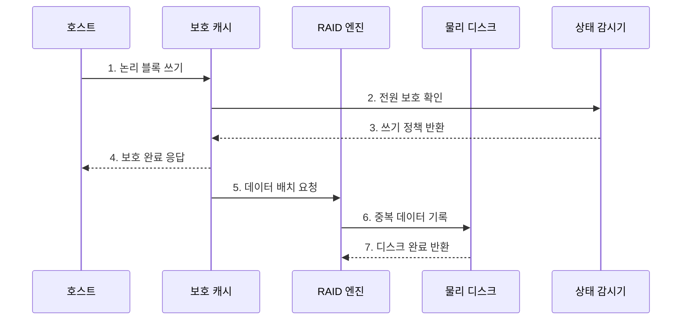

---
sidebar:
  order: 92
  label: "092. RAID 컨트롤러·JBOD (RAID Controller and JBOD)"
  badge:
    text: "미출 · 50%"
    variant: note
title: "RAID 컨트롤러·JBOD (RAID Controller and JBOD)"
date: "2026-07-25T00:22:25+09:00"
tags:
  - "notes-hardware"
weight: 92
extra:
  question_no: "092"
  source_status: "미출"
  source_history: ""
  priority: 50
  priority_note: "보호·복구 책임 계층에 따른 경로 선택"
---

## 미리 알고가기

- **RAID 컨트롤러·JBOD**: RAID 컨트롤러는 여러 디스크를 하나의 중복 논리 볼륨으로 제공하고, JBOD는 개별 디스크를 상위 소프트웨어에 그대로 노출한다
- **독립 디스크 중복 배열(Redundant Array of Independent Disks, RAID)**: 여러 디스크에 데이터를 분산·중복하여 성능과 가용성을 조절하는 저장장치 구성
- **단순 디스크 묶음(Just a Bunch of Disks, JBOD)**: 하드웨어 RAID를 구성하지 않고 개별 디스크를 상위 소프트웨어에 직접 제공하는 방식
- **입출력(Input/Output, I/O)**: 호스트와 저장장치 사이에서 명령과 데이터를 전달하는 경로
- **스트라이핑(Striping)**: 데이터를 여러 디스크에 나눠 기록
- **미러링(Mirroring)**: 같은 데이터를 여러 디스크에 복제
- **패리티(Parity)**: 누락 데이터를 재구성하는 계산값
- **패스스루(Pass-Through)**: 디스크 명령·상태를 상위 계층에 그대로 전달
- **라이트백(Write-Back)**: 캐시 기록 후 완료하고 디스크에 지연 반영
- **전원 보호 쓰기 캐시(Power-Protected Write Cache)**: 정전에도 미반영 쓰기 데이터를 보존
- **RAID 재구성(Rebuild)**: 생존 데이터·패리티로 교체 디스크 복원
- **재복제(Re-replication)**: 생존 사본을 다른 디스크·노드에 복제
- **소프트웨어 정의 스토리지(Software-Defined Storage, SDS)**: 범용 서버의 소프트웨어가 데이터 배치·복제·장애 복구 정책을 담당하는 스토리지 구조
- **독립 디스크 중복 배열 1단계(Redundant Array of Independent Disks Level 1, RAID 1, 레이드 원)**: 숫자 1은 RAID의 미러링 수준 번호를 나타내며, 같은 데이터를 둘 이상의 디스크에 복제해 본문의 부트 볼륨을 보호함
- **논리 볼륨(Logical Volume)**: 여러 물리 디스크의 용량을 묶어 호스트에 하나의 블록 장치로 제공하는 공간
- **RAID 메타데이터(RAID Metadata)**: RAID 레벨·구성원·배치·재구성 상태를 기록하는 제어 정보
- **장애 영역(Failure Domain)**: 한 구성요소 장애가 함께 중단시키거나 성능을 떨어뜨리는 시스템 범위
- **분산 객체 스토리지(Distributed Object Storage)**: 데이터를 객체 단위로 여러 노드에 배치·복제해 제공하는 저장 시스템
- **부트 볼륨(Boot Volume)**: 운영체제와 부팅 파일을 저장해 서버 시작에 사용하는 논리 저장장치
- **라이트스루(Write-Through)**: 디스크에 기록이 끝난 뒤 호스트에 쓰기 완료를 알리는 방식
- **단일 장애점(Single Point of Failure)**: 하나의 구성요소 고장만으로 전체 서비스가 중단되는 지점
- **취약 시간(Vulnerability Window)**: 중복 장애를 견디지 못하는 저하 상태가 지속되는 시간

## Ⅰ. 개요

- 정의/개념: 디스크를 묶거나 개별 노출하는 **저장 구성**
- 배경/필요성: 중복 보호의 **비용·복구 책임 혼선** 방지

### 쉽게 이해하기 (학습용)

- 여러 디스크를 하드웨어 RAID 컨트롤러가 관리할지 상위 스토리지 소프트웨어가 개별 관리할지 결정한다.

## Ⅱ. 특징

- 보호 캐시는 라이트백 응답 지연을 줄인다.
- 단일 컨트롤러 장애는 배열 전체를 중단시킨다.
- JBOD 상태 노출이 SDS의 배치·격리 결정을 돕는다.

### 쉽게 이해하기 (학습용)

- RAID 컨트롤러는 쓰기 캐시로 지연을 줄일 수 있지만 단일 장애점이 될 수 있고, JBOD는 상위 소프트웨어가 디스크별 상태와 복구를 직접 관리한다.

## Ⅲ. 구조 및 구성요소

| 구성요소 | 책임 |
|:---|:---|
| 호스트 | **논리·개별 I/O 요청** |
| 보호 쓰기 캐시 | **안전한 라이트백 제공** |
| RAID 엔진 | **중복·재구성 관리** |
| 패스스루 컨트롤러 | **개별 디스크 노출** |
| 물리 디스크 | **블록·상태 제공** |

### 쉽게 이해하기 (학습용)

- 정전 보호 캐시가 쓰기를 먼저 안전하게 받아 주고, 뒤에서 RAID 규칙에 따라 여러 디스크에 모두 반영한다.

## Ⅳ. 흐름도

**동작 원리**

- **1. 논리 블록 쓰기**: 데이터 요청 수신
- **2. 전원 보호 확인**: 캐시 보호 점검
- **3. 쓰기 정책 반환**: 백·스루 결정
- **4. 보호 완료 응답**: 안전한 쓰기 통지
- **5. 데이터 배치 요청**: 위치·중복 계산
- **6. 중복 데이터 기록**: 디스크에 반영
- **7. 디스크 완료 반환**: 기록 상태 확인

### 쉽게 이해하기 (학습용)

- 보호 캐시가 먼저 받은 뒤 RAID 규칙대로 디스크에 기록한다.

## Ⅴ. 종류 및 비교

| 구분 | RAID 컨트롤러 | JBOD 패스스루 |
|:---|:---|:---|
| 적용 기준 | 단일 서버 내부 볼륨 보호 | 분산 스토리지 사본 관리 |
| 핵심 특징 | 논리 볼륨 중복·재구성 관리 | 개별 디스크를 SDS에 노출 |
| 한계 | 컨트롤러 장애·재구성 부하 | 복제 정책 오류·상태 관리 |

> 요약: 단일 서버 보호에는 RAID, 분산 복제에는 JBOD·SDS가 적합하다.

### 쉽게 이해하기 (학습용)

- RAID는 한 서버의 컨트롤러가 복구하고 JBOD는 상위 분산 소프트웨어가 복구한다.

## Ⅵ. 실무 고려사항 및 대책

| 고려사항 | 대책 | 효과 |
|:---|:---|:---|
| 보호되지 않은 라이트백 캐시의 정전 손실 | 캐시 전원 보호 상태 감시와 실패 시 라이트스루 전환 | 승인된 쓰기 보존 |
| 재구성·재복제가 정상 I/O를 압박 | 우선순위·속도 제한과 취약 시간·완료 시간 감시 | 서비스 영향·노출 시간 균형 |
| 하드웨어 RAID와 SDS 중복 보호 | 보호·복구 책임을 한 계층에 명시 | 용량 낭비·장애 판단 혼선 방지 |
| 컨트롤러·메타데이터 종속으로 교체 복구 실패 | 호환 예비품·구성 백업과 실제 복구 훈련 | 배열 복구 가능성 확보 |

### 쉽게 이해하기 (학습용)

- 부팅 디스크는 같은 내용을 두 장에 쓰고 정전 때도 캐시의 미반영 쓰기를 보존한다.

## Ⅶ. 결론

- 보호 책임·복구 범위로 **RAID·JBOD**를 선택한다.

### 쉽게 이해하기 (학습용)

- 한 서버가 고장을 복구하면 RAID이고 여러 서버의 소프트웨어가 사본을 복구하면 JBOD 경로이다.
