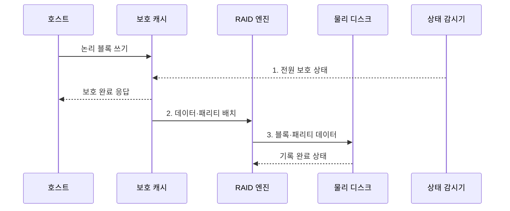

---
sidebar:
  order: 92
  label: "092. RAID 컨트롤러·JBOD (RAID Controller and JBOD)"
  badge:
    text: "미출 · 50%"
    variant: note
title: "RAID 컨트롤러·JBOD (RAID Controller and JBOD)"
date: "2026-08-02T11:52:00+09:00"
tags:
  - "notes-hardware"
weight: 92
extra:
  question_no: "092"
  source_status: "미출"
  source_history: ""
  priority: 50
  priority_note: "보호·복구 책임 계층에 따른 경로 선택"
---

## Ⅰ. 개요

핵심 용어

- **RAID 컨트롤러**: 여러 디스크의 분산·중복과 캐시를 관리하여 하나의 논리 볼륨으로 제공하는 장치이다.
- **JBOD**: 하드웨어 RAID를 구성하지 않고 개별 디스크를 상위 소프트웨어에 직접 노출하는 방식이다.

- 정의/개념: 여러 디스크를 중복 논리 볼륨이나 개별 장치로 제공하는 **저장 구성**
- 배경/필요성: 보호·복구 책임 중첩은 **용량 낭비·장애 판단 혼선** 유발

### 쉽게 이해하기 (학습용)

- 여러 디스크를 하드웨어 RAID 컨트롤러가 관리할지 상위 스토리지 소프트웨어가 개별 관리할지 결정한다.

## Ⅱ. 특징

핵심 용어

- **전원 보호 쓰기 캐시**: 정전이 발생해도 디스크에 반영되지 않은 쓰기 데이터를 보존하는 캐시이다.
- **라이트백**: 데이터를 보호 캐시에 기록한 뒤 완료를 알리고 디스크에는 나중에 반영하는 방식이다.
- **패스스루**: 디스크 명령과 상태를 상위 계층에 그대로 전달하는 방식이다.

- **보호 캐시**를 통한 라이트백 응답 지연 단축
- **단일 컨트롤러 장애**에 따른 배열 전체 중단 위험
- **JBOD 상태 노출**을 활용한 SDS 배치·격리 결정

### 쉽게 이해하기 (학습용)

- RAID 컨트롤러는 쓰기 캐시로 지연을 줄일 수 있지만 단일 장애점이 될 수 있고, JBOD는 상위 소프트웨어가 디스크별 상태와 복구를 직접 관리한다.

## Ⅲ. 구조 및 구성요소

핵심 용어

- **스트라이핑**: 연속 데이터를 여러 디스크에 나누어 기록하는 기법이다.
- **미러링**: 같은 데이터를 둘 이상의 디스크에 복제하여 장애 사본을 확보하는 기법이다.
- **패리티**: 일부 디스크 데이터가 없어졌을 때 값을 재구성하는 계산 정보이다.

| 구성요소 | 책임 |
|:---|:---|
| 호스트 | **논리·개별 I/O 요청** |
| 보호 쓰기 캐시 | **안전한 라이트백 제공** |
| RAID 엔진 | **스트라이핑·패리티 관리** |
| 패스스루 컨트롤러 | **개별 디스크 노출** |
| 물리 디스크 | **블록·상태 제공** |

### 쉽게 이해하기 (학습용)

- 호스트는 보호 캐시와 RAID 엔진을 거쳐 논리 볼륨을 쓰고 패스스루 경로로 개별 디스크에 접근한다.

## Ⅳ. 흐름도

핵심 용어

- **RAID 재구성**: 생존 데이터와 패리티를 읽어 교체 디스크에 손실된 내용을 복원하는 과정이다.
- **재복제**: 생존 사본을 다른 디스크나 노드에 복사해 목표 중복도를 회복하는 과정이다.

**동작 원리**

1. **전원 보호 상태**: 캐시 보호 가능 여부 확인
2. **데이터·패리티 배치**: RAID 레벨에 맞는 기록 위치 계산
3. **블록·패리티 데이터**: 구성원에 기록하고 배열 상태 갱신

### 쉽게 이해하기 (학습용)

- 보호 캐시가 먼저 받은 뒤 RAID 규칙대로 디스크에 기록한다.

## Ⅴ. 종류 및 비교

핵심 용어

- **논리 볼륨**: 여러 물리 디스크의 용량을 묶어 호스트에 하나의 블록 장치로 제공하는 공간이다.
- **소프트웨어 정의 스토리지(SDS)**: 범용 서버 소프트웨어가 데이터 배치·복제·장애 복구 정책을 담당하는 구조이다.

| 저장 구성 | RAID 컨트롤러 | JBOD 패스스루 |
|:---|:---|:---|
| 적용 기준 | **단일 서버 내부 볼륨** 보호 | **분산 스토리지 사본** 관리 |
| 핵심 특징 | **논리 볼륨 중복·재구성** 관리 | 개별 디스크를 **SDS에 노출** |
| 한계 | **컨트롤러 장애·재구성 부하** | **복제 정책 오류·상태 관리** |

> 요약: 단일 서버 보호는 **RAID**, 분산 복제는 **JBOD·SDS** 선택

### 쉽게 이해하기 (학습용)

- RAID는 한 서버의 컨트롤러가 복구하고 JBOD는 상위 분산 소프트웨어가 복구한다.

## Ⅵ. 실무 고려사항 및 대책

핵심 용어

- **단일 장애점**: 하나의 구성요소 고장만으로 전체 서비스가 중단되는 지점이다.
- **취약 시간**: 재구성·재복제가 끝날 때까지 추가 장애를 견디기 어려운 저하 상태의 지속 시간이다.
- **RAID 메타데이터**: RAID 레벨·구성원·배치·재구성 상태를 기록하는 제어 정보이다.

| 문제 | 대책 | 효과 |
|:---|:---|:---|
| 보호되지 않은 라이트백 캐시로 **정전 손실** 발생 | 보호 상태 감시 후 **라이트스루 전환** | **승인된 쓰기** 보존 |
| **재구성·재복제**가 정상 I/O를 압박 | 우선순위 제한과 **취약 시간 감시** | 정상 I/O 지연·**취약 시간** 목표 준수 |
| 하드웨어 RAID와 SDS의 **중복 보호** | **보호·복구 책임**을 한 계층에 명시 | **용량 낭비·판단 혼선** 방지 |
| 컨트롤러·RAID 메타데이터 종속으로 **교체 복구 실패** | **호환 예비품·구성 백업**과 복구 훈련 | **배열 복구 가능성** 확보 |

### 쉽게 이해하기 (학습용)

- 부팅 디스크는 같은 내용을 두 장에 쓰고 정전 때도 캐시의 미반영 쓰기를 보존한다.

## Ⅶ. 결론

핵심 용어

- **부트 볼륨**: 운영체제와 부팅 파일을 저장하여 서버 시작에 사용하는 논리 저장장치이다.
- **라이트스루**: 디스크에 실제 기록이 끝난 뒤 호스트에 쓰기 완료를 알리는 방식이다.

- 단일 서버 보호는 **RAID**, 분산 복제는 **JBOD·SDS** 선택

### 쉽게 이해하기 (학습용)

- 한 서버가 고장을 복구하면 RAID이고 여러 서버의 소프트웨어가 사본을 복구하면 JBOD 경로이다.
