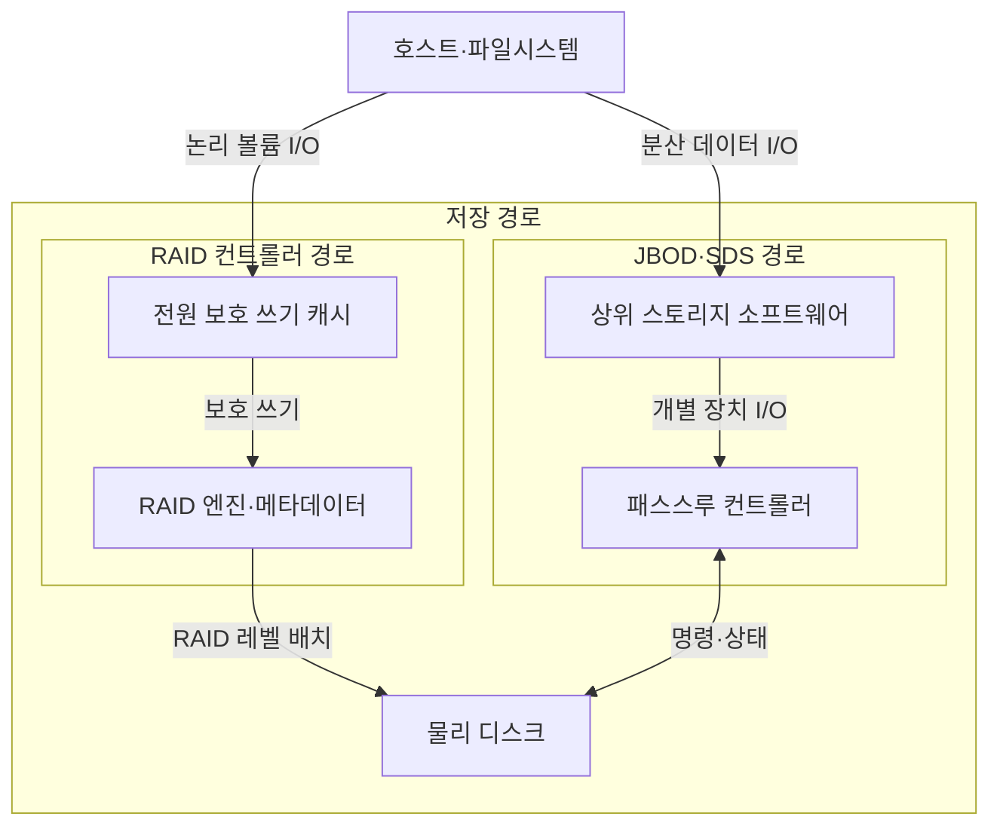
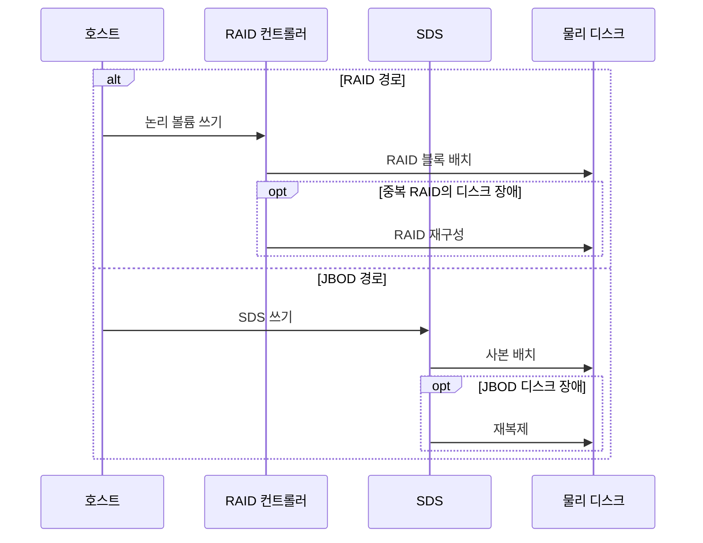

---
sidebar:
  order: 92
  label: "092. RAID 컨트롤러·JBOD (RAID Controller and JBOD)"
  badge:
    text: "미출제 · 50%"
    variant: note
title: "RAID 컨트롤러·JBOD (RAID Controller and JBOD)"
date: "2026-07-25T00:22:25+09:00"
tags:
  - "notes-hardware"
weight: 92
extra:
  question_no: "092"
  source_status: "미출제"
  source_history: ""
  priority: 50
  priority_note: "보호·복구 책임 계층에 따른 경로 선택"
---

## 미리 알고가기

- **RAID 컨트롤러·JBOD**: RAID는 ‘레이드’, JBOD는 ‘제이보드’로 읽으며, 논리 볼륨 관리와 개별 디스크 노출 경로를 대비
- **독립 디스크 중복 배열(Redundant Array of Independent Disks, RAID)**: RAID는 영문 머리글자를 딴 약어이며, 여러 디스크를 분산·중복해 논리 볼륨을 구성
- **단순 디스크 묶음(Just a Bunch of Disks, JBOD)**: JBOD는 영문 머리글자를 딴 약어이며, RAID 없이 개별 디스크를 상위 계층에 노출
- **입출력(Input/Output, I/O)**: I/O는 ‘아이오’로 읽고 입력과 출력 사이를 슬래시로 묶은 표기이며, 호스트와 저장장치 간 명령·데이터 경로
- **스트라이핑(Striping)**: 데이터를 여러 디스크에 나눠 기록
- **미러링(Mirroring)**: 같은 데이터를 여러 디스크에 복제
- **패리티(Parity)**: 누락 데이터를 재구성하는 계산값
- **패스스루(Pass-Through)**: 디스크 명령·상태를 상위 계층에 그대로 전달
- **라이트백(Write-Back)**: 캐시 기록 후 완료하고 디스크에 지연 반영
- **전원 보호 쓰기 캐시(Power-Protected Write Cache)**: 정전에도 미반영 쓰기 데이터를 보존
- **RAID 재구성(Rebuild)**: 생존 데이터·패리티로 교체 디스크 복원
- **재복제(Re-replication)**: 생존 사본을 다른 디스크·노드에 복제
- **소프트웨어 정의 스토리지(Software-Defined Storage, SDS)**: SDS는 ‘에스디에스’로 읽고 영문 머리글자를 딴 약어이며, 소프트웨어가 배치·복제·복구 정책을 담당
- **독립 디스크 중복 배열 1단계(Redundant Array of Independent Disks Level 1, RAID 1, 레이드 원)**: 숫자 1은 RAID의 미러링 수준 번호를 나타내며, 같은 데이터를 둘 이상의 디스크에 복제해 본문의 부트 볼륨을 보호함
- **논리 볼륨(Logical Volume)**: 여러 물리 디스크의 용량을 묶어 호스트에 하나의 블록 장치로 제공하는 공간
- **RAID 메타데이터(RAID Metadata)**: RAID 레벨·구성원·배치·재구성 상태를 기록하는 제어 정보
- **장애 영역(Failure Domain)**: 한 구성요소 장애가 함께 중단시키거나 성능을 떨어뜨리는 시스템 범위
- **분산 객체 스토리지(Distributed Object Storage)**: 데이터를 객체 단위로 여러 노드에 배치·복제해 제공하는 저장 시스템
- **부트 볼륨(Boot Volume)**: 운영체제와 부팅 파일을 저장해 서버 시작에 사용하는 논리 저장장치

## Ⅰ. 개요

- 정의/개념: 디스크를 논리 볼륨으로 묶거나 개별 장치로 노출하는 구성
- **배경/필요성**: 복제·복구 책임 중복을 막아 보호 계층 결정이 필요함

### 쉽게 이해하기 (학습용)

- 여러 서랍을 한 금고가 관리할지 각 서랍을 상위 관리자가 맡을지 정한다.

## Ⅱ. 특징

- 보호 캐시는 라이트백 응답 지연을 줄인다.
- 단일 컨트롤러 장애는 배열 전체를 중단시킨다.
- JBOD 상태 노출이 SDS의 배치·격리 결정을 돕는다.

### 쉽게 이해하기 (학습용)

- 금고 관리자는 쓰기를 먼저 받아 답하지만 고장 나면 금고 전체가 멈추고 JBOD는 상위 소프트웨어가 서랍별 상태를 직접 본다.

## Ⅲ. 아키텍처 및 구성요소

| 설계 요소 | 설명 |
|:---|:---|
| 전원 보호 쓰기 캐시 | 완료한 미반영 쓰기를 정전에도 보존 |
| RAID 엔진·메타데이터 | 논리 주소·중복·패리티·구성원 상태 관리 |
| 상위 스토리지 소프트웨어 | JBOD에 배치·복제·복구 정책 적용 |
| 패스스루 컨트롤러 | 디스크 명령·상태를 상위 계층에 전달 |
| 물리 디스크 | RAID 구성원 또는 JBOD 개별 장치 |

> 요약: RAID는 논리 볼륨, JBOD는 개별 디스크를 노출

### 쉽게 이해하기 (학습용)

- RAID 경로는 서랍을 한 문 뒤에 숨기고 JBOD 경로는 각 서랍의 이름과 상태를 상위 관리자에게 알린다.

## Ⅳ. 원리 및 절차 흐름도

| 절차 | 설명 |
|:---|:---|
| 논리 볼륨 쓰기 | 호스트가 RAID 컨트롤러에 블록 전달 |
| RAID 블록 배치 | RAID 레벨에 따라 스트라이핑·미러링·패리티 적용 |
| RAID 재구성 | 생존 데이터·패리티로 교체 디스크 복원 |
| SDS 쓰기 | 호스트가 SDS에 데이터 전달 |
| 사본 배치 | SDS가 개별 디스크·노드에 사본 기록 |
| 재복제 | 생존 사본을 다른 디스크·노드에 복제 |

> 요약: 컨트롤러는 재구성, SDS는 재복제를 수행

### 쉽게 이해하기 (학습용)

- RAID는 남은 조각으로 새 디스크를 복원하고 JBOD 위 소프트웨어는 다른 노드의 사본을 다시 복제한다.

## Ⅴ. 종류 및 비교

| 판단 기준 | RAID 컨트롤러 | JBOD 패스스루 |
|:---|:---|:---|
| 핵심 특징 | 논리 볼륨의 중복·재구성 관리 | 개별 디스크를 상위 SDS에 노출 |
| 적용 기준 | 단일 서버 내부 볼륨 보호 | 분산 스토리지 사본 관리 |
| 주요 위험 | 컨트롤러 장애·재구성 부하 | 상위 복제 정책 오류·상태 관리 |

> 요약: 단일 서버 보호는 RAID, 분산 복제는 JBOD·SDS

### 쉽게 이해하기 (학습용)

- 한 서버 금고가 직접 지키면 RAID이고 여러 창고의 소프트웨어가 개별 서랍을 관리하면 JBOD 경로이다.

## Ⅵ. 실무 사례

1. 서버 부트 볼륨에 RAID 1·전원 보호 쓰기 캐시 적용

### 쉽게 이해하기 (학습용)

- 부팅 디스크는 같은 내용을 두 장에 쓰고 정전 때도 캐시의 미반영 쓰기를 보존한다.

## Ⅶ. 결론

- 단일 서버 볼륨은 RAID, 분산 복제는 JBOD·SDS 선택

### 쉽게 이해하기 (학습용)

- 한 서버가 고장을 복구하면 RAID이고 여러 서버의 소프트웨어가 사본을 복구하면 JBOD 경로이다.
