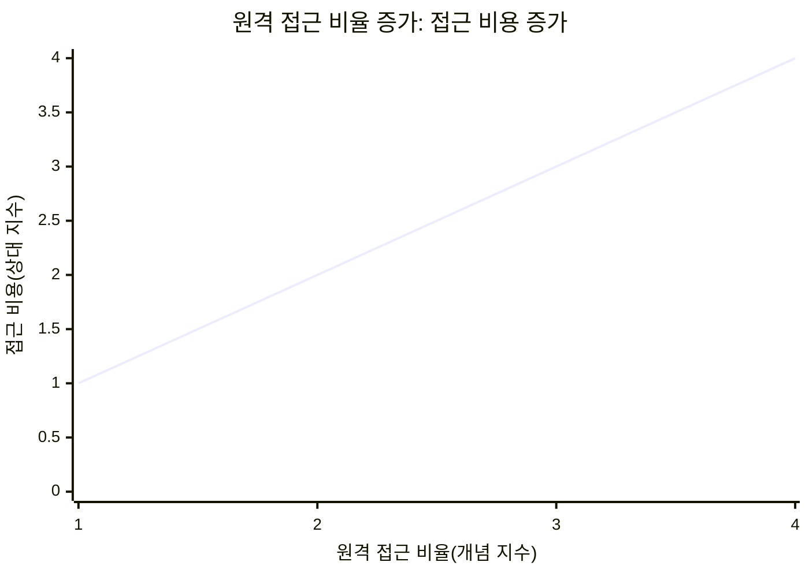
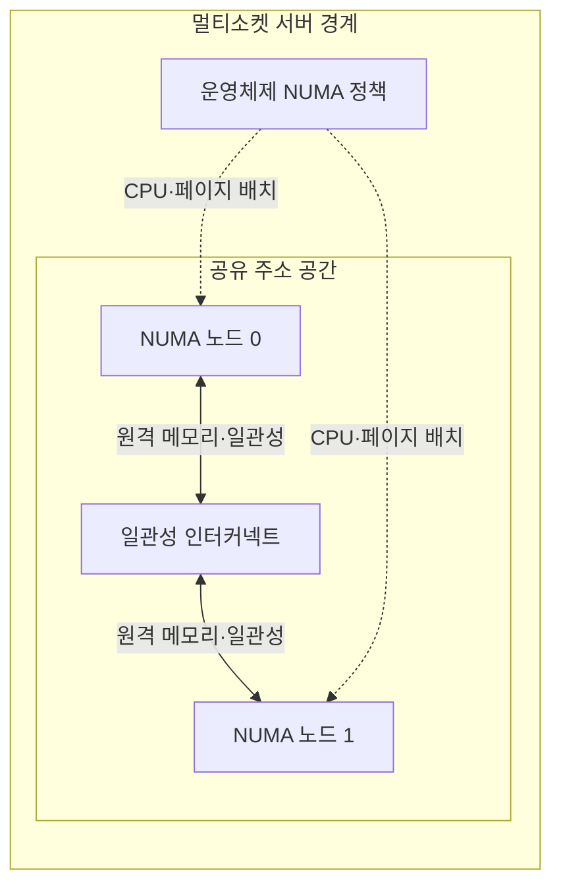
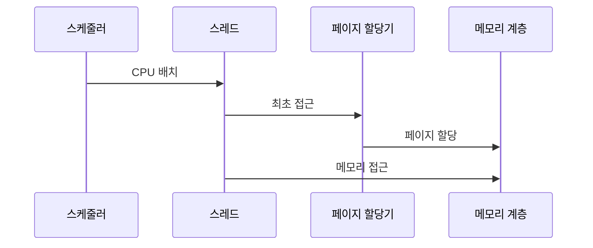

---
sidebar:
  order: 93
  label: "093. 멀티소켓 서버·SMP (Multi-Socket Server·SMP)"
  badge:
    text: "미출제 · 50%"
    variant: note
title: "멀티소켓 서버·SMP (Multi-Socket Server·SMP)"
date: "2026-07-25T00:22:25+09:00"
tags:
  - "notes-hardware"
weight: 93
extra:
  question_no: "093"
  source_status: "미출제"
  source_history: ""
  priority: 50
  priority_note: "지역성·원격 메모리 비용 중심 설계"
---

## 미리 알고가기

- **멀티소켓 서버(Multi-Socket Server)**: 운영체제·주소 공간을 공유하고 소켓별 로컬 메모리를 쓰는 서버
- **프로세서 소켓(Processor Socket)**: CPU 패키지를 장착하고 메모리 채널·인터커넥트에 연결하는 메인보드 접점
- **공유 주소 공간(Shared Address Space)**: 모든 프로세서가 같은 주소값으로 시스템 메모리를 참조하는 구조
- **중앙처리장치(Central Processing Unit, CPU)**: CPU는 ‘시피유’로 읽고 영문 머리글자를 딴 약어이며, 명령 실행·메모리 요청을 담당
- **대칭형 다중처리(Symmetric Multiprocessing, SMP)**: SMP는 ‘에스엠피’로 읽고 영문 머리글자를 딴 약어이며, 여러 프로세서가 운영체제·메모리를 대칭적으로 공유
- **캐시 일관성 비균일 메모리 접근(Cache-Coherent Non-Uniform Memory Access, ccNUMA)**: ccNUMA는 ‘캐시 코히어런트 누마’로 읽고 cache-coherent를 소문자 cc로 NUMA 앞에 붙인 표기이며, 주소는 공유하되 노드 거리에 따라 접근 비용이 다름
- **비균일 메모리 접근 노드(Non-Uniform Memory Access Node, NUMA Node)**: NUMA는 ‘누마’로 읽고 영문 머리글자를 딴 약어이며, 프로세서·캐시·제어기·로컬 메모리의 근접 자원 묶음을 나타냄
- **비균일 메모리 접근 노드 0·1(Non-Uniform Memory Access Node 0·1, NUMA Node 0·1, 누마 노드 영·일)**: 0·1은 컴퓨터의 0 기반 순번으로 두 근접 자원 묶음을 구분하며, 본문에서 로컬·원격 메모리 경로와 CPU·페이지 배치 대상을 나타냄
- **로컬·원격 메모리(Local·Remote Memory)**: 실행 노드 내 메모리와 인터커넥트 너머 메모리
- **CPU·메모리 선호도(CPU and Memory Affinity)**: 스레드·페이지를 지정 NUMA 노드에 묶는 정책
- **최초 접근 배치(First-Touch Allocation)**: 기본 정책에서 최초 접근 CPU의 로컬 노드에 할당
- **메모리 채널(Memory Channel)**: 메모리 제어기와 메모리 모듈 사이의 독립 명령·데이터 전송 경로
- **캐시 라인·일관성 트래픽(Cache Line·Coherence Traffic)**: 캐시 라인은 캐시 전송 단위이고 일관성 트래픽은 소켓별 사본을 같은 값으로 유지하는 메시지
- **페이지·페이지 폴트(Page·Page Fault)**: 페이지는 가상 메모리 관리 단위이고 페이지 폴트는 필요한 주소 매핑이 없어 운영체제가 개입하는 예외
- **가상 CPU(Virtual CPU, vCPU)**: vCPU는 ‘브이시피유’로 읽고 virtual을 소문자 v로 CPU 앞에 붙인 표기이며, 가상 머신에 제공되어 물리 CPU 시간에 스케줄되는 논리 처리기
- **버퍼 풀(Buffer Pool)**: 데이터베이스가 자주 쓰는 데이터 페이지를 메모리에 보관하는 캐시 영역

## Ⅰ. 개요

- 정의/개념: SMP 기반 소켓별 로컬 메모리의 ccNUMA 서버
- **배경/필요성**: 단일 소켓의 코어·메모리가 제한되어 다중 소켓 확장이 필요함

### 쉽게 이해하기 (학습용)

- 자기 층 서류함은 가깝고 다른 층 서류함은 계단을 거쳐야 하는 구조다.

## Ⅱ. 특징

- 운영체제가 전 코어·메모리를 단일 시스템으로 관리한다.
- 소켓별 메모리 채널이 용량과 총 대역폭을 높인다.
- 원격 접근은 지연과 인터커넥트 부하를 높인다.
- 공유 캐시 라인은 일관성 트래픽을 늘린다.

### 쉽게 이해하기 (학습용)

- 사무실을 늘려도 다른 층 자료와 공동 문서를 자주 쓰면 계단 왕래가 늘어난다.

## Ⅲ. 아키텍처 및 구성요소

| 설계 요소 | 설명 |
|:---|:---|
| 운영체제 NUMA 정책 | 스레드·물리 페이지의 배치 노드 결정 |
| NUMA 노드 0 | 소켓·캐시·제어기·로컬 메모리 묶음 |
| 일관성 인터커넥트 | 원격 요청 전달·소켓 간 캐시 일관성 유지 |
| NUMA 노드 1 | 소켓·캐시·제어기·로컬 메모리 묶음 |

> 요약: 소켓별 로컬 메모리·인터커넥트로 접근 경로 분리

### 쉽게 이해하기 (학습용)

- 층마다 방과 서류함을 묶고 총무가 자리를 정하며 계단은 다른 층 요청을 운반한다.

## Ⅳ. 원리 및 절차 흐름도

| 절차 | 설명 |
|:---|:---|
| CPU 배치 | 스케줄러가 스레드 실행 노드 결정 |
| 최초 접근 | 페이지 폴트로 물리 페이지 할당 요청 |
| 페이지 할당 | 정책이 지정한 로컬·선호 노드에 페이지 할당 |
| 메모리 접근 | 페이지 노드 일치 시 로컬, 불일치 시 원격 접근 |

> 요약: 실행 CPU·페이지 노드 일치로 원격 접근 축소

### 쉽게 이해하기 (학습용)

- 사람과 서류를 같은 층에 두면 원격 계단을 거치지 않고 바로 처리한다.

## Ⅴ. 종류 및 비교

| 판단 기준 | 멀티소켓 ccNUMA 서버 | 단일 소켓 서버 |
|:---|:---|:---|
| 핵심 특징 | 소켓별 로컬 메모리의 ccNUMA 확장 | 한 소켓의 균일한 메모리 경로 |
| 적용 기준 | 단일 소켓 초과·노드별 데이터 분할 | 단일 소켓 범위·공유 쓰기 집중 |
| 주요 위험 | 원격 지연·캐시 일관성 트래픽 | 코어·메모리·채널 수 상한 |

> 요약: 자원 확장 이득과 원격 접근 비용의 절충

### 쉽게 이해하기 (학습용)

- 한 층에 모두 들어가면 단일 소켓이 단순하고 사람과 자료를 층별로 나눌 수 있어야 멀티소켓이 이득이다.

## Ⅵ. 실무 사례

1. 데이터베이스 워커·버퍼 풀을 같은 NUMA 노드에 배치

### 쉽게 이해하기 (학습용)

- 창고 작업자와 자주 꺼내는 물품을 같은 층에 둔다.

## Ⅶ. 결론

- 단일 소켓 한도 초과·지역성 확보 시 멀티소켓 선택

### 쉽게 이해하기 (학습용)

- 사람과 자료를 층별로 묶을 수 있을 때만 더 큰 사무실이 실제 처리량을 늘린다.
