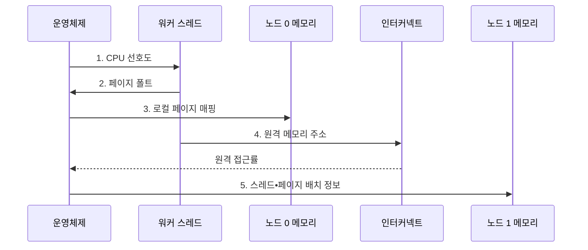

---
sidebar:
  order: 93
  label: "093. 멀티소켓 서버•SMP (Multi-Socket Server•SMP)"
  badge:
    text: "미출 • 50%"
    variant: note
title: "멀티소켓 서버•SMP (Multi-Socket Server•SMP)"
date: "2026-08-05T00:00:00+09:00"
tags:
  - "notes-hardware"
weight: 93
extra:
  question_no: "093"
  source_status: "미출"
  source_history: ""
  priority: 50
  priority_note: "지역성•원격 메모리 비용 중심 설계"
---

## Ⅰ. 개요

<details><summary>핵심 용어</summary>

- **CPU(Central Processing Unit)**: 명령 실행과 시스템 자원 제어를 담당하는 중앙 처리 장치이다.
- **멀티소켓 서버**: 여러 CPU 소켓이 하나의 운영체제와 주소 공간을 공유하면서 소켓별 로컬 메모리를 사용하는 서버이다.
- **ccNUMA(Cache-coherent Non-uniform Memory Access)**: 캐시 일관성을 유지하되 노드 거리에 따라 메모리 접근 비용이 달라지는 구조이다.

</details>

- 정의/개념: **멀티소켓 서버** 는 여러 CPU 소켓과 소켓별 로컬 메모리를 일관성 인터커넥트로 연결해 하나의 운영체제와 주소 공간으로 제공하는 **ccNUMA 서버 구조**
- 배경/필요성: 단일 소켓은 코어•용량•대역폭의 **물리 확장 한계**

#### 한줄 요약

- 자기 층 서류함은 가깝고 다른 층 서류함은 계단을 거쳐야 하는 구조다.

## Ⅱ. 특징

<details><summary>핵심 용어</summary>

- **SMP(Symmetric Multiprocessing)**: 여러 프로세서가 하나의 운영체제와 공유 주소 공간을 대등하게 사용하는 구조이다.
- **로컬 메모리(Local Memory)**: 실행 CPU와 같은 NUMA 노드에 있는 메모리이다.
- **원격 메모리(Remote Memory)**: 인터커넥트 너머 다른 NUMA 노드에 있는 메모리이다.
- **캐시 일관성 트래픽**: 여러 소켓에 있는 캐시 라인 사본을 같은 값으로 유지하기 위한 메시지이다.

</details>

- **공유 주소 공간•SMP** 로 단일 운영체제의 대등한 자원 관리
- **소켓별 메모리 채널** 로 용량•대역폭 확장
- **원격 접근•공유 쓰기** 는 지연•트래픽 증가

#### 한줄 요약

- 사무실을 늘려도 다른 층 자료와 공동 문서를 자주 쓰면 계단 왕래가 늘어난다.

## Ⅲ. 구조 및 구성요소

<details><summary>핵심 용어</summary>

- **NUMA(Non-uniform Memory Access)**: CPU와 메모리 위치에 따라 접근 시간이 달라지는 메모리 구조이다.
- **NUMA 노드**: CPU 소켓•캐시•메모리 제어기•로컬 메모리로 구성된 근접 자원 단위이다.
- **메모리 채널**: 메모리 제어기와 메모리 모듈 사이의 독립 명령•데이터 전송 경로이다.
- **프로세서 소켓**: CPU 패키지를 장착하고 메모리 채널과 인터커넥트에 연결하는 메인보드 접점이다.

</details>

```text
                   [운영체제 NUMA 정책]
                    /                 \
        [NUMA 노드 0] ----- [일관성 인터커넥트] ----- [NUMA 노드 1]
```

선의 의미: 가로선은 두 NUMA 노드를 묶는 일관성 인터커넥트 경계이고, 사선은 운영체제 정책이 두 노드의 CPU•페이지 배치에 공통 결합되는 관리 관계를 뜻한다.

| 구성요소 | 책임 |
|:---|:---|
| 운영체제 NUMA 정책 | **CPU•페이지 배치** |
| NUMA 노드 0 | **로컬 연산•메모리 제공** |
| 일관성 인터커넥트 | **원격 접근•일관성 유지** |
| NUMA 노드 1 | **로컬 연산•메모리 제공** |

#### 한줄 요약

- 운영체제 정책이 두 NUMA 노드의 CPU•페이지를 배치하고 일관성 인터커넥트가 원격 접근을 연결한다.

## Ⅳ. 흐름도

<details><summary>핵심 용어</summary>

- **최초 접근 배치**: 페이지를 처음 접근한 CPU의 로컬 NUMA 노드에 물리 메모리를 할당하는 정책이다.
- **페이지 폴트**: 필요한 가상 주소 매핑이 없어 운영체제가 페이지를 배치하거나 매핑하도록 개입하는 예외이다.

</details>



**동작 원리**

1. **CPU 선호도**: 스레드를 노드 CPU에 고정
2. **페이지 폴트**: 최초 접근으로 운영체제 개입
3. **로컬 페이지 매핑**: 접근 CPU와 가까운 메모리에 배치
4. **원격 메모리 주소**: 인터커넥트로 다른 노드 접근
5. **스레드•페이지 배치 정보**: 장기 지역성에 맞춰 같은 노드로 이동

#### 한줄 요약

- 사람과 자료가 다른 층이면 자료도 함께 옮긴다.

## Ⅴ. 종류 및 비교

<details><summary>핵심 용어</summary>

- **공유 주소 공간**: 모든 프로세서가 같은 주소값으로 시스템 메모리를 참조하는 구조이다.
- **CPU•메모리 선호도**: 스레드와 그 페이지를 지정한 NUMA 노드의 CPU•메모리에 묶는 정책이다.

</details>

| 서버 구조 | 멀티소켓 ccNUMA 서버 | 단일 소켓 서버 |
|:---|:---|:---|
| 적용 기준 | **단일 소켓 초과•노드별 데이터 분할** | **단일 소켓 범위•공유 쓰기 집중** |
| 핵심 특징 | **소켓별 로컬 메모리** 확장 | 한 소켓의 **균일 메모리 경로** |
| 한계 | **원격 지연•일관성 트래픽** | **코어•메모리 용량** 과 채널 수 상한 |

> 요약: 소켓 확장으로 자원은 늘지만 **원격 접근 지연** 도 증가

#### 한줄 요약

- 단일 소켓 자원이 충분하면 균일한 경로를 쓰고 부족하면 NUMA 지역성을 관리하며 확장한다.

## Ⅵ. 실무 고려사항 및 대책

<details><summary>핵심 용어</summary>

- **패딩**: 서로 다른 스레드가 쓰는 데이터를 별도 캐시 라인에 두도록 빈 공간을 넣는 기법이다.
- **쓰기 소유권**: 특정 캐시가 캐시 라인을 수정할 수 있도록 부여받은 일관성 권한이다.
- **NUMA 토폴로지**: CPU•메모리•장치의 노드 소속과 노드 간 거리 관계이다.
- **VM(Virtual Machine)**: 격리된 가상 하드웨어에서 게스트 운영체제를 실행하는 시스템이다.

</details>

| 문제 | 대책 | 효과 |
|:---|:---|:---|
| 스레드 이동 뒤 페이지가 원격 노드에 남아 **지연 증가** | **CPU•메모리 선호도** 와 원격 접근 계측 | **메모리 지연** 감소 |
| 최초 접근 초기화가 한 노드에 몰려 **채널 편중** | **병렬 초기화•분할 할당** | 노드별 **채널 대역폭 편차** 감소 |
| 공유 쓰기 캐시 라인의 소켓 간 왕복으로 **트래픽 증가** | **데이터 분할•패딩** 과 쓰기 소유권 지역화 | **일관성 트래픽** 축소 |
| VM 자원이 다른 노드에 배치돼 **원격 접근 증가** | **NUMA 토폴로지 노출•자원 공동 고정** | **가상화 성능 예측성** 향상 |

#### 한줄 요약

- 스레드와 해당 스레드가 자주 접근하는 메모리를 같은 NUMA 노드에 배치한다.

## Ⅶ. 결론

<details><summary>핵심 용어</summary>

- **원격 메모리 접근**: CPU가 인터커넥트를 거쳐 다른 NUMA 노드의 메모리를 읽거나 쓰는 동작이다.
- **데이터 분할**: 작업 데이터와 실행 스레드를 노드별로 나누어 로컬 접근 비율을 높이는 배치 방식이다.

</details>

- 단일 소켓 부족•노드 분할 가능 시 **멀티소켓** 적용

#### 한줄 요약

- 사람과 자료를 층별로 묶을 수 있을 때만 더 큰 사무실이 실제 처리량을 늘린다.
