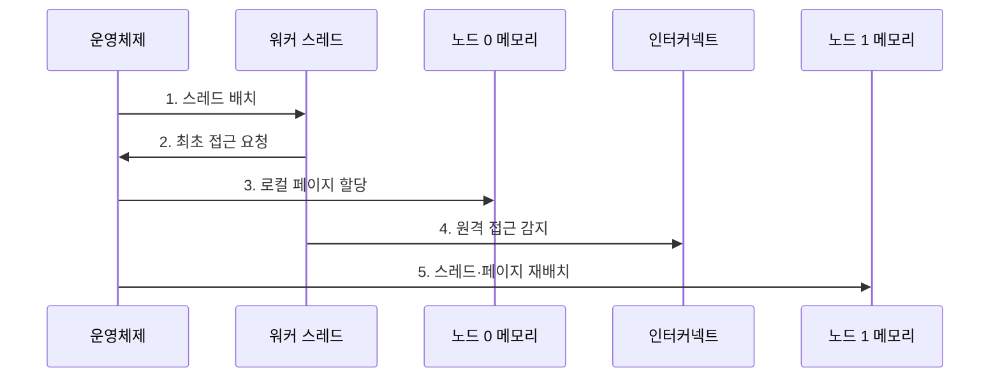

---
sidebar:
  order: 93
  label: "093. 멀티소켓 서버·SMP (Multi-Socket Server·SMP)"
  badge:
    text: "미출 · 50%"
    variant: note
title: "멀티소켓 서버·SMP (Multi-Socket Server·SMP)"
date: "2026-07-30T18:00:00+09:00"
tags:
  - "notes-hardware"
weight: 93
extra:
  question_no: "093"
  source_status: "미출"
  source_history: ""
  priority: 50
  priority_note: "지역성·원격 메모리 비용 중심 설계"
---

## 미리 알고가기

- **멀티소켓 서버(Multi-Socket Server)**: 운영체제·주소 공간을 공유하고 소켓별 로컬 메모리를 쓰는 서버
- **프로세서 소켓(Processor Socket)**: CPU 패키지를 장착하고 메모리 채널·인터커넥트에 연결하는 메인보드 접점
- **공유 주소 공간(Shared Address Space)**: 모든 프로세서가 같은 주소값으로 시스템 메모리를 참조하는 구조
- **중앙처리장치(Central Processing Unit, CPU)**: 명령어를 실행하고 캐시·메모리 접근 요청을 생성하는 처리장치
- **대칭형 다중처리(Symmetric Multiprocessing, SMP)**: 여러 프로세서가 하나의 운영체제와 공유 주소 공간을 대등하게 사용하는 다중처리 구조
- **캐시 일관성 비균일 메모리 접근(Cache-Coherent Non-Uniform Memory Access, ccNUMA)**: 공유 주소 공간의 캐시 일관성을 유지하면서 노드 거리에 따라 메모리 접근 비용이 달라지는 구조
- **비균일 메모리 접근 노드(Non-Uniform Memory Access Node, NUMA Node)**: 프로세서 소켓·캐시·메모리 제어기·로컬 메모리로 구성된 근접 자원 단위
- **비균일 메모리 접근 노드 0·1(Non-Uniform Memory Access Node 0·1, NUMA Node 0·1, 누마 노드 영·일)**: 0·1은 컴퓨터의 0 기반 순번으로 두 근접 자원 묶음을 구분하며, 본문에서 로컬·원격 메모리 경로와 CPU·페이지 배치 대상을 나타냄
- **로컬·원격 메모리(Local·Remote Memory)**: 실행 노드 내 메모리와 인터커넥트 너머 메모리
- **CPU·메모리 선호도(CPU and Memory Affinity)**: 스레드·페이지를 지정 NUMA 노드에 묶는 정책
- **최초 접근 배치(First-Touch Allocation)**: 기본 정책에서 최초 접근 CPU의 로컬 노드에 할당
- **메모리 채널(Memory Channel)**: 메모리 제어기와 메모리 모듈 사이의 독립 명령·데이터 전송 경로
- **캐시 라인·일관성 트래픽(Cache Line·Coherence Traffic)**: 캐시 라인은 캐시 전송 단위이고 일관성 트래픽은 소켓별 사본을 같은 값으로 유지하는 메시지
- **페이지·페이지 폴트(Page·Page Fault)**: 페이지는 가상 메모리 관리 단위이고 페이지 폴트는 필요한 주소 매핑이 없어 운영체제가 개입하는 예외
- **가상 CPU(Virtual CPU, vCPU)**: 가상 머신에 할당되고 하이퍼바이저가 물리 CPU 시간에 스케줄하는 논리 처리기
- **버퍼 풀(Buffer Pool)**: 데이터베이스가 자주 쓰는 데이터 페이지를 메모리에 보관하는 캐시 영역
- **부하 균형(Load Balancing)**: 처리량을 맞추기 위해 작업을 여러 CPU·노드에 재배치하는 정책
- **패딩(Padding)**: 서로 다른 스레드의 쓰기 데이터를 다른 캐시 라인에 두도록 빈 공간을 넣는 기법
- **쓰기 소유권(Write Ownership)**: 캐시 라인을 수정할 수 있도록 특정 캐시에 부여된 일관성 권한
- **NUMA 토폴로지(NUMA Topology)**: CPU·메모리·장치의 노드 소속과 노드 간 거리 관계

## Ⅰ. 개요

- 정의/개념: 소켓별 로컬 메모리를 쓰는 **ccNUMA 서버**
- 배경/필요성: 단일 소켓의 **코어·용량·대역폭** 확장

### 쉽게 이해하기 (학습용)

- 자기 층 서류함은 가깝고 다른 층 서류함은 계단을 거쳐야 하는 구조다.

## Ⅱ. 특징

- **공유 주소 공간**으로 전체 자원 관리
- **소켓별 메모리 채널**로 용량·대역폭 확장
- **원격 접근·공유 쓰기**는 지연·트래픽 증가

### 쉽게 이해하기 (학습용)

- 사무실을 늘려도 다른 층 자료와 공동 문서를 자주 쓰면 계단 왕래가 늘어난다.

## Ⅲ. 구조 및 구성요소

| 구성요소 | 책임 |
|:---|:---|
| 운영체제 NUMA 정책 | **CPU·페이지 배치** |
| NUMA 노드 0 | **로컬 연산·메모리 제공** |
| 일관성 인터커넥트 | **원격 접근·일관성 유지** |
| NUMA 노드 1 | **로컬 연산·메모리 제공** |

### 쉽게 이해하기 (학습용)

- 사람이 다른 층으로 옮겨도 서류가 남아 있으면 계속 계단을 쓰므로, 사람을 되돌리거나 서류를 함께 옮긴다.

## Ⅳ. 흐름도

**동작 원리**

- **1. 스레드 배치**: 노드 CPU에 고정
- **2. 최초 접근 요청**: 페이지 폴트 발생
- **3. 로컬 페이지 할당**: 가까운 메모리 배치
- **4. 원격 접근 감지**: 스레드 이동 뒤 인터커넥트 접근률 계측
- **5. 스레드·페이지 재배치**: 장기 지역성에 맞춰 실행 주체와 데이터를 같은 노드로 이동

### 쉽게 이해하기 (학습용)

- 사람과 자료가 다른 층이면 자료도 함께 옮긴다.

## Ⅴ. 종류 및 비교

| 구분 | 멀티소켓 ccNUMA 서버 | 단일 소켓 서버 |
|:---|:---|:---|
| 적용 기준 | 단일 소켓 초과·노드별 데이터 분할 | 단일 소켓 범위·공유 쓰기 집중 |
| 핵심 특징 | 소켓별 로컬 메모리 확장 | 한 소켓의 균일 메모리 경로 |
| 한계 | 원격 지연·일관성 트래픽 | 코어·메모리·채널 수 상한 |

> 요약: 자원 확장 이득과 원격 접근 비용이 상충한다.

### 쉽게 이해하기 (학습용)

- 단일 소켓 자원이 충분하면 균일한 경로를 쓰고 부족하면 NUMA 지역성을 관리하며 확장한다.

## Ⅵ. 실무 고려사항 및 대책

| 고려사항 | 대책 | 효과 |
|:---|:---|:---|
| 스레드 이동 뒤 페이지가 원격 노드에 잔류 | CPU·메모리 선호도와 주기적 원격 접근 계측 | 메모리 지연 감소 |
| 최초 접근 초기화가 한 노드에 페이지 집중 | 실제 처리 스레드의 병렬 초기화·분할 할당 | 채널 대역폭 균형 |
| 공유 쓰기 캐시 라인의 소켓 간 왕복 | 데이터 분할·패딩과 쓰기 소유권 지역화 | 일관성 트래픽 축소 |
| VM vCPU·메모리·장치가 다른 노드에 배치 | NUMA 토폴로지 노출과 자원 공동 고정 | 가상화 성능 예측성 향상 |

### 쉽게 이해하기 (학습용)

- 스레드와 해당 스레드가 자주 접근하는 메모리를 같은 NUMA 노드에 배치한다.

## Ⅶ. 결론

- 확장 이득·원격 접근률로 **멀티소켓**을 적용한다.

### 쉽게 이해하기 (학습용)

- 사람과 자료를 층별로 묶을 수 있을 때만 더 큰 사무실이 실제 처리량을 늘린다.
