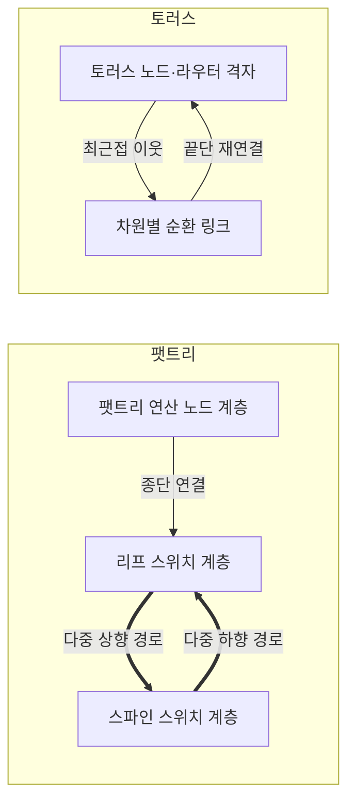
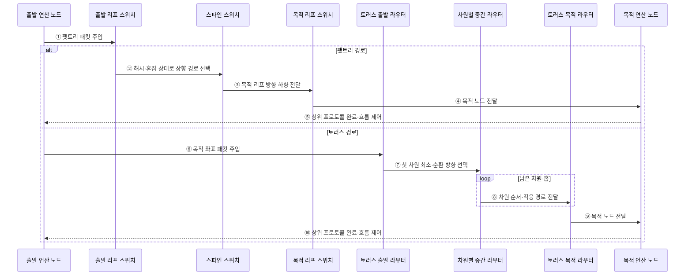

---
sidebar:
  order: 94
  label: "094. 인터커넥트 토폴로지 — 팻트리·토러스 (Interconnect Topology — Fat-Tree·Torus)"
  badge:
    text: "기출 · 70%"
    variant: note
title: "인터커넥트 토폴로지 — 팻트리·토러스 (Interconnect Topology — Fat-Tree·Torus)"
date: "2026-07-27T23:59:59+09:00"
tags:
  - "notes-hardware"
weight: 94
extra:
  question_no: "094"
  source_status: "기출"
  source_history: "138회"
  priority: 70
  priority_note: "집단·인접 통신 패턴이 토폴로지 선택을 좌우함"
---

## 미리 알고가기

- **팻트리(Fat-Tree)**: 상위 계층의 링크 용량·수를 늘린 계층형 스위치 망
- **토러스(Torus)**: 각 차원 끝단을 연결한 순환 격자형 노드 망
- **인터커넥트 토폴로지(Interconnect Topology)**: 연산 노드·스위치·링크의 물리·논리 연결 형태
- **리프·스파인 스위치(Leaf·Spine Switch)**: 리프는 연산 노드를 수용하고 스파인은 모든 리프 사이의 상위 경로를 제공함
- **양분 대역폭(Bisection Bandwidth)**: 같은 크기 두 노드 집합 사이의 최소 총 링크 용량
- **오버서브스크립션(Oversubscription)**: 하향 대역폭 합이 상향 대역폭 합을 넘는 상태
- **비차단(Non-Blocking)**: 동시 통신을 내부 대역폭 부족 없이 수용하는 구성
- **홉(Hop)**: 패킷이 거치는 링크·장비 한 단계
- **노드 차수·망 지름(Node Degree·Network Diameter)**: 차수는 노드당 직접 링크 수이고 지름은 가장 먼 두 노드 사이의 최소 홉 수
- **혼잡(Congestion)**: 여러 통신 흐름이 같은 링크·출력 포트를 요구해 대기하는 상태
- **집단 통신(Collective Communication)**: 여러 프로세스가 방송·수집·축약 같은 하나의 공동 데이터 교환에 참여하는 통신
- **방송·수집·축약(Broadcast·Gather·Reduction)**: 방송은 한 데이터를 전체로, 수집은 전체 데이터를 한곳으로 보내고 축약은 여러 값을 하나의 합·최댓값 등으로 결합함
- **패킷 주입(Packet Injection)**: 연산 노드가 목적지·데이터를 담은 패킷을 로컬 네트워크 장비에 넣는 동작
- **스텐실 연산(Stencil Computation)**: 격자 이웃값으로 새 값을 반복 계산하는 연산
- **토폴로지 인지 배치(Topology-Aware Mapping)**: 통신량이 큰 작업을 가까운 노드에 배치하는 기법
- **인공지능(Artificial Intelligence, AI)**: 대규모 모델의 학습·추론에서 노드 간 집단 통신을 발생시키는 대표 워크로드
- **고성능 컴퓨팅(High-Performance Computing, HPC)**: 다수 노드와 가속기를 병렬 연결하여 대규모 과학·공학 연산을 수행하는 컴퓨팅 방식

## Ⅰ. 개요

- 정의/개념: 노드·스위치·링크 배치로 **통신 경로·용량**을 정하는 구조
- 기존 한계: 단일 연결 구조는 **전역·최근접 통신 패턴별 병목** 대응에 한계

### 쉽게 이해하기 (학습용)

- 큰길로 이을지 순환 골목으로 이을지 이동 패턴에 맞춰 도로망을 정한다.

## Ⅱ. 특징

- **차수·지름·양분 대역폭**이 경로 성능·비용 결정
- 팻트리는 **다중 상향 경로**로 전역 통신 대역폭 확보
- 토러스는 **순환 최근접 연결**로 인접 통신 비용 절감

### 쉽게 이해하기 (학습용)

- 큰길은 공사비가 크고 골목은 먼 이동이 길어지므로 통행 방식에 맞춰 설계한다.

## Ⅲ. 아키텍처 및 구성요소

### 도표안 A. 팻트리·토러스 정적 구조

| 설계 요소 | 입력·상태 | 역할 |
|:---|:---|:---|
| 팻트리 연산 노드·리프 | 종단 트래픽·상향 링크 상태 | 종단 수용·다중 상향 경로 제공 |
| 스파인 스위치 계층 | 리프 간 흐름·중재 상태 | 전역 상향·하향 경로 제공 |
| 토러스 노드·라우터 격자 | 목적 좌표·이웃 링크 상태 | 차원별 최근접 패킷 전달 |
| 차원별 순환 링크 | 경계 노드·링크 용량 | 끝단을 재연결해 대체 경로 제공 |

> 요약: 팻트리는 계층 다중 경로, 토러스는 차원 순환 경로

### 쉽게 이해하기 (학습용)

- 팻트리는 계층 큰길로 토러스는 순환 이웃길로 노드를 연결한다.

### 도표안 B. 토폴로지별 패킷 전달 시퀀스

#### 동작 원리

1. 출발 노드가 팻트리의 로컬 리프에 목적지 패킷을 주입한다.
2. 리프가 동일 비용 경로 해시나 혼잡 상태로 여러 스파인 중 상향 링크를 고른다.
3. 스파인이 목적 노드가 연결된 리프 방향으로 패킷을 내린다.
4. 목적 리프가 종단 포트로 패킷을 전달한다.
5. 목적 노드가 상위 전송 규칙에 따라 완료·흐름 제어를 출발 노드에 반환한다.
6. 토러스에서는 출발 노드가 목적 좌표를 포함한 패킷을 로컬 라우터에 넣는다.
7. 출발 라우터가 좌표 차이와 순환 링크를 비교해 최소 홉 방향을 선택한다.
8. 중간 라우터가 교착 방지 규칙을 지키며 남은 차원·홉으로 전달하고, 허용 시 혼잡 우회 경로를 쓴다.
9. 목적 좌표 라우터가 패킷을 최종 연산 노드에 전달한다.
10. 목적 노드가 완료·흐름 제어를 토러스 역방향 또는 별도 경로로 반환한다.

### 쉽게 이해하기 (학습용)

- 팻트리는 리프에서 스파인 큰길로 올라갔다 내려오고, 토러스는 좌표 차이를 줄이는 이웃길을 여러 번 건넌다.

## Ⅳ. 종류 및 비교

| 인터커넥트 토폴로지 | 팻트리 | 토러스 |
|:---|:---|:---|
| 적용 기준 | 전역 **집단 통신 중심 작업** | **최근접 이웃 통신 중심 작업** |
| 핵심 특징 | 리프·스파인 계층의 **다중 경로** | 차원별 이웃의 **순환 경로** |
| 한계 | 상위 스위치·**포트·케이블 비용** | 먼 노드의 **홉·혼잡 증가** |

> 요약: 전역 집단 통신은 팻트리, 최근접 이웃 통신은 토러스

## Ⅴ. 실무 고려사항 및 대응 방안

| 운영 위험 | 대응 | 기대 효과 |
|:---|:---|:---|
| 평균 대역폭만 보고 집단 통신 혼잡 누락 | 실제 통신 행렬로 양분 대역폭·꼬리 지연 시험 | 토폴로지 적합성 검증 |
| 팻트리 오버서브스크립션으로 상위 링크 병목 | 리프별 트래픽 배치와 상향 용량·다중 경로 조정 | 전역 통신 처리량 확보 |
| 토러스의 장거리 흐름이 다수 홉 점유 | 토폴로지 인지 작업 배치와 적응 라우팅 | 홉·혼잡 감소 |
| 링크·스위치 장애로 우회 경로 편중 | 장애 주입·경로 재수렴과 축소 대역폭 감시 | 장애 시 성능 예측성 향상 |

### 쉽게 이해하기 (학습용)

- 택배가 주소를 보고 갈림길마다 다음 길을 선택해 목적지까지 간다.

### 적용 사례

- AI 학습 클러스터는 All-Reduce 통신 행렬로 팻트리 양분 대역폭과 오버서브스크립션을 산정하고, 격자 스텐실 HPC는 토러스 좌표에 작업을 인접 배치한다.

### 쉽게 이해하기 (학습용)

- 모두가 자료를 주고받는 AI 학습에는 넓은 계층 큰길을 둔다.

## Ⅵ. 결론

- 병렬 시스템의 통신 지연과 확장 비용을 최적화하기 위해 **전역·최근접 이웃 통신 비율·직경·양분 대역폭·배선 비용·장애 우회**를 검토하고, 전역 통신은 팻트리, 지역 통신은 토러스 중심으로 선택한다

### 쉽게 이해하기 (학습용)

- 모두 멀리 오가면 큰길, 이웃끼리 오가면 순환 골목을 선택한다.
