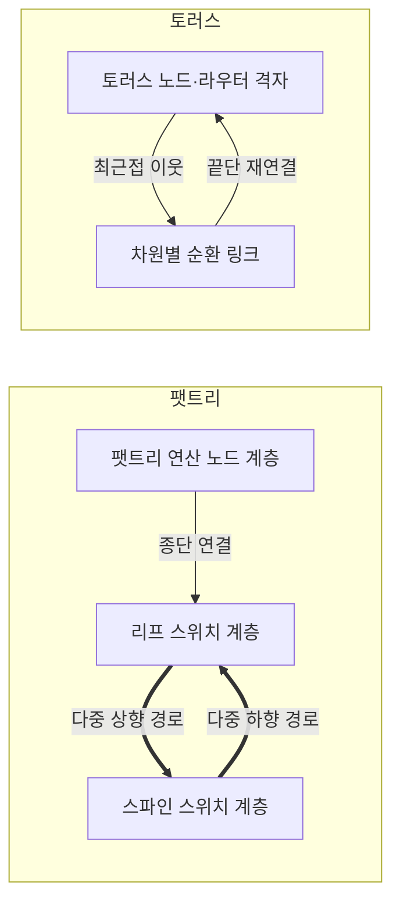
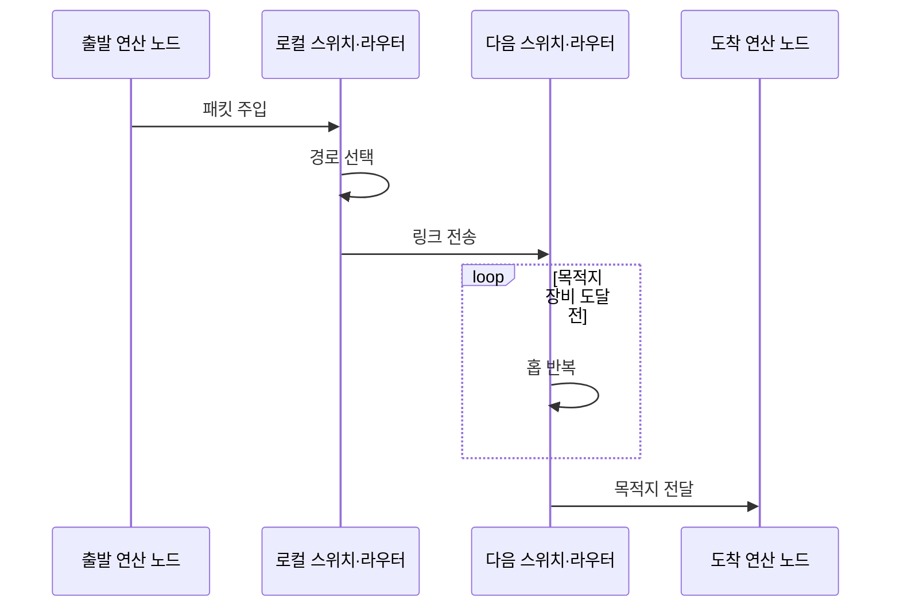

---
sidebar:
  order: 94
  label: "094. 인터커넥트 토폴로지 — 팻트리·토러스 (Interconnect Topology — Fat-Tree·Torus)"
  badge:
    text: "기출 · 70%"
    variant: note
title: "인터커넥트 토폴로지 — 팻트리·토러스 (Interconnect Topology — Fat-Tree·Torus)"
date: "2026-07-27T23:59:59+09:00"
tags:
  - "notes-hardware"
weight: 94
extra:
  question_no: "094"
  source_status: "기출"
  source_history: "138회"
  priority: 70
  priority_note: "집단·인접 통신 패턴이 토폴로지 선택을 좌우함"
---

## 미리 알고가기

- **팻트리(Fat-Tree)**: 상위 계층의 링크 용량·수를 늘린 계층형 스위치 망
- **토러스(Torus)**: 각 차원 끝단을 연결한 순환 격자형 노드 망
- **인터커넥트 토폴로지(Interconnect Topology)**: 연산 노드·스위치·링크의 물리·논리 연결 형태
- **리프·스파인 스위치(Leaf·Spine Switch)**: 리프는 연산 노드를 수용하고 스파인은 모든 리프 사이의 상위 경로를 제공함
- **양분 대역폭(Bisection Bandwidth)**: 같은 크기 두 노드 집합 사이의 최소 총 링크 용량
- **오버서브스크립션(Oversubscription)**: 하향 대역폭 합이 상향 대역폭 합을 넘는 상태
- **비차단(Non-Blocking)**: 동시 통신을 내부 대역폭 부족 없이 수용하는 구성
- **홉(Hop)**: 패킷이 거치는 링크·장비 한 단계
- **노드 차수·망 지름(Node Degree·Network Diameter)**: 차수는 노드당 직접 링크 수이고 지름은 가장 먼 두 노드 사이의 최소 홉 수
- **혼잡(Congestion)**: 여러 통신 흐름이 같은 링크·출력 포트를 요구해 대기하는 상태
- **집단 통신(Collective Communication)**: 여러 프로세스가 방송·수집·축약 같은 하나의 공동 데이터 교환에 참여하는 통신
- **방송·수집·축약(Broadcast·Gather·Reduction)**: 방송은 한 데이터를 전체로, 수집은 전체 데이터를 한곳으로 보내고 축약은 여러 값을 하나의 합·최댓값 등으로 결합함
- **패킷 주입(Packet Injection)**: 연산 노드가 목적지·데이터를 담은 패킷을 로컬 네트워크 장비에 넣는 동작
- **스텐실 연산(Stencil Computation)**: 격자 이웃값으로 새 값을 반복 계산하는 연산
- **토폴로지 인지 배치(Topology-Aware Mapping)**: 통신량이 큰 작업을 가까운 노드에 배치하는 기법
- **인공지능(Artificial Intelligence, AI)**: AI는 ‘에이아이’로 읽고 영문 머리글자를 딴 약어이며, 학습 기반 판단·생성 기술을 뜻함
- **고성능 컴퓨팅(High-Performance Computing, HPC)**: HPC는 ‘에이치피시’로 읽고 영문 머리글자를 딴 약어이며, 병렬 자원으로 대규모 연산을 수행

## Ⅰ. 개요

- **정의/개념**: 노드·스위치·링크 배치로 **통신 경로·용량**을 정하는 구조
- **기존 한계**: 단일 연결 구조는 **전역·최근접 통신 패턴별 병목** 대응에 한계

### 쉽게 이해하기 (학습용)

- 큰길로 이을지 순환 골목으로 이을지 이동 패턴에 맞춰 도로망을 정한다.

## Ⅱ. 특징

- **차수·지름·양분 대역폭**이 경로 성능·비용 결정
- 팻트리는 **다중 상향 경로**로 전역 통신 대역폭 확보
- 토러스는 **순환 최근접 연결**로 인접 통신 비용 절감

### 쉽게 이해하기 (학습용)

- 큰길은 공사비가 크고 골목은 먼 이동이 길어지므로 통행 방식에 맞춰 설계한다.

## Ⅲ. 아키텍처 및 구성요소

| 설계 요소 | 설명 |
|:---|:---|
| 팻트리 연산 노드 계층 | 모든 종단을 같은 리프 계층에 연결 |
| 리프 스위치 계층 | 종단을 수용하고 스파인에 다중 연결 |
| 스파인 스위치 계층 | 리프 사이 상향·하향 경로 제공 |
| 토러스 노드·라우터 격자 | 노드마다 차원별 이웃 라우터에 연결 |
| 차원별 순환 링크 | 각 차원 끝단을 연결해 순환 경로 완성 |

> 요약: 팻트리는 계층 다중 경로, 토러스는 차원 순환 경로

### 쉽게 이해하기 (학습용)

- 팻트리는 계층 큰길로 토러스는 순환 이웃길로 노드를 연결한다.

## Ⅳ. 원리 및 절차 흐름도

| 절차 | 설명 |
|:---|:---|
| 패킷 주입 | 목적지·데이터를 로컬 스위치·라우터에 전달 |
| 경로 선택 | 팻트리는 상향·하향, 토러스는 차원 순서 선택 |
| 링크 전송 | 출력 포트로 다음 스위치·라우터에 전달 |
| 홉 반복 | 목적지 장비까지 경로 선택과 링크 전송 반복 |
| 목적지 전달 | 최종 장비가 패킷을 도착 연산 노드에 전달 |

> 요약: 토폴로지별 다음 홉 선택·전송을 목적지까지 반복

### 쉽게 이해하기 (학습용)

- 택배가 주소를 보고 갈림길마다 다음 길을 선택해 목적지까지 간다.

## Ⅴ. 종류 및 비교

| 인터커넥트 토폴로지 | 팻트리 | 토러스 |
|:---|:---|:---|
| 적용 기준 | 전역 **집단 통신 중심 작업** | **최근접 이웃 통신 중심 작업** |
| 핵심 특징 | 리프·스파인 계층의 **다중 경로** | 차원별 이웃의 **순환 경로** |
| 한계 | 상위 스위치·**포트·케이블 비용** | 먼 노드의 **홉·혼잡 증가** |

> 요약: 전역 집단 통신은 팻트리, 최근접 이웃 통신은 토러스

### 쉽게 이해하기 (학습용)

- 전역 통신은 팻트리로 인접 통신은 토러스로 경로를 맞춘다.

## Ⅵ. 실무 사례

1. AI 클러스터는 **비차단 팻트리**로 집단 통신 대역폭 확보
2. HPC 스텐실은 **인접 프로세스를 토러스 이웃**에 배치

### 쉽게 이해하기 (학습용)

- 모두가 자료를 주고받는 AI 학습에는 넓은 계층 큰길을 둔다.
- 격자 계산 작업은 자주 대화하는 이웃끼리 옆자리에 둔다.

## Ⅶ. 결론

- **전역·최근접 이웃 통신 비율**로 팻트리·토러스 선택

### 쉽게 이해하기 (학습용)

- 모두 멀리 오가면 큰길, 이웃끼리 오가면 순환 골목을 선택한다.
