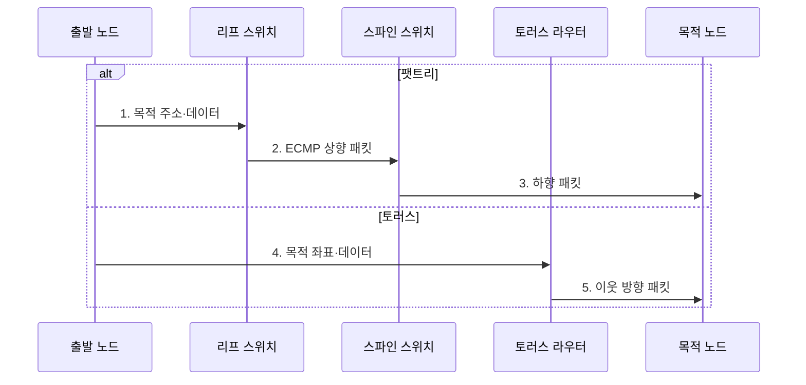

---
sidebar:
  order: 94
  label: "094. 인터커넥트 토폴로지: 팻트리·토러스 (Interconnect Topology: Fat-Tree·Torus)"
  badge:
    text: "기출 · 70%"
    variant: note
title: "인터커넥트 토폴로지: 팻트리·토러스 (Interconnect Topology: Fat-Tree·Torus)"
date: "2026-08-02T11:54:00+09:00"
tags:
  - "notes-hardware"
weight: 94
extra:
  question_no: "094"
  source_status: "기출"
  source_history: "138회"
  priority: 70
  priority_note: "집단·인접 통신 패턴에 따른 토폴로지 선택"
---

## Ⅰ. 개요

핵심 용어

- **인터커넥트 토폴로지**: 연산 노드·스위치·링크의 물리·논리 연결 형태이다.
- **팻트리**: 상위 계층으로 갈수록 링크 용량이나 수를 늘린 계층형 스위치 망이다.
- **토러스**: 각 차원의 끝단을 연결하여 순환 경로를 만든 격자형 노드 망이다.

- 정의/개념: **인터커넥트 토폴로지**는 연산 노드•스위치•링크의 물리•논리 연결로 통신 경로와 대역폭 특성을 결정하는 **망 구조**
- 배경/필요성: 단일 연결 구조는 통신 패턴 차이로 **대역폭·지연 병목** 발생

### 쉽게 이해하기 (학습용)

- 큰길로 이을지 순환 골목으로 이을지 이동 패턴에 맞춰 도로망을 정한다.

## Ⅱ. 특징

핵심 용어

- **양분 대역폭**: 망을 같은 크기의 두 노드 집합으로 나눌 때 그 사이를 잇는 최소 총 링크 용량이다.
- **오버서브스크립션**: 하향 포트의 총대역폭이 상향 포트의 총대역폭을 초과하는 상태이다.
- **망 지름**: 망에서 가장 먼 두 노드 사이의 최소 홉 수이다.

- 높은 **노드 차수**는 배선 비용 증가, 큰 **망 지름**은 최대 홉 증가
- 팻트리는 높은 양분 대역폭으로 **전체 축약·ECMP** 지원
- 토러스는 **순환 최근접 연결**로 인접 통신 비용 절감

### 쉽게 이해하기 (학습용)

- 큰길은 공사비가 크고 골목은 먼 이동이 길어지므로 통행 방식에 맞춰 설계한다.

## Ⅲ. 구조 및 구성요소

핵심 용어

- **리프·스파인 스위치**: 리프는 연산 노드를 수용하고 스파인은 모든 리프 사이의 상위 경로를 제공한다.
- **홉(Hop)**: 패킷이 출발지에서 목적지로 이동하며 거치는 링크나 장비 한 단계이다.
- **동일 비용 다중 경로(ECMP)**: 비용이 같은 여러 경로에 흐름을 해시로 분산하는 방식이다.

| 구성요소 | 책임 |
|:---|:---|
| 연산 노드 | **패킷 생성·수신** |
| 리프 스위치 | **종단 수용·상향 전달** |
| 스파인 스위치 | **전역 다중 경로 제공** |
| 토러스 라우터 | **좌표 기반 전달** |
| 순환 링크 | **끝단·대체 경로 연결** |

### 쉽게 이해하기 (학습용)

- 팻트리는 노드·리프·스파인 계층, 토러스는 노드·라우터·순환 링크 구조다.

## Ⅳ. 흐름도

핵심 용어

- **패킷 주입**: 연산 노드가 목적지와 데이터를 담은 패킷을 로컬 네트워크 장비에 넣는 동작이다.
- **적응 라우팅**: 링크의 혼잡·장애 상태에 따라 패킷의 전송 경로를 바꾸는 방식이다.
- **교착**: 패킷들이 서로 점유한 자원을 기다리며 모두 진행하지 못하는 상태이다.

**동작 원리**

1. **목적 주소·데이터**: 출발 노드가 리프에 패킷 주입
2. **ECMP 상향 패킷**: 동일 비용 스파인 경로 선택
3. **하향 패킷**: 목적 노드 방향으로 전달
4. **목적 좌표·데이터**: 출발 노드가 라우터에 패킷 주입
5. **이웃 방향 패킷**: 좌표 차이를 줄이는 순환 링크 이동

### 쉽게 이해하기 (학습용)

- 팻트리는 큰길을 거치고 토러스는 이웃길을 건넌다.

## Ⅴ. 종류 및 비교

핵심 용어

- **집단 통신**: 여러 프로세스가 방송·수집·축약 같은 공동 데이터 교환에 참여하는 통신이다.
- **최근접 이웃 통신**: 각 노드가 토폴로지에서 인접한 소수 노드와 반복적으로 데이터를 교환하는 패턴이다.

| 망 토폴로지 | 팻트리 | 토러스 |
|:---|:---|:---|
| 적용 기준 | 전역 **집단 통신 중심 작업** | **최근접 이웃 통신 중심 작업** |
| 핵심 특징 | 리프·스파인 계층의 **다중 경로** | 차원별 이웃의 **순환 경로** |
| 한계 | 상위 스위치·**포트·케이블 비용** | 먼 노드의 **홉·혼잡 증가** |

> 요약: 전역 집단 통신은 **팻트리**, 최근접 이웃 통신은 **토러스** 선택

### 쉽게 이해하기 (학습용)

- 멀리 동시에 오가는 통신은 팻트리, 이웃끼리 반복하는 통신은 토러스가 유리하다.

## Ⅵ. 실무 고려사항 및 대책

핵심 용어

- **통신 행렬**: 출발·목적 노드 쌍별 통신량을 나타낸 표이다.
- **꼬리 지연**: 지연 분포의 상위 백분위에 해당하는 느린 패킷의 지연이다.
- **장애 주입·경로 재수렴**: 링크 장애를 의도적으로 발생시키고 라우팅이 새 정상 경로로 안정되는지 검증하는 시험이다.

| 문제 | 대책 | 효과 |
|:---|:---|:---|
| 평균 대역폭만 보면 **집단 통신 혼잡** 누락 | 통신 행렬로 **양분 대역폭·꼬리 지연** 시험 | **토폴로지 적합성** 검증 |
| 팻트리 오버서브스크립션으로 **상위 링크 병목** | **트래픽 배치·상향 용량**과 다중 경로 조정 | **전역 통신 처리량** 확보 |
| 토러스 장거리 흐름이 다수 홉을 점유해 **교착·혼잡** 유발 | 교착 회피 경로와 **적응 라우팅** | **홉·혼잡** 감소 |
| 링크·스위치 장애로 **우회 경로 편중** | **장애 주입·경로 재수렴**과 축소 대역폭 감시 | **장애 성능 예측성** 향상 |

### 쉽게 이해하기 (학습용)

- 모든 노드가 자료를 주고받는 전체 축약에는 넓은 계층 경로를 둔다.

## Ⅶ. 결론

핵심 용어

- **토폴로지 인지 배치**: 통신량이 큰 작업을 서로 가까운 노드에 배치하는 기법이다.
- **전체 축약(All-Reduce)**: 모든 노드의 값을 축약한 결과를 다시 모든 노드에 배포하는 집단 통신이다.

- 전역 집단 통신은 **팻트리**, 최근접 이웃은 **토러스** 선택

### 쉽게 이해하기 (학습용)

- 모두 멀리 오가면 큰길, 이웃끼리 오가면 순환 골목을 선택한다.
