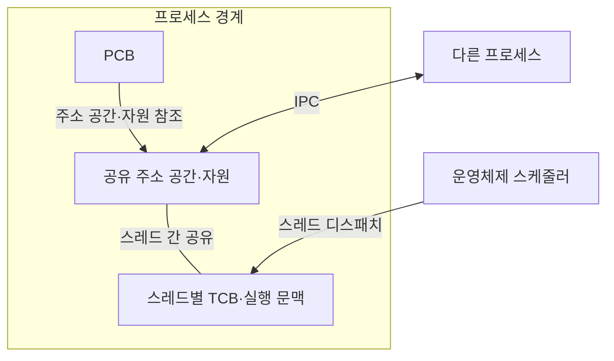

---
sidebar:
  order: 1
  label: "001. 프로세스 vs 스레드 (Process vs Thread)"
  badge:
    text: "기출 · 50%"
    variant: note
title: 프로세스 vs 스레드 (Process vs Thread)
date: "2026-07-27T23:59:59+09:00"
tags: [notes-software]
weight: 1
extra:
  question_no: "001"
  source_status: "기출"
  source_history: "120회"
  priority: 50
  priority_note: "120회 기출, 프로세스·스레드 자원 비교"
---

## 미리 알고가기

- **프로세스**: 운영체제가 주소 공간·자원을 보호하는 단위
- **스레드**: 프로세스 자원을 공유하는 실행·스케줄링 단위
- **프로세스 제어 블록(Process Control Block, PCB)**: 주소 공간·자원 참조와 프로세스 상태를 저장하는 운영체제 자료구조
- **스레드 제어 블록(Thread Control Block, TCB)**: 레지스터·스택 포인터·스케줄 상태를 저장하는 스레드별 자료구조
- **프로세스 간 통신(Inter-Process Communication, IPC)**: 격리된 프로세스의 주소 공간 사이에서 데이터를 교환하는 방식
- **운영체제(Operating System, OS)**: 프로세스 자원과 스레드 실행 순서를 관리하는 시스템 소프트웨어
- **주소 공간(Address Space)**: 프로세스가 사용할 수 있도록 운영체제가 격리한 가상 메모리 주소 범위
- **실행 문맥(Execution Context)**: 중단된 스레드의 실행을 이어 가는 데 필요한 프로그램 카운터·레지스터·스택 포인터 상태
- **프로그램 카운터(Program Counter, PC)**: 다음에 실행할 명령 주소와 스레드별 중단 위치를 저장하는 레지스터
- **중앙처리장치(Central Processing Unit, CPU)**: 스케줄러가 선택한 스레드의 명령을 실행하는 처리장치
- **스택·스택 포인터(Stack·Stack Pointer)**: 스택은 함수 호출·지역 변수를 쌓는 스레드별 메모리이고 스택 포인터는 현재 스택 끝 주소를 가리키는 레지스터
- **스케줄러·디스패치(Scheduler·Dispatch)**: 스케줄러는 다음 실행 스레드를 선택하고 디스패치는 선택한 스레드에 CPU 제어권을 넘긴다.
- **코드·데이터·힙·열린 파일(Code·Data·Heap·Open File)**: 코드와 데이터는 프로그램 명령·전역값, 힙은 동적 할당 영역, 열린 파일은 운영체제 자원 참조로서 같은 프로세스의 스레드가 공유한다.
- **잠금·보호 구간(Lock·Critical Section)**: 잠금은 공유 상태 접근을 직렬화하고 보호 구간은 동시에 실행하면 안 되는 코드 범위
- **동기화(Synchronization)**: 여러 스레드의 공유 상태 접근 순서와 값의 가시성을 맞춰 경쟁 조건을 방지하는 제어
- **브라우저 렌더러(Browser Renderer)**: 웹 문서를 화면에 그리는 구성요소로서 별도 프로세스에 두면 충돌과 권한을 다른 탭에서 격리한다.
- **스레드 풀·요청 큐·캐시(Thread Pool·Request Queue·Cache)**: 스레드 풀은 미리 만든 작업 스레드 집합, 요청 큐는 대기 작업 목록, 캐시는 재사용 데이터를 보관하는 공유 저장소

## Ⅰ. 개요
- 정의/개념: 프로세스는 **자원 보호 단위**, 스레드는 **실행 단위**
- 기존 한계: 단일 실행 단위는 **장애 격리·상태 공유**를 함께 최적화하기 곤란

### 쉽게 이해하기 (학습용)

- 프로세스가 작업실이라면 스레드는 도구를 함께 쓰는 작업자

## Ⅱ. 특징

- 프로세스의 **독립 주소 공간**으로 장애·권한 격리
- 스레드의 **주소 공간 공유**로 상태 교환 비용 절감
- **격리·공유 범위**가 전환 비용·오류 전파 범위 결정

### 쉽게 이해하기 (학습용)

- 작업실을 나누면 고장을 가두지만 도구를 함께 쓰려면 전달 비용이 커진다

## Ⅲ. 아키텍처 및 구성요소

| 설계 요소 | 입력·상태 | 역할 |
|:---|:---|:---|
| PCB | 프로세스 상태·자원 참조 | 주소 공간·권한·자원 수명 관리 |
| 공유 주소 공간·자원 | 코드·데이터·힙·열린 파일 | 같은 프로세스 스레드 간 상태 공유 |
| 스레드별 TCB·실행 문맥 | 레지스터·프로그램 카운터·스택 | 독립 실행·스케줄링 상태 보관 |

> 요약: 프로세스별 주소 공간·스레드별 실행 문맥

### 쉽게 이해하기 (학습용)

- 작업실 장부는 공용 자원을, 작업자 수첩은 각자 멈춘 위치를 기록한다

## Ⅳ. 운영 고려사항

| 운영 위험 | 대응 | 기대 효과 |
|:---|:---|:---|
| 공유 상태 경쟁·교착 | 소유권·불변성 우선 설계와 잠금 순서·시간 제한 | 동시성 결함 감소 |
| 스레드 오류가 프로세스 전체로 전파 | 신뢰 경계별 프로세스 분리와 감독·재시작 | 장애 범위 축소 |
| 과도한 스레드로 전환·스택 메모리 증가 | 부하 기반 풀 크기·큐 길이·포화 정책 설정 | 자원 사용 안정화 |
| IPC 직렬화·복사 비용이 처리량 제한 | 메시지 크기·빈도 계측과 배치·공유 메모리 검토 | 격리와 성능 균형 |

### 쉽게 이해하기 (학습용)

- 다른 작업실에는 전달 창구로 보내고 같은 작업실에서는 도구를 잠근 뒤 함께 쓴다

## Ⅴ. 종류 및 비교

| 실행 단위 | 프로세스 | 스레드 |
|:---|:---|:---|
| 적용 기준 | 권한·장애·**수명주기 격리** | 빈번한 **상태 공유** |
| 핵심 특징 | 주소 공간 격리·**명시적 IPC** | 주소 공간 공유·**동기화 필요** |
| 한계 | IPC·주소 공간 **전환 비용** | 오류 전파·**동기화 결함** |

> 요약: 프로세스는 주소 공간을 격리하고 스레드는 자원을 공유

### 쉽게 이해하기 (학습용)

- 고장을 가둘 때는 작업실을, 자료를 자주 나눌 때는 작업자를 나눈다

## Ⅵ. 실무 사례

1. 브라우저는 **렌더러 프로세스 분리**로 탭 장애 격리

### 쉽게 이해하기 (학습용)

- 브라우저 화면 처리를 별도 작업실에 두면 하나가 고장 나도 다른 작업실은 남는다

## Ⅶ. 결론

- 실행 단위의 장애 전파와 전환 비용을 통제하기 위해 **권한·장애 격리와 상태 공유 빈도**를 검토하고, 강한 격리는 프로세스, 빈번한 공유는 스레드로 설계한다

### 쉽게 이해하기 (학습용)

- 고장을 가두려면 작업실을 나누고 자료를 자주 공유하려면 작업자를 나눈다
