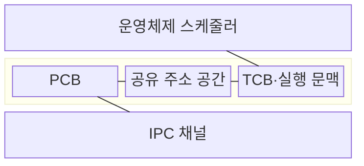
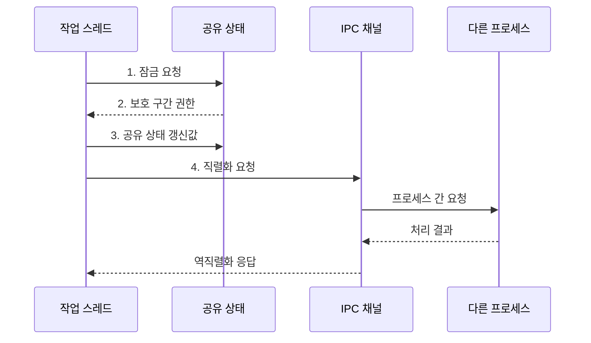

---
sidebar:
  order: 1
  label: "001. 프로세스 vs 스레드 (Process vs Thread)"
  badge:
    text: "기출 · 50%"
    variant: note
title: 프로세스 vs 스레드 (Process vs Thread)
date: "2026-08-02T22:01:00+09:00"
tags: [notes-software]
weight: 1
extra:
  question_no: "001"
  source_status: "기출"
  source_history: "120회"
  priority: 50
  priority_note: "120회 기출, 프로세스·스레드 자원 비교"
---

## Ⅰ. 개요

핵심 용어

- **프로세스**: 운영체제가 주소 공간과 자원을 보호하는 실행 단위
- **스레드**: 프로세스 자원을 공유하는 실행·스케줄링 단위

- 정의/개념: 프로세스는 독립 주소 공간과 자원을 보호하는 컨테이너이고, 스레드는 그 자원을 공유하며 CPU에 스케줄되는 **실행 단위**
- 배경/필요성: 장애 격리와 상태 공유 요구에 맞는 **실행 단위 선택**

#### 한줄 요약

- 프로세스가 독립 작업실이고 스레드가 도구를 함께 쓰는 작업자라서, 고장을 가둘지 상태를 빠르게 나눌지에 따라 단위를 고른다

## Ⅱ. 특징

핵심 용어

- **주소 공간(Address Space)**: 운영체제가 프로세스별로 격리한 가상 메모리 주소 범위
- **격리·공유 범위**: 프로세스와 스레드가 주소 공간·자원을 독립해서 쓰거나 함께 쓰는 경계

- 프로세스의 **독립 주소 공간**으로 장애·권한 격리
- 스레드의 **주소 공간 공유**로 상태 교환 비용 절감
- **격리·공유 범위**가 전환 비용·오류 전파 범위 결정

#### 한줄 요약

- 작업실을 나누면 고장을 가두지만 도구를 함께 쓰려면 전달 비용이 커진다

## Ⅲ. 구조 및 구성요소

핵심 용어

- **프로세스 제어 블록(Process Control Block, PCB)**: 주소 공간·자원 참조와 프로세스 상태를 저장하는 운영체제 자료구조
- **스레드 제어 블록(Thread Control Block, TCB)**: 레지스터·스택 포인터·스케줄 상태를 저장하는 스레드별 자료구조
- **실행 문맥(Execution Context)**: 중단된 스레드의 실행을 잇는 프로그램 카운터·레지스터·스택 포인터 상태
- **프로세스 간 통신(Inter-Process Communication, IPC)**: 격리된 프로세스 주소 공간 사이에서 데이터를 교환하는 방식
- **스케줄러·디스패치(Scheduler·Dispatch)**: 스케줄러는 다음 스레드를 선택하고 디스패치는 그 스레드에 CPU 제어권을 넘긴다.

| 구성요소 | 책임 |
|:---|:---|
| 운영체제 스케줄러 | **스레드 선택·디스패치** |
| PCB | **주소 공간·자원 관리** |
| 공유 주소 공간 | **코드·힙·파일 공유** |
| TCB·실행 문맥 | **독립 실행 상태 보관** |
| IPC 채널 | **프로세스 간 전달** |

#### 한줄 요약

- 같은 작업실의 작업자는 잠금으로 도구를 공유하고, 다른 작업실에는 복사·검사되는 전달 창구로 요청한다.

## Ⅳ. 흐름도

핵심 용어

- **프로그램 카운터(Program Counter, PC)**: 다음에 실행할 명령 주소와 스레드별 중단 위치를 저장하는 레지스터
- **잠금·보호 구간(Lock·Critical Section)**: 잠금은 공유 상태 접근을 직렬화하고 보호 구간은 동시에 실행하면 안 되는 코드 범위
- **직렬화(Serialization)**: 메모리 객체를 프로세스 경계를 넘는 바이트 형식으로 변환하는 처리
- **역직렬화(Deserialization)**: 전달받은 바이트 형식을 프로그램이 사용할 객체로 복원하는 처리

**동작 원리**

1. **잠금 요청**: 공유 상태의 동시 접근 순서 조정
2. **보호 구간 권한**: 잠금 소유 스레드만 상태 변경 허용
3. **공유 상태 갱신값**: 값 반영과 잠금 해제로 변경 가시화
4. **직렬화 요청**: 객체를 바이트 형식으로 바꿔 프로세스 경계 통과

#### 한줄 요약

- 같은 작업실은 잠금으로 공유하고 다른 작업실은 창구로 전달한다.

## Ⅴ. 종류 및 비교

핵심 용어

- **동기화(Synchronization)**: 여러 스레드의 공유 상태 접근 순서와 값의 가시성을 맞추는 제어
- **프로세스 간 통신(Inter-Process Communication, IPC)**: 격리된 프로세스 사이에서 데이터를 교환하는 방식

| 실행 단위 | 프로세스 | 스레드 |
|:---|:---|:---|
| 적용 기준 | 권한·장애·**수명주기 격리** | 빈번한 **상태 공유** |
| 핵심 특징 | 주소 공간 격리·**명시적 IPC** | 주소 공간 공유·**동기화 필요** |
| 한계 | IPC·주소 공간 **전환 비용** | 오류 전파·**동기화 결함** |

> 요약: 프로세스는 주소 공간을 격리하고 스레드는 자원을 공유

#### 한줄 요약

- 고장을 가둘 때는 프로세스를 나누고 같은 상태를 자주 다룰 때는 스레드를 나눈다.

## Ⅵ. 실무 고려사항 및 대책

핵심 용어

- **불변성(Immutability)**: 생성 뒤 값을 바꾸지 않아 동시 접근 충돌을 줄이는 성질
- **감독·재시작(Supervision·Restart)**: 상위 관리자가 실패한 프로세스를 감지해 다시 실행하는 복구 방식
- **신뢰 경계(Trust Boundary)**: 서로 다른 권한과 장애 전파 범위를 분리하는 시스템 경계
- **포화 정책(Saturation Policy)**: 요청 큐가 한도에 도달했을 때 작업 거부·대기·호출자 실행 중 하나를 정하는 규칙
- **공유 메모리(Shared Memory)**: 여러 프로세스가 같은 물리 메모리 영역을 매핑해 데이터를 교환하는 IPC 방식
- **소유권(Ownership)**: 공유 상태를 읽거나 변경할 책임을 특정 스레드나 구성요소에 한정하는 설계 원칙
- **스레드 풀(Thread Pool)**: 정해진 수의 스레드를 재사용해 작업을 처리하며 생성·전환 비용을 제한하는 구조

| 문제 | 대책 | 효과 |
|:---|:---|:---|
| 여러 스레드가 공유 상태를 갱신해 **경쟁·교착** | **불변성·소유권** 우선 설계와 잠금 순서 고정 | **동시성 결함** 발생률 감소 |
| 스레드 오류가 프로세스 전체로 **장애 전파** | **신뢰 경계**별 프로세스 분리와 감독·재시작 | **장애 격리 범위** 축소 |
| 스레드 수가 늘어 전환·스택 **메모리 급증** | 부하별 **풀 크기·포화 정책** 설정 | **문맥 전환·메모리** 사용량 제한 |
| 잦은 IPC 직렬화·복사로 **처리량 저하** | 메시지 배치와 **공유 메모리** 적용 | **직렬화·복사 비용** 감소 |

#### 한줄 요약

- 브라우저 화면 처리를 별도 작업실에 두면 하나가 고장 나도 다른 작업실은 남는다

## Ⅶ. 결론

핵심 용어

- **격리·공유**: 장애를 가둘 필요와 상태를 함께 쓸 빈도에 따라 실행 단위 선택을 가르는 기준

- 격리 요구가 높으면 **프로세스**, 공유 빈도가 높으면 **스레드** 선택

#### 한줄 요약

- 고장을 가두려면 작업실을 나누고 자료를 자주 공유하려면 작업자를 나눈다
