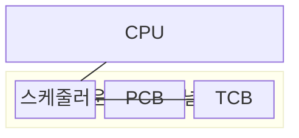
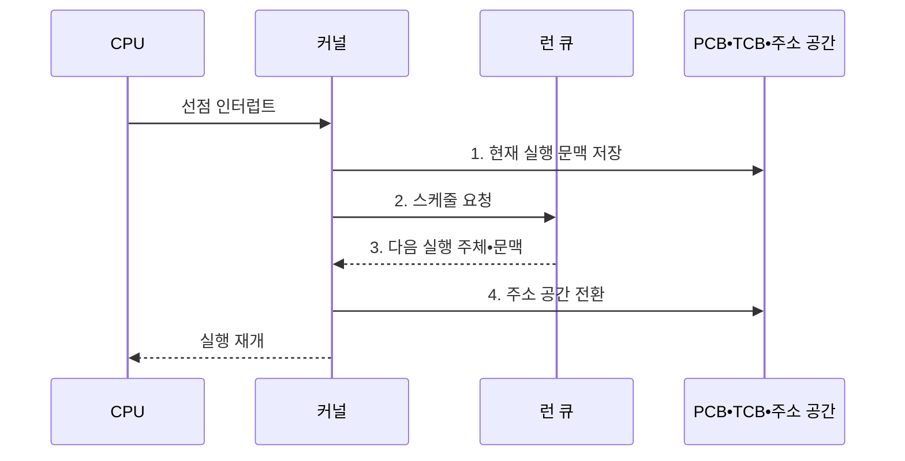

---
sidebar:
  order: 2
  label: "002. PCB•컨텍스트 스위칭 (PCB Context Switching)"
  badge:
    text: "기출 • 50%"
    variant: note
title: PCB•컨텍스트 스위칭 (PCB Context Switching)
date: "2026-08-04T16:42:00+09:00"
tags: [notes-software]
weight: 2
extra:
  question_no: "002"
  source_status: "기출"
  source_history: "120회"
  priority: 50
  priority_note: "120회 기출, 문맥 전환 비용•PCB 상태 핵심"
---

## Ⅰ. 개요

핵심 용어

- **컨텍스트 스위칭(Context Switching)**: 현재 실행 문맥을 저장하고 다음 문맥을 복원해 실행 주체를 교체하는 운영체제 기법
- **프로세스 제어 블록(Process Control Block, PCB)**: 프로세스 상태•주소 공간•자원 참조를 저장하는 운영체제 자료구조
- **스레드 제어 블록(Thread Control Block, TCB)**: 스레드별 레지스터•스택 포인터•스케줄 상태를 저장하는 자료구조
- **실행 문맥(Execution Context)**: 중단 지점부터 실행을 재개하는 데 필요한 프로그램 카운터•레지스터•스택 포인터 상태

- 정의/개념: **PCB•TCB** 에 실행 문맥을 저장•복원해 실행 주체를 교체하는 운영체제 기법
- 배경/필요성: 문맥 저장 없이는 선점된 작업의 **중단 지점 복귀 불가**

#### 한줄 요약

- 책상 상태를 장부에 기록하고 다음 사람의 장부대로 책상을 복원한다

## Ⅱ. 특징

핵심 용어

- **변환 색인 버퍼(Translation Lookaside Buffer, TLB)**: 가상 주소의 물리 주소 변환 결과를 저장하는 캐시
- **캐시 지역성(Cache Locality)**: 최근 사용한 코드•데이터가 프로세서 캐시에 남아 재사용되는 성질
- **PCB 문맥 보존**: 프로세스 상태와 자원 참조를 저장하는 처리
- **TCB 문맥 보존**: 스레드 레지스터와 스택 포인터를 저장하는 처리

- **PCB•TCB 문맥 보존** 으로 선점 전 실행 지점 복구
- **TLB•캐시 지역성 손실** 로 전환 비용 증가

#### 한줄 요약

- 교대를 자주 하면 손님을 빨리 번갈아 받지만 책상 자료를 다시 펴는 시간이 늘어난다

## Ⅲ. 구조 및 구성요소

핵심 용어

- **운영체제 커널(Operating System Kernel)**: 문맥 저장•복원과 다음 실행 주체 선택을 수행하는 운영체제 핵심
- **스케줄러(Scheduler)**: 실행 가능 주체 중 다음 실행 대상을 선택하는 커널 구성요소

| 구성요소 | 책임 |
|:---|:---|
| CPU | **현재 문맥 실행** |
| 운영체제 커널 | **문맥 저장•복원** |
| 스케줄러 | **다음 실행 대상 선택** |
| PCB | **주소 공간•자원 관리** |
| TCB | **스레드 문맥 보관** |

#### 한줄 요약

- 현재 작업자의 손 위치를 기록하고, 다음 작업자의 작업실 주소와 수첩대로 책상을 복원한 뒤 일을 넘긴다.

## Ⅳ. 흐름도

핵심 용어

- **선점(Preemption)**: 할당 시간 종료나 높은 우선순위 작업 도착 시 실행 중인 CPU를 회수하는 동작
- **런 큐(Run Queue)**: CPU 실행을 기다리는 준비 상태 스레드 목록
- **프로세서 친화도(Processor Affinity)**: 스레드가 실행될 수 있는 프로세서 범위를 제한하는 정책
- **페이지 테이블(Page Table)**: 가상 주소와 물리 주소의 대응 정보를 저장한 표
- **프로그램 카운터(Program Counter, PC)**: 다음에 실행할 명령어의 주소를 저장하는 레지스터
- **선점 인터럽트(Preemption Interrupt)**: 실행 시간을 회수해 커널의 스케줄링을 시작하게 하는 하드웨어•타이머 신호

**동작 원리**

1. **현재 실행 문맥 저장**: 프로그램 카운터•레지스터를 현재 TCB에 보존
2. **스케줄 요청**: 런 큐에서 우선순위•친화도 평가 시작
3. **다음 실행 주체•문맥**: 평가 결과로 다음 TCB•PCB를 확정하고 저장된 레지스터 조회
4. **주소 공간 전환**: 다음 프로세스면 페이지 테이블을 바꾸고 실행 문맥 복원

#### 한줄 요약

- 현재 상태를 기록하고 다음 작업자의 상태를 복원한다.

## Ⅴ. 종류 및 비교

핵심 용어

- **주소 공간 전환(Address-space Switch)**: 다음 프로세스의 페이지 테이블에 맞춰 가상 주소 변환 상태를 바꾸는 동작
- **디스패치(Dispatch)**: 스케줄러가 고른 실행 주체에 CPU 제어권을 넘기는 동작
- **지역성 손실(Locality Loss)**: 전환 뒤 기존 캐시•TLB 내용의 재사용률이 낮아져 재적재 비용이 발생하는 현상

| 전환 범위 | 프로세스 전환 | 동일 프로세스 스레드 전환 |
|:---|:---|:---|
| 적용 기준 | 다른 프로세스 **디스패치** | 동일 프로세스 내 **스레드 교체** |
| 핵심 특징 | PCB•TCB•**주소 공간 전환** | TCB의 **실행 문맥 전환** |
| 한계 | TLB•캐시 **지역성 손실** | 공유 캐시 **교란 가능성** |

> 요약: 프로세스는 주소 공간까지, 스레드는 실행 문맥만 전환

#### 한줄 요약

- 프로세스를 바꾸면 작업실 주소까지, 같은 프로세스의 스레드를 바꾸면 작업자 수첩만 교체한다.

## Ⅵ. 실무 고려사항 및 대책

핵심 용어

- **시간 할당량(Time Quantum)**: 선점 전 연속 실행을 허용하는 시간
- **꼬리 지연(Tail Latency)**: 지연 분포의 상위 백분위에 해당하는 느린 전환 지연
- **백분위(Percentile)**: 측정값을 작은 순서로 놓았을 때 특정 비율이 그 이하인 경계값
- **보호 구간(Critical Section)**: 공유 커널 상태의 일관성을 위해 한 실행 주체만 진입하도록 제한한 코드 범위
- **최악 실행시간(Worst-Case Execution Time, WCET)**: 특정 코드 경로가 완료되는 데 걸릴 수 있는 최대 시간
- **런 큐 길이(Run-queue Length)**: CPU 실행을 기다리는 준비 상태 작업의 수

| 문제 | 대책 | 효과 |
|:---|:---|:---|
| 시간 할당량이 짧아 **문맥 전환 비중 급증** | 응답 목표와 전환 시간으로 **시간 할당량 조정** | **응답 지연•CPU 효율** 균형 |
| 프로세서 이동으로 **캐시•TLB 지역성 손실** | **프로세서 친화도** 와 부하 분산 공동 적용 | **캐시 재적재 비용** 감소 |
| 평균 전환 지연만 보면 **꼬리 지연 누락** | 백분위 전환 지연과 **런 큐 길이 계측** | **간헐적 지연** 원인 식별 |
| 긴 보호 구간으로 **선점•스케줄링 지연** | 보호 구간 축소와 **최악 실행시간 점검** | **응답시간 예측성** 향상 |

#### 한줄 요약

- 손님을 빨리 번갈아 응대하되 교대 준비가 많아지지 않도록 교대 간격을 정한다

## Ⅶ. 결론

핵심 용어

- **전환 비중**: 전체 CPU 시간 중 문맥 저장•복원에 소비한 시간의 비율

- 응답 지연이 목표를 넘으면 **할당량 축소**, 전환 비중이 높으면 **할당량 확대**

#### 한줄 요약

- 응답이 늦거나 교대 준비가 많으면 교대 간격을 조정한다
