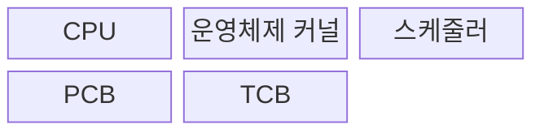
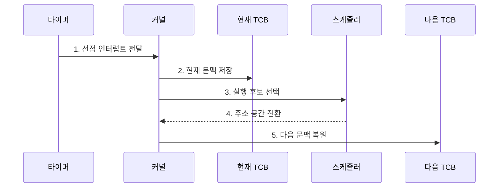

---
sidebar:
  order: 2
  label: "002. PCB·컨텍스트 스위칭 (PCB Context Switching)"
  badge:
    text: "기출 · 50%"
    variant: note
title: PCB·컨텍스트 스위칭 (PCB Context Switching)
date: "2026-07-27T23:59:59+09:00"
tags: [notes-software]
weight: 2
extra:
  question_no: "002"
  source_status: "기출"
  source_history: "120회"
  priority: 50
  priority_note: "120회 기출, 문맥 전환 비용·PCB 상태 핵심"
---

## 미리 알고가기

- **컨텍스트 스위칭(Context Switching)**: 현재 실행 문맥 저장 후 다음 문맥 복원
- **프로세스 제어 블록(Process Control Block, PCB)**: 프로세스 상태·주소 공간·자원 참조를 저장하는 운영체제 자료구조
- **스레드 제어 블록(Thread Control Block, TCB)**: 스레드별 레지스터·스택 포인터·스케줄 상태를 저장하는 자료구조
- **중앙처리장치(Central Processing Unit, CPU) 문맥**: 프로그램 카운터·레지스터·스택 포인터를 묶은 실행 상태
- **스케줄러(Scheduler)**: 실행 가능 주체 중 다음 실행 대상 선택
- **시간 할당량(Time Quantum)**: 선점 전 연속 실행을 허용하는 시간
- **페이지 테이블(Page Table)**: 가상·물리 주소 대응 정보를 저장한 표
- **변환 색인 버퍼(Translation Lookaside Buffer, TLB)**: 가상 주소에서 물리 주소로의 변환 결과를 저장하는 캐시
- **프로세서 친화도(Processor Affinity)**: 스레드의 실행 프로세서 범위 제한
- **운영체제 커널(Operating System Kernel)**: 선점·대기 시 문맥 저장과 다음 스레드 선택을 수행하는 운영체제 핵심
- **선점(Preemption)**: 할당 시간이 끝나거나 더 높은 우선순위 작업이 도착했을 때 실행 중인 스레드의 CPU를 회수하는 동작
- **주소 공간 전환(Address-space Switch)**: 다음 프로세스의 페이지 테이블을 기준으로 가상 주소 변환 상태를 바꾸는 동작
- **캐시 지역성(Cache Locality)**: 최근 사용한 코드·데이터가 프로세서 캐시에 남아 재사용되는 성질로서 다른 프로세서로 이동하면 재적재 비용이 생길 수 있다.
- **대화형 서버(Interactive Server)**: 사용자 요청에 빠른 첫 응답이 필요한 서버로서 시간 할당량과 문맥 전환 비중을 함께 조정한다.
- **패킷 처리 스레드(Packet-processing Thread)**: 네트워크 패킷을 반복 처리하는 실행 흐름으로서 특정 프로세서에 고정하면 캐시 재적재를 줄일 수 있다.
- **메모리 관리 장치(Memory Management Unit, MMU)**: 페이지 테이블을 이용해 가상 주소를 물리 주소로 변환·보호하는 하드웨어
- **런 큐(Run Queue)**: CPU 실행을 기다리는 준비 상태 스레드 목록
- **꼬리 지연(Tail Latency)**: 지연 분포의 상위 백분위에 해당하는 느린 전환 지연
- **백분위(Percentile)**: 측정값을 작은 순서로 놓았을 때 특정 비율이 그 이하인 경계값

## Ⅰ. 개요
- 정의/개념: PCB·TCB의 **문맥 저장·복원**으로 실행 교체
- 배경/필요성: 선점·대기 후 **중단 지점 실행 재개** 보장

### 쉽게 이해하기 (학습용)

- 책상 상태를 장부에 기록하고 다음 사람의 장부대로 책상을 복원한다

## Ⅱ. 특징

- **레지스터·프로그램 카운터 저장**으로 중단 지점 보존
- **다음 문맥 복원**으로 선점된 실행 주체 교체
- **TLB·캐시 지역성 손실**로 전환 비용 증가

### 쉽게 이해하기 (학습용)

- 교대를 자주 하면 손님을 빨리 번갈아 받지만 책상 자료를 다시 펴는 시간이 늘어난다

## Ⅲ. 구조 및 구성요소

| 구성요소 | 책임 |
|:---|:---|
| CPU | **현재 문맥 실행** |
| 운영체제 커널 | **문맥 저장·복원** |
| 스케줄러 | **다음 실행 대상 선택** |
| PCB | **주소 공간·자원 관리** |
| TCB | **스레드 문맥 보관** |

### 쉽게 이해하기 (학습용)

- 현재 작업자의 손 위치를 기록하고, 다음 작업자의 작업실 주소와 수첩대로 책상을 복원한 뒤 일을 넘긴다.

## Ⅳ. 흐름도

**동작 원리**

- **1. 선점 인터럽트 전달**: 커널 진입
- **2. 현재 문맥 저장**: PC·레지스터 기록
- **3. 실행 후보 선택**: 런 큐에서 우선순위·친화도 평가
- **4. 주소 공간 전환**: 전환 정보를 확인하고 페이지 기준 변경
- **5. 다음 문맥 복원**: 실행 재개

### 쉽게 이해하기 (학습용)

- 현재 상태를 기록하고 다음 작업자의 상태를 복원한다.

## Ⅴ. 종류 및 비교

| 구분 | 프로세스 전환 | 동일 프로세스 스레드 전환 |
|:---|:---|:---|
| 적용 기준 | 다른 프로세스 **디스패치** | 동일 프로세스 내 **스레드 교체** |
| 핵심 특징 | PCB·TCB·**주소 공간 전환** | TCB의 **실행 문맥 전환** |
| 한계 | TLB·캐시 **지역성 손실** | 공유 캐시 **교란 가능성** |

> 요약: 프로세스는 주소 공간까지, 스레드는 실행 문맥만 전환

### 쉽게 이해하기 (학습용)

- 프로세스를 바꾸면 작업실 주소까지, 같은 프로세스의 스레드를 바꾸면 작업자 수첩만 교체한다.

## Ⅵ. 실무 고려사항 및 대책

| 고려사항 | 대책 | 효과 |
|:---|:---|:---|
| 짧은 할당량으로 전환 비중 급증 | 응답 목표와 전환 시간 기반 할당량 조정 | 응답성·CPU 효율 균형 |
| 코어 이동으로 캐시·TLB 지역성 손실 | 프로세서 친화도와 부하 균형 공동 적용 | 재적재 비용 감소 |
| 전환 지연 평균만 보고 꼬리 지연 누락 | 원인별·백분위 전환 지연과 런 큐 길이 계측 | 간헐적 지연 탐지 |
| 긴 보호 구간이 선점·스케줄링 지연 | 커널 보호 구간 축소와 최악 실행시간 점검 | 응답 예측성 향상 |

### 쉽게 이해하기 (학습용)

- 손님을 빨리 번갈아 응대하되 교대 준비가 많아지지 않도록 교대 간격을 정한다

## Ⅶ. 결론

- 응답 지연·전환 비중으로 **시간 할당량**을 조결정

### 쉽게 이해하기 (학습용)

- 응답이 늦거나 교대 준비가 많으면 교대 간격을 조정한다
