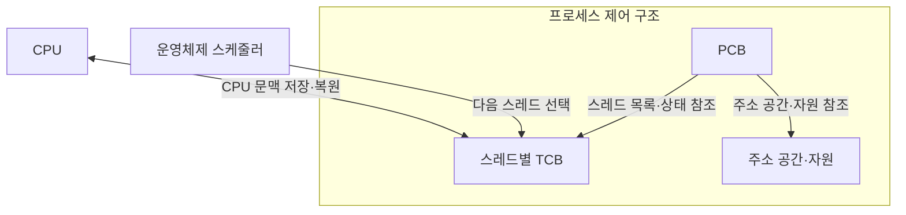
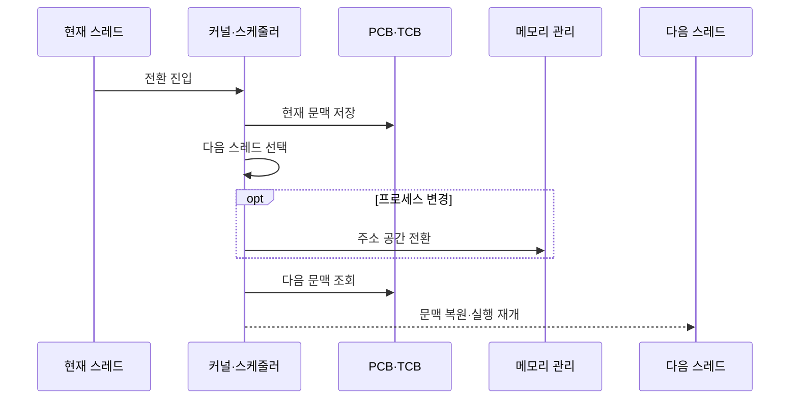

---
sidebar:
  order: 2
  label: "002. PCB·컨텍스트 스위칭 (PCB Context Switching)"
  badge:
    text: "기출 · 50%"
    variant: note
title: PCB·컨텍스트 스위칭 (PCB Context Switching)
date: "2026-07-27T23:59:59+09:00"
tags: [notes-software]
weight: 2
extra:
  question_no: "002"
  source_status: "기출"
  source_history: "120회"
  priority: 50
  priority_note: "120회 기출, 문맥 전환 비용·PCB 상태 핵심"
---

## 미리 알고가기

- **컨텍스트 스위칭(Context Switching)**: 현재 실행 문맥 저장 후 다음 문맥 복원
- **프로세스 제어 블록(Process Control Block, PCB, 피시비)**: 영문 각 단어의 첫 글자를 따 PCB로 표기하며 프로세스 상태·주소 공간·자원 참조를 저장하는 구조
- **스레드 제어 블록(Thread Control Block, TCB, 티시비)**: 영문 각 단어의 첫 글자를 따 TCB로 표기하며 스레드별 레지스터·스택 포인터·스케줄 상태를 저장하는 구조
- **중앙처리장치(Central Processing Unit, CPU, 시피유) 문맥**: 영문 각 단어의 첫 글자를 따 CPU로 표기하며 프로그램 카운터·레지스터·스택 포인터 상태를 묶은 정보
- **스케줄러(Scheduler)**: 실행 가능 주체 중 다음 실행 대상 선택
- **시간 할당량(Time Quantum)**: 선점 전 연속 실행을 허용하는 시간
- **페이지 테이블(Page Table)**: 가상·물리 주소 대응 정보를 저장한 표
- **변환 색인 버퍼(Translation Lookaside Buffer, TLB, 티엘비)**: 영문 각 단어의 첫 글자를 따 TLB로 표기하며 가상·물리 주소 변환 결과를 저장하는 캐시
- **프로세서 친화도(Processor Affinity)**: 스레드의 실행 프로세서 범위 제한
- **운영체제 커널(Operating System Kernel)**: 선점·대기 시 문맥 저장과 다음 스레드 선택을 수행하는 운영체제 핵심
- **선점(Preemption)**: 할당 시간이 끝나거나 더 높은 우선순위 작업이 도착했을 때 실행 중인 스레드의 CPU를 회수하는 동작
- **주소 공간 전환(Address-space Switch)**: 다음 프로세스의 페이지 테이블을 기준으로 가상 주소 변환 상태를 바꾸는 동작
- **캐시 지역성(Cache Locality)**: 최근 사용한 코드·데이터가 프로세서 캐시에 남아 재사용되는 성질로서 다른 프로세서로 이동하면 재적재 비용이 생길 수 있다.
- **대화형 서버(Interactive Server)**: 사용자 요청에 빠른 첫 응답이 필요한 서버로서 시간 할당량과 문맥 전환 비중을 함께 조정한다.
- **패킷 처리 스레드(Packet-processing Thread)**: 네트워크 패킷을 반복 처리하는 실행 흐름으로서 특정 프로세서에 고정하면 캐시 재적재를 줄일 수 있다.

## Ⅰ. 개요
- 정의/개념: PCB·TCB의 **실행 문맥 저장·복원**으로 실행 주체 교체
- 기존 한계: 선점·대기 시 문맥 미보존은 **중단 지점의 실행 재개** 불가

### 쉽게 이해하기 (학습용)

- 책상 상태를 장부에 기록하고 다음 사람의 장부대로 책상을 복원한다

## Ⅱ. 특징

- **레지스터·프로그램 카운터 저장**으로 중단 지점 보존
- **다음 문맥 복원**으로 선점된 실행 주체 교체
- **TLB·캐시 지역성 손실**이 프로세스 전환 비용 증가
- 짧은 할당량은 문맥 전환 비중을 높인다

### 쉽게 이해하기 (학습용)

- 교대를 자주 하면 손님을 빨리 번갈아 받지만 책상 자료를 다시 펴는 시간이 늘어난다

## Ⅲ. 아키텍처 및 구성요소

| 설계 요소 | 설명 |
|:---|:---|
| PCB | 프로세스 상태·주소 공간·자원 참조 보관 |
| 스레드별 TCB | 프로그램 카운터·레지스터·스택 포인터 보관 |
| 주소 공간·자원 | 페이지 테이블·열린 파일·권한 정보 |

> 요약: PCB는 자원, TCB는 실행 문맥 저장

### 쉽게 이해하기 (학습용)

- 작업실 장부는 공용 자원, 작업자 수첩은 각자 멈춘 위치를 기록해 일을 이어 가게 한다

## Ⅳ. 원리 및 절차 흐름도

| 절차 | 설명 |
|:---|:---|
| 전환 진입 | 선점·대기로 커널 전환 경로 진입 |
| 현재 문맥 저장 | CPU 문맥을 현재 TCB에 저장 |
| 다음 스레드 선택 | 실행 가능 스레드 선택 |
| 주소 공간 전환 | 프로세스 변경 시 페이지 테이블 기준 전환 |
| 다음 문맥 조회 | 다음 TCB의 CPU 문맥 읽기 |
| 문맥 복원·실행 재개 | 커널이 문맥을 복원해 다음 스레드 실행 재개 |

> 요약: 문맥 저장·복원으로 중단 지점부터 실행 재개

### 쉽게 이해하기 (학습용)

- 현재 작업자의 손 위치를 적고 다음 작업자의 기록대로 책상을 맞춘 뒤 일을 이어 간다

## Ⅴ. 종류 및 비교

| 문맥 전환 유형 | 프로세스 전환 | 동일 프로세스 스레드 전환 |
|:---|:---|:---|
| 적용 기준 | 다른 프로세스 **디스패치** | 동일 프로세스 내 **스레드 교체** |
| 핵심 특징 | PCB·TCB·**주소 공간 전환** | TCB의 **실행 문맥 전환** |
| 한계 | TLB·캐시 **지역성 손실** | 공유 캐시 **교란 가능성** |

> 요약: 프로세스는 주소 공간까지, 스레드는 실행 문맥만 전환

### 쉽게 이해하기 (학습용)

- 프로세스 전환은 작업실까지 바꾸고 같은 프로세스의 스레드 전환은 작업자 기록만 바꾼다

## Ⅵ. 실무 사례

1. 대화형 서버는 **응답 지연·전환 비중**으로 할당량 조정
2. 패킷 처리 스레드는 **CPU 고정**으로 캐시 재적재 감소

### 쉽게 이해하기 (학습용)

- 손님을 빨리 번갈아 응대하되 교대 준비가 많아지지 않도록 교대 간격을 정한다
- 같은 작업자를 같은 책상에 두어 자료를 다시 꺼내는 시간을 줄인다

## Ⅶ. 결론

- **응답 지연·문맥 전환 비중**으로 시간 할당량 조정

### 쉽게 이해하기 (학습용)

- 응답이 늦거나 교대 준비가 많으면 교대 간격을 조정한다
