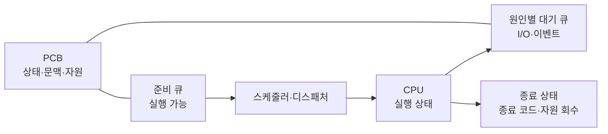
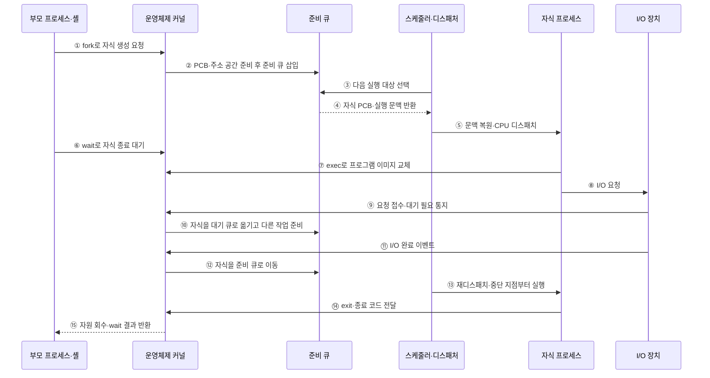

---
sidebar:
  order: 3
  label: "003. 프로세스 생성·종료·상태 전이 (Process Lifecycle)"
  badge:
    text: "미출 · 30%"
    variant: note
title: 프로세스 생성·종료·상태 전이 (Process Lifecycle)
date: "2026-07-25T01:39:00+09:00"
tags: [notes-software]
weight: 3
extra:
  question_no: "003"
  source_status: "미출"
  source_history: ""
  priority: 30
  priority_note: "프로세스 상태 전이는 운영체제 기본 흐름"
---

## 미리 알고가기

- **프로세스 수명주기(Process Lifecycle)**: 생성부터 종료까지 상태가 변하는 과정
- **중앙처리장치(Central Processing Unit, CPU)**: 프로세스의 명령을 실행하는 처리장치
- **준비 상태**: CPU를 기다리는 실행 가능 상태
- **실행 상태**: CPU에서 명령을 처리하는 상태
- **대기 상태**: 입출력·이벤트 완료 전 실행 불가 상태
- **디스패치**: 선택된 준비 프로세스에 CPU 제어권 이전
- **포크·엑섹·웨이트 시스템 호출(fork·exec·wait System Calls)**: 자식 프로세스 생성·실행 프로그램 교체·종료 상태 회수를 수행하는 유닉스 시스템 호출
- **운영체제(Operating System, OS)**: 프로세스 상태·주소 공간·자원과 큐 전이를 관리하는 시스템 소프트웨어
- **입출력(Input/Output, I/O)**: 장치 작업을 요청한 프로세스를 완료 이벤트까지 대기 상태로 전환하는 처리
- **프로세스 제어 블록(Process Control Block, PCB)**: 프로세스 상태·실행 문맥·주소 공간·자원 참조를 저장하는 운영체제 자료구조
- **준비 큐·대기 큐(Ready Queue·Wait Queue)**: 준비 큐는 CPU만 기다리는 실행 가능 프로세스를, 대기 큐는 특정 입출력·이벤트 완료를 기다리는 프로세스를 보관한다.
- **스케줄러·디스패처(Scheduler·Dispatcher)**: 스케줄러는 준비 큐에서 실행 대상을 선택하고 디스패처는 문맥을 복원해 CPU 제어권을 넘긴다.
- **문맥 전환(Context Switch)**: 현재 프로세스의 실행 상태를 저장하고 선택된 프로세스의 상태를 복원하는 절차
- **선점(Preemption)**: 할당 시간이 끝나면 운영체제가 실행 중인 프로세스의 CPU를 회수해 준비 큐로 돌려보내는 동작
- **셸(Shell)**: 사용자 명령을 해석하고 자식 프로세스를 생성·실행한 뒤 종료 결과를 회수하는 명령 인터페이스
- **종료 코드(Exit Code)**: 프로세스가 종료 이유나 성공 여부를 부모 프로세스에 전달하도록 남기는 정수 상태값

## Ⅰ. 개요

- 정의/개념: 생성부터 종료까지의 상태 전이 모델
- **배경/필요성**: 대기 중 CPU 점유를 막아 상태 구분 필요

### 쉽게 이해하기 (학습용)

- 프로그램은 만들어진 뒤 실행 차례와 입출력을 기다리며 상태를 바꾸다가 끝난다

## Ⅱ. 특징

- 실행 상태의 프로세스만 CPU를 점유한다
- 준비 상태는 실행 가능하지만 CPU 할당을 기다린다
- 대기 상태는 CPU를 반납해 활용률을 높인다
- 선점·이벤트가 상태와 큐 위치를 바꾼다

### 쉽게 이해하기 (학습용)

- 작업대에서 일하는 작업만 CPU를 쓰고, 줄에서 기다리는 작업은 CPU를 쓰지 않는다

## Ⅲ. 아키텍처 및 구성요소

### 도표안 A. 프로세스 상태·큐 관리 정적 구조

| 설계 요소 | 입력·상태 | 역할 |
|:---|:---|:---|
| 프로세스 제어 블록 | 상태·문맥·자원 참조 | 프로세스 수명주기 기록 |
| 준비 큐 | 실행 가능 프로세스 | CPU 할당 후보 보관 |
| 대기 큐 | 이벤트·입출력 대기 프로세스 | 실행 불가 작업을 원인별 보관 |
| 스케줄러·디스패처 | 준비 큐·CPU 상태 | 실행 대상 선택·문맥 전환 |

> 요약: 상태 기록·큐 분리로 실행 후보 관리

### 쉽게 이해하기 (학습용)

- 운영체제는 작업표에 상태를 적고, 실행할 일과 응답을 기다릴 일을 서로 다른 줄에 둔다

### 도표안 B. 생성·디스패치·대기·종료 회수 시퀀스

#### 동작 원리

1. 부모 프로세스나 셸이 `fork`로 자식 프로세스 생성을 요청한다.
2. 커널이 PCB·주소 공간·자원 참조를 준비하고 자식을 준비 큐에 넣는다.
3. 스케줄러가 준비 큐에서 실행할 프로세스를 선택한다.
4. 준비 큐가 선택된 자식의 PCB와 저장 문맥을 디스패처에 제공한다.
5. 디스패처가 문맥을 복원해 자식을 실행 상태로 전환한다.
6. 부모는 `wait`로 자식의 종료 상태 회수를 요청하고 필요하면 대기한다.
7. 자식은 `exec`로 현재 주소 공간의 프로그램 이미지를 새 프로그램으로 교체한다.
8. 실행 중인 자식이 장치 I/O를 요청한다.
9. 장치가 즉시 끝낼 수 없는 요청임을 커널에 알린다.
10. 커널이 자식을 원인별 대기 큐로 옮기고 CPU를 다른 준비 작업에 배정한다.
11. 장치가 작업을 마치면 인터럽트·이벤트로 완료를 알린다.
12. 커널이 자식을 대기 큐에서 준비 큐로 이동한다.
13. 다시 선택되면 저장한 문맥을 복원해 I/O 요청 이후부터 실행한다.
14. 자식이 완료·오류 종료 코드와 함께 `exit`를 호출한다.
15. 커널이 부모에게 종료 결과를 반환하고 PCB·주소 공간·열린 자원을 회수한다.

### 쉽게 이해하기 (학습용)

- 만들어진 작업은 실행 줄에 서고, 장치를 기다릴 때는 대기 줄로 옮겨졌다가 완료 신호 뒤 다시 실행 줄로 돌아온다.

## Ⅳ. 종류 및 비교

| 판단 기준 | 준비 상태 | 대기 상태 |
|:---|:---|:---|
| 핵심 특징 | CPU만 받으면 실행 가능 | 외부 이벤트 전 실행 불가 |
| 적용 기준 | 실행 가능 작업의 CPU 대기 | 입출력·이벤트 완료 대기 |
| 주요 위험 | 긴 준비 큐의 응답 지연 | 이벤트 누락·무기한 대기 |

> 요약: 실행 가능성으로 준비와 대기 상태를 구분

## Ⅴ. 실무 고려사항 및 대응 방안

| 운영 위험 | 대응 | 기대 효과 |
|:---|:---|:---|
| 부모가 종료 상태를 회수하지 않아 좀비 누적 | 자식 감시·wait 처리와 재수거 정책 적용 | 프로세스 표 고갈 방지 |
| 이벤트 누락으로 대기 상태 고착 | 시간 제한·취소·대기 원인 계측 | 무기한 대기 탐지 |
| 생성 폭주로 PID·메모리·파일 한도 소진 | 사용자·서비스별 프로세스 한도와 백프레셔 | 자원 고갈 방지 |
| 강제 종료 중 자원·데이터 정리 실패 | 단계적 종료·유예 시간과 멱등 복구 절차 | 정합성·재시작 안정성 확보 |

### 쉽게 이해하기 (학습용)

- 운영체제는 CPU를 주거나 되찾고, 입출력 완료 신호에 따라 작업을 줄 사이로 옮긴다

### 적용 사례

- 셸은 `fork`로 자식을 만들고 `exec`로 명령 프로그램을 실행한 뒤 `wait`로 종료 코드와 자원을 회수한다.

### 쉽게 이해하기 (학습용)

- 명령 창은 새 프로그램을 자식으로 시작하고 끝나면 종료 결과를 거둔다

## Ⅵ. 결론

- 프로세스 자원과 CPU 활용률을 안정적으로 관리하기 위해 **실행 가능성·대기 원인·선점·종료 상태 회수·생성 한도**를 검토하고, PCB와 원인별 큐로 수명주기를 추적한다.

### 쉽게 이해하기 (학습용)

- 지금 바로 일할 수 있는지와 무엇을 기다리는지를 보면 어느 줄에 둘지 정할 수 있다
