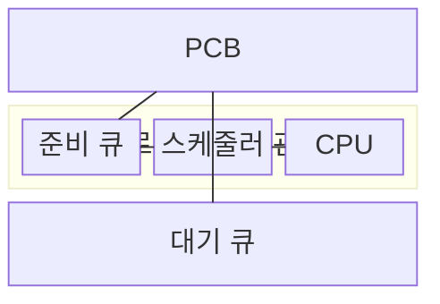
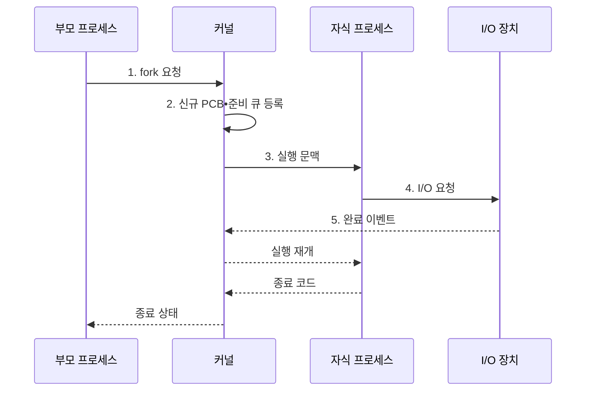

---
sidebar:
  order: 3
  label: "003. 프로세스 생성•종료•상태 전이 (Process Lifecycle)"
  badge:
    text: "미출 • 30%"
    variant: note
title: 프로세스 생성•종료•상태 전이 (Process Lifecycle)
date: "2026-08-03T08:48:47+09:00"
tags: [notes-software]
weight: 3
extra:
  question_no: "003"
  source_status: "미출"
  source_history: ""
  priority: 30
  priority_note: "프로세스 상태 전이는 운영체제 기본 흐름"
---

## Ⅰ. 개요

핵심 용어

- **프로세스 수명주기(Process Lifecycle)**: 생성된 프로세스가 준비•실행•대기 상태를 거쳐 종료되는 운영체제 관리 과정

- 정의/개념: 생성된 프로세스가 준비•실행•대기 상태를 거쳐 종료되는 **수명주기 모델**

#### 한줄 요약

- 프로그램은 만들어진 뒤 실행 차례와 입출력을 기다리며 상태를 바꾸다가 끝난다

## Ⅱ. 특징

핵심 용어

- **준비 상태**: CPU를 기다리는 실행 가능 상태
- **실행 상태**: CPU에서 명령을 처리하는 상태
- **대기 상태**: 입출력•이벤트가 완료되기 전의 실행 불가 상태

- **실행 상태** 만 CPU 점유
- **준비 상태** 는 CPU 할당 대기
- **대기 상태** 는 이벤트 완료 대기

#### 한줄 요약

- 작업대에서 일하는 작업만 CPU를 쓰고, 줄에서 기다리는 작업은 CPU를 쓰지 않는다

## Ⅲ. 구조 및 구성요소

핵심 용어

- **프로세스 제어 블록(Process Control Block, PCB)**: 프로세스 상태•실행 문맥•주소 공간•자원 참조를 저장하는 운영체제 자료구조
- **준비 큐•대기 큐(Ready Queue•Wait Queue)**: 준비 큐는 CPU를 기다리는 프로세스를, 대기 큐는 특정 이벤트를 기다리는 프로세스를 보관한다.
- **스케줄러(Scheduler)**: 준비 큐에서 다음 실행 프로세스를 선택하는 운영체제 구성요소

| 구성요소 | 책임 |
|:---|:---|
| PCB | **상태•문맥•자원 기록** |
| 준비 큐 | **실행 가능 작업 보관** |
| 스케줄러 | **실행 대상 선택** |
| CPU | **프로세스 명령 실행** |
| 대기 큐 | **이벤트별 작업 보관** |

#### 한줄 요약

- 만들어진 작업은 실행 줄에 서고, 장치를 기다릴 때는 대기 줄로 옮겨졌다가 완료 신호 뒤 다시 실행 줄로 돌아온다.

## Ⅳ. 흐름도

핵심 용어

- **포크(fork) 시스템 호출**: 부모 프로세스를 복제해 자식 프로세스를 생성하는 유닉스 시스템 호출
- **입출력(Input/Output, I/O)**: 장치 작업을 요청한 프로세스를 완료 이벤트까지 대기 상태로 전환하는 처리
- **디스패치(Dispatch)**: 선택된 준비 프로세스에 CPU 제어권을 넘기는 동작
- **프로세스 식별자(Process Identifier, PID)**: 운영체제가 프로세스를 구분하는 번호
- **종료 코드(Exit Code)**: 프로세스가 종료 원인이나 성공•실패 상태를 부모 프로세스에 전달하는 값

**동작 원리**

1. **fork 요청**: 부모 주소 공간을 복제하고 자식 식별자 할당
2. **신규 PCB•준비 큐 등록**: 자식의 상태 정보를 만들고 실행 가능 상태로 전환
3. **실행 문맥**: 디스패치로 준비 상태에서 실행 상태 전환
4. **I/O 요청**: CPU를 반납하고 장치별 대기 큐로 이동
5. **완료 이벤트**: 대기 상태를 해제하고 준비 큐로 복귀

#### 한줄 요약

- 장치를 기다리는 작업은 대기 줄로 옮겼다가 다시 불러온다.

## Ⅴ. 종류 및 비교

핵심 용어

- **준비 상태**: CPU만 기다려 즉시 실행할 수 있는 프로세스 상태
- **실행 상태**: 중앙처리장치(Central Processing Unit, CPU)를 할당받아 명령을 처리하는 프로세스 상태
- **대기 상태**: 입출력이나 이벤트가 끝나기 전에는 실행할 수 없는 프로세스 상태
- **종료 상태**: 실행을 마치고 종료 코드를 남긴 뒤 운영체제가 문맥•주소 공간 등 관리 자원을 회수하는 상태

| 프로세스 상태 | 진입 조건 | 다음 상태를 만드는 사건 |
|:---|:---|:---|
| **준비 상태** | 생성 완료•선점•입출력 완료 | 디스패치로 **실행 상태** 전환 |
| **실행 상태** | CPU를 할당받아 명령 수행 | 선점•입출력 요청•**종료** |
| **대기 상태** | 입출력•이벤트 완료 전 실행 불가 | 완료 이벤트로 **준비 상태** 복귀 |
| **종료 상태** | 실행 완료•강제 종료 | 종료 코드 회수 뒤 **관리 자원 해제** |

> 요약: CPU 할당과 이벤트 완료가 **준비•실행•대기 상태** 를 전환

#### 한줄 요약

- CPU만 기다리면 준비 상태이고 장치•이벤트를 기다리면 대기 상태다.

## Ⅵ. 실무 고려사항 및 대책

핵심 용어

- **좀비 프로세스(Zombie Process)**: 실행은 끝났지만 부모가 종료 상태를 회수하지 않아 PCB 일부가 남은 프로세스
- **웨이트(wait) 시스템 호출**: 부모가 종료된 자식의 종료 코드와 남은 PCB 정보를 회수하는 유닉스 시스템 호출
- **백프레셔(Backpressure)**: 후단 자원이 부족할 때 새 작업 생성을 늦추는 흐름 제어
- **유예 시간(Grace Period)**: 강제 종료 전에 정상 정리를 허용하는 제한 시간
- **멱등 복구(Idempotent Recovery)**: 같은 복구 절차를 반복해도 결과가 달라지지 않는 복구 방식
- **PCB 슬롯**: 커널이 각 프로세스의 제어 블록을 유지하기 위해 확보한 관리 공간
- **데이터 정합성(Data Consistency)**: 종료•복구 전후에도 관련 데이터가 정해진 제약과 관계를 유지하는 성질

| 문제 | 대책 | 효과 |
|:---|:---|:---|
| 부모가 종료 코드를 회수하지 않아 **좀비 누적** | 자식 감시와 **wait 종료 코드 회수** | **PCB 슬롯 고갈** 방지 |
| 완료 이벤트 누락으로 **대기 상태 고착** | **시간 제한•취소** 와 대기 원인 계측 | **무기한 대기** 조기 탐지 |
| 생성 폭주로 PID•메모리 **자원 한도 소진** | 서비스별 프로세스 한도와 **백프레셔** | **프로세스 생성 폭주** 억제 |
| 강제 종료로 자원•데이터 **정리 실패** | 단계적 종료•유예 시간과 **멱등 복구** | **데이터 정합성** 과 재시작 가능성 유지 |

#### 한줄 요약

- 명령 창은 새 프로그램을 자식으로 시작하고 끝나면 종료 결과를 거둔다

## Ⅶ. 결론

핵심 용어

- **준비 큐•대기 큐**: 실행 가능 여부와 대기 원인에 따라 프로세스를 나누어 보관하는 상태 큐

- CPU 실행 가능하면 **준비 큐**, 이벤트 대기면 **대기 큐** 배치

#### 한줄 요약

- 지금 바로 일할 수 있는지와 무엇을 기다리는지를 보면 어느 줄에 둘지 정할 수 있다
