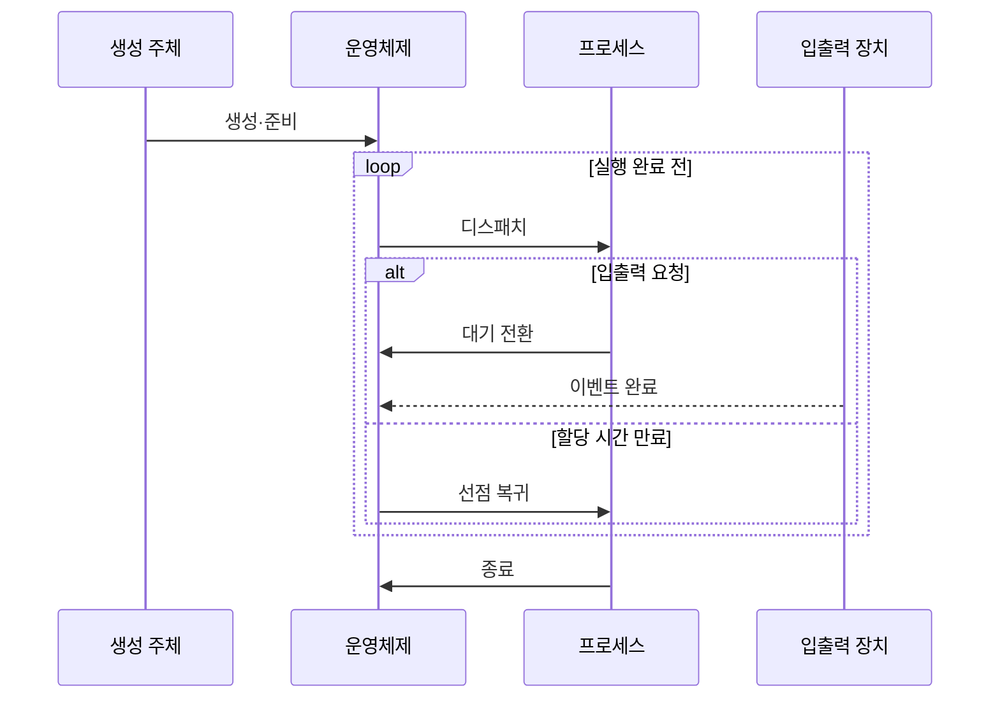

---
sidebar:
  order: 3
  label: "003. 프로세스 생성·종료·상태 전이 (Process Lifecycle)"
  badge:
    text: "미출제 · 30%"
    variant: note
title: 프로세스 생성·종료·상태 전이 (Process Lifecycle)
date: "2026-07-25T01:39:00+09:00"
tags: [notes-software]
weight: 3
extra:
  question_no: "003"
  source_status: "미출제"
  source_history: ""
  priority: 30
  priority_note: "프로세스 상태 전이는 운영체제 기본 흐름"
---

## 미리 알고가기

- **프로세스 수명주기(Process Lifecycle)**: 생성부터 종료까지 상태가 변하는 과정
- **중앙처리장치(Central Processing Unit, CPU)**: 프로세스의 명령을 실행하는 처리장치
- **준비 상태**: CPU를 기다리는 실행 가능 상태
- **실행 상태**: CPU에서 명령을 처리하는 상태
- **대기 상태**: 입출력·이벤트 완료 전 실행 불가 상태
- **디스패치**: 선택된 준비 프로세스에 CPU 제어권 이전
- **포크·엑섹·웨이트 시스템 호출(fork·exec·wait System Calls)**: 자식 프로세스 생성·실행 프로그램 교체·종료 상태 회수를 수행하는 유닉스 시스템 호출
- **운영체제(Operating System, OS)**: 프로세스 상태·주소 공간·자원과 큐 전이를 관리하는 시스템 소프트웨어
- **입출력(Input/Output, I/O)**: 장치 작업을 요청한 프로세스를 완료 이벤트까지 대기 상태로 전환하는 처리
- **프로세스 제어 블록(Process Control Block, PCB)**: 프로세스 상태·실행 문맥·주소 공간·자원 참조를 저장하는 운영체제 자료구조
- **준비 큐·대기 큐(Ready Queue·Wait Queue)**: 준비 큐는 CPU만 기다리는 실행 가능 프로세스를, 대기 큐는 특정 입출력·이벤트 완료를 기다리는 프로세스를 보관한다.
- **스케줄러·디스패처(Scheduler·Dispatcher)**: 스케줄러는 준비 큐에서 실행 대상을 선택하고 디스패처는 문맥을 복원해 CPU 제어권을 넘긴다.
- **문맥 전환(Context Switch)**: 현재 프로세스의 실행 상태를 저장하고 선택된 프로세스의 상태를 복원하는 절차
- **선점(Preemption)**: 할당 시간이 끝나면 운영체제가 실행 중인 프로세스의 CPU를 회수해 준비 큐로 돌려보내는 동작
- **셸(Shell)**: 사용자 명령을 해석하고 자식 프로세스를 생성·실행한 뒤 종료 결과를 회수하는 명령 인터페이스
- **종료 코드(Exit Code)**: 프로세스가 종료 이유나 성공 여부를 부모 프로세스에 전달하도록 남기는 정수 상태값

## Ⅰ. 개요

- 정의/개념: 생성부터 종료까지의 상태 전이 모델
- **배경/필요성**: 대기 중 CPU 점유를 막아 상태 구분 필요

### 쉽게 이해하기 (학습용)

- 프로그램은 만들어진 뒤 실행 차례와 입출력을 기다리며 상태를 바꾸다가 끝난다

## Ⅱ. 특징

- 실행 상태의 프로세스만 CPU를 점유한다
- 준비 상태는 실행 가능하지만 CPU 할당을 기다린다
- 대기 상태는 CPU를 반납해 활용률을 높인다
- 선점·이벤트가 상태와 큐 위치를 바꾼다

### 쉽게 이해하기 (학습용)

- 작업대에서 일하는 작업만 CPU를 쓰고, 줄에서 기다리는 작업은 CPU를 쓰지 않는다

## Ⅲ. 아키텍처 및 구성요소

| 설계 요소 | 설명 |
|:---|:---|
| 프로세스 제어 블록 | 상태·문맥·자원 참조를 저장 |
| 준비 큐 | CPU를 기다리는 실행 가능 프로세스 보관 |
| 대기 큐 | 이벤트별 실행 불가 프로세스 보관 |
| 스케줄러·디스패처 | 실행 대상 선택과 문맥 전환 수행 |

> 요약: 상태 기록·큐 분리로 실행 후보 관리

### 쉽게 이해하기 (학습용)

- 운영체제는 작업표에 상태를 적고, 실행할 일과 응답을 기다릴 일을 서로 다른 줄에 둔다

## Ⅳ. 원리 및 절차 흐름도

| 절차 | 설명 |
|:---|:---|
| 생성·준비 | 제어 블록·주소 공간 생성 후 준비 큐 등록 |
| 디스패치 | 문맥 복원 후 CPU 제어권 이전 |
| 대기 전환 | 입출력 요청 후 대기 큐 이동 |
| 이벤트 완료 | 대기 프로세스를 준비 큐로 이동 |
| 선점 복귀 | 할당 시간 만료 시 준비 큐 복귀 |
| 종료 | 실행 자원 해제 후 종료 상태·코드 보존 |

> 요약: CPU·이벤트 조건이 상태와 큐를 전환

### 쉽게 이해하기 (학습용)

- 운영체제는 CPU를 주거나 되찾고, 입출력 완료 신호에 따라 작업을 줄 사이로 옮긴다

## Ⅴ. 종류 및 비교

| 판단 기준 | 준비 상태 | 대기 상태 |
|:---|:---|:---|
| 핵심 특징 | CPU만 받으면 실행 가능 | 외부 이벤트 전 실행 불가 |
| 적용 기준 | 실행 가능 작업의 CPU 대기 | 입출력·이벤트 완료 대기 |
| 주요 위험 | 긴 준비 큐의 응답 지연 | 이벤트 누락·무기한 대기 |

> 요약: 실행 가능성으로 준비와 대기 상태를 구분

### 쉽게 이해하기 (학습용)

- 준비 상태는 CPU만 받으면 바로 일하지만, 대기 상태는 필요한 사건이 먼저 끝나야 한다

## Ⅵ. 실무 사례

1. 셸은 fork·exec·wait로 자식 생성·실행·회수

### 쉽게 이해하기 (학습용)

- 명령 창은 새 프로그램을 자식으로 시작하고 끝나면 종료 결과를 거둔다

## Ⅶ. 결론

- 실행 가능성·이벤트 의존성으로 준비·대기 상태 분리

### 쉽게 이해하기 (학습용)

- 지금 바로 일할 수 있는지와 무엇을 기다리는지를 보면 어느 줄에 둘지 정할 수 있다
