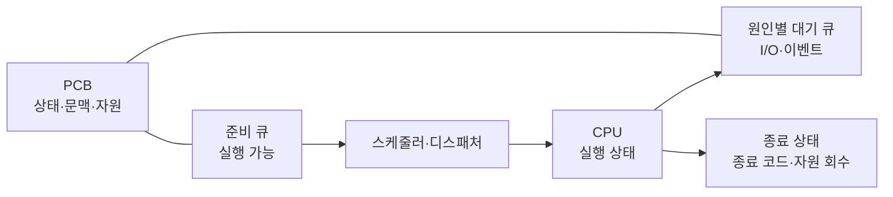
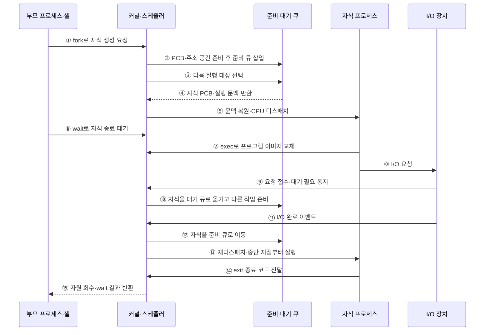

---
sidebar:
  order: 3
  label: "003. 프로세스 생성·종료·상태 전이 (Process Lifecycle)"
  badge:
    text: "미출 · 30%"
    variant: note
title: 프로세스 생성·종료·상태 전이 (Process Lifecycle)
date: "2026-07-25T01:39:00+09:00"
tags: [notes-software]
weight: 3
extra:
  question_no: "003"
  source_status: "미출"
  source_history: ""
  priority: 30
  priority_note: "프로세스 상태 전이는 운영체제 기본 흐름"
---

## 미리 알고가기

- **프로세스 수명주기(Process Lifecycle)**: 생성부터 종료까지 상태가 변하는 과정
- **중앙처리장치(Central Processing Unit, CPU)**: 프로세스의 명령을 실행하는 처리장치
- **준비 상태**: CPU를 기다리는 실행 가능 상태
- **실행 상태**: CPU에서 명령을 처리하는 상태
- **대기 상태**: 입출력·이벤트 완료 전 실행 불가 상태
- **디스패치**: 선택된 준비 프로세스에 CPU 제어권 이전
- **포크·엑섹·웨이트 시스템 호출(fork·exec·wait System Calls)**: 자식 프로세스 생성·실행 프로그램 교체·종료 상태 회수를 수행하는 유닉스 시스템 호출
- **운영체제(Operating System, OS)**: 프로세스 상태·주소 공간·자원과 큐 전이를 관리하는 시스템 소프트웨어
- **입출력(Input/Output, I/O)**: 장치 작업을 요청한 프로세스를 완료 이벤트까지 대기 상태로 전환하는 처리
- **프로세스 제어 블록(Process Control Block, PCB)**: 프로세스 상태·실행 문맥·주소 공간·자원 참조를 저장하는 운영체제 자료구조
- **준비 큐·대기 큐(Ready Queue·Wait Queue)**: 준비 큐는 CPU만 기다리는 실행 가능 프로세스를, 대기 큐는 특정 입출력·이벤트 완료를 기다리는 프로세스를 보관한다.
- **스케줄러·디스패처(Scheduler·Dispatcher)**: 스케줄러는 준비 큐에서 실행 대상을 선택하고 디스패처는 문맥을 복원해 CPU 제어권을 넘긴다.
- **문맥 전환(Context Switch)**: 현재 프로세스의 실행 상태를 저장하고 선택된 프로세스의 상태를 복원하는 절차
- **선점(Preemption)**: 할당 시간이 끝나면 운영체제가 실행 중인 프로세스의 CPU를 회수해 준비 큐로 돌려보내는 동작
- **셸(Shell)**: 사용자 명령을 해석하고 자식 프로세스를 생성·실행한 뒤 종료 결과를 회수하는 명령 인터페이스
- **종료 코드(Exit Code)**: 프로세스가 종료 이유나 성공 여부를 부모 프로세스에 전달하도록 남기는 정수 상태값
- **프로그램 이미지(Program Image)**: 프로세스 주소 공간에 적재된 실행 코드·데이터·초기 상태
- **좀비 프로세스(Zombie Process)**: 실행은 끝났지만 부모가 종료 상태를 회수하지 않아 PCB 일부가 남은 프로세스
- **프로세스 식별자(Process Identifier, PID)**: 운영체제가 프로세스를 구분하는 번호
- **백프레셔(Backpressure)**: 후단 자원이 부족할 때 새 작업 생성을 늦추는 흐름 제어
- **유예 시간(Grace Period)**: 강제 종료 전에 정상 정리를 허용하는 제한 시간
- **멱등 복구(Idempotent Recovery)**: 같은 복구 절차를 반복해도 결과가 달라지지 않는 방식

## Ⅰ. 개요

- 정의/개념: 생성부터 종료까지의 상태 전이 모델
- **배경/필요성**: 대기 중 CPU 점유를 막아 상태 구분 필요

### 쉽게 이해하기 (학습용)

- 프로그램은 만들어진 뒤 실행 차례와 입출력을 기다리며 상태를 바꾸다가 끝난다

## Ⅱ. 특징

- 실행 상태의 프로세스만 CPU를 점유한다
- 준비 상태는 실행 가능하지만 CPU 할당을 기다린다
- 대기 상태는 CPU를 반납해 활용률을 높인다
- 선점·이벤트가 상태와 큐 위치를 바꾼다

### 쉽게 이해하기 (학습용)

- 작업대에서 일하는 작업만 CPU를 쓰고, 줄에서 기다리는 작업은 CPU를 쓰지 않는다

## Ⅲ. 아키텍처

**도표안 A — 구조도**

**도표안 B — sequenceDiagram**

| 설계 요소 | 입력·상태 | 역할 |
|:---|:---|:---|
| 프로세스 제어 블록 | 상태·문맥·자원 참조 | 프로세스 수명주기 기록 |
| 준비 큐 | 실행 가능 프로세스 | CPU 할당 후보 보관 |
| 대기 큐 | 이벤트·입출력 대기 프로세스 | 실행 불가 작업을 원인별 보관 |
| 스케줄러·디스패처 | 준비 큐·CPU 상태 | 실행 대상 선택·문맥 전환 |

> 요약: 상태 기록과 큐 분리로 실행 후보를 관리한다.

**동작 원리**

- **① 생성 요청**: 부모가 `fork`로 자식 생성
- **② 준비 삽입**: PCB·주소 공간·자원 참조 생성
- **③ 대상 선택**: 준비 큐에서 다음 실행 프로세스 결정
- **④ 문맥 반환**: 선택된 자식의 PCB·실행 상태 제공
- **⑤ 디스패치**: 문맥을 복원해 실행 상태로 전환
- **⑥ 종료 대기**: 부모가 `wait`로 결과 회수 요청
- **⑦ 이미지 교체**: 자식이 `exec`로 새 프로그램 적재
- **⑧ I/O 요청**: 실행 중 장치 작업 시작
- **⑨ 대기 통지**: 장치가 비동기 완료 필요를 커널에 알림
- **⑩ 대기 전환**: 자식을 원인별 대기 큐로 이동
- **⑪ 완료 이벤트**: 장치가 인터럽트로 작업 완료 통지
- **⑫ 준비 전환**: 자식을 다시 준비 큐로 이동
- **⑬ 재디스패치**: 중단 문맥을 복원해 실행 재개
- **⑭ 종료 호출**: 자식이 `exit`와 종료 코드 전달
- **⑮ 자원 회수**: 부모에 결과를 주고 PCB·자원 정리

### 쉽게 이해하기 (학습용)

- 만들어진 작업은 실행 줄에 서고, 장치를 기다릴 때는 대기 줄로 옮겨졌다가 완료 신호 뒤 다시 실행 줄로 돌아온다.

## Ⅳ. 종류 및 비교

| 판단 기준 | 준비 상태 | 대기 상태 |
|:---|:---|:---|
| 핵심 특징 | CPU만 받으면 실행 가능 | 외부 이벤트 전 실행 불가 |
| 적용 기준 | 실행 가능 작업의 CPU 대기 | 입출력·이벤트 완료 대기 |
| 주요 위험 | 긴 준비 큐의 응답 지연 | 이벤트 누락·무기한 대기 |

> 요약: 실행 가능성으로 준비와 대기 상태를 구분

### 쉽게 이해하기 (학습용)

- CPU만 기다리면 준비 상태이고 장치·이벤트를 기다리면 대기 상태다.

## Ⅴ. 실무 고려사항 및 대책

| 운영 위험 | 대응 | 기대 효과 |
|:---|:---|:---|
| 부모가 종료 상태를 회수하지 않아 좀비 누적 | 자식 감시·wait 처리와 재수거 정책 적용 | 프로세스 표 고갈 방지 |
| 이벤트 누락으로 대기 상태 고착 | 시간 제한·취소·대기 원인 계측 | 무기한 대기 탐지 |
| 생성 폭주로 PID·메모리·파일 한도 소진 | 사용자·서비스별 프로세스 한도와 백프레셔 | 자원 고갈 방지 |
| 강제 종료 중 자원·데이터 정리 실패 | 단계적 종료·유예 시간과 멱등 복구 절차 | 정합성·재시작 안정성 확보 |

### 적용 사례

- 셸은 `fork`로 자식을 만들고 `exec`로 명령 프로그램을 실행한 뒤 `wait`로 종료 코드와 자원을 회수한다.

### 쉽게 이해하기 (학습용)

- 명령 창은 새 프로그램을 자식으로 시작하고 끝나면 종료 결과를 거둔다

## Ⅵ. 결론

- 프로세스 자원과 CPU 활용률을 안정적으로 관리하기 위해 **실행 가능성·대기 원인·선점·종료 상태 회수·생성 한도**를 검토하고, PCB와 원인별 큐로 수명주기를 추적한다.

### 쉽게 이해하기 (학습용)

- 지금 바로 일할 수 있는지와 무엇을 기다리는지를 보면 어느 줄에 둘지 정할 수 있다
