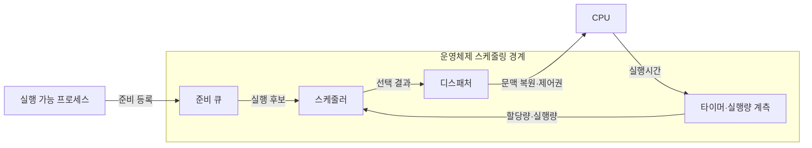

---
sidebar:
  order: 4
  label: "004. 프로세스 스케줄링 알고리즘 — FCFS·SJF·RR·MLFQ·CFS (Process Scheduling)"
  badge:
    text: "기출 · 85%"
    variant: note
title: 프로세스 스케줄링 알고리즘 — FCFS·SJF·RR·MLFQ·CFS (Process Scheduling)
date: "2026-07-27T23:59:59+09:00"
tags: [notes-software]
weight: 4
extra:
  question_no: "004"
  source_status: "기출"
  source_history: "122회, 129회, 131회, 138회"
  priority: 85
  priority_note: "4회 반복, 스케줄링 기준·알고리즘 핵심"
---

## 미리 알고가기

- **프로세스 스케줄링(Process Scheduling)**: CPU를 줄 프로세스와 실행 시간을 정하는 일
- **선점형(Preemptive Scheduling)**: 실행 중인 프로세스의 CPU를 회수하는 방식
- **중앙처리장치(Central Processing Unit, CPU) 버스트**: 프로세스가 입출력 없이 CPU를 연속 사용하는 시간
- **시간 할당량(Time Quantum)**: 선점 전 허용하는 연속 CPU 사용 시간
- **응답시간(Response Time)**: 도착부터 첫 CPU 할당까지의 시간
- **문맥 전환(Context Switch)**: 실행 상태를 저장하고 다음 상태를 복원하는 작업
- **기아(Starvation)**: 실행 기회를 계속 얻지 못하는 상태
- **호위 효과(Convoy Effect)**: 짧은 작업이 긴 작업 뒤에서 지연되는 현상
- **선입 선처리(First-Come, First-Served, FCFS)**: 도착 순서로 프로세스를 선택하는 스케줄링 방식
- **최단 작업 우선(Shortest Job First, SJF)**: 예상 CPU 버스트가 가장 짧은 작업을 먼저 선택하는 스케줄링 방식
- **라운드 로빈(Round Robin, RR)**: 시간 할당량마다 작업을 순환하며 선점하는 스케줄링 방식
- **멀티레벨 피드백 큐(Multilevel Feedback Queue, MLFQ)**: CPU 사용 이력에 따라 프로세스의 우선순위를 조정하는 스케줄링 방식
- **완전 공정 스케줄러(Completely Fair Scheduler, CFS)**: 가중 가상 실행시간이 가장 작은 작업을 선택하는 스케줄러
- **운영체제(Operating System, OS)**: 프로세스·메모리·장치와 CPU 실행 순서를 관리하는 시스템 소프트웨어
- **처리량(Throughput)**: 단위 시간에 완료한 작업 수로서 응답시간·공정성과 함께 스케줄링 정책의 상충을 판단하는 지표
- **공정성(Fairness)**: 경쟁하는 프로세스가 우선순위·가중치에 따른 CPU 몫을 지속적으로 받는 성질
- **감소·증가 기호($\downarrow$·$\uparrow$)**: 지표의 감소와 증가를 나타내며 시간 할당량과 응답시간·문맥 전환 간 상충관계를 표시한다.
- **준비 큐(Ready Queue)**: CPU를 기다리는 실행 가능 프로세스를 스케줄링 정책의 순서로 보관하는 대기열
- **디스패처·타이머(Dispatcher·Timer)**: 디스패처는 선택한 프로세스의 문맥을 복원하고 타이머는 실행량을 재어 할당량 만료 시 선점을 알린다.
- **가상 실행시간(Virtual Runtime)**: 실제 CPU 사용시간을 프로세스 가중치로 보정한 값으로서 CFS가 가장 적은 작업을 선택해 CPU 몫을 배분하는 기준
- **배치·대화형 시분할(Batch·Interactive Time-sharing)**: 배치는 응답보다 묶음 처리량을, 대화형 시분할은 여러 사용자의 빠른 반응을 우선하는 작업 환경
- **컨테이너(Container)**: 응용과 실행 환경을 격리해 배포하는 단위로서 CFS 가중치에 따라 호스트 CPU 몫을 배분받는다.
- **실시간 음성 처리(Real-time Audio Processing)**: 재생 기한 안에 짧은 작업을 반복 실행해야 하며 RR 할당량으로 CPU 독점을 제한하는 작업

## Ⅰ. 개요

- 정의/개념: 준비 큐에서 **실행 대상·CPU 할당시간**을 정하는 정책
- 기존 한계: 단일 순서 정책은 **응답시간·처리량·공정성** 동시 충족에 한계

### 쉽게 이해하기 (학습용)

- 한 작업대 앞에 여러 일이 몰리면 누구를 먼저 얼마나 일하게 할지 정해야 한다

## Ⅱ. 특징

- **선점·실행 순서**가 응답시간·처리량 결정
- **시간 할당량**이 응답 지연·문맥 전환 비용 절충
- **버스트 예측·우선순위**가 공정성·기아 결정

### 쉽게 이해하기 (학습용)

- 교대 시간을 짧게 하면 첫 반응은 빨라지지만, 작업을 바꾸느라 쓰는 시간이 늘어난다

## Ⅲ. 아키텍처 및 구성요소

| 설계 요소 | 입력·상태 | 역할 |
|:---|:---|:---|
| 준비 큐 | 실행 가능 작업·우선순위 | 정책 기준 후보 관리 |
| 스케줄러 | 도착·버스트·가중치·실행량 | 다음 실행 대상·구간 선택 |
| 디스패처 | 현재·다음 실행 문맥 | 문맥 저장·복원과 CPU 제어권 이전 |
| 타이머·실행량 계측 | 실행시간·할당량 | 선점 통지·정책 피드백 제공 |

> 요약: 준비 큐·계측값으로 실행 대상과 시점 결정

### 쉽게 이해하기 (학습용)

- 스케줄러가 대기 명단과 사용 기록을 보고 대상을 정하면 디스패처가 작업대를 넘긴다

## Ⅳ. 운영 고려사항

| 운영 위험 | 대응 | 기대 효과 |
|:---|:---|:---|
| 평균 처리량 최적화가 꼬리 응답 악화 | 워크로드별 응답·대기·처리량 백분위 공동 관리 | 서비스 수준 균형 |
| 우선순위 정책으로 낮은 작업 기아 | 에이징·최소 CPU 몫·최대 대기시간 적용 | 진행 가능성 보장 |
| 짧은 할당량으로 문맥 전환 증가 | 전환 비용·응답 목표 기반 할당량 조정 | 유효 CPU 시간 확보 |
| 단일 정책을 혼합 부하에 일괄 적용 | 배치·대화형·실시간 클래스 분리와 부하 재현 시험 | 목적별 예측성 향상 |

### 쉽게 이해하기 (학습용)

- 준비된 일을 정책대로 실행하고, 시간이 끝나거나 일이 멈추면 다시 다음 대상을 정한다

## Ⅴ. 종류 및 비교

| 스케줄링 정책 | FCFS | SJF | RR | MLFQ | CFS |
|:---|:---|:---|:---|:---|:---|
| 적용 기준 | 도착 순서 **보장 배치** | 버스트 예측 가능 **배치** | 대화형 **시분할** | 대화형·CPU **혼합 부하** | 다중 사용자 **공정 배분** |
| 핵심 특징 | 도착 순서·**비선점** | 최단 버스트·**비선점** | 순환·**할당량 선점** | 실행 이력별 **큐 이동** | 최소 **가상 실행시간** |
| 한계 | 긴 작업의 **호위 효과** | 예측 오차·**긴 작업 기아** | 짧은 할당량의 **전환 증가** | 규칙 복잡성·**기아** | 가중치 설정 **편향** |

> 요약: 예측 배치 SJF·대화형 RR·MLFQ·공정 배분 CFS

### 쉽게 이해하기 (학습용)

- 도착순과 짧은 작업은 배치 처리에, 순환·다단계 큐는 빠른 반응에, 가상 사용시간은 공정한 몫에 맞춘다

## Ⅵ. 실무 사례

1. 컨테이너는 **CPU 가중치**를 스케줄러 실행 몫에 반영

### 쉽게 이해하기 (학습용)

- 여러 컨테이너가 CPU를 함께 쓸 때 가중치로 각자의 사용 몫을 나눈다

## Ⅶ. 결론

- 작업별 서비스 수준을 만족하기 위해 **버스트 예측성·응답 요구·CPU 몫**을 검토하고, 워크로드 특성에 맞는 스케줄링 정책을 선택한다

### 쉽게 이해하기 (학습용)

- 작업 길이를 예측할 수 있는지, 빨리 반응해야 하는지, CPU 몫을 나눌지에 따라 정책을 선택한다
