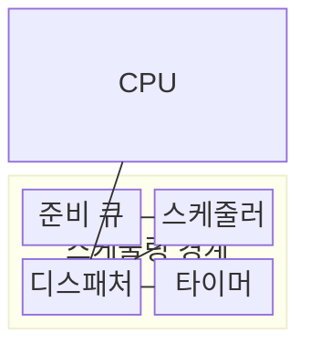
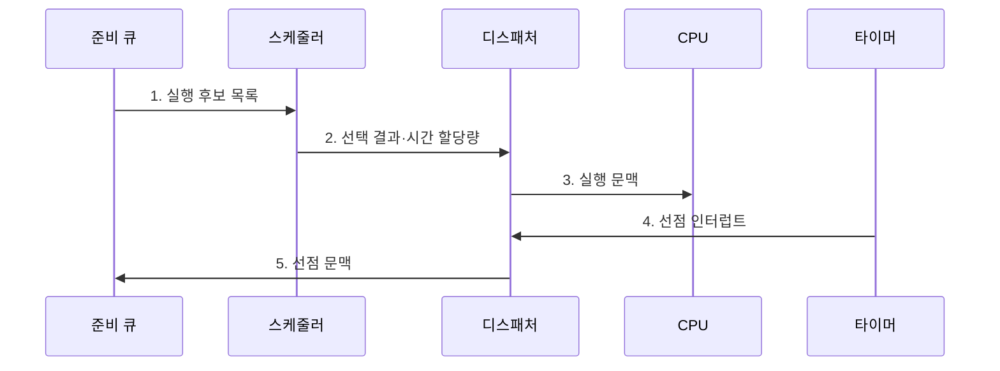

---
sidebar:
  order: 4
  label: "004. 프로세스 스케줄링 알고리즘: FCFS·SJF·RR·MLFQ·CFS (Process Scheduling)"
  badge:
    text: "기출 · 85%"
    variant: note
title: "프로세스 스케줄링 알고리즘: FCFS·SJF·RR·MLFQ·CFS (Process Scheduling)"
date: "2026-08-02T22:04:00+09:00"
tags: [notes-software]
weight: 4
extra:
  question_no: "004"
  source_status: "기출"
  source_history: "122회, 129회, 131회, 138회"
  priority: 85
  priority_note: "4회 반복, 스케줄링 기준·알고리즘 핵심"
---

## Ⅰ. 개요

핵심 용어

- **프로세스 스케줄링(Process Scheduling)**: CPU를 줄 프로세스와 실행 시간을 정하는 운영체제 정책
- **응답시간·처리량·공정성**: 첫 실행까지의 시간, 단위 시간 완료 수, CPU 몫의 지속적 배분을 나타내는 상충 지표

- 정의/개념: 준비 큐에서 실행 대상과 CPU 사용시간을 정하는 **스케줄링 정책**
- 배경/필요성: 단일 기준으로는 **응답시간·처리량·공정성** 동시 최적화 불가

#### 한줄 요약

- 한 작업대 앞에 여러 일이 몰리면 누구를 먼저 얼마나 일하게 할지 정해야 한다

## Ⅱ. 특징

핵심 용어

- **시간 할당량(Time Quantum)**: 선점 전 허용하는 연속 CPU 사용 시간
- **CPU 버스트**: 프로세스가 입출력 없이 CPU를 연속 사용하는 시간
- **기아(Starvation)**: 준비된 작업이 실행 기회를 계속 얻지 못하는 상태

- **선점 시점·실행 순서**에 따라 응답시간·처리량 변동
- **시간 할당량 감소** 시 응답 지연 감소·문맥 전환 비용 증가
- **버스트 예측 오차·고정 우선순위**로 공정성 저하·기아 발생

#### 한줄 요약

- 교대 시간을 짧게 하면 첫 반응은 빨라지지만, 작업을 바꾸느라 쓰는 시간이 늘어난다

## Ⅲ. 구조 및 구성요소

핵심 용어

- **준비 큐(Ready Queue)**: CPU를 기다리는 실행 가능 프로세스를 정책 순서로 보관하는 대기열
- **디스패처·타이머(Dispatcher·Timer)**: 디스패처는 CPU 제어권을 넘기고 타이머는 할당량 만료를 알린다.

| 구성요소 | 책임 |
|:---|:---|
| CPU | 선택된 프로세스의 **명령 실행** |
| 준비 큐 | **정책 기준 후보 관리** |
| 스케줄러 | **다음 실행 대상 선택** |
| 디스패처 | **문맥 복원·제어권 이전** |
| 타이머 | **할당량 만료 통지** |

#### 한줄 요약

- 각 작업이 정해진 시간만큼 번갈아 CPU를 쓰고, 먼저 I/O를 기다리거나 시간이 끝나면 줄 뒤로 이동한다.

## Ⅳ. 흐름도

핵심 용어

- **선점(Preemption)**: 실행 중인 프로세스에서 CPU를 회수해 다른 프로세스에 배분하는 동작
- **문맥 전환(Context Switch)**: 현재 실행 상태를 저장하고 다음 실행 상태를 복원하는 작업

**동작 원리**

1. **실행 후보 목록**: 준비 상태 프로세스와 정책별 순서 제공
2. **선택 결과·시간 할당량**: 정책 기준으로 실행 대상과 선점 시점 확정
3. **실행 문맥**: 선택된 프로세스의 레지스터 복원과 CPU 제어권 이전
4. **선점 인터럽트**: 시간 할당량 만료로 실행 주체의 CPU 회수
5. **선점 문맥**: 저장된 실행 상태를 준비 큐에 다시 등록

#### 한줄 요약

- 작업을 정한 시간만큼 실행하고 끝나면 다음 작업을 고른다.

## Ⅴ. 종류 및 비교

핵심 용어

- **FCFS·SJF·RR·MLFQ·CFS**: 도착 순서, 최단 버스트, 시간 순환, 실행 이력, 가상 실행시간을 각각 선택 기준으로 삼는 스케줄링 방식
- **호위 효과(Convoy Effect)**: 짧은 작업이 긴 작업 뒤에서 함께 지연되는 현상
- **가상 실행시간(Virtual Runtime)**: 실제 CPU 사용시간을 가중치로 보정해 CFS가 CPU 몫을 배분하는 기준

| 스케줄링 알고리즘 | FCFS | SJF | RR | MLFQ | CFS |
|:---|:---|:---|:---|:---|:---|
| 적용 기준 | 도착 순서를 보장하는 **배치 작업** | 버스트 예측이 가능한 **배치 작업** | 빠른 응답이 필요한 **대화형 작업** | 대화형·CPU 중심의 **혼합 부하** | 사용자별 CPU 몫의 **공정 배분** |
| 핵심 특징 | 도착 순서·**비선점** | 최단 버스트·**비선점** | 순환·**할당량 선점** | 실행 이력별 **큐 이동** | 최소 **가상 실행시간** |
| 한계 | 긴 작업 뒤의 **호위 효과** | 버스트 예측 오차·**긴 작업 기아** | 짧은 할당량으로 **문맥 전환 증가** | 승격·강등 규칙 복잡성과 **기아** | 부정확한 가중치로 **CPU 몫 편향** |

> 요약: 버스트 예측은 **SJF**, 시분할·공정 배분은 **RR·MLFQ·CFS** 선택

#### 한줄 요약

- 짧은 작업을 알면 SJF, 빠른 교대는 RR·MLFQ, 지속적인 CPU 몫은 CFS가 적합하다.

## Ⅵ. 실무 고려사항 및 대책

핵심 용어

- **꼬리 응답시간(Tail Response Time)**: 응답시간 분포의 상위 백분위에 해당하는 느린 요청 시간
- **에이징(Aging)**: 오래 기다린 작업의 우선순위를 점차 높여 기아를 막는 기법
- **작업 클래스**: 응답·처리량·기한 목표가 다른 배치·대화형·실시간 작업의 분류

| 문제 | 대책 | 효과 |
|:---|:---|:---|
| 평균 처리량만 최적화해 **꼬리 응답시간 악화** | 응답·대기·처리량의 **백분위 공동 관리** | **응답시간·처리량 목표** 간 균형 |
| 낮은 우선순위 작업의 **기아 지속** | **에이징·최소 CPU 몫**과 최대 대기시간 적용 | 모든 작업의 **진행 가능성** 보장 |
| 짧은 할당량으로 **문맥 전환 증가** | 전환 비용·응답 목표로 **할당량 조정** | **유효 CPU 시간** 비율 증가 |
| 혼합 부하에 단일 정책을 적용해 **목표 충돌** | 배치·대화형·실시간 **작업 클래스 분리** | 부하별 **응답·처리량 예측성** 향상 |

#### 한줄 요약

- 여러 서비스가 CPU를 함께 쓸 때 가중치로 각자의 사용 몫을 나눈다

## Ⅶ. 결론

핵심 용어

- **버스트 예측·응답·CPU 몫**: SJF, RR·MLFQ, CFS 중 정책 선택을 가르는 세 기준

- 버스트 예측은 SJF, 빠른 응답은 **RR·MLFQ**, CPU 몫은 **CFS** 선택

#### 한줄 요약

- 작업 길이를 예측할 수 있는지, 빨리 반응해야 하는지, CPU 몫을 나눌지에 따라 정책을 선택한다
