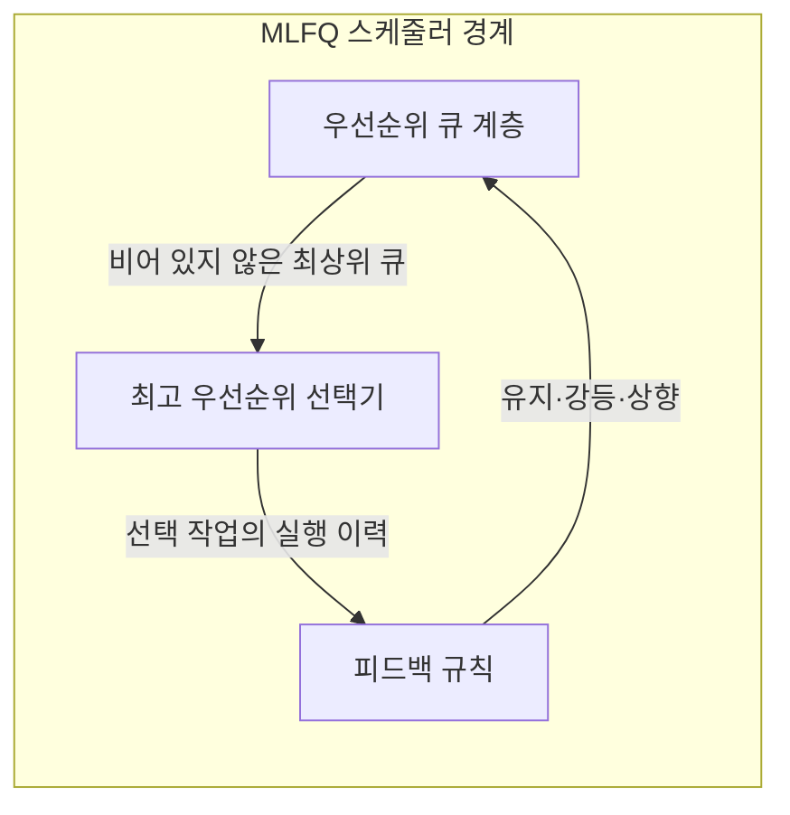

---
sidebar:
  order: 5
  label: "005. 멀티레벨 피드백 큐 MLFQ (Multilevel Feedback Queue)"
  badge:
    text: "기출 · 50%"
    variant: note
title: 멀티레벨 피드백 큐 MLFQ (Multilevel Feedback Queue)
date: "2026-07-27T23:59:59+09:00"
tags: [notes-software]
weight: 5
extra:
  question_no: "005"
  source_status: "기출"
  source_history: "138회"
  priority: 50
  priority_note: "138회 기출, 피드백 큐·기아 방지 설계"
---

## 미리 알고가기

- **멀티레벨 피드백 큐(Multilevel Feedback Queue, MLFQ)**: CPU 사용 이력에 따라 프로세스의 우선순위를 바꾸는 스케줄링 기법
- **멀티레벨 큐(Multilevel Queue, MLQ)**: 프로세스를 고정 우선순위 큐에 분류하는 스케줄링 기법
- **중앙처리장치(Central Processing Unit, CPU)**: 프로세스의 명령을 실행하는 처리장치
- **준비 큐(Ready Queue)**: CPU 실행을 기다리는 프로세스 대기열
- **CPU 버스트(CPU Burst)**: 프로세스가 CPU를 연속 사용하는 구간
- **시간 할당량(Time Quantum)**: 한 차례 CPU를 연속 사용할 수 있는 시간
- **라운드 로빈(Round Robin)**: 같은 큐의 작업에 CPU 시간을 차례로 배분
- **강등**: 프로세스를 한 단계 낮은 큐로 이동
- **우선순위 상향**: 모든 프로세스를 최상위 큐로 이동
- **기아(Starvation)**: 낮은 우선순위 작업이 실행 기회를 계속 얻지 못하는 상태
- **선점 스케줄링(Preemptive Scheduling)**: 할당량 만료나 높은 우선순위 작업 도착 시 실행 중인 프로세스의 CPU를 회수하는 정책
- **스케줄러(Scheduler)**: 준비 큐의 우선순위와 피드백 규칙을 적용해 다음 실행 프로세스를 선택하는 운영체제 구성요소
- **피드백 규칙(Feedback Rule)**: 실제 CPU 사용 이력과 상향 주기에 따라 프로세스가 머물 큐를 결정하는 규칙
- **대화형 셸(Interactive Shell)**: 키 입력과 명령 결과를 주고받아 짧은 CPU 버스트와 대기가 반복되므로 상위 큐에 남기 쉬운 명령 인터페이스
- **빌드 프로세스(Build Process)**: 소스 코드를 컴파일·링크하며 긴 CPU 버스트를 사용하는 작업으로서 할당량을 소진하면 하위 큐로 강등된다.
- **최대 대기시간(Maximum Waiting Time)**: 낮은 우선순위 프로세스가 실행 없이 기다릴 수 있는 상한으로서 상향 주기를 정하는 기준

## Ⅰ. 개요

- 정의/개념: CPU 사용 이력으로 **큐·우선순위를 동적 조정**하는 정책
- 기존 한계: 작업 길이를 모르면 **정적 우선순위·버스트 기반 선택** 곤란

### 쉽게 이해하기 (학습용)

- CPU를 짧게 쓰는 일은 앞줄에, 오래 쓰는 일은 뒷줄에 보내는 줄 세우기다

## Ⅱ. 특징

- **실행 이력**으로 대화형·CPU 집중 작업 구분
- **할당량 소진 시 강등**으로 CPU 독점 제한
- **주기적 우선순위 상향**으로 하위 큐 기아 방지

### 쉽게 이해하기 (학습용)

- 미리 작업 시간을 몰라도 실제로 짧게 쓰는 일을 앞줄에 둘 수 있다

## Ⅲ. 아키텍처 및 구성요소

| 설계 요소 | 입력·상태 | 역할 |
|:---|:---|:---|
| 우선순위 큐 계층 | 작업·큐별 할당량 | 상위 짧은 구간·하위 긴 구간 제공 |
| 최고 우선순위 선택기 | 비어 있지 않은 큐·도착 작업 | 큐 간 우선순위·큐 내 순환 선택 |
| 피드백 규칙 | CPU 사용 이력·대기시간 | 유지·강등·상향 위치 결정 |

> 요약: 선택기는 실행 순서, 피드백은 큐 위치 결정

### 쉽게 이해하기 (학습용)

- 여러 줄 중 가장 앞선 줄부터 처리하고, 사용 기록에 따라 작업을 다른 줄로 옮긴다

## Ⅳ. 운영 고려사항

| 운영 위험 | 대응 | 기대 효과 |
|:---|:---|:---|
| 하위 큐 작업 기아 | 최대 대기시간 기반 주기적 상향 | 배치 작업 진행 보장 |
| 짧은 I/O로 CPU 집중 작업이 상위 큐 유지 | 누적 CPU 사용량·행동 이력 기반 회계 | 우선순위 조작 방지 |
| 큐·할당량 과도 세분화로 전환 증가 | 부하 측정 기반 최소 큐 수·기하급수 할당량 설정 | 정책 비용 축소 |
| 전역 상향 순간에 상위 큐 혼잡 | 분산 상향·상향 예산과 꼬리 응답 감시 | 급격한 응답 저하 완화 |

### 쉽게 이해하기 (학습용)

- 새 작업은 앞줄에서 시작해 CPU를 오래 쓰면 내려가고, 오래 기다리면 다시 올라간다

## Ⅴ. 종류 및 비교

| 다중 큐 정책 | MLFQ | 멀티레벨 큐(MLQ) |
|:---|:---|:---|
| 적용 기준 | 작업 길이 미상·**혼합 부하** | 작업 유형별 **우선순위 고정** |
| 핵심 특징 | CPU 사용 이력의 **큐 이동** | 프로세스의 **소속 큐 고정** |
| 한계 | 할당량·상향 주기 **설정 복잡성** | 낮은 큐의 **기아 가능성** |

> 요약: 작업 길이 미상은 MLFQ, 작업 유형 고정은 MLQ

### 쉽게 이해하기 (학습용)

- 작업 성격이 바뀌면 사용 기록으로 줄을 옮기고, 유형이 고정되면 정해진 줄을 유지한다

## Ⅵ. 실무 사례

1. 대화형 셸은 **짧은 CPU 버스트**로 상위 큐 유지

### 쉽게 이해하기 (학습용)

- 키 입력을 자주 기다리는 셸은 CPU를 짧게 써서 앞줄에 남는다

## Ⅶ. 결론

- 대화형 작업의 응답성과 배치 작업의 기아를 함께 통제하기 위해 **응답 목표·최대 대기시간**을 검토하고, 큐별 할당량과 우선순위 상향 주기를 설정한다

### 쉽게 이해하기 (학습용)

- 화면 반응과 오래 기다리는 작업을 함께 살펴 줄별 사용 시간과 끌어올리는 간격을 정한다
