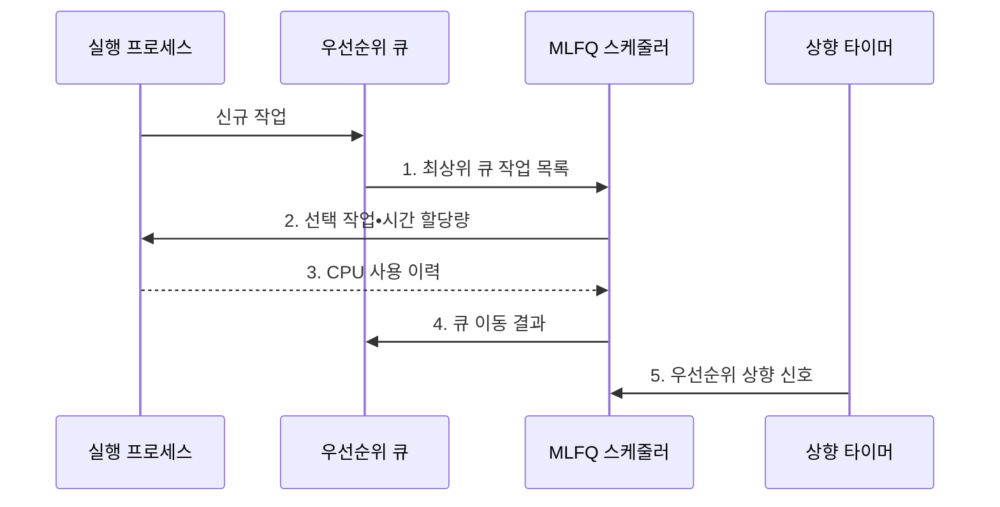

---
sidebar:
  order: 5
  label: "005. 멀티레벨 피드백 큐 MLFQ (Multilevel Feedback Queue)"
  badge:
    text: "기출 • 50%"
    variant: note
title: 멀티레벨 피드백 큐 MLFQ (Multilevel Feedback Queue)
date: "2026-08-04T10:03:00+09:00"
tags: [notes-software]
weight: 5
extra:
  question_no: "005"
  source_status: "기출"
  source_history: "138회"
  priority: 50
  priority_note: "138회 기출, 피드백 큐•기아 방지 설계"
---

## Ⅰ. 개요

핵심 용어

- **멀티레벨 피드백 큐(Multilevel Feedback Queue, MLFQ)**: CPU 사용 이력에 따라 프로세스를 우선순위 큐 사이에서 이동시키는 선점 스케줄링 기법

- 정의/개념: CPU 사용 이력에 따라 큐를 이동시켜 우선순위를 조정하는 **선점 스케줄링 정책**
- 배경/필요성: 작업 길이를 모르면 고정 우선순위로 **응답성•기아** 동시 통제 불가

#### 한줄 요약

- CPU를 짧게 쓰는 일은 앞줄에, 오래 쓰는 일은 뒷줄에 보내는 줄 세우기다

## Ⅱ. 특징

핵심 용어

- **강등(Demotion)**: CPU를 오래 쓴 작업을 하위 큐로 내리는 정책
- **우선순위 상향(Priority Boost)**: 오래 기다린 작업을 상위 큐로 올리는 정책
- **기아(Starvation)**: 낮은 우선순위 작업이 실행 기회를 계속 얻지 못하는 상태
- **대화형 작업(Interactive Job)**: 짧은 CPU 실행과 입력 대기를 반복하는 부하 유형
- **CPU 집중 작업(CPU-bound Job)**: CPU 연산을 오래 이어가는 부하 유형

- **실행 이력** 으로 대화형•CPU 집중 작업 구분
- **할당량 소진 시 강등** 으로 CPU 독점 제한
- **주기적 우선순위 상향** 으로 하위 큐 기아 방지

#### 한줄 요약

- 미리 작업 시간을 몰라도 실제로 짧게 쓰는 일을 앞줄에 둘 수 있다

## Ⅲ. 구조 및 구성요소

핵심 용어

- **우선순위 큐 계층**: 서로 다른 시간 할당량과 우선순위를 가진 여러 준비 큐의 구조
- **피드백 규칙(Feedback Rule)**: CPU 사용 이력과 상향 주기에 따라 작업이 머물 큐를 결정하는 규칙

| 구성요소 | 책임 |
|:---|:---|
| 우선순위 큐 계층 | **작업•할당량 보관** |
| 우선순위 선택기 | **최상위 작업 선택** |
| 피드백 규칙 | **유지•강등•상향 결정** |
| 상향 타이머 | **기아 방지 시점 통지** |

#### 한줄 요약

- 짧게 쓰고 기다리는 일은 앞줄에 남고, CPU를 오래 쓰는 일은 뒷줄로 가지만 너무 오래 기다리면 다시 끌어올린다.

## Ⅳ. 흐름도

핵심 용어

- **시간 할당량(Time Quantum)**: 한 차례 CPU를 연속 사용할 수 있는 시간
- **CPU 사용 이력**: 작업의 할당량 소진 여부와 실제 CPU 사용시간을 기록한 정보
- **최대 대기시간(Maximum Waiting Time)**: 낮은 우선순위 작업이 실행 없이 기다릴 수 있는 상한

**동작 원리**

1. **최상위 큐 작업 목록**: 비어 있지 않은 최고 우선순위 큐부터 후보 제공
2. **선택 작업•시간 할당량**: 큐별 할당량으로 CPU 실행 범위 확정
3. **CPU 사용 이력**: 할당량 소진 여부와 실제 사용시간 회수
4. **큐 이동 결과**: 사용 이력에 따라 현재 큐 유지 또는 하위 큐 강등
5. **우선순위 상향 신호**: 최대 대기시간 전에 모든 작업을 상위 큐로 이동

#### 한줄 요약

- 오래 쓰면 뒤로 보내고 오래 기다리면 다시 앞으로 올린다.

## Ⅴ. 종류 및 비교

핵심 용어

- **멀티레벨 큐(Multilevel Queue, MLQ)**: 프로세스를 고정 우선순위 큐에 분류하고 큐 사이를 이동시키지 않는 기법
- **혼합 부하**: 대화형 작업과 CPU 중심 작업이 함께 실행되는 작업 구성

| 스케줄링 정책 | MLFQ | 멀티레벨 큐(MLQ) |
|:---|:---|:---|
| 적용 기준 | 작업 길이 미상•**혼합 부하** | 작업 유형별 **우선순위 고정** |
| 핵심 특징 | CPU 사용 이력의 **큐 이동** | 프로세스의 **소속 큐 고정** |
| 한계 | 할당량•상향 주기 **설정 복잡성** | 낮은 큐의 **기아 가능성** |

> 요약: 작업 길이가 변하면 **MLFQ**, 유형별 우선순위가 고정되면 **MLQ** 선택

#### 한줄 요약

- 작업 성격이 바뀌면 MLFQ가 줄을 옮기고 유형이 고정되면 MLQ가 정해진 줄을 유지한다.

## Ⅵ. 실무 고려사항 및 대책

핵심 용어

- **CPU 사용량 회계(CPU Usage Accounting)**: 작업이 실제 사용한 CPU 시간을 누적해 우선순위 정책에 반영하는 처리
- **기하급수 할당량(Geometric Quantum)**: 하위 큐로 갈수록 일정 배수로 길어지는 시간 할당량
- **꼬리 응답시간(Tail Response Time)**: 응답시간 분포의 상위 백분위에 해당하는 느린 작업 시간
- **스케줄링 오버헤드**: 큐 관리와 문맥 전환처럼 실제 작업 실행 외에 CPU를 소비하는 관리 비용
- **분산 상향(Staggered Boost)**: 작업별 승격 시점을 분산하는 정책
- **상향 예산(Boost Budget)**: 한 번에 승격할 작업 수를 제한하는 정책

| 문제 | 대책 | 효과 |
|:---|:---|:---|
| 상위 큐가 계속 차서 하위 큐 작업의 **기아 발생** | 최대 대기시간 기반 **주기적 우선순위 상향** | **배치 작업 진행** 보장 |
| 짧은 입출력 대기로 CPU 중심 작업이 **상위 큐 유지** | 누적 사용시간 기반 **CPU 사용량 회계** | **우선순위 조작** 방지 |
| 큐•할당량 세분화로 **문맥 전환 증가** | 최소 큐 수와 **기하급수 할당량** 설정 | **스케줄링 오버헤드** 감소 |
| 전역 상향 순간에 상위 큐가 몰려 **꼬리 응답시간 악화** | 작업별 **분산 상향•상향 예산** 적용 | **상위 큐 혼잡** 완화 |

#### 한줄 요약

- 키 입력을 자주 기다리는 작업은 CPU를 짧게 써서 앞줄에 남는다

## Ⅶ. 결론

핵심 용어

- **상향 주기**: 기아 방지를 위해 하위 큐 작업을 상위 큐로 올리는 시간 간격

- 꼬리 응답이 목표를 넘으면 **상위 큐 할당량 단축**, 최대 대기가 넘으면 **상향 주기 단축**

#### 한줄 요약

- 화면 반응과 오래 기다리는 작업을 함께 살펴 줄별 사용 시간과 끌어올리는 간격을 정한다
