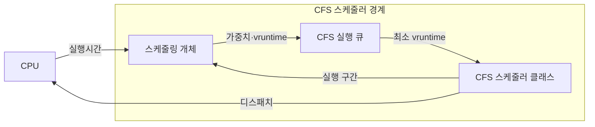

---
sidebar:
  order: 6
  label: "006. CFS 완전 공정 스케줄러 (Completely Fair Scheduler)"
  badge:
    text: "기출 · 50%"
    variant: note
title: CFS 완전 공정 스케줄러 (Completely Fair Scheduler)
date: "2026-07-27T23:59:59+09:00"
tags: [notes-software]
weight: 6
extra:
  question_no: "006"
  source_status: "기출"
  source_history: "138회"
  priority: 50
  priority_note: "138회 기출, 공정 스케줄링 가중치 구조"
---

## 미리 알고가기

- **완전 공정 스케줄러(Completely Fair Scheduler, CFS)**: 가중 CPU 사용량이 가장 적은 태스크를 선택하는 스케줄러
- **중앙처리장치(Central Processing Unit, CPU)**: 태스크의 명령을 실행하는 처리 자원
- **스케줄링 개체(Scheduling Entity)**: 태스크의 가중치·가상 실행시간 상태
- **CFS 실행 큐(CFS Run Queue, cfs_rq)**: 실행 가능한 스케줄링 개체를 가상 실행시간 순으로 관리하는 실행 큐
- **CFS 스케줄러 클래스(CFS Scheduler Class)**: 개체 등록·선택·실행 구간 산정 정책
- **가상 실행시간(Virtual Runtime, vruntime)**: 실행시간을 가중치로 보정한 누적값
- **nice 값(Nice Value)**: 태스크의 CPU 배분 가중치를 정하는 값
- **레드-블랙 트리(Red-Black Tree)**: vruntime 순서를 유지하는 균형 탐색 트리
- **목표 지연시간(Target Latency)**: 실행 가능 태스크가 한 번씩 실행될 목표 구간
- **최소 세분도(Minimum Granularity)**: 태스크별 실행 구간의 하한
- **깨움 세분도(Wakeup Granularity)**: 깨어난 태스크의 선점 민감도 기준
- **태스크(Task)**: CFS가 CPU 시간을 배분하는 실행 단위로서 프로세스나 스레드를 스케줄링 개체로 표현한다.
- **브이런타임(vruntime)**: 실제 실행시간을 가중치로 보정한 누적 CPU 사용량
- **나이스 값(nice Value)**: 태스크의 가중치와 CPU 배분 비율을 정하는 우선순위 조정값
- **스케줄러 클래스(Scheduler Class)**: 태스크 등록·선택·실행 구간 계산을 같은 정책으로 묶어 운영체제 스케줄러에 제공하는 구현 경계
- **디스패치(Dispatch)**: 선택한 태스크의 실행 문맥을 복원하고 CPU 제어권을 넘기는 동작
- **문맥 전환(Context Switch)**: 실행 중인 태스크 상태를 저장하고 다음 태스크 상태를 복원하며 세분도가 너무 작을 때 비용이 증가하는 작업
- **라운드 로빈(Round Robin, RR)**: 준비 큐의 태스크에 같은 시간 할당량을 차례로 배분하는 방식
- **웹·배치 프로세스(Web·Batch Process)**: 웹 프로세스는 빠른 응답을, 배치 프로세스는 묶음 처리를 수행하며 nice 값으로 서로 다른 CPU 몫을 배정할 수 있다.

## Ⅰ. 개요

- 정의/개념: 최소 가상 실행시간 태스크에 **가중 CPU 몫**을 배분하는 정책
- 기존 한계: 동일 시간 배분은 **태스크별 가중치·우선순위 몫** 반영 불가

### 쉽게 이해하기 (학습용)

- 배정된 몫보다 CPU를 덜 쓴 작업에 다음 차례를 주는 방식이다.

## Ⅱ. 특징

- **가중 가상 실행시간**으로 태스크별 CPU 몫 추적
- **최소 vruntime 태스크 선택**으로 공정한 실행 기회 제공
- **최소·깨움 세분도**로 전환 비용·응답 지연 절충

### 쉽게 이해하기 (학습용)

- 차례를 기다리는 실행 가능 작업이 많아질수록 각 작업의 실행 구간은 짧아지지만 정한 하한 아래로는 줄이지 않는다.

## Ⅲ. 아키텍처 및 구성요소

| 설계 요소 | 입력·상태 | 역할 |
|:---|:---|:---|
| 스케줄링 개체 | 태스크 가중치·가상 실행시간 | 가중 CPU 사용량 보관 |
| CFS 실행 큐 | 실행 가능 개체·최소 가상 실행시간 | 가상 실행시간 순서 유지 |
| CFS 스케줄러 클래스 | 개체 수·목표 지연·세분도 | 최솟값 선택·실행 구간 산정 |

> 요약: 가중 사용량 최솟값에 실행 구간 배분

### 쉽게 이해하기 (학습용)

- 작업별 가중 사용량 장부를 순서대로 정리해 가장 덜 사용한 작업을 찾는다.

## Ⅳ. 운영 고려사항

| 운영 위험 | 대응 | 기대 효과 |
|:---|:---|:---|
| 실행 가능 태스크 증가로 구간이 최소 세분도에 수렴 | 런 큐 길이·전환률 감시와 CPU·작업 분산 | 과도한 문맥 전환 방지 |
| 잘못된 nice·그룹 가중치로 서비스 몫 왜곡 | 계층별 CPU 몫·실사용량 검토와 정책 변경 감사 | 의도한 공정성 유지 |
| 깨움 선점 과민으로 현재 작업 캐시 교란 | 응답 목표 기반 깨움 세분도 조정 | 응답성과 처리량 균형 |
| 평균 CPU 몫은 맞지만 짧은 구간 지연 발생 | 구간별 런 큐 지연·꼬리 응답 계측 | 순간 불공정 탐지 |

### 쉽게 이해하기 (학습용)

- 가장 덜 사용한 작업을 실행한 뒤 가중 사용량을 올려 다시 차례표에 넣는다.

## Ⅴ. 종류 및 비교

| 공정 스케줄링 정책 | CFS | 라운드 로빈 |
|:---|:---|:---|
| 적용 기준 | 가중치별 **CPU 몫 배분** | 동일 할당량의 **순환 응답** |
| 핵심 특징 | 최소 vruntime·**가중 배분** | 준비 큐 선두·**동일 할당량** |
| 한계 | 세분도 설정·**계측 비용** | 짧은 할당량의 **전환 증가** |

> 요약: CFS는 가중 사용량, 라운드 로빈은 큐 순서로 배분

### 쉽게 이해하기 (학습용)

- CFS는 배정된 몫보다 덜 쓴 작업을, 라운드 로빈은 줄의 맨 앞 작업을 실행한다.

## Ⅵ. 실무 사례

1. 웹·배치 프로세스는 **nice 값**으로 CPU 몫 차등

### 쉽게 이해하기 (학습용)

- 웹 요청 작업에는 큰 몫을, 배치 작업에는 작은 CPU 몫을 배분한다.

## Ⅶ. 결론

- 프로세스 간 CPU를 공정하게 배분하기 위해 **CPU 몫과 응답 요구**를 검토하고, CFS의 nice 값과 깨움 선점 민감도를 설정한다

### 쉽게 이해하기 (학습용)

- 작업별 CPU 몫과 반응 속도 요구를 함께 보고 가중치와 선점 민감도를 정한다.
