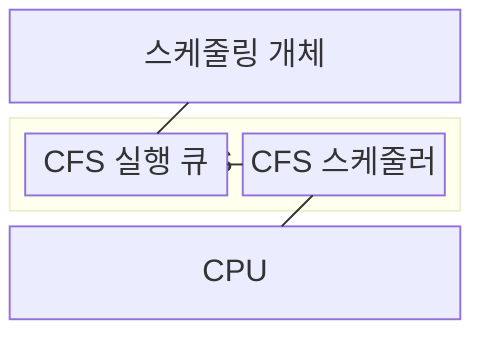
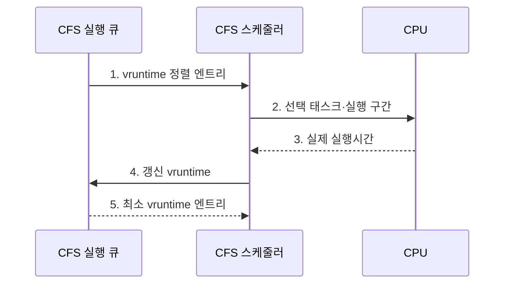

---
sidebar:
  order: 6
  label: "006. CFS 완전 공정 스케줄러 (Completely Fair Scheduler)"
  badge:
    text: "기출 · 50%"
    variant: note
title: CFS 완전 공정 스케줄러 (Completely Fair Scheduler)
date: "2026-07-30T23:21:16+09:00"
tags: [notes-software]
weight: 6
extra:
  question_no: "006"
  source_status: "기출"
  source_history: "138회"
  priority: 50
  priority_note: "138회 기출, 공정 스케줄링 가중치 구조"
---

## 미리 알고가기

- **완전 공정 스케줄러(Completely Fair Scheduler, CFS)**: 가중치로 보정한 CPU 사용량이 가장 적은 태스크를 선택하는 공정 스케줄러
- **중앙처리장치(Central Processing Unit, CPU)**: 태스크의 명령을 실행하는 처리 자원
- **스케줄링 개체(Scheduling Entity)**: 태스크의 가중치·가상 실행시간 상태
- **CFS 실행 큐(CFS Run Queue, cfs_rq)**: 실행 가능한 스케줄링 개체를 가상 실행시간 순으로 관리하는 실행 큐
- **가상 실행시간(Virtual Runtime, vruntime)**: 실행시간을 가중치로 보정한 누적값
- **nice 값(Nice Value)**: 태스크의 CPU 배분 가중치를 정하는 값
- **레드-블랙 트리(Red-Black Tree)**: vruntime 순서를 유지하는 균형 탐색 트리
- **목표 지연시간(Target Latency)**: 실행 가능 태스크가 한 번씩 실행될 목표 구간
- **최소 세분도(Minimum Granularity)**: 태스크별 실행 구간의 하한
- **깨움 세분도(Wakeup Granularity)**: 깨어난 태스크의 선점 민감도 기준
- **태스크(Task)**: CFS가 CPU 시간을 배분하는 실행 단위로서 프로세스나 스레드를 스케줄링 개체로 표현한다.
- **디스패치(Dispatch)**: 선택한 태스크의 실행 문맥을 복원하고 CPU 제어권을 넘기는 동작
- **문맥 전환(Context Switch)**: 실행 중인 태스크 상태를 저장하고 다음 태스크 상태를 복원하며 세분도가 너무 작을 때 비용이 증가하는 작업
- **라운드 로빈(Round Robin, RR)**: 준비 큐의 태스크에 같은 시간 할당량을 차례로 배분하는 방식
- **그룹 스케줄링(Group Scheduling)**: 태스크를 그룹으로 묶어 그룹 간·그룹 내 CPU 몫을 계층적으로 배분하는 방식
- **런 큐 지연(Run-Queue Latency)**: 실행 가능해진 태스크가 실제 CPU를 받기까지 기다린 시간
- **꼬리 응답시간(Tail Response Time)**: 응답시간 분포의 상위 백분위에 해당하는 느린 요청 시간

## Ⅰ. 개요

- 정의/개념: 가중치로 보정한 **vruntime**이 가장 작은 태스크에 CPU를 배분하는 공정 스케줄링 정책
- 배경/필요성: 동일 시간 할당만으로는 태스크별 **가중 CPU 몫 반영 불가**

### 쉽게 이해하기 (학습용)

- 배정된 몫보다 CPU를 덜 쓴 작업에 다음 차례를 주는 방식이다.

## Ⅱ. 특징

- **가중 가상 실행시간**으로 태스크별 CPU 몫 추적
- **최소 vruntime 태스크 선택**으로 공정한 실행 기회 제공
- **최소·깨움 세분도**로 전환 비용·응답 지연 절충

### 쉽게 이해하기 (학습용)

- 차례를 기다리는 실행 가능 작업이 많아질수록 각 작업의 실행 구간은 짧아지지만 정한 하한 아래로는 줄이지 않는다.

## Ⅲ. 구조 및 구성요소

| 구성요소 | 책임 |
|:---|:---|
| 스케줄링 개체 | **가중치·vruntime 보관** |
| CFS 실행 큐 | **vruntime 순서 유지** |
| CFS 스케줄러 | **최솟값·실행 구간 산정** |
| CPU | **선택 태스크 실행** |

- **vruntime 증가량**: 실제 실행시간 × 기준 가중치 / 태스크 가중치
- **이상적 실행 몫**: 배분 구간 × 태스크 가중치 / 전체 가중치 합

### 쉽게 이해하기 (학습용)

- CPU를 쓴 만큼 가중 사용량 장부를 올리고, 장부 값이 가장 작은 작업에 다음 차례를 준다.

## Ⅳ. 흐름도

**동작 원리**

1. **vruntime 정렬 엔트리**: 레드-블랙 트리에서 최솟값 후보 제공
2. **선택 태스크·실행 구간**: 가중치 비율과 세분도 하한으로 실행시간 확정
3. **실제 실행시간**: 디스패치 뒤 소비한 CPU 시간 회수
4. **갱신 vruntime**: 실제 실행시간을 가중치 역비례로 누적
5. **최소 vruntime 엔트리**: 가장 적게 배분받은 태스크를 다음 후보로 선택

### 쉽게 이해하기 (학습용)

- 가중 사용량이 가장 작은 작업에 다음 차례를 준다.

## Ⅴ. 종류 및 비교

| 스케줄링 정책 | CFS | 라운드 로빈 |
|:---|:---|:---|
| 적용 기준 | 가중치별 **CPU 몫 배분** | 동일 할당량의 **순환 응답** |
| 핵심 특징 | 최소 vruntime·**가중 배분** | 준비 큐 선두·**동일 할당량** |
| 한계 | 세분도 설정·**계측 비용** | 짧은 할당량의 **전환 증가** |

> 요약: 가중 CPU 몫은 **CFS**, 동일 시간 순환은 **라운드 로빈** 선택

### 쉽게 이해하기 (학습용)

- CFS는 배정 몫보다 덜 쓴 작업을 고르고 라운드 로빈은 줄의 맨 앞 작업을 고른다.

## Ⅵ. 실무 고려사항 및 대책

| 고려사항 | 대책 | 효과 |
|:---|:---|:---|
| 실행 가능 태스크 증가로 실행 구간이 **최소 세분도 수렴** | 태스크를 CPU별 **CFS 실행 큐로 분산** | 과도한 **문맥 전환** 방지 |
| 잘못된 nice·그룹 가중치로 **CPU 몫 왜곡** | **nice·그룹 가중치**와 실사용 몫 재조정 | 목표 **가중 공정성** 유지 |
| 깨움 선점이 잦아 현재 태스크의 **캐시 지역성 손실** | 응답 목표 기반 **깨움 세분도 조정** | **응답시간·처리량** 상충 조정 |
| 평균 CPU 몫은 맞지만 짧은 구간에 **지연 편중** | 구간별 **런 큐 지연·꼬리 응답시간** 계측 | 순간 **불공정 구간** 식별 |

### 쉽게 이해하기 (학습용)

- 웹 요청 작업에는 큰 몫을, 배치 작업에는 작은 CPU 몫을 배분한다.

## Ⅶ. 결론

- CPU 몫은 **nice 가중치**, 꼬리 응답 목표는 **깨움 세분도**로 조정

### 쉽게 이해하기 (학습용)

- 작업별 CPU 몫과 반응 속도 요구를 함께 보고 가중치와 선점 민감도를 정한다.
