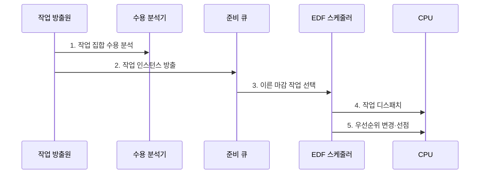

---
sidebar:
  order: 7
  label: "007. 실시간 스케줄링: Rate Monotonic·EDF (Real-Time Scheduling)"
  badge:
    text: "기출 · 70%"
    variant: note
title: "실시간 스케줄링: Rate Monotonic·EDF (Real-Time Scheduling)"
date: "2026-07-27T23:59:59+09:00"
tags: [notes-software]
weight: 7
extra:
  question_no: "007"
  source_status: "기출"
  source_history: "137회"
  priority: 70
  priority_note: "137회 기출, 마감시간 보장 알고리즘 중요"
---

## 미리 알고가기

- **실시간 스케줄링(Real-Time Scheduling)**: 작업 완료 시각을 마감시간 안으로 통제
- **주기 단조 스케줄링(Rate Monotonic, RM)**: 주기가 짧은 작업에 높은 고정 우선순위를 부여하는 방식
- **최단 마감시간 우선(Earliest Deadline First, EDF)**: 절대 마감시간이 가장 이른 작업을 먼저 선택하는 방식
- **중앙처리장치(Central Processing Unit, CPU)**: 실시간 작업의 명령을 실행하는 처리 자원
- **태스크 수($n$)**: ‘엔’으로 읽고 개수를 나타내는 수학 관례 변수이며 분석 대상 주기 작업의 개수를 나타낸다.
- **작업 모수 $C_i$·$T_i$·$D_i$**: 각각 ‘시 서브 아이·티 서브 아이·디 서브 아이’로 읽고 계산·주기·마감의 영문 머리글자에 작업 번호 $i$를 아래 첨자로 붙이는 실시간 분석 관례 표기이며 $i$번째 작업의 최악 실행시간·주기·상대 마감시간을 나타낸다.
- **절대 마감시간(Absolute Deadline)**: 작업이 완료돼야 하는 실제 시각
- **암시적 마감(Implicit Deadline)**: 상대 마감시간과 주기가 같은 조건
- **스케줄 가능성(Schedulability)**: 모든 작업의 마감 준수 가능 여부
- **이용률(Utilization, $U$)**: ‘유’로 읽고 Utilization의 머리글자를 쓰는 관례 표기이며 각 작업의 실행시간을 주기로 나눈 CPU 수요를 합산한 비율
- **분석 전제**: 단일 CPU·독립·선점 가능 주기 작업
- **이용률 식 $\sum C_i/T_i$**: ‘시그마 시 서브 아이 나누기 티 서브 아이’로 읽고 합을 뜻하는 그리스 대문자 시그마($\sum$)와 나눗셈 빗금(/)을 쓰는 수학 관례 표기이며 모든 주기 작업이 요구하는 CPU 시간 비율의 합을 계산한다.
- **최악 실행시간(Worst-case Execution Time, WCET)**: 가장 불리한 조건에서 작업을 완료하는 데 필요한 최대 CPU 시간
- **작업 릴리스(Job Release)**: 주기나 외부 사건에 따라 새 작업 인스턴스가 실행 가능 상태가 되는 시점
- **정적·동적 우선순위(Static·Dynamic Priority)**: 정적 우선순위는 RM처럼 실행 전 고정되고 동적 우선순위는 EDF처럼 절대 마감에 따라 실행 중 바뀜
- **과부하(Overload)**: 도착한 작업의 CPU 수요가 처리 가능량을 넘어 EDF에서도 마감 위반이 연쇄될 수 있는 상태
- **최악 응답시간 분석(Worst-case Response-time Analysis)**: 간섭과 선점을 포함해 작업이 릴리스부터 완료까지 걸릴 최대 시간을 구하고 마감 준수 여부를 검증하는 방법
- **수용 제어(Admission Control)**: 새 작업을 받아도 기존 작업의 마감을 지킬 수 있는지 검사해 수용 여부를 결정하는 절차
- **마감 미스(Deadline Miss)**: 작업이 정해진 마감시간까지 완료되지 못한 상태
- **최대 차단시간(Worst-case Blocking Time)**: 공유 자원을 기다리느라 높은 우선순위 작업이 멈출 수 있는 최대 시간
- **우선순위 상속·천장(Priority Inheritance·Ceiling)**: 낮은 우선순위 작업의 자원 잠금으로 높은 우선순위 작업이 오래 막히는 현상을 제한하는 규칙
- **중요도(Criticality)**: 마감 실패가 시스템에 미치는 위험의 크기에 따른 작업 등급
- **미디어 서버(Media Server)**: 재생 시각이 정해진 변환 작업을 처리하며 절대 마감이 가까운 순서로 EDF를 적용할 수 있는 서버

## Ⅰ. 개요

- 정의/개념: 우선순위로 **응답시간·마감을 통제**하는 정책
- 배경/필요성: 평균 중심 정책의 **태스크별 마감 미보장** 해결

### 쉽게 이해하기 (학습용)

- 각 작업이 약속한 시각을 넘기지 않도록 실행 차례와 선점 순서를 정한다.

## Ⅱ. 특징

- **논리 결과·완료 시각**을 함께 정확성으로 판정
- **최악 실행시간 기반 분석**으로 데드라인 충족 여부 검증
- **수용 분석**으로 마감 불가능한 신규 작업 사전 거부

### 쉽게 이해하기 (학습용)

- 약속 시각을 넘기면 실패하거나 가치가 낮아지므로 최악의 실행시간까지 계산해 작업을 받는다.

## Ⅲ. 구조 및 구성요소

| 구성요소 | 책임 |
|:---|:---|
| 실시간 작업 집합 | **실행시간·주기·마감 제공** |
| 스케줄 가능성 분석기 | **작업 수용 여부 판정** |
| 우선순위 준비 큐 | **RM·EDF 후보 정렬** |
| 선점 스케줄러 | **디스패치·선점 수행** |

단일 CPU의 독립·선점 가능 주기 태스크에서 \(D_i=T_i\)인 경우의 이용률:

$$
U=\sum_{i=1}^{n}\frac{C_i}{T_i}
$$

RM의 고전적 충분조건과 EDF의 이용률 조건:

$$
U\le n\left(2^{1/n}-1\right),\qquad U\le1
$$

- \(n\)은 태스크 수, \(i\)는 태스크 번호, \(C_i\)는 \(i\)번째 태스크의 WCET, \(T_i\)는 주기, \(U\)는 전체 CPU 이용률상태
- RM 경계 초과 시 응답시간 분석으로 추가 판결정
- 차단·문맥 전환·인터럽트 비용과 비주기·다중 CPU를 위한 **별도 분석 모델**

### 쉽게 이해하기 (학습용)

- 작업을 받기 전에 최악 시간표를 확인하고, 실행 중 더 가까운 마감이 오면 먼저 처리한 뒤 중단한 일을 이어간다.

## Ⅳ. 흐름도

**동작 원리**

- **1. 작업 집합 수용 분석**: 이용률 검증 후 수용 작업 등록
- **2. 작업 인스턴스 방출**: 실행 후보 생성
- **3. 이른 마감 작업 선택**: EDF 우선순위 결정
- **4. 작업 디스패치**: CPU 배정
- **5. 우선순위 변경·선점**: 새 마감을 반영해 더 이른 작업 실행

### 쉽게 이해하기 (학습용)

- 작업을 받기 전에 시간표를 확인하고 가까운 마감을 먼저 처리한다.

## Ⅴ. 종류 및 비교

| 구분 | RM | EDF |
|:---|:---|:---|
| 적용 기준 | 고정 주기·**정적 우선순위 검증** | 가변 마감·**높은 CPU 이용률** |
| 핵심 특징 | 짧은 주기의 **고정 우선순위** | 이른 절대 마감의 **동적 우선순위** |
| 한계 | 보수적 이용률·**낮은 순위 위반** | 과부하 시 **마감 위반 연쇄** |

> 요약: 고정 주기는 RM, 가변 마감은 EDF

### 쉽게 이해하기 (학습용)

- RM은 반복 주기가 짧은 작업을 고정 우선하고, EDF는 매 순간 마감이 가장 가까운 작업을 우선한다.

## Ⅵ. 실무 고려사항 및 대책

| 고려사항 | 대책 | 효과 |
|:---|:---|:---|
| 평균 실행시간으로 분석해 최악 조건 누락 | 측정·정적 분석 기반 최악 실행시간과 간섭 포함 | 마감 보장의 근거 확보 |
| 과부하 시 EDF 마감 위반 연쇄 | 수용 제어·중요도별 폐기와 과부하 모드 설계 | 핵심 작업 마감 보호 |
| 공유 자원 차단·우선순위 역전 | 최악 차단시간 포함과 우선순위 상속·천장 적용 | 응답시간 상한 유지 |
| 잦은 선점·타이머 비용 누락 | 전환·인터럽트 비용을 실행시간 예산에 반영 | 분석과 실제 실행 일치 |

### 쉽게 이해하기 (학습용)

- 제어 작업은 반복 주기가 짧을수록 높은 고정 우선순위를 받는다.

## Ⅶ. 결론

- 주기 고정성·마감 변동으로 **RM·EDF**를 선택

### 쉽게 이해하기 (학습용)

- 반복 간격이 고정이면 RM을, 마감 순서가 계속 바뀌면 EDF를 선택한다.
