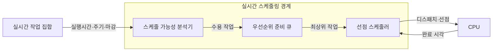
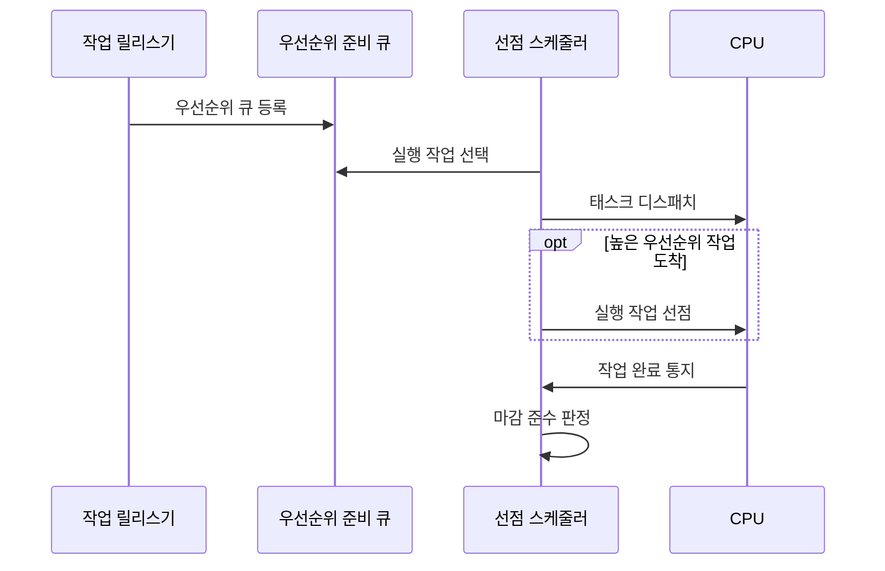

---
sidebar:
  order: 7
  label: "007. 실시간 스케줄링 — Rate Monotonic·EDF (Real-Time Scheduling)"
  badge:
    text: "기출 · 70%"
    variant: note
title: 실시간 스케줄링 — Rate Monotonic·EDF (Real-Time Scheduling)
date: "2026-07-27T23:59:59+09:00"
tags: [notes-software]
weight: 7
extra:
  question_no: "007"
  source_status: "기출"
  source_history: "137회"
  priority: 70
  priority_note: "137회 기출, 마감시간 보장 알고리즘 중요"
---

## 미리 알고가기

- **실시간 스케줄링(Real-Time Scheduling)**: 작업 완료 시각을 마감시간 안으로 통제
- **주기 단조 스케줄링(Rate Monotonic, RM, 알엠)**: 영문 각 단어의 첫 글자를 따 RM으로 표기하며 짧은 주기에 높은 고정 우선순위를 부여하는 방식
- **최단 마감시간 우선(Earliest Deadline First, EDF, 이디에프)**: 영문 각 단어의 첫 글자를 따 EDF로 표기하며 절대 마감이 가장 이른 작업을 선택하는 방식
- **중앙처리장치(Central Processing Unit, CPU, 시피유)**: 영문 각 단어의 첫 글자를 따 CPU로 표기하며 실시간 작업 명령을 실행하는 처리 자원
- **태스크 수($n$)**: ‘엔’으로 읽고 개수를 나타내는 수학 관례 변수이며 분석 대상 주기 작업의 개수를 나타낸다.
- **작업 모수 $C_i$·$T_i$·$D_i$**: 각각 ‘시 서브 아이·티 서브 아이·디 서브 아이’로 읽고 계산·주기·마감의 영문 머리글자에 작업 번호 $i$를 아래 첨자로 붙이는 실시간 분석 관례 표기이며 $i$번째 작업의 최악 실행시간·주기·상대 마감시간을 나타낸다.
- **절대 마감시간(Absolute Deadline)**: 작업이 완료돼야 하는 실제 시각
- **암시적 마감(Implicit Deadline)**: 상대 마감시간과 주기가 같은 조건
- **스케줄 가능성(Schedulability)**: 모든 작업의 마감 준수 가능 여부
- **이용률(Utilization, $U$)**: ‘유’로 읽고 Utilization의 머리글자를 쓰는 관례 표기이며 각 작업의 실행시간을 주기로 나눈 CPU 수요를 합산한 비율
- **분석 전제**: 단일 CPU·독립·선점 가능 주기 작업
- **이용률 식 $\sum C_i/T_i$**: ‘시그마 시 서브 아이 나누기 티 서브 아이’로 읽고 합을 뜻하는 그리스 대문자 시그마($\sum$)와 나눗셈 빗금(/)을 쓰는 수학 관례 표기이며 모든 주기 작업이 요구하는 CPU 시간 비율의 합을 계산한다.
- **최악 실행시간(Worst-case Execution Time, WCET, 더블유시에이티)**: 영문 각 단어의 첫 글자를 따 WCET로 표기하며 가장 불리한 조건에서 작업을 완료하는 데 필요한 최대 CPU 시간
- **작업 릴리스(Job Release)**: 주기나 외부 사건에 따라 새 작업 인스턴스가 실행 가능 상태가 되는 시점
- **정적·동적 우선순위(Static·Dynamic Priority)**: 정적 우선순위는 RM처럼 실행 전 고정되고 동적 우선순위는 EDF처럼 절대 마감에 따라 실행 중 바뀜
- **과부하(Overload)**: 도착한 작업의 CPU 수요가 처리 가능량을 넘어 EDF에서도 마감 위반이 연쇄될 수 있는 상태
- **최악 응답시간 분석(Worst-case Response-time Analysis)**: 간섭과 선점을 포함해 작업이 릴리스부터 완료까지 걸릴 최대 시간을 구하고 마감 준수 여부를 검증하는 방법
- **미디어 서버(Media Server)**: 재생 시각이 정해진 변환 작업을 처리하며 절대 마감이 가까운 순서로 EDF를 적용할 수 있는 서버

## Ⅰ. 개요

- 정의/개념: 태스크 우선순위로 **최악 응답시간·마감 준수**를 통제하는 정책
- 기존 한계: 평균 처리량 중심 정책은 **태스크별 데드라인 준수** 보장 곤란

### 쉽게 이해하기 (학습용)

- 각 작업이 약속한 시각을 넘기지 않도록 실행 차례와 선점 순서를 정한다.

## Ⅱ. 특징

- **논리 결과·완료 시각**을 함께 정확성으로 판정
- **최악 실행시간 기반 분석**으로 데드라인 충족 여부 검증
- **수용 분석**으로 마감 불가능한 신규 작업 사전 거부
- 잦은 선점은 문맥 전환 비용을 높인다

### 쉽게 이해하기 (학습용)

- 약속 시각을 넘기면 실패하거나 가치가 낮아지므로 최악의 실행시간까지 계산해 작업을 받는다.

## Ⅲ. 아키텍처 및 구성요소

| 설계 요소 | 설명 |
|:---|:---|
| 스케줄 가능성 분석기 | 작업 모수로 수용 가능 여부 판정 |
| 우선순위 준비 큐 | RM 주기·EDF 절대 마감 순으로 정렬 |
| 선점 스케줄러 | 최상위 작업 디스패치·선점 |

> 요약: 수용 분석 후 우선순위 큐에서 선점 실행

### 쉽게 이해하기 (학습용)

- 작업을 받기 전에 시간표가 가능한지 계산하고 실행 중에는 가장 급한 작업에 처리기를 넘긴다.

## Ⅳ. 원리 및 절차 흐름도

| 절차 | 설명 |
|:---|:---|
| 우선순위 큐 등록 | RM은 주기, EDF는 절대 마감 반영 |
| 실행 작업 선택 | 준비 큐의 최상위 작업 제거 |
| 태스크 디스패치 | 선택 작업에 CPU 제어권 전달 |
| 실행 작업 선점 | 현재 작업을 준비 큐에 재등록 |
| 작업 완료 통지 | CPU가 실제 완료 시각 전달 |
| 마감 준수 판정 | 완료 시각과 절대 마감 비교 |

> 요약: 우선순위 등록·선점 실행·마감 판정

### 쉽게 이해하기 (학습용)

- 새 작업이 더 급하면 현재 작업을 줄에 돌려보내고 끝난 뒤 약속 시각을 지켰는지 확인한다.

## Ⅴ. 종류 및 비교

| 실시간 스케줄링 | RM | EDF |
|:---|:---|:---|
| 적용 기준 | 고정 주기·**정적 우선순위 검증** | 가변 마감·**높은 CPU 이용률** |
| 핵심 특징 | 짧은 주기의 **고정 우선순위** | 이른 절대 마감의 **동적 우선순위** |
| 한계 | 보수적 이용률·**낮은 순위 위반** | 과부하 시 **마감 위반 연쇄** |

> 요약: 고정 주기는 RM, 가변 마감은 EDF

### 쉽게 이해하기 (학습용)

- RM은 자주 오는 일을 늘 우선하고 EDF는 매 순간 마감이 가장 가까운 일을 우선한다.

## Ⅵ. 실무 사례

1. 산업 제어 태스크는 **RM·최악 응답시간 분석** 적용
2. 미디어 변환 작업은 **절대 마감시간**으로 EDF 정렬

### 쉽게 이해하기 (학습용)

- 제어 작업은 반복 주기가 짧을수록 높은 고정 우선순위를 받는다.
- 영상 변환 요청은 재생 시각이 가장 가까운 작업부터 처리한다.

## Ⅶ. 결론

- 고정 주기·정적 검증은 **RM**, 가변 마감은 **EDF** 선택

### 쉽게 이해하기 (학습용)

- 반복 간격이 고정이면 RM을, 마감 순서가 계속 바뀌면 EDF를 선택한다.
