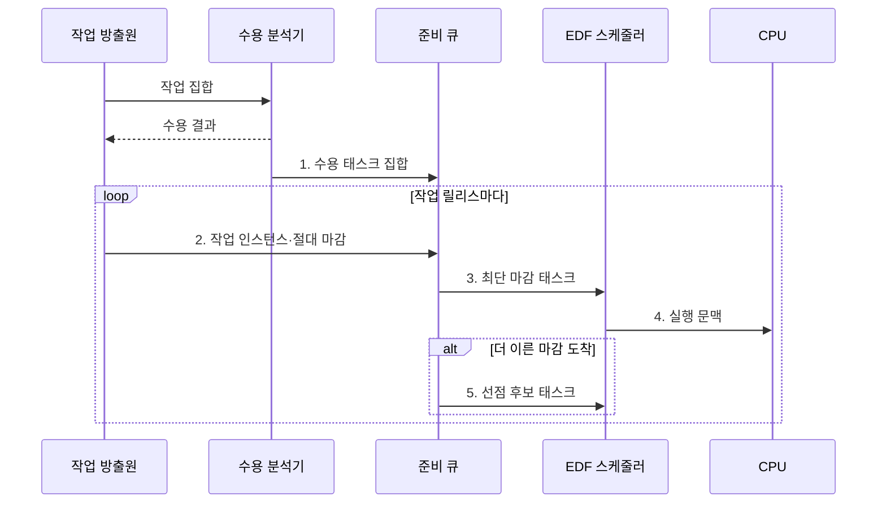

---
sidebar:
  order: 7
  label: "007. 실시간 스케줄링: Rate Monotonic·EDF (Real-Time Scheduling)"
  badge:
    text: "기출 · 70%"
    variant: note
title: "실시간 스케줄링: Rate Monotonic·EDF (Real-Time Scheduling)"
date: "2026-08-02T12:00:00+09:00"
tags: [notes-software]
weight: 7
extra:
  question_no: "007"
  source_status: "기출"
  source_history: "137회"
  priority: 70
  priority_note: "137회 기출, 마감시간 보장 알고리즘 중요"
---

## Ⅰ. 개요

핵심 용어

- **실시간 스케줄링(Real-Time Scheduling)**: 작업 우선순위와 선점 순서를 정해 완료 시각을 마감 안으로 통제하는 정책

- 정의/개념: 작업 우선순위를 정해 완료 시각을 마감 안으로 통제하는 **실시간 스케줄링 정책**
- 배경/필요성: 평균 중심 스케줄링으로는 태스크별 **마감시간 준수 보장 불가**

### 쉽게 이해하기 (학습용)

- 각 작업이 약속한 시각을 넘기지 않도록 실행 차례와 선점 순서를 정한다.

## Ⅱ. 특징

핵심 용어

- **최악 실행시간(Worst-case Execution Time, WCET)**: 가장 불리한 조건에서 작업을 완료하는 데 필요한 최대 CPU 시간
- **수용 분석**: 신규 작업을 더해도 모든 작업의 마감을 지킬 수 있는지 미리 검증하는 절차

- **논리 결과·완료 시각**을 함께 정확성으로 판정
- **최악 실행시간 기반 분석**으로 데드라인 충족 여부 검증
- **수용 분석**으로 마감 불가능한 신규 작업 사전 거부

### 쉽게 이해하기 (학습용)

- 약속 시각을 넘기면 실패하거나 가치가 낮아지므로 최악의 실행시간까지 계산해 작업을 받는다.

## Ⅲ. 구조 및 구성요소

핵심 용어

- **스케줄 가능성(Schedulability)**: 작업 집합의 모든 마감을 지킬 수 있는 성질
- **$C_i$·$T_i$·$D_i$**: $i$번째 작업의 최악 실행시간·주기·상대 마감시간을 나타내는 모수
- **이용률($U$)**: 각 작업의 실행시간을 주기로 나눈 CPU 수요 비율의 합
- **암시적 마감(Implicit Deadline)**: 상대 마감시간과 주기가 같은 조건

| 구성요소 | 책임 |
|:---|:---|
| 실시간 작업 집합 | **실행시간·주기·마감 제공** |
| 스케줄 가능성 분석기 | **작업 수용 여부 판정** |
| 우선순위 준비 큐 | **RM·EDF 후보 정렬** |
| 선점 스케줄러 | **디스패치·선점 수행** |

단일 CPU의 독립·선점 가능 주기 태스크에서 $D_i=T_i$인 경우의 이용률:

$$
U=\sum_{i=1}^{n}\frac{C_i}{T_i}
$$

- **RM 충분조건**: $U\le n(2^{1/n}-1)$
- **EDF 이용률 조건**: $U\le1$
- **RM 경계 초과**: 최악 응답시간 분석으로 추가 판정
- **분석 모델 확장**: 차단·전환·인터럽트 비용과 다중 CPU 반영

### 쉽게 이해하기 (학습용)

- 작업을 받기 전에 최악 시간표를 확인하고, 실행 중 더 가까운 마감이 오면 먼저 처리한 뒤 중단한 일을 이어간다.

## Ⅳ. 흐름도

핵심 용어

- **작업 릴리스(Job Release)**: 주기나 외부 사건에 따라 새 작업 인스턴스가 실행 가능해지는 시점
- **절대 마감시간(Absolute Deadline)**: 개별 작업 인스턴스가 완료돼야 하는 실제 시각
- **최단 마감시간 우선(Earliest Deadline First, EDF)**: 절대 마감시간이 가장 이른 작업을 먼저 선택하는 방식

**동작 원리**

1. **수용 태스크 집합**: 이용률·응답시간 분석을 통과한 작업만 등록
2. **작업 인스턴스·절대 마감**: 릴리스 시각에 실행 후보와 완료 기한 생성
3. **최단 마감 태스크**: 절대 마감시간이 가장 이른 후보 선택
4. **실행 문맥**: 선택 태스크의 상태 복원과 CPU 제어권 이전
5. **선점 후보 태스크**: 현재 작업보다 마감이 이르면 우선순위 변경

### 쉽게 이해하기 (학습용)

- 작업을 받기 전에 시간표를 확인하고 가까운 마감을 먼저 처리한다.

## Ⅴ. 종류 및 비교

핵심 용어

- **주기 단조 스케줄링(Rate Monotonic, RM)**: 주기가 짧은 작업에 높은 고정 우선순위를 부여하는 방식
- **최단 마감시간 우선(Earliest Deadline First, EDF)**: 절대 마감시간이 가장 이른 작업에 동적 우선순위를 부여하는 방식
- **과부하(Overload)**: 작업의 CPU 수요가 처리 가능량을 넘어 마감 위반이 연쇄될 수 있는 상태

| 실시간 스케줄링 알고리즘 | RM | EDF |
|:---|:---|:---|
| 적용 기준 | 고정 주기·**정적 우선순위 검증** | 가변 마감·**높은 CPU 이용률** |
| 핵심 특징 | 짧은 주기의 **고정 우선순위** | 이른 절대 마감의 **동적 우선순위** |
| 한계 | 보수적 이용률·**낮은 순위 위반** | 과부하 시 **마감 위반 연쇄** |

> 요약: 고정 주기·우선순위는 **RM**, 가변 절대 마감은 **EDF** 선택

### 쉽게 이해하기 (학습용)

- RM은 반복 주기가 짧은 작업을 고정 우선하고, EDF는 매 순간 마감이 가장 가까운 작업을 우선한다.

## Ⅵ. 실무 고려사항 및 대책

핵심 용어

- **마감 미스(Deadline Miss)**: 작업이 정해진 마감시간까지 완료되지 못한 상태
- **수용 제어(Admission Control)**: 신규 작업을 받아도 기존 마감을 지킬 수 있는지 검사해 수용을 결정하는 절차
- **우선순위 상속·천장(Priority Inheritance·Ceiling)**: 낮은 우선순위 작업의 잠금이 높은 우선순위 작업을 오래 막는 현상을 제한하는 규칙
- **중요도(Criticality)**: 마감 실패가 시스템에 미치는 위험의 크기에 따른 작업 등급

| 고려사항 | 대책 | 효과 |
|:---|:---|:---|
| 평균 실행시간만 사용해 **최악 조건 누락** | 측정·정적 분석으로 **최악 실행시간·간섭** 산정 | **마감 보장 근거** 확보 |
| EDF 과부하로 **마감 미스 연쇄** | **수용 제어·중요도별 폐기**와 과부하 모드 적용 | 핵심 작업의 **마감시간 보호** |
| 공유 자원 차단으로 **우선순위 역전** | 최악 차단시간과 **우선순위 상속·천장** 적용 | **최악 응답시간 상한** 유지 |
| 잦은 선점으로 **전환·인터럽트 비용 누락** | 비용을 **최악 실행시간 예산**에 반영 | 분석값과 **실제 완료시간** 오차 축소 |

### 쉽게 이해하기 (학습용)

- 제어 작업은 반복 주기가 짧을수록 높은 고정 우선순위를 받는다.

## Ⅶ. 결론

핵심 용어

- **고정 주기·절대 마감**: RM과 EDF 중 우선순위 정책을 선택하는 기준

- 주기와 마감이 고정이면 **RM**, 절대 마감 순서가 바뀌면 **EDF** 선택

### 쉽게 이해하기 (학습용)

- 반복 간격이 고정이면 RM을, 마감 순서가 계속 바뀌면 EDF를 선택한다.
