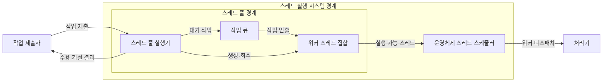
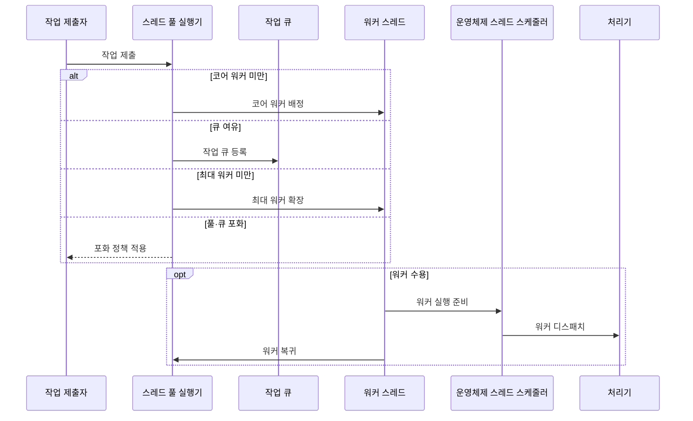

---
sidebar:
  order: 8
  label: "008. 스레드 스케줄링·스레드 풀 (Thread Scheduling·Thread Pool)"
  badge:
    text: "미출제 · 50%"
    variant: note
title: 스레드 스케줄링·스레드 풀 (Thread Scheduling·Thread Pool)
date: "2026-07-25T01:49:00+09:00"
tags: [notes-software]
weight: 8
extra:
  question_no: "008"
  source_status: "미출제"
  source_history: ""
  priority: 50
  priority_note: "스레드 풀은 생성 비용·대기열 절충 설계"
---

## 미리 알고가기

- **스레드 스케줄링(Thread Scheduling)**: 실행 가능 스레드를 처리기에 배정
- **스레드 풀(Thread Pool)**: 한정된 워커를 재사용하는 실행 구조
- **작업 큐(Work Queue)**: 워커가 인출할 대기 작업 저장소
- **워커 스레드(Worker Thread)**: 작업을 실행하고 풀로 복귀하는 실행 단위
- **스레드 풀 실행기(Thread Pool Executor)**: 워커 수·큐 수용·생명주기 통제
- **코어·최대 워커 수**: 기본 워커 수·증설 가능한 상한
- **포화 정책(Saturation Policy)**: 풀·큐 포화 시 거절·대기·호출자 실행
- **역압력(Backpressure)**: 처리 한계를 제출자에게 전달하는 제어
- **응용 프로그래밍 인터페이스(Application Programming Interface, API, 에이피아이)**: 영문 각 단어의 첫 글자를 따 API로 표기하며 프로그램 간 요청을 받는 접점
- **운영체제(Operating System, OS, 오에스)**: 영문 각 단어의 첫 글자를 따 OS로 표기하며 실행 가능 워커를 처리기에 디스패치하는 소프트웨어
- **중앙처리장치(Central Processing Unit, CPU, 시피유) 코어**: 영문 각 단어의 첫 글자를 따 CPU로 표기하며 운영체제가 워커를 배정해 명령을 실행하는 처리기
- **경합(Contention)**: 워커 수가 늘어 여러 스레드가 같은 CPU·메모리·잠금을 동시에 요구하면서 대기와 조정 비용이 커지는 현상
- **생명주기(Lifecycle)**: 워커의 생성·유휴·작업 실행·회수·종료 상태를 스레드 풀 실행기가 관리하는 과정
- **코어·최대 워커(Core·Maximum Worker)**: 코어 워커는 기본 유지하는 스레드 수이고 최대 워커는 큐 포화 시 늘릴 수 있는 전체 스레드 상한
- **호출자 실행 정책(Caller-runs Policy)**: 풀과 큐가 포화되면 작업을 제출한 스레드가 직접 실행해 제출 속도에 역압력을 거는 포화 정책
- **데이터베이스 연결 풀(Database Connection Pool)**: 재사용 가능한 데이터베이스 연결을 한정된 수로 보관해 워커가 연결을 기다리며 무한히 늘어나는 것을 막는 구조
- **과부하(Overload)**: 들어오는 작업량이 워커와 큐의 처리 한계를 넘어 지연·거절·자원 고갈이 발생하는 상태

## Ⅰ. 개요

- 정의/개념: 유한 워커에 작업을 배정하는 구조
- **배경/필요성**: 스레드 생성 비용이 커 워커·큐 제한 필요

### 쉽게 이해하기 (학습용)

- 정해진 작업자들이 대기 줄에서 일을 가져가고 끝나면 다시 다음 일을 기다린다.

## Ⅱ. 특징

- 워커 재사용은 스레드 생성·종료 비용을 줄인다
- 큰 풀은 큐 지연을 줄이고 자원 경합을 높인다
- 유한 풀·큐는 실행·대기 작업 수를 제한한다
- 포화 정책은 역압력으로 자원 고갈을 막는다

### 쉽게 이해하기 (학습용)

- 작업자가 적으면 줄이 길어지고 너무 많으면 서로 자원을 다투므로 처리량에 맞는 수를 정한다.

## Ⅲ. 아키텍처 및 구성요소

| 설계 요소 | 설명 |
|:---|:---|
| 스레드 풀 실행기 | 워커 상한·큐 수용·포화 정책 적용 |
| 작업 큐 | 수용한 대기 작업을 순서대로 보관 |
| 워커 스레드 집합 | 큐 작업을 실행하는 재사용 스레드 |
| 운영체제 스레드 스케줄러 | 실행 가능 워커에 처리기 시간 배정 |

> 요약: 풀 실행기가 작업을 제한하고 운영체제가 워커 실행

### 쉽게 이해하기 (학습용)

- 실행기는 대기 줄과 작업자 수를 제한하고 운영체제는 일할 작업자에게 처리 시간을 나눠 준다.

## Ⅳ. 원리 및 절차 흐름도

| 절차 | 설명 |
|:---|:---|
| 작업 제출 | 실행 작업을 풀에 전달 |
| 코어 워커 배정 | 코어 수 미만이면 새 워커로 실행 |
| 작업 큐 등록 | 코어 수 이상이면 큐 여유부터 사용 |
| 최대 워커 확장 | 큐 포화·최대 수 미만이면 워커 추가 |
| 포화 정책 적용 | 풀·큐 포화 시 거절·대기·호출자 실행 |
| 워커 실행 준비 | 큐 작업 인출 후 실행 가능 상태 전환 |
| 워커 디스패치 | 운영체제가 워커에 처리기 시간 배정 |
| 워커 복귀 | 완료한 워커가 다음 작업을 대기 |

> 요약: 코어 워커·큐·최대 워커 순으로 수용

### 쉽게 이해하기 (학습용)

- 기본 작업자를 먼저 쓰고 줄까지 차면 작업자를 한도까지 늘리며 그마저 차면 포화 규칙을 적용한다.

## Ⅴ. 종류 및 비교

| 판단 기준 | 스레드 풀 | 요청별 스레드 생성 |
|:---|:---|:---|
| 핵심 특징 | 유한 워커·큐 재사용 | 요청마다 스레드 생성·종료 |
| 적용 기준 | 반복 작업·자원 상한 통제 | 적은 요청·생성 비용 허용 |
| 주요 위험 | 큐 지연·풀 고갈 | 스레드·메모리 고갈 |

> 요약: 스레드 풀은 워커·대기 작업 상한을 명시

### 쉽게 이해하기 (학습용)

- 스레드 풀은 정한 작업자와 줄만 쓰지만 요청별 생성은 손님마다 새 작업자를 만든다.

## Ⅵ. 실무 사례

1. API 서버는 유한 큐·거절 정책으로 과부하 제한
2. 데이터베이스 배치는 연결 풀 이하로 워커 수 제한

### 쉽게 이해하기 (학습용)

- 서버는 대기 줄까지 차면 새 요청을 거절해 실행 중인 요청의 자원을 보존한다.
- 데이터베이스 연결보다 작업자를 늘리지 않아 연결을 기다리는 스레드가 쌓이지 않게 한다.

## Ⅶ. 결론

- 입출력 대기·자원 상한으로 워커·큐·포화 정책 결정

### 쉽게 이해하기 (학습용)

- 작업이 기다리는 시간과 사용할 수 있는 연결·메모리를 보고 작업자 수와 대기 줄을 정한다.
