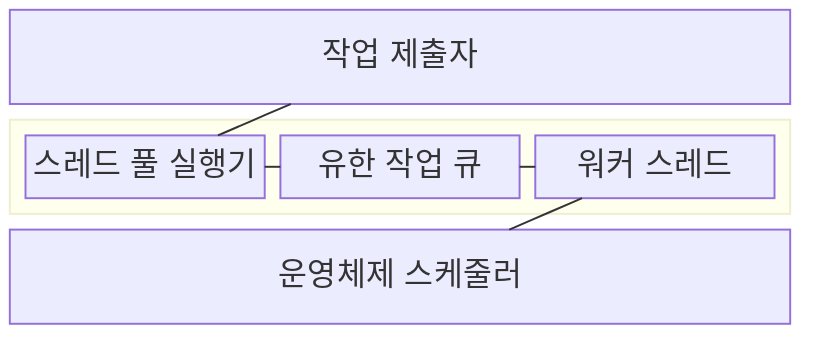
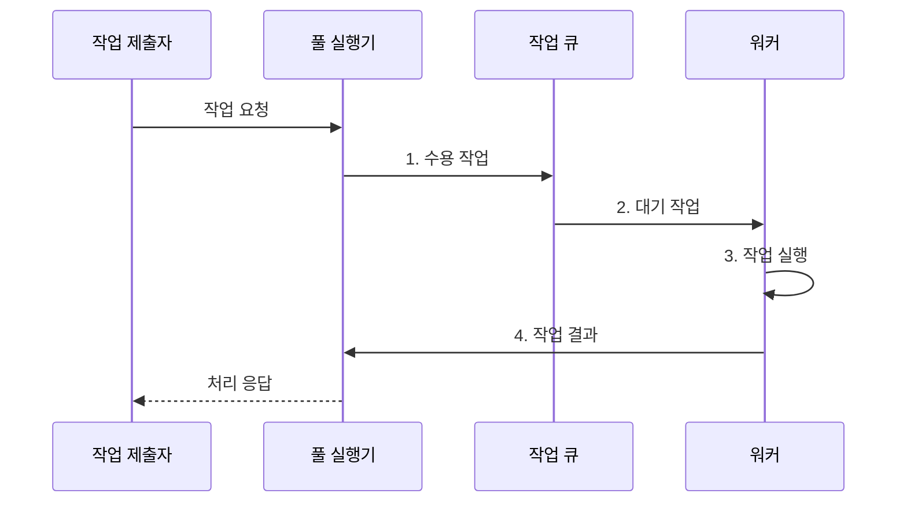

---
sidebar:
  order: 8
  label: "008. 스레드 스케줄링·스레드 풀 (Thread Scheduling·Thread Pool)"
  badge:
    text: "미출 · 50%"
    variant: note
title: 스레드 스케줄링·스레드 풀 (Thread Scheduling·Thread Pool)
date: "2026-08-02T22:08:00+09:00"
tags: [notes-software]
weight: 8
extra:
  question_no: "008"
  source_status: "미출"
  source_history: ""
  priority: 50
  priority_note: "스레드 풀은 생성 비용·대기열 절충 설계"
---

## Ⅰ. 개요

핵심 용어

- **스레드 풀(Thread Pool)**: 한정된 워커와 작업 큐를 재사용해 동시 작업 수를 제한하는 실행 구조
- **스레드 스케줄링(Thread Scheduling)**: 실행 가능한 스레드 중 다음 대상을 골라 CPU에 배정하는 운영체제 처리

- 정의/개념: 유한한 워커 스레드가 작업 큐에서 일을 가져와 반복 실행하고, 운영체제가 각 워커를 CPU에 배정하는 **동시성 실행 구조**
- 배경/필요성: 요청마다 스레드를 만들면 생성·전환·스택 **메모리 비용 급증**

#### 한줄 요약

- 정해진 작업자들이 대기 줄에서 일을 가져가고 끝나면 다시 다음 일을 기다린다.

## Ⅱ. 특징

핵심 용어

- **포화 정책(Saturation Policy)**: 풀과 큐가 모두 찼을 때 작업 거절·대기·호출자 실행 중 하나를 정하는 규칙
- **역압력(Backpressure)**: 처리 한계를 작업 제출자에게 전달해 유입 속도를 낮추는 제어

- **워커 재사용**으로 생성·종료 비용 감소
- **유한 풀·큐**로 실행·대기 작업 제한
- **포화 정책·역압력**으로 자원 고갈 방지

#### 한줄 요약

- 작업자가 적으면 줄이 길어지고 너무 많으면 서로 자원을 다투므로 처리량에 맞는 수를 정한다.

## Ⅲ. 구조 및 구성요소

핵심 용어

- **스레드 풀 실행기(Thread Pool Executor)**: 워커 수와 큐 수용량, 워커 생명주기를 통제하는 구성요소
- **작업 큐(Work Queue)**: 워커가 인출할 대기 작업을 제한된 수로 보관하는 저장소
- **워커 스레드(Worker Thread)**: 작업을 실행하고 완료 뒤 풀로 복귀하는 실행 단위

| 구성요소 | 책임 |
|:---|:---|
| 작업 제출자 | **작업·취소 정보 제출** |
| 스레드 풀 실행기 | **수용·포화 정책 적용** |
| 유한 작업 큐 | **대기 작업 제한 보관** |
| 워커 스레드 | **작업 실행·재사용** |
| 운영체제 스케줄러 | **CPU 시간 배정** |

#### 한줄 요약

- 빈 작업자, 대기 줄, 추가 작업자 순으로 수용하고 모두 차면 제출자에게 과부하를 즉시 돌려보낸다.

## Ⅳ. 흐름도

핵심 용어

- **디스패치(Dispatch)**: 선택된 실행 가능 워커에 CPU 시간을 배정해 실행을 시작하는 동작
- **취소 상태**: 상위 요청이 취소되거나 시간 제한을 넘었는지를 나타내는 작업 수용 조건

**동작 원리**

1. **수용 작업**: 워커·큐 상태와 취소 여부로 수용·포화 정책 적용
2. **대기 작업**: 유휴 워커가 큐 선두 작업을 인출
3. **작업 실행**: 디스패치된 워커가 작업 코드를 실행
4. **작업 결과**: 완료·오류 상태를 반환하고 워커를 풀에 복귀

#### 한줄 요약

- 빈 작업자와 대기 줄이 모두 차면 제출 속도를 줄인다.

## Ⅴ. 종류 및 비교

핵심 용어

- **요청별 스레드 생성**: 요청이 올 때마다 새 스레드를 만들고 완료 뒤 종료하는 워커 관리 방식
- **풀 고갈**: 모든 워커가 장시간 작업에 묶여 새 작업을 실행하지 못하는 상태

| 워커 관리 방식 | 스레드 풀 | 요청별 스레드 생성 |
|:---|:---|:---|
| 적용 기준 | 반복 작업과 **자원 상한 통제** | 요청이 적고 **생성 비용 허용** |
| 핵심 특징 | 유한 **워커·큐 재사용** | 요청마다 **스레드 생성·종료** |
| 한계 | 긴 작업으로 **큐 지연·풀 고갈** | 요청 폭주 시 **스레드·메모리 고갈** |

> 요약: 반복 작업과 자원 상한이 있으면 **스레드 풀** 선택

#### 한줄 요약

- 스레드 풀은 정해진 작업자를 재사용하지만 요청별 생성은 요청마다 새 작업자를 만든다.

## Ⅵ. 실무 고려사항 및 대책

핵심 용어

- **호출자 실행 정책(Caller-runs Policy)**: 풀과 큐가 포화되면 제출 스레드가 작업을 직접 실행해 역압력을 거는 정책
- **데이터베이스 연결 풀(Database Connection Pool)**: 재사용 가능한 데이터베이스 연결을 한정된 수로 보관하는 구조
- **경합(Contention)**: 여러 스레드가 같은 CPU·메모리·잠금을 요구해 대기와 조정 비용이 커지는 현상
- **취소 전파(Cancellation Propagation)**: 상위 요청의 취소나 시간 초과를 하위 작업에도 전달해 실행을 중단하는 방식

| 문제 | 대책 | 효과 |
|:---|:---|:---|
| 무한 큐가 과부하를 지연·**메모리 폭증**으로 은폐 | 유한 큐와 **호출자 실행 정책** 적용 | 제출자에 명시적 **역압력 전달** |
| 워커가 하위 연결을 기다려 **스레드 풀 고갈** | **연결 풀·워커 수** 공동 산정과 대기시간 계측 | 하위 자원의 **연쇄 포화** 방지 |
| CPU 중심 작업에 워커가 많아 **경합 증가** | 코어 수·처리량 기반 **워커 상한 설정** | **문맥 전환 비용** 감소 |
| 느린 작업이 단일 큐를 막아 **짧은 작업 지연** | 작업 등급별 풀·큐 분리와 **취소 전파** | 작업 등급 간 **지연 격리** |

#### 한줄 요약

- 서버는 대기 줄까지 차면 새 요청을 거절해 실행 중인 요청의 자원을 보존한다.

## Ⅶ. 결론

핵심 용어

- **워커 상한·큐 상한**: 동시 실행 수와 대기 작업 수를 제한해 하위 자원 고갈과 지연을 통제하는 값

- 하위 연결 수로 **워커 상한**, 허용 대기시간으로 **큐 상한** 설정

#### 한줄 요약

- 작업이 기다리는 시간과 사용할 수 있는 연결·메모리를 보고 작업자 수와 대기 줄을 정한다.
