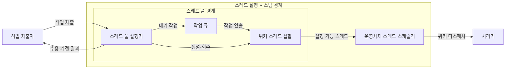
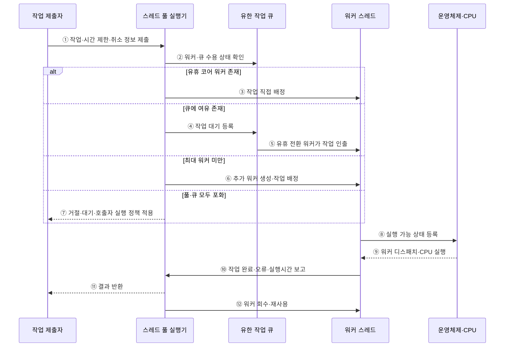

---
sidebar:
  order: 8
  label: "008. 스레드 스케줄링·스레드 풀 (Thread Scheduling·Thread Pool)"
  badge:
    text: "미출 · 50%"
    variant: note
title: 스레드 스케줄링·스레드 풀 (Thread Scheduling·Thread Pool)
date: "2026-07-25T01:49:00+09:00"
tags: [notes-software]
weight: 8
extra:
  question_no: "008"
  source_status: "미출"
  source_history: ""
  priority: 50
  priority_note: "스레드 풀은 생성 비용·대기열 절충 설계"
---

## 미리 알고가기

- **스레드 스케줄링(Thread Scheduling)**: 실행 가능 스레드를 처리기에 배정
- **스레드 풀(Thread Pool)**: 한정된 워커를 재사용하는 실행 구조
- **작업 큐(Work Queue)**: 워커가 인출할 대기 작업 저장소
- **워커 스레드(Worker Thread)**: 작업을 실행하고 풀로 복귀하는 실행 단위
- **스레드 풀 실행기(Thread Pool Executor)**: 워커 수·큐 수용·생명주기 통제
- **포화 정책(Saturation Policy)**: 풀·큐 포화 시 거절·대기·호출자 실행
- **역압력(Backpressure)**: 처리 한계를 제출자에게 전달하는 제어
- **응용 프로그래밍 인터페이스(Application Programming Interface, API)**: 프로그램 간 요청과 응답을 교환하는 접점
- **운영체제(Operating System, OS)**: 실행 가능한 워커를 처리기에 디스패치하는 시스템 소프트웨어
- **중앙처리장치(Central Processing Unit, CPU) 코어**: 운영체제가 워커를 배정해 명령을 실행하는 처리기
- **경합(Contention)**: 워커 수가 늘어 여러 스레드가 같은 CPU·메모리·잠금을 동시에 요구하면서 대기와 조정 비용이 커지는 현상
- **생명주기(Lifecycle)**: 워커의 생성·유휴·작업 실행·회수·종료 상태를 스레드 풀 실행기가 관리하는 과정
- **코어·최대 워커(Core·Maximum Worker)**: 코어 워커는 기본 유지하는 스레드 수이고 최대 워커는 큐 포화 시 늘릴 수 있는 전체 스레드 상한
- **호출자 실행 정책(Caller-runs Policy)**: 풀과 큐가 포화되면 작업을 제출한 스레드가 직접 실행해 제출 속도에 역압력을 거는 포화 정책
- **데이터베이스 연결 풀(Database Connection Pool)**: 재사용 가능한 데이터베이스 연결을 한정된 수로 보관해 워커가 연결을 기다리며 무한히 늘어나는 것을 막는 구조
- **과부하(Overload)**: 들어오는 작업량이 워커와 큐의 처리 한계를 넘어 지연·거절·자원 고갈이 발생하는 상태
- **입출력(Input/Output, I/O) 대기 비율**: 워커의 전체 처리시간 중 파일·네트워크·데이터베이스 응답을 기다리는 시간의 비율
- **취소 전파(Cancellation Propagation)**: 상위 요청의 취소나 시간 초과를 하위 작업에도 전달해 불필요한 실행을 중단하는 방식
- **문맥(Context)**: 운영체제가 스레드 실행을 멈췄다가 재개할 때 보존하는 레지스터·실행 위치 등의 상태
- **디스패치(Dispatch)**: 선택한 실행 가능 스레드에 CPU 시간을 배정해 실행을 시작하는 동작

## Ⅰ. 개요

- 정의/개념: 유한 워커에 작업을 배정하는 구조
- **배경/필요성**: 스레드 생성 비용이 커 워커·큐 제한 필요

### 쉽게 이해하기 (학습용)

- 정해진 작업자들이 대기 줄에서 일을 가져가고 끝나면 다시 다음 일을 기다린다.

## Ⅱ. 특징

- 워커 재사용은 스레드 생성·종료 비용을 줄인다
- 큰 풀은 큐 지연을 줄이고 자원 경합을 높인다
- 유한 풀·큐는 실행·대기 작업 수를 제한한다
- 포화 정책은 역압력으로 자원 고갈을 막는다

### 쉽게 이해하기 (학습용)

- 작업자가 적으면 줄이 길어지고 너무 많으면 서로 자원을 다투므로 처리량에 맞는 수를 정한다.

## Ⅲ. 아키텍처

**도표안 A — 구조도**

**도표안 B — sequenceDiagram**

| 설계 요소 | 입력·상태 | 역할 |
|:---|:---|:---|
| 스레드 풀 실행기 | 제출 작업·워커·큐 상태 | 수용·증설·포화 정책 적용 |
| 작업 큐 | 대기 작업·수용 한도 | 실행 전 작업을 제한적으로 보관 |
| 워커 스레드 집합 | 인출 작업·자원 상태 | 작업 실행 후 재사용 |
| 운영체제 스케줄러 | 실행 가능 워커·CPU 상태 | 워커에 처리기 시간 배정 |

**동작 원리**

- ① 작업과 시간 제한·취소 정보 제출
- ② 코어·최대 워커 수와 큐 여유 확인
- ③ 유휴 코어 워커에 작업 직접 배정
- ④ 코어 워커가 모두 사용 중이면 유한 큐에 등록
- ⑤ 작업을 마친 워커가 큐의 다음 작업 인출
- ⑥ 큐가 찼고 최대 워커 미만이면 워커 증설
- ⑦ 풀과 큐가 모두 차면 포화 정책 적용
- ⑧ 작업을 가진 워커를 실행 가능 상태로 등록
- ⑨ 운영체제가 워커를 디스패치해 CPU에서 실행
- ⑩ 완료·오류·실행시간을 실행기에 보고
- ⑪ 실행 결과를 제출자에게 반환
- ⑫ 완료한 워커를 회수해 다음 작업에 재사용

### 쉽게 이해하기 (학습용)

- 빈 작업자, 대기 줄, 추가 작업자 순으로 수용하고 모두 차면 제출자에게 과부하를 즉시 돌려보낸다.

## Ⅳ. 종류 및 비교

| 판단 기준 | 스레드 풀 | 요청별 스레드 생성 |
|:---|:---|:---|
| 핵심 특징 | 유한 워커·큐 재사용 | 요청마다 스레드 생성·종료 |
| 적용 기준 | 반복 작업·자원 상한 통제 | 적은 요청·생성 비용 허용 |
| 주요 위험 | 큐 지연·풀 고갈 | 스레드·메모리 고갈 |

> 요약: 스레드 풀은 워커·대기 작업 상한을 명시

### 쉽게 이해하기 (학습용)

- 스레드 풀은 정해진 작업자를 재사용하지만 요청별 생성은 요청마다 새 작업자를 만든다.

## Ⅴ. 실무 고려사항 및 대책

| 운영 위험 | 대응 | 기대 효과 |
|:---|:---|:---|
| 무한 큐가 과부하를 지연·메모리 폭증으로 은폐 | 유한 큐·제출 시간 제한과 거절·호출자 실행 정책 | 명시적 역압력 확보 |
| 워커가 하위 자원 연결을 기다려 풀 고갈 | 연결 수와 워커 수 공동 산정·대기시간 계측 | 연쇄 포화 방지 |
| CPU 작업에 과도한 워커로 경합 증가 | 코어·실측 처리량 기반 풀 상한 설정 | 전환 비용·처리량 최적화 |
| 느린 작업이 단일 큐를 막아 짧은 작업 지연 | 작업 등급별 풀·큐 분리와 시간 제한·취소 | 장애·지연 격리 |

### 적용 사례

- API 서버는 워커·데이터베이스 연결 수를 함께 제한하고 유한 큐·제출 시간 제한·거절 정책으로 연쇄 포화를 막는다.

### 쉽게 이해하기 (학습용)

- 서버는 대기 줄까지 차면 새 요청을 거절해 실행 중인 요청의 자원을 보존한다.

## Ⅵ. 결론

- 반복 작업의 처리량과 과부하 복원력을 확보하기 위해 **CPU·I/O 대기 비율·하위 연결 수·워커·큐 상한·포화 정책·취소 전파**를 검토하고, 유한 스레드 풀에 명시적 역압력을 적용한다.

### 쉽게 이해하기 (학습용)

- 작업이 기다리는 시간과 사용할 수 있는 연결·메모리를 보고 작업자 수와 대기 줄을 정한다.
