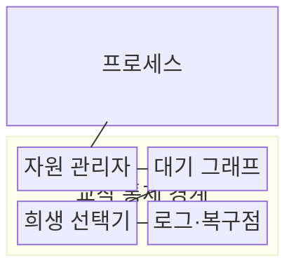
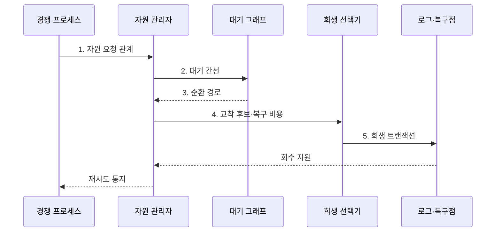

---
sidebar:
  order: 9
  label: "009. 교착상태 조건·예방·회피·탐지·복구 (Deadlock)"
  badge:
    text: "기출 · 85%"
    variant: note
title: 교착상태 조건·예방·회피·탐지·복구 (Deadlock)
date: "2026-07-30T23:23:54+09:00"
tags: [notes-software]
weight: 9
extra:
  question_no: "009"
  source_status: "기출"
  source_history: "131회, 132회, 134회"
  priority: 85
  priority_note: "131·132·134회 반복, 자원 할당 통제 핵심"
---

## 미리 알고가기

- **교착상태(Deadlock)**: 여러 프로세스가 서로 보유한 자원을 기다리는 순환 때문에 모두 진행하지 못하는 동시성 실패 상태
- **자원 인스턴스(Resource Instance)**: 한 프로세스에 할당되는 자원 단위
- **안전 상태(Safe State)**: 모든 프로세스를 끝낼 할당 순서가 존재
- **예방(Prevention)**: 네 필요조건 중 하나가 성립하지 않게 설계
- **회피(Avoidance)**: 요청 후에도 안전 상태일 때만 할당
- **탐지·복구(Detection and Recovery)**: 순환 탐지 후 프로세스 종료·자원 회수
- **대기 그래프(Wait-for Graph)**: 프로세스 간 자원 대기를 방향 간선으로 표현
- **자원 할당 그래프(Resource-allocation Graph)**: 프로세스의 자원 요청과 자원의 프로세스 할당을 방향 간선으로 표현한 그래프
- **롤백(Rollback)**: 프로세스 상태를 이전 복구점으로 되돌림
- **상호 배제(Mutual Exclusion)**: 한 자원 인스턴스를 동시에 한 프로세스만 사용할 수 있어 다른 프로세스가 해제를 기다리는 조건
- **점유와 대기(Hold and Wait)**: 프로세스가 이미 자원을 보유한 채 다른 자원을 추가로 기다리는 조건
- **비선점(No Preemption)**: 자원을 보유한 프로세스가 자발적으로 놓기 전에는 운영체제가 강제로 회수할 수 없는 조건
- **환형 대기(Circular Wait)**: 각 프로세스가 다음 프로세스의 보유 자원을 기다리는 관계가 닫힌 순환을 이루는 조건
- **자원 관리자(Resource Manager)**: 자원 할당·요청·반납 상태를 기록하고 대기 그래프의 순환을 탐지하는 운영체제 구성요소
- **트랜잭션·희생 트랜잭션(Transaction·Victim Transaction)**: 트랜잭션은 데이터베이스 작업의 원자적 단위이고 희생 트랜잭션은 교착 해소를 위해 선택해 롤백하는 작업
- **전역 잠금 획득 순서(Global Lock Ordering)**: 모든 코드가 여러 잠금을 같은 순서로 획득하게 해 환형 대기 조건을 제거하는 예방 규칙
- **기아(Starvation)**: 특정 작업이 자원이나 실행 기회를 계속 얻지 못해 끝없이 기다리는 상태
- **상관 식별자(Correlation Identifier)**: 여러 시스템을 거치는 하나의 요청 흐름을 연결해 추적하는 공통 식별값
- **임대·펜싱 토큰(Lease·Fencing Token)**: 잠금에 유효시간과 증가 번호를 부여해 만료된 소유자의 뒤늦은 쓰기를 차단하는 방식
- **로그·복구점(Log·Recovery Point)**: 작업 변경 이력과 되돌릴 수 있는 이전 상태를 보관하는 복구 자료
- **정적 분석(Static Analysis)**: 프로그램을 실행하지 않고 코드의 잠금 획득 순서와 잠재 순환을 검사하는 기법

## Ⅰ. 개요

- 정의/개념: 서로 보유한 자원을 기다리는 순환으로 모든 프로세스가 멈추는 **동시성 실패 상태**
- 배경/필요성: 잠금 순서 없이 여러 자원을 점유하면 **환형 대기**로 영구 정지

### 쉽게 이해하기 (학습용)

- 두 사람이 상대방 열쇠를 쥔 채 서로 돌려주기만 기다리면 누구도 다음 일을 시작하지 못한다.

## Ⅱ. 특징

- **상호 배제·점유와 대기**로 자원 보유 중 추가 요청 차단
- **비선점·환형 대기**가 결합하면 순환 내 프로세스 진행 정지
- **자원 할당 그래프 순환**으로 교착 후보 탐지

### 쉽게 이해하기 (학습용)

- 자원을 혼자 쓰고 쥔 채 기다리며 빼앗을 수도 없는 상태가 원을 이룰 때 모두 멈춘다.

## Ⅲ. 구조 및 구성요소

| 구성요소 | 책임 |
|:---|:---|
| 프로세스 | **자원 보유·추가 요청** |
| 자원 관리자 | **할당·대기 관계 기록** |
| 대기 그래프 | **환형 대기 탐지** |
| 희생 선택기 | **복구 대상 결정** |
| 로그·복구점 | **미완료 변경 복구** |

### 쉽게 이해하기 (학습용)

- 서로의 열쇠를 기다리는 원을 찾은 뒤 되돌리기 비용이 작은 작업 하나를 복구점으로 돌려 열쇠를 푼다.

## Ⅳ. 흐름도

**동작 원리**

1. **자원 요청 관계**: 프로세스별 보유 자원과 추가 요청 기록
2. **대기 간선**: 자원 보유자를 향하는 프로세스 간 의존성 생성
3. **순환 경로**: 닫힌 대기 의존성을 교착 후보로 판정
4. **교착 후보·복구 비용**: 진행량·롤백 비용·재시도 횟수 비교
5. **희생 트랜잭션**: 선택 작업을 복구점으로 되돌려 순환 자원 해제

### 쉽게 이해하기 (학습용)

- 서로 기다리는 원을 찾고 비용이 작은 작업을 되돌린다.

## Ⅴ. 종류 및 비교

| 교착 대응 방식 | 예방 | 회피 | 탐지·복구 |
|:---|:---|:---|:---|
| 적용 기준 | 획득 순서·**선점 규칙 강제 가능** | 최대 요구량 **사전 파악 가능** | 발생이 드물고 **롤백 가능** |
| 핵심 특징 | 필요조건 **하나 이상 제거** | 안전 상태일 때만 **자원 할당** | 순환 탐지 후 **종료·롤백** |
| 한계 | 자원 이용률 **저하** | 사전 정보·**검사 비용** | 탐지 전 **서비스 정지** |

> 요약: 조건 제거는 **예방**, 안전 상태 검사는 **회피**, 사후 순환 해소는 탐지·복구

### 쉽게 이해하기 (학습용)

- 순서를 강제할 수 있으면 예방하고, 최대 요구량을 알면 회피하며, 되돌릴 수 있으면 발생 후 복구한다.

## Ⅵ. 실무 고려사항 및 대책

| 고려사항 | 대책 | 효과 |
|:---|:---|:---|
| 코드 경로마다 잠금 획득 순서가 달라 **환형 대기 형성** | **전역 잠금 획득 순서**와 정적 분석 적용 | **환형 대기 조건** 제거 |
| 시간 제한만 사용해 교착과 **장기 작업 혼동** | 대기 그래프·잠금 보유자·**자원 요청 경로** 수집 | **교착 순환** 원인 판별 |
| 같은 희생 작업을 반복 선택해 **기아 발생** | 롤백 비용·재시도 횟수를 반영한 **희생 정책** | 작업별 **복구 공정성** 향상 |
| 외부 자원·분산 잠금이 빠져 **대기 관계 누락** | 전 구간 상관 식별자와 **임대·펜싱 토큰** 적용 | 숨은 대기와 **중복 소유** 통제 |

### 쉽게 이해하기 (학습용)

- 데이터베이스는 서로 기다리는 거래 중 하나를 이전 상태로 되돌려 나머지가 진행하게 한다.

## Ⅶ. 결론

- 순서 강제는 **예방**, 최대 요구량 파악은 회피, 롤백 가능은 **탐지·복구** 선택

### 쉽게 이해하기 (학습용)

- 잠금 순서를 강제할 수 있는지, 최대 요청량을 아는지, 되돌리기 비용이 작은지에 따라 대응법을 선택한다.
