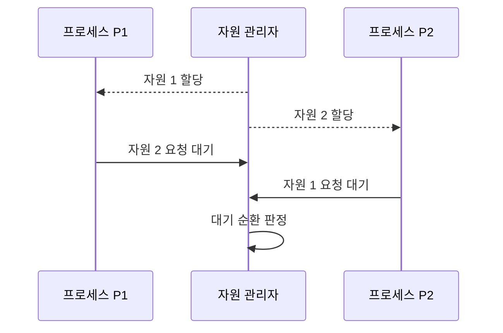

---
sidebar:
  order: 9
  label: "009. 교착상태 조건·예방·회피·탐지·복구 (Deadlock)"
  badge:
    text: "기출 · 85%"
    variant: note
title: 교착상태 조건·예방·회피·탐지·복구 (Deadlock)
date: "2026-07-27T23:59:59+09:00"
tags: [notes-software]
weight: 9
extra:
  question_no: "009"
  source_status: "기출"
  source_history: "131회, 132회, 134회"
  priority: 85
  priority_note: "131·132·134회 반복, 자원 할당 통제 핵심"
---

## 미리 알고가기

- **교착상태(Deadlock)**: 서로 보유한 자원을 기다려 모두 멈춘 상태
- **자원 인스턴스(Resource Instance)**: 한 프로세스에 할당되는 자원 단위
- **안전 상태(Safe State)**: 모든 프로세스를 끝낼 할당 순서가 존재
- **예방(Prevention)**: 네 필요조건 중 하나가 성립하지 않게 설계
- **회피(Avoidance)**: 요청 후에도 안전 상태일 때만 할당
- **탐지·복구(Detection and Recovery)**: 순환 탐지 후 프로세스 종료·자원 회수
- **대기 그래프(Wait-for Graph)**: 프로세스 간 자원 대기를 방향 간선으로 표현
- **롤백(Rollback)**: 프로세스 상태를 이전 복구점으로 되돌림
- **상호 배제(Mutual Exclusion)**: 한 자원 인스턴스를 동시에 한 프로세스만 사용할 수 있어 다른 프로세스가 해제를 기다리는 조건
- **점유와 대기(Hold and Wait)**: 프로세스가 이미 자원을 보유한 채 다른 자원을 추가로 기다리는 조건
- **비선점(No Preemption)**: 자원을 보유한 프로세스가 자발적으로 놓기 전에는 운영체제가 강제로 회수할 수 없는 조건
- **환형 대기(Circular Wait)**: 각 프로세스가 다음 프로세스의 보유 자원을 기다리는 관계가 닫힌 순환을 이루는 조건
- **프로세스 $P1$·$P2$**: 각각 ‘프로세스 피 원·피 투’로 읽고 Process의 머리글자 P와 식별 번호를 붙이는 설명용 관례 표기이며 서로 자원을 점유하고 기다리는 두 실행 주체를 나타낸다.
- **자원 관리자(Resource Manager)**: 자원 할당·요청·반납 상태를 기록하고 대기 그래프의 순환을 탐지하는 운영체제 구성요소
- **트랜잭션·희생 트랜잭션(Transaction·Victim Transaction)**: 트랜잭션은 데이터베이스 작업의 원자적 단위이고 희생 트랜잭션은 교착 해소를 위해 선택해 롤백하는 작업
- **전역 잠금 획득 순서(Global Lock Ordering)**: 모든 코드가 여러 잠금을 같은 순서로 획득하게 해 환형 대기 조건을 제거하는 예방 규칙

## Ⅰ. 개요

- 정의/개념: 프로세스가 상호 보유 자원을 기다려 **진행 불가능한 상태**
- 기존 한계: 무제한 자원 대기는 **순환 대기·서비스 영구 정지** 유발

### 쉽게 이해하기 (학습용)

- 두 사람이 상대방 열쇠를 쥔 채 서로 돌려주기만 기다리면 누구도 다음 일을 시작하지 못한다.

## Ⅱ. 특징

- **상호배제·점유대기·비선점·순환대기** 동시 성립 시 발생
- **자원 할당 그래프 순환**으로 교착 후보 탐지
- 필요조건 제거·안전 상태 검사·**탐지 후 복구**로 통제

### 쉽게 이해하기 (학습용)

- 자원을 혼자 쓰고 쥔 채 기다리며 빼앗을 수도 없는 상태가 원을 이룰 때 모두 멈춘다.

## Ⅲ. 아키텍처 및 구성요소

| 설계 요소 | 설명 |
|:---|:---|
| 상호 배제 | 자원 인스턴스를 한 프로세스만 사용 |
| 점유와 대기 | 자원을 보유한 채 다른 자원을 요청 |
| 비선점 | 보유 프로세스만 자원을 자발적으로 해제 |
| 환형 대기 | 프로세스·자원 요청 관계가 순환 |

> 요약: 네 조건의 동시 성립으로 대기 순환 형성

### 쉽게 이해하기 (학습용)

- 한 사람이 한 열쇠를 독점하고 다른 열쇠를 기다리는 관계가 원으로 이어지면 교착상태가 된다.

## Ⅳ. 원리 및 절차 흐름도

| 절차 | 설명 |
|:---|:---|
| 자원 1 할당 | P1이 자원 1을 배타적으로 보유 |
| 자원 2 할당 | P2가 자원 2를 배타적으로 보유 |
| 자원 2 요청 대기 | P1이 P2 보유 자원을 대기 |
| 자원 1 요청 대기 | P2가 P1 보유 자원을 대기 |
| 대기 순환 판정 | 대기 그래프 순환을 교착으로 판정 |

> 요약: 서로의 보유 자원을 요청해 대기 순환 형성

### 쉽게 이해하기 (학습용)

- 두 프로세스가 서로의 자원을 요청한 채 기다리면 자원 관리자가 대기 관계의 원을 찾아낸다.

## Ⅴ. 종류 및 비교

| 교착상태 대응 | 예방 | 회피 | 탐지·복구 |
|:---|:---|:---|:---|
| 적용 기준 | 획득 순서·**선점 규칙 강제 가능** | 최대 요구량 **사전 파악 가능** | 발생이 드물고 **롤백 가능** |
| 핵심 특징 | 필요조건 **하나 이상 제거** | 안전 상태일 때만 **자원 할당** | 순환 탐지 후 **종료·롤백** |
| 한계 | 자원 이용률 **저하** | 사전 정보·**검사 비용** | 탐지 전 **서비스 정지** |

> 요약: 예방은 조건 제거, 회피는 안전 판정, 탐지는 사후 복구

### 쉽게 이해하기 (학습용)

- 순서를 강제할 수 있으면 예방하고 최대 요구량을 알면 회피하며 되돌릴 수 있으면 발생 후 복구한다.

## Ⅵ. 실무 사례

1. 데이터베이스는 **대기 순환 탐지** 후 희생 트랜잭션 롤백

### 쉽게 이해하기 (학습용)

- 데이터베이스는 서로 기다리는 거래 중 하나를 이전 상태로 되돌려 나머지가 진행하게 한다.

## Ⅶ. 결론

- 교착상태로 인한 서비스 정지를 방지하기 위해 **자원 순서 강제 가능성·최대 요구량·롤백 비용**을 검토하고, 예방·회피·탐지 및 복구 중 적합한 대응을 선택한다

### 쉽게 이해하기 (학습용)

- 잠금 순서를 강제할 수 있는지, 최대 요청량을 아는지, 되돌리기 비용이 작은지에 따라 대응법을 선택한다.
