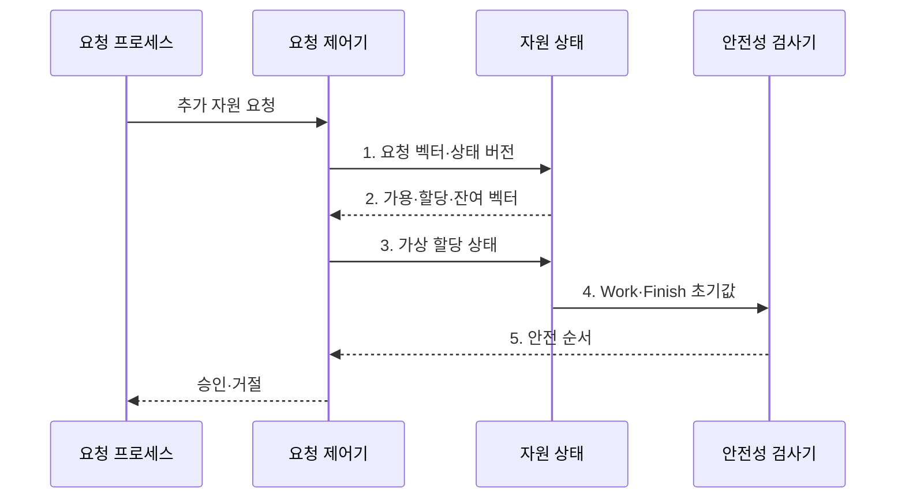

---
sidebar:
  order: 10
  label: "010. 은행원 알고리즘 (Banker's Algorithm)"
  badge:
    text: "미출 · 50%"
    variant: note
title: 은행원 알고리즘 (Banker's Algorithm)
date: "2026-07-30T23:24:39+09:00"
tags: [notes-software]
weight: 10
extra:
  question_no: "010"
  source_status: "미출"
  source_history: ""
  priority: 50
  priority_note: "최대 요구량 기반 교착상태 회피 핵심"
---

## 미리 알고가기

- **은행원 알고리즘(Banker's Algorithm)**: 요청을 가상 할당한 뒤 모든 프로세스를 끝낼 안전 순서가 남을 때만 승인하는 교착 회피 알고리즘
- **가용량·최대 요구량·할당량·잔여 요구량(Available·Max·Allocation·Need)**: 현재 가용 벡터·최대 요구 행렬·현재 할당 행렬·남은 요구 행렬
- **안전 순서(Safe Sequence)**: 모든 프로세스를 끝낼 수 있는 실행 순서
- **요청 벡터(Request Vector)**: 프로세스가 추가로 요구한 자원 수량
- **벡터·행렬(Vector·Matrix)**: 벡터는 자원 종류별 수량의 한 줄 배열이고 행렬은 프로세스별 벡터를 쌓은 표로서 가용량·요구량·할당량을 표현한다.
- **검사 가용량·완료 여부(Work·Finish)**: 안전성 검사 중 가상으로 회수한 자원과 각 프로세스의 완료 가능 여부를 기록하는 변수
- **작거나 같음 기호($\le$)**: 요청량이 잔여 요구량·가용량 이하인지, 잔여 요구량이 검사 가용량 이하인지 비교하는 기호
- **가상 할당(Tentative Allocation)**: 요청을 실제 승인하기 전에 자원 상태에 임시 반영해 안전 순서가 유지되는지 검사하고 불안전하면 복원하는 동작
- **불리언 참·거짓(Boolean True·False)**: 불리언은 두 논릿값만 갖는 자료형이며 Finish의 참은 완료 가능한 프로세스, 거짓은 아직 안전 순서에 넣지 못한 프로세스를 나타낸다.
- **원자성(Atomicity)**: 여러 상태 변경이 전부 성공하거나 전부 취소되어 중간 상태가 드러나지 않는 성질
- **버전 검증(Version Validation)**: 검사 중 자원 상태가 바뀌지 않았는지 상태 번호를 비교해 확인하는 방법
- **오버헤드(Overhead)**: 본래 작업 외에 검사·관리 때문에 추가로 드는 시간과 자원
- **프로세스 인덱스($i$)**: ‘아이’로 읽고 프로세스 번호를 나타내는 관례적 변수이며 각 행의 요청·할당·잔여 요구량을 구분한다.

> **키워드:** 은행원 알고리즘 (Banker's Algorithm)

## Ⅰ. 개요

- 정의/개념: 요청을 가상 할당한 뒤 안전 순서가 남을 때만 승인하는 **교착 회피 알고리즘**
- 배경/필요성: 현재 가용량만 보고 할당하면 미래 요청이 맞물려 **교착상태 진행 가능**

### 쉽게 이해하기 (학습용)

- 모든 고객에게 남은 대출을 해 줘도 차례대로 상환받을 수 있을 때만 새 대출을 승인한다.

## Ⅱ. 특징

- **최대 요구량**으로 안전 상태 판정
- **가상 할당·안전 순서** 확인 후 승인
- **가용량·잔여 요구량** 벡터 비교로 다중 자원 안전성 판정

### 쉽게 이해하기 (학습용)

- 고객마다 앞으로 필요한 최대 금액을 알고 모두 상환할 순서를 찾을 수 있을 때만 돈을 빌려준다.

## Ⅲ. 구조 및 구성요소

| 구성요소 | 책임 |
|:---|:---|
| 요청 프로세스 | **추가 자원량 제출** |
| 요청 제어기 | **한도·가상 할당 통제** |
| 자원 상태 | **가용·할당·잔여량 보관** |
| 안전성 검사기 | **안전 순서 탐색** |

프로세스 $i$의 잔여 요구량과 요청 선행 조건:

$$
\mathrm{Need}_i=\mathrm{Max}_i-\mathrm{Allocation}_i,\qquad
\mathrm{Request}_i\le\mathrm{Need}_i,\quad
\mathrm{Request}_i\le\mathrm{Available}
$$

- **벡터 비교**: 자원 종류별 요청량과 가용량을 각각 비교
- **분석 전제**: 최대 요구량의 사전 선언과 자원 회수 가능성 가정
- **안전 승인 조건**: 가상 할당 뒤 모든 Finish가 참인 순서 존재

### 쉽게 이해하기 (학습용)

- 새 요청을 장부에 임시로 적고, 끝낼 수 있는 고객의 자원을 차례로 회수해 모두 끝나는 순서가 만들어질 때만 확정한다.

## Ⅳ. 흐름도

**동작 원리**

1. **요청 벡터·상태 버전**: 요청량이 잔여 요구량·가용량 이하인지 확인
2. **가용·할당·잔여 벡터**: 상태 버전과 프로세스별 자원 수량 제공
3. **가상 할당 상태**: 요청을 임시 반영하고 실제 상태는 확정 전 보존
4. **Work·Finish 초기값**: 가상 가용량과 미완료 프로세스 집합 설정
5. **안전 순서**: 완료 가능한 프로세스의 자원을 가상 회수해 전수 종료 확인

### 쉽게 이해하기 (학습용)

- 임시 배정 뒤 모두 끝낼 순서가 있을 때만 확정한다.

## Ⅴ. 종류 및 비교

| 자원 할당 상태 | 안전 상태 | 불안전 상태 |
|:---|:---|:---|
| 적용 기준 | 모든 **Finish가 참** | 일부 **Finish가 거짓** |
| 핵심 특징 | **안전 순서**가 하나 이상 존재 | **안전 순서**가 존재하지 않음 |
| 한계 | 요청마다 **반복 검사 비용** | 향후 **교착상태 진행 가능** |

> 요약: 불안전 상태는 교착이 아니지만 **안전 순서 부재**로 **교착 진행 가능**

### 쉽게 이해하기 (학습용)

- 모두 끝낼 순서가 있으면 안전하고, 지금 당장 막히지 않아도 그런 순서가 없으면 불안전하다.

## Ⅵ. 실무 고려사항 및 대책

| 고려사항 | 대책 | 효과 |
|:---|:---|:---|
| 최대 요구량을 과장·변경해 **자원 이용률 저하** | 선언 상한 검증과 **실사용량 피드백** | **보수적 자원 예약** 완화 |
| 동시 요청 중 검사·할당 상태가 바뀌어 **판정 경쟁** | 자원 갱신의 **원자성·버전 검증** | **안전성 판정 일관성** 유지 |
| 프로세스·자원 증가로 **안전성 검사 지연** 확대 | 검사 비용 계측과 **적용 범위 제한** | **제어 오버헤드** 상한 유지 |
| 안전 상태만 우선해 특정 요청이 **장기 대기** | 대기시간·우선순위 기반 **예약 정책** | 안전성과 **진행 공정성** 균형 |

### 쉽게 이해하기 (학습용)

- 작업 관리자는 모든 작업이 끝날 자원 배정 순서를 확인한 뒤 새 작업을 받는다.

## Ⅶ. 결론

- 최대 요구량을 신뢰할 수 있고 검사 지연이 허용되면 **은행원 알고리즘**으로 **요청 승인**

### 쉽게 이해하기 (학습용)

- 최대 사용량을 미리 알 수 있고 검사 시간이 요청 지연 한도 이내인 작업에 적용한다.
