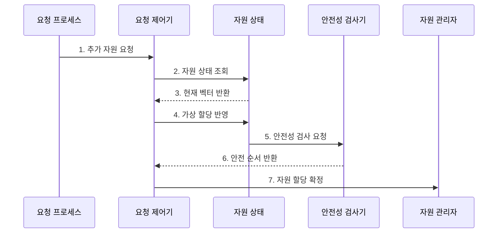

---
sidebar:
  order: 10
  label: "010. 은행원 알고리즘 (Banker's Algorithm)"
  badge:
    text: "미출 · 50%"
    variant: note
title: 은행원 알고리즘 (Banker's Algorithm)
date: "2026-07-25T01:53:00+09:00"
tags: [notes-software]
weight: 10
extra:
  question_no: "010"
  source_status: "미출"
  source_history: ""
  priority: 50
  priority_note: "최대 요구량 기반 교착상태 회피 핵심"
---

## 미리 알고가기

- **은행원 알고리즘(Banker's Algorithm)**: 안전 상태를 유지할 요청만 승인하는 회피 기법
- **가용량·최대 요구량·할당량·잔여 요구량(Available·Max·Allocation·Need)**: 현재 가용 벡터·최대 요구 행렬·현재 할당 행렬·남은 요구 행렬
- **안전 순서(Safe Sequence)**: 모든 프로세스를 끝낼 수 있는 실행 순서
- **요청 벡터(Request Vector)**: 프로세스가 추가로 요구한 자원 수량
- **벡터·행렬(Vector·Matrix)**: 벡터는 자원 종류별 수량의 한 줄 배열이고 행렬은 프로세스별 벡터를 쌓은 표로서 가용량·요구량·할당량을 표현한다.
- **검사 가용량·완료 여부(Work·Finish)**: 안전성 검사 중 가상으로 회수한 자원과 각 프로세스의 완료 가능 여부를 기록하는 변수
- **작거나 같음 기호($\le$)**: 요청량이 잔여 요구량·가용량 이하인지, 잔여 요구량이 검사 가용량 이하인지 비교하는 기호
- **가상 할당(Tentative Allocation)**: 요청을 실제 승인하기 전에 자원 상태에 임시 반영해 안전 순서가 유지되는지 검사하고 불안전하면 복원하는 동작
- **불리언 참·거짓(Boolean True·False)**: 불리언은 두 논릿값만 갖는 자료형이며 Finish의 참은 완료 가능한 프로세스, 거짓은 아직 안전 순서에 넣지 못한 프로세스를 나타낸다.
- **배치 시스템(Batch System)**: 작업별 최대 메모리를 미리 선언받고 여러 작업을 묶어 실행하므로 은행원 알고리즘의 사전 요구량 조건을 충족할 수 있는 시스템
- **임베디드 제어기(Embedded Controller)**: 제한된 장치 자원을 제어하는 전용 컴퓨터로서 작업별 최대 점유량을 바탕으로 요청을 승인할 수 있다.
- **원자성(Atomicity)**: 여러 상태 변경이 전부 성공하거나 전부 취소되어 중간 상태가 드러나지 않는 성질
- **버전 검증(Version Validation)**: 검사 중 자원 상태가 바뀌지 않았는지 상태 번호를 비교해 확인하는 방법
- **오버헤드(Overhead)**: 본래 작업 외에 검사·관리 때문에 추가로 드는 시간과 자원
- **가속기(Accelerator)**: 그래픽 처리장치처럼 특정 계산을 CPU보다 빠르게 수행하는 전용 처리 자원

## Ⅰ. 개요

- 정의/개념: 안전 순서를 보존하는 **교착 회피 기법**
- 배경/필요성: 불안전 할당의 **교착 진행 사전 차단**

### 쉽게 이해하기 (학습용)

- 모든 고객에게 남은 대출을 해 줘도 차례대로 상환받을 수 있을 때만 새 대출을 승인한다.

## Ⅱ. 특징

- **최대 요구량**으로 안전 상태 판정
- **가상 할당·안전 순서** 확인 후 승인
- **보수적 승인·반복 검사**로 이용률·지연 증가

### 쉽게 이해하기 (학습용)

- 고객마다 앞으로 필요한 최대 금액을 알고 모두 상환할 순서를 찾을 수 있을 때만 돈을 빌려준다.

## Ⅲ. 구조 및 구성요소

| 구성요소 | 책임 |
|:---|:---|
| 요청 프로세스 | **추가 자원량 제출** |
| 요청 제어기 | **한도·가상 할당 통제** |
| 자원 상태 | **가용·할당·잔여량 보관** |
| 안전성 검사기 | **안전 순서 탐색** |

프로세스 \(i\)의 잔여 요구량과 요청 선행 조건:

$$
\mathrm{Need}_i=\mathrm{Max}_i-\mathrm{Allocation}_i,\qquad
\mathrm{Request}_i\le\mathrm{Need}_i,\quad
\mathrm{Request}_i\le\mathrm{Available}
$$

- \(i\)는 프로세스 번호이며 모든 비교는 자원 종류별 수량을 각각 비교
- 최대 요구량의 정확한 사전 선언을 가결정
- 자원 인스턴스는 회수 가능하다고 가결정
- 선행 조건을 만족해도 가상 할당 후 모든 `Finish`가 참인 안전 순서가 있어야 승인

### 쉽게 이해하기 (학습용)

- 새 요청을 장부에 임시로 적고, 끝낼 수 있는 고객의 자원을 차례로 회수해 모두 끝나는 순서가 만들어질 때만 확정한다.

## Ⅳ. 흐름도

**동작 원리**

- **1. 추가 자원 요청**: 요청 벡터 제출
- **2. 자원 상태 조회**: 가용·잔여량 확인
- **3. 현재 벡터 반환**: 버전 포함
- **4. 가상 할당 반영**: 요청 임시 적용
- **5. 안전성 검사 요청**: 완료 순서 탐색
- **6. 안전 순서 반환**: 안전 여부 판정
- **7. 자원 할당 확정**: 안전 요청 승인

### 쉽게 이해하기 (학습용)

- 임시 배정 뒤 모두 끝낼 순서가 있을 때만 확정한다.

## Ⅴ. 종류 및 비교

| 구분 | 안전 상태 | 불안전 상태 |
|:---|:---|:---|
| 적용 기준 | 모든 Finish가 참 | 일부 Finish가 거짓 |
| 핵심 특징 | 안전 순서가 하나 이상 존재 | 안전 순서가 존재하지 않음 |
| 한계 | 반복 검사 비용 | 교착상태로 진행 가능 |

> 요약: 불안전 상태는 교착상태가 아니지만 진행 가능성이 존재

### 쉽게 이해하기 (학습용)

- 모두 끝낼 순서가 있으면 안전하고, 지금 당장 막히지 않아도 그런 순서가 없으면 불안전하다.

## Ⅵ. 실무 고려사항 및 대책

| 고려사항 | 대책 | 효과 |
|:---|:---|:---|
| 최대 요구량이 과장·변경돼 자원 이용률 저하 | 선언 검증·상한 갱신 규칙과 실제 사용량 피드백 | 보수성 완화 |
| 동시 요청 중 검사·할당 상태가 경쟁 | 자원 상태 갱신의 원자성·버전 검증 | 안전성 판정 일관성 확보 |
| 프로세스·자원 증가로 요청 지연 확대 | 검사 비용 계측·요청 배치와 적용 범위 제한 | 제어 오버헤드 통제 |
| 안전 상태만 믿고 장기 대기 공정성 누락 | 대기시간·우선순위·예약 정책 병행 | 안전성과 진행 공정성 균형 |

### 쉽게 이해하기 (학습용)

- 배치 시스템은 모든 작업이 끝날 메모리 배정 순서를 확인한 뒤 새 작업을 받는다.

## Ⅶ. 결론

- 최대 요구량과 검사 지연을 반영한 **안전 요청 승인**

### 쉽게 이해하기 (학습용)

- 최대 사용량을 미리 알 수 있고 검사 시간이 요청 지연 한도 이내인 작업에 적용한다.
