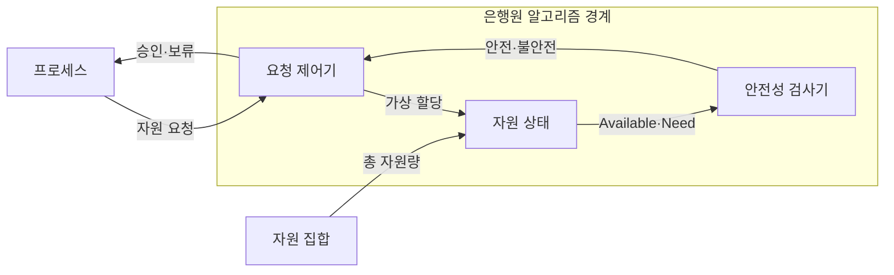
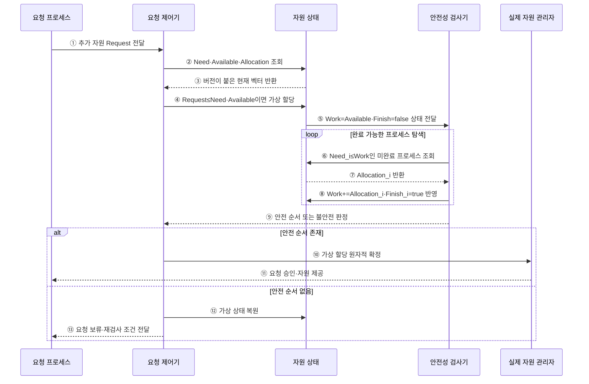

---
sidebar:
  order: 10
  label: "010. 은행원 알고리즘 (Banker's Algorithm)"
  badge:
    text: "미출 · 50%"
    variant: note
title: 은행원 알고리즘 (Banker's Algorithm)
date: "2026-07-25T01:53:00+09:00"
tags: [notes-software]
weight: 10
extra:
  question_no: "010"
  source_status: "미출"
  source_history: ""
  priority: 50
  priority_note: "최대 요구량 기반 교착상태 회피 핵심"
---

## 미리 알고가기

- **은행원 알고리즘(Banker's Algorithm)**: 안전 상태를 유지할 요청만 승인하는 회피 기법
- **가용량·최대 요구량·할당량·잔여 요구량(Available·Max·Allocation·Need)**: 현재 가용 벡터·최대 요구 행렬·현재 할당 행렬·남은 요구 행렬
- **안전 순서(Safe Sequence)**: 모든 프로세스를 끝낼 수 있는 실행 순서
- **요청 벡터(Request Vector)**: 프로세스가 추가로 요구한 자원 수량
- **벡터·행렬(Vector·Matrix)**: 벡터는 자원 종류별 수량의 한 줄 배열이고 행렬은 프로세스별 벡터를 쌓은 표로서 가용량·요구량·할당량을 표현한다.
- **검사 가용량·완료 여부(Work·Finish)**: 안전성 검사 중 가상으로 회수한 자원과 각 프로세스의 완료 가능 여부를 기록하는 변수
- **작거나 같음 기호($\le$)**: 요청량이 잔여 요구량·가용량 이하인지, 잔여 요구량이 검사 가용량 이하인지 비교하는 기호
- **가상 할당(Tentative Allocation)**: 요청을 실제 승인하기 전에 자원 상태에 임시 반영해 안전 순서가 유지되는지 검사하고 불안전하면 복원하는 동작
- **불리언 참·거짓(Boolean True·False)**: 불리언은 두 논릿값만 갖는 자료형이며 Finish의 참은 완료 가능한 프로세스, 거짓은 아직 안전 순서에 넣지 못한 프로세스를 나타낸다.
- **배치 시스템(Batch System)**: 작업별 최대 메모리를 미리 선언받고 여러 작업을 묶어 실행하므로 은행원 알고리즘의 사전 요구량 조건을 충족할 수 있는 시스템
- **임베디드 제어기(Embedded Controller)**: 제한된 장치 자원을 제어하는 전용 컴퓨터로서 작업별 최대 점유량을 바탕으로 요청을 승인할 수 있다.
- **원자성(Atomicity)**: 여러 상태 변경이 전부 성공하거나 전부 취소되어 중간 상태가 드러나지 않는 성질
- **버전 검증(Version Validation)**: 검사 중 자원 상태가 바뀌지 않았는지 상태 번호를 비교해 확인하는 방법
- **오버헤드(Overhead)**: 본래 작업 외에 검사·관리 때문에 추가로 드는 시간과 자원
- **가속기(Accelerator)**: 그래픽 처리장치처럼 특정 계산을 CPU보다 빠르게 수행하는 전용 처리 자원

## Ⅰ. 개요

- 정의/개념: 안전 순서를 보존하는 교착상태 회피 기법
- **배경/필요성**: 불안전 할당이 교착을 낳아 사전 검사 필요

### 쉽게 이해하기 (학습용)

- 모든 고객에게 남은 대출을 해 줘도 차례대로 상환받을 수 있을 때만 새 대출을 승인한다.

## Ⅱ. 특징

- 최대 요구량을 모르면 안전 상태를 판정할 수 없다
- 안전 순서가 있는 가상 할당만 승인한다
- 보수적 승인은 자원 이용률을 낮출 수 있다
- 프로세스·자원 증가는 검사 비용을 높인다

### 쉽게 이해하기 (학습용)

- 고객마다 앞으로 필요한 최대 금액을 알고 모두 상환할 순서를 찾을 수 있을 때만 돈을 빌려준다.

## Ⅲ. 아키텍처

**도표안 A — 구조도**

**도표안 B — sequenceDiagram**

| 설계 요소 | 입력·상태 | 역할 |
|:---|:---|:---|
| 요청 제어기 | 요청 벡터·프로세스 식별자 | 한도 검사·가상 할당·복원 통제 |
| 자원 상태 | 가용·최대·할당·잔여 요구량 | 현재·최대 자원 관계 유지 |
| 안전성 검사기 | 검사 가용량·완료 표식 | 모든 작업을 끝낼 안전 순서 탐색 |

프로세스 \(i\)의 잔여 요구량과 요청 선행 조건은 다음과 같다.

$$
\mathrm{Need}_i=\mathrm{Max}_i-\mathrm{Allocation}_i,\qquad
\mathrm{Request}_i\le\mathrm{Need}_i,\quad
\mathrm{Request}_i\le\mathrm{Available}
$$

- \(i\)는 프로세스 번호이며 모든 비교는 자원 종류별 수량을 각각 비교한다.
- 프로세스가 최대 요구량을 정확히 사전 선언하고 자원 인스턴스를 회수할 수 있다고 가정한다.
- 선행 조건을 만족해도 가상 할당 후 모든 `Finish`가 참인 안전 순서가 있어야 승인한다.

**동작 원리**

- ① 자원 종류별 추가 요청 벡터 제출
- ② 해당 프로세스의 잔여 요구량과 전체 자원 상태 조회
- ③ 동시 변경 검사용 버전과 현재 벡터·행렬 반환
- ④ 요청이 잔여 요구량·가용량 이하이면 가상 할당
- ⑤ 가상 가용량을 Work로 복사하고 모든 Finish를 거짓으로 초기화
- ⑥ Need가 Work 이하인 미완료 프로세스 탐색
- ⑦ 완료 가능 프로세스가 반납할 Allocation 조회
- ⑧ Allocation을 Work에 더하고 Finish를 참으로 변경
- ⑨ 모든 Finish가 참이면 안전, 일부가 거짓이면 불안전 판정
- ⑩ 안전하고 버전이 같으면 가상 할당을 원자적으로 확정
- ⑪ 요청 프로세스에 실제 자원 제공
- ⑫ 불안전하면 가상 상태를 원래 상태로 복원
- ⑬ 요청을 보류하고 자원 반납 후 재검사 조건 전달

### 쉽게 이해하기 (학습용)

- 새 요청을 장부에 임시로 적고, 끝낼 수 있는 고객의 자원을 차례로 회수해 모두 끝나는 순서가 만들어질 때만 확정한다.

## Ⅳ. 종류 및 비교

| 판단 기준 | 안전 상태 | 불안전 상태 |
|:---|:---|:---|
| 핵심 특징 | 안전 순서가 하나 이상 존재 | 안전 순서가 존재하지 않음 |
| 적용 기준 | 모든 Finish가 참 | 일부 Finish가 거짓 |
| 주요 위험 | 반복 검사 비용 | 교착상태로 진행 가능 |

> 요약: 불안전 상태는 교착상태가 아니지만 진행 가능성이 존재

### 쉽게 이해하기 (학습용)

- 모두 끝낼 순서가 있으면 안전하고, 지금 당장 막히지 않아도 그런 순서가 없으면 불안전하다.

## Ⅴ. 실무 고려사항 및 대책

| 운영 위험 | 대응 | 기대 효과 |
|:---|:---|:---|
| 최대 요구량이 과장·변경돼 자원 이용률 저하 | 선언 검증·상한 갱신 규칙과 실제 사용량 피드백 | 보수성 완화 |
| 동시 요청 중 검사·할당 상태가 경쟁 | 자원 상태 갱신의 원자성·버전 검증 | 안전성 판정 일관성 확보 |
| 프로세스·자원 증가로 요청 지연 확대 | 검사 비용 계측·요청 배치와 적용 범위 제한 | 제어 오버헤드 통제 |
| 안전 상태만 믿고 장기 대기 공정성 누락 | 대기시간·우선순위·예약 정책 병행 | 안전성과 진행 공정성 균형 |

### 적용 사례

- 배치 시스템은 작업별 최대 메모리·가속기 수를 선언받고 신규 할당 뒤에도 모든 작업을 끝낼 안전 순서가 있는지 검사한다.

### 쉽게 이해하기 (학습용)

- 배치 시스템은 모든 작업이 끝날 메모리 배정 순서를 확인한 뒤 새 작업을 받는다.

## Ⅵ. 결론

- 교착을 사전에 회피하기 위해 **최대 요구량의 정확성·자원 회수 가능성·동시 상태 원자성·검사 지연·장기 대기 공정성**을 검토하고, 안전 순서가 유지되는 요청만 확정한다.

### 쉽게 이해하기 (학습용)

- 최대 사용량을 미리 알 수 있고 검사 시간이 요청 지연 한도 이내인 작업에 적용한다.
