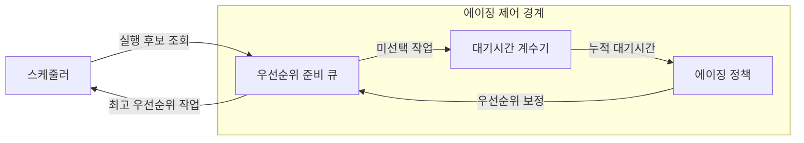
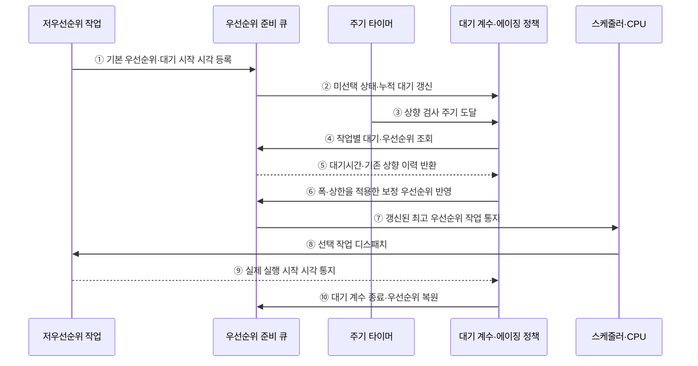

---
sidebar:
  order: 11
  label: "011. 기아·에이징 (Starvation Aging)"
  badge:
    text: "기출 · 50%"
    variant: note
title: 기아·에이징 (Starvation Aging)
date: "2026-07-27T23:59:59+09:00"
tags: [notes-software]
weight: 11
extra:
  question_no: "011"
  source_status: "기출"
  source_history: "138회"
  priority: 50
  priority_note: "138회 기출, 기아·에이징 대응 관계"
---

## 미리 알고가기

- **기아(Starvation)**: 특정 작업이 계속 밀려 실행되지 못하는 상태
- **에이징(Aging)**: 대기시간이 늘수록 작업 우선순위를 높이는 기법
- **우선순위 상향 주기**: 대기시간을 검사해 우선순위를 높이는 간격
- **우선순위 상향 폭**: 한 주기마다 높이는 우선순위 단계
- **우선순위 상한**: 에이징으로 높일 수 있는 최고 우선순위
- **준비 큐(Ready Queue)**: 실행을 기다리는 스케줄러 선택 대상 집합
- **스케줄러(Scheduler)**: 준비 큐에서 보정된 우선순위가 가장 높은 작업을 선택해 CPU에 디스패치하는 운영체제 구성요소
- **대기시간 계수기(Waiting-time Counter)**: 실행되지 않은 작업별 누적 대기시간을 기록해 에이징 정책의 입력으로 제공하는 장치
- **주기 타이머(Periodic Timer)**: 정한 간격마다 에이징 정책에 우선순위 상향 시점을 알리는 시간 장치
- **중앙처리장치(Central Processing Unit, CPU, 시피유)**: 영문 각 단어의 첫 글자를 따 CPU로 표기하며 선택된 작업의 명령을 실행하는 처리 자원
- **운영체제(Operating System, OS, 오에스)**: 영문 각 단어의 첫 글자를 따 OS로 표기하며 준비 큐와 우선순위를 관리하고 에이징을 적용하는 소프트웨어
- **배치 작업 큐(Batch Job Queue)**: 즉시 상호작용 없이 묶어서 실행할 작업을 보관하며 대기시간별 우선순위 상향으로 오래된 작업의 기아를 줄이는 대기열
- **예약 몫(Reserved Share)**: 긴급 작업이 항상 사용할 수 있도록 실행 자원의 일부를 따로 보장한 비율
- **상위 백분위(Upper Percentile)**: 대기시간을 짧은 순서로 정렬했을 때 대부분의 작업이 넘지 않는 상단 경곗값

## Ⅰ. 개요
- 정의/개념: 장기 대기 작업의 우선순위를 높여 **기아를 방지하는 기법**
- 기존 한계: 고정 우선순위는 고순위 작업 지속 도착 시 **저순위 작업 무기한 대기** 유발

### 쉽게 이해하기 (학습용)

- 기다린 시간이 길수록 실행 순서를 앞당긴다.

## Ⅱ. 특징

- **누적 대기시간 기반 상향**으로 장기 대기 작업 실행 보장
- **상향 주기·폭·상한**이 최대 대기시간 결정
- 과도한 상향은 **긴급 작업 우선순위 구분** 약화

### 쉽게 이해하기 (학습용)

- 오래 기다린 작업을 너무 빨리 앞세우면 급한 작업이 뒤로 밀릴 수 있다.

## Ⅲ. 아키텍처

**도표안 A — 구조도**

**도표안 B — sequenceDiagram**

| 설계 요소 | 입력·상태 | 역할 |
|:---|:---|:---|
| 대기시간 계수기 | 미선택 작업·대기 시작 시각 | 누적 대기시간 산출 |
| 에이징 정책 | 주기·폭·상한·기본 우선순위 | 보정 우선순위 계산 |
| 우선순위 준비 큐 | 보정 우선순위·도착 순서 | 실행 후보 정렬 |
| 스케줄러 | 큐 선두·CPU 상태 | 작업 선택·디스패치 |

우선순위 숫자가 클수록 높은 정책의 예시는 다음과 같다.

$$
p_{\mathrm{eff}}=\min\left(p_{\max},\ p_{\mathrm{base}}+
\left\lfloor\frac{W}{\Delta}\right\rfloor\delta\right)
$$

- \(p_{\mathrm{eff}}\)는 보정 우선순위, \(p_{\mathrm{base}}\)는 기본 우선순위, \(p_{\max}\)는 상한이다.
- \(W\)는 누적 대기시간, \(\Delta\)는 상향 검사 주기, \(\delta\)는 주기당 상향 폭이다.
- \(\min\)은 두 값 중 작은 값, \(\lfloor\ \rfloor\)는 소수점 이하를 버린 정수다.
- 재등록·선점 뒤에도 누적 대기를 보존하며 우선순위 숫자가 작을수록 높은 시스템은 계산 방향을 반대로 적용한다.

**동작 원리**

- ① 저우선순위 작업의 기본 우선순위와 대기 시작 시각 등록
- ② 선택되지 않은 작업의 누적 대기시간 갱신
- ③ 정해진 주기마다 에이징 평가 시작
- ④ 준비 작업별 대기시간과 우선순위 조회
- ⑤ 대기시간과 기존 상향 이력 반환
- ⑥ 주기·폭·상한으로 보정 우선순위 반영
- ⑦ 새 최고 우선순위 작업을 스케줄러에 통지
- ⑧ 선택 작업을 CPU에 디스패치
- ⑨ 실제 실행 시작 시각을 에이징 정책에 통지
- ⑩ 대기 계수를 끝내고 정책에 따라 우선순위 복원

### 쉽게 이해하기 (학습용)

- 기다린 시간을 지우지 않고 주기적으로 순위를 올려, 상한 안에서 언젠가는 실행 차례를 얻도록 한다.

## Ⅳ. 종류 및 비교

| 우선순위 정책 | 에이징 적용 | 고정 우선순위 |
|:---|:---|:---|
| 적용 기준 | **최대 대기시간 제한** | 중요도 순서 **고정** |
| 핵심 특징 | 누적 대기시간에 따른 **우선순위 상향** | 초기 **우선순위 유지** |
| 한계 | 긴급 작업의 **우선순위 희석** | 저우선 작업의 **기아** |

> 요약: 에이징은 누적 대기시간, 고정 방식은 초기 우선순위 반영

### 쉽게 이해하기 (학습용)

- 에이징은 기다린 만큼 순위를 올리고, 고정 방식은 처음 정한 순위를 유지한다.

## Ⅴ. 실무 고려사항 및 대책

| 운영 위험 | 대응 | 기대 효과 |
|:---|:---|:---|
| 상향이 느려 최대 대기시간 목표 초과 | 부하별 대기 분포로 주기·폭 산정 | 기아 방지 목표 충족 |
| 상향이 빨라 긴급 작업 우선순위 희석 | 상한·예약 몫과 중요도 등급 분리 | 긴급 작업 보호 |
| 작업이 반복 재등록돼 대기시간 초기화 | 원래 대기 시작 시각·누적 대기 보존 | 우회적 기아 방지 |
| 평균 대기시간만으로 소수 기아 은폐 | 작업별 최대·상위 백분위 대기시간 감시 | 장기 대기 조기 탐지 |

### 적용 사례

- 배치 작업 큐는 원래 제출 시각을 보존하며 장기 대기 작업의 우선순위를 올리고 긴급 작업에는 별도 예약 몫을 둔다.

### 쉽게 이해하기 (학습용)

- 운영체제는 오래 기다린 스레드의 순위를 올려 실행 차례를 준다.

## Ⅵ. 결론

- 저우선순위 작업의 무한 대기를 방지하려면 **최대 대기시간과 우선순위 구분 필요성**을 검토하고 에이징의 상향 주기·폭·상한을 설정한다.

### 쉽게 이해하기 (학습용)

- 오래 기다린 일도 살리되 급한 일이 밀리지 않게 올리는 속도를 정한다.
