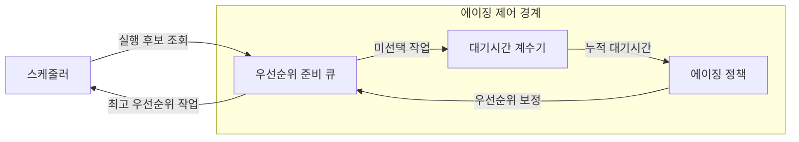
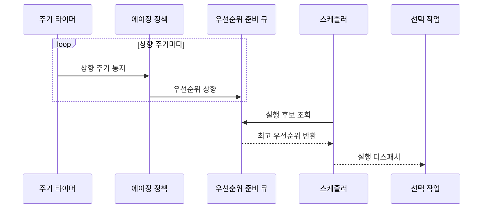

---
sidebar:
  order: 11
  label: "011. 기아·에이징 (Starvation Aging)"
  badge:
    text: "기출 · 50%"
    variant: note
title: 기아·에이징 (Starvation Aging)
date: "2026-07-25T01:55:00+09:00"
tags: [notes-software]
weight: 11
extra:
  question_no: "011"
  source_status: "기출"
  source_history: "138회"
  priority: 50
  priority_note: "138회 기출, 기아·에이징 대응 관계"
---

## 미리 알고가기

- **기아(Starvation)**: 특정 작업이 계속 밀려 실행되지 못하는 상태
- **에이징(Aging)**: 대기시간이 늘수록 작업 우선순위를 높이는 기법
- **우선순위 상향 주기**: 대기시간을 검사해 우선순위를 높이는 간격
- **우선순위 상향 폭**: 한 주기마다 높이는 우선순위 단계
- **우선순위 상한**: 에이징으로 높일 수 있는 최고 우선순위
- **준비 큐(Ready Queue)**: 실행을 기다리는 스케줄러 선택 대상 집합
- **스케줄러(Scheduler)**: 준비 큐에서 보정된 우선순위가 가장 높은 작업을 선택해 CPU에 디스패치하는 운영체제 구성요소
- **대기시간 계수기(Waiting-time Counter)**: 실행되지 않은 작업별 누적 대기시간을 기록해 에이징 정책의 입력으로 제공하는 장치
- **주기 타이머(Periodic Timer)**: 정한 간격마다 에이징 정책에 우선순위 상향 시점을 알리는 시간 장치
- **중앙처리장치(Central Processing Unit, CPU, 시피유)**: 영문 각 단어의 첫 글자를 따 CPU로 표기하며 선택된 작업의 명령을 실행하는 처리 자원
- **운영체제(Operating System, OS, 오에스)**: 영문 각 단어의 첫 글자를 따 OS로 표기하며 준비 큐와 우선순위를 관리하고 에이징을 적용하는 소프트웨어
- **배치 작업 큐(Batch Job Queue)**: 즉시 상호작용 없이 묶어서 실행할 작업을 보관하며 대기시간별 우선순위 상향으로 오래된 작업의 기아를 줄이는 대기열

## Ⅰ. 개요
- **정의/개념**: 대기시간에 따라 우선순위를 높이는 기법
- **배경/필요성**: 고정 우선순위가 기아를 낳아 에이징 필요

### 쉽게 이해하기 (학습용)

- 기다린 시간이 길수록 실행 순서를 앞당긴다.

## Ⅱ. 특징

- 고우선 작업의 연속 도착은 저우선 기아를 낳는다
- 에이징은 장기 대기 작업의 실행 기회를 보장한다
- 빠른 상향은 긴급 작업 응답을 늦출 수 있다
- 주기·폭·상한이 최대 대기시간을 결정한다

### 쉽게 이해하기 (학습용)

- 오래 기다린 작업을 너무 빨리 앞세우면 급한 작업이 뒤로 밀릴 수 있다.

## Ⅲ. 아키텍처 및 구성요소

| 설계 요소 | 설명 |
|:---|:---|
| 대기시간 계수기 | 미선택 작업별 누적 대기시간 보관 |
| 에이징 정책 | 주기·폭·상한으로 우선순위 보정 |
| 우선순위 준비 큐 | 보정 우선순위로 실행 후보 정렬 |

> 요약: 대기시간을 우선순위에 반영해 기아 억제

### 쉽게 이해하기 (학습용)

- 기다린 시간표와 순위 올림 규칙이 대기 줄을 다시 정리한다.

## Ⅳ. 원리 및 절차 흐름도

| 절차 | 설명 |
|:---|:---|
| 상향 주기 통지 | 상향 주기 도달로 에이징 정책 실행 |
| 우선순위 상향 | 대기시간 기준으로 상한 내 순위 상향 |
| 실행 후보 조회 | 스케줄러가 준비 큐 선두 조회 |
| 최고 우선순위 반환 | 준비 큐가 최고 우선순위 작업 반환 |
| 실행 디스패치 | 선택 작업에 중앙처리장치 할당 |

> 요약: 누적 대기시간으로 우선순위를 높여 실행 기회 확대

### 쉽게 이해하기 (학습용)

- 정해진 때마다 오래 기다린 일을 앞세워 다음 일을 선택한다.

## Ⅴ. 종류 및 비교

| 판단 기준 | 에이징 적용 우선순위 | 고정 우선순위 |
|:---|:---|:---|
| 핵심 특징 | 누적 대기시간에 따라 상향 | 초기 우선순위 유지 |
| 적용 기준 | 최대 대기시간을 제한할 때 | 중요도 순서를 고정할 때 |
| 주요 위험 | 긴급 작업의 우선순위 희석 | 저우선 작업의 기아 |

> 요약: 에이징은 누적 대기시간, 고정 방식은 초기 우선순위 반영

### 쉽게 이해하기 (학습용)

- 에이징은 기다린 만큼 순위를 올리고 고정 방식은 처음 순위를 유지한다.

## Ⅵ. 실무 사례

1. 운영체제 준비 큐에서 장기 대기 스레드 우선순위 상향
2. 배치 작업 큐에서 대기시간별 작업 우선순위 상향

### 쉽게 이해하기 (학습용)

- 운영체제는 오래 기다린 스레드의 순위를 올려 실행 차례를 준다.
- 배치 작업 줄도 기다린 시간에 따라 오래된 작업을 앞세운다.

## Ⅶ. 결론

- 최대 대기시간·우선순위 구분으로 상향 주기·폭·상한 설정

### 쉽게 이해하기 (학습용)

- 오래 기다린 일도 살리되 급한 일이 밀리지 않게 올리는 속도를 정한다.
