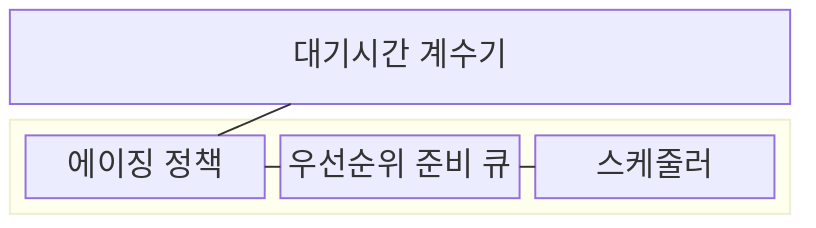
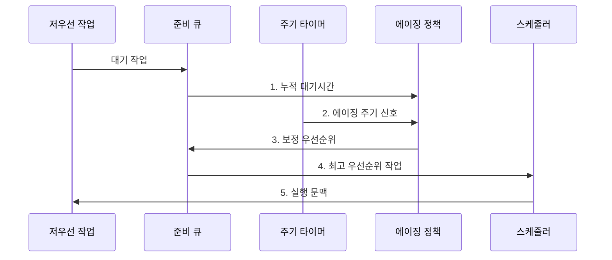

---
sidebar:
  order: 11
  label: "011. 기아·에이징 (Starvation Aging)"
  badge:
    text: "기출 · 50%"
    variant: note
title: 기아·에이징 (Starvation Aging)
date: "2026-07-30T23:25:30+09:00"
tags: [notes-software]
weight: 11
extra:
  question_no: "011"
  source_status: "기출"
  source_history: "138회"
  priority: 50
  priority_note: "138회 기출, 기아·에이징 대응 관계"
---

## 미리 알고가기

- **기아(Starvation)**: 높은 우선순위 작업에 계속 밀려 특정 작업이 실행 기회를 얻지 못하는 상태
- **에이징(Aging)**: 누적 대기시간에 따라 작업 우선순위를 높여 기아를 방지하는 스케줄링 기법
- **우선순위 상향 주기**: 대기시간을 검사해 우선순위를 높이는 간격
- **우선순위 상향 폭**: 한 주기마다 높이는 우선순위 단계
- **우선순위 상한**: 에이징으로 높일 수 있는 최고 우선순위
- **준비 큐(Ready Queue)**: 실행을 기다리는 스케줄러 선택 대상 집합
- **스케줄러(Scheduler)**: 준비 큐에서 보정된 우선순위가 가장 높은 작업을 선택해 CPU에 디스패치하는 운영체제 구성요소
- **대기시간 계수기(Waiting-time Counter)**: 실행되지 않은 작업별 누적 대기시간을 기록해 에이징 정책의 입력으로 제공하는 장치
- **주기 타이머(Periodic Timer)**: 정한 간격마다 에이징 정책에 우선순위 상향 시점을 알리는 시간 장치
- **중앙처리장치(Central Processing Unit, CPU)**: 스케줄러가 선택한 작업의 명령을 실행하는 처리 자원
- **운영체제(Operating System, OS)**: 준비 큐와 우선순위를 관리하고 에이징을 적용하는 시스템 소프트웨어
- **예약 몫(Reserved Share)**: 긴급 작업이 항상 사용할 수 있도록 실행 자원의 일부를 따로 보장한 비율
- **상위 백분위(Upper Percentile)**: 대기시간을 짧은 순서로 정렬했을 때 대부분의 작업이 넘지 않는 상단 경곗값

## Ⅰ. 개요
- 정의/개념: 대기시간에 따라 우선순위를 높여 저순위 작업에 실행 기회를 주는 **기아 방지 기법**
- 배경/필요성: 고순위 작업이 계속 도착하면 고정 우선순위의 **저순위 작업 무기한 대기**

### 쉽게 이해하기 (학습용)

- 기다린 시간이 길수록 실행 순서를 앞당긴다.

## Ⅱ. 특징

- **누적 대기시간 기반 상향**으로 장기 대기 작업 실행 보장
- **상향 주기·폭·상한**이 최대 대기시간 결정
- **우선순위 상한**으로 긴급 작업의 순위 영역 보존

### 쉽게 이해하기 (학습용)

- 오래 기다린 작업을 너무 빨리 앞세우면 급한 작업이 뒤로 밀릴 수 있다.

## Ⅲ. 구조 및 구성요소

| 구성요소 | 책임 |
|:---|:---|
| 대기시간 계수기 | **누적 대기시간 산출** |
| 에이징 정책 | **보정 우선순위 계산** |
| 우선순위 준비 큐 | **실행 후보 정렬** |
| 스케줄러 | **작업 선택·디스패치** |

- **보정 우선순위**: 기본 우선순위 + 대기 주기 수 × 상향 폭
- **우선순위 상한**: 보정값이 긴급 작업의 순위 영역을 넘지 않도록 제한

### 쉽게 이해하기 (학습용)

- 기다린 시간을 지우지 않고 주기적으로 순위를 올려, 상한 안에서 언젠가는 실행 차례를 얻도록 한다.

## Ⅳ. 흐름도

**동작 원리**

1. **누적 대기시간**: 재등록·선점 뒤에도 최초 대기 시각부터 합산
2. **에이징 주기 신호**: 정한 간격마다 상향 대상 평가 시작
3. **보정 우선순위**: 대기 주기 수와 상향 폭을 반영하고 상한 적용
4. **최고 우선순위 작업**: 보정된 준비 큐 선두 작업 선택
5. **실행 문맥**: 선택 작업의 상태 복원과 CPU 제어권 이전

### 쉽게 이해하기 (학습용)

- 기다린 시간을 보존해 순위를 주기적으로 올린다.

## Ⅴ. 종류 및 비교

| 우선순위 정책 | 에이징 적용 | 고정 우선순위 |
|:---|:---|:---|
| 적용 기준 | **최대 대기시간 제한** | 중요도 순서 **고정** |
| 핵심 특징 | 누적 대기시간에 따른 **우선순위 상향** | 초기 **우선순위 유지** |
| 한계 | 긴급 작업의 **우선순위 희석** | 저우선 작업의 **기아** |

> 요약: 최대 대기 제한은 **에이징**, 중요도 순서 고정은 **고정 우선순위** 선택

### 쉽게 이해하기 (학습용)

- 에이징은 기다린 만큼 순위를 올리고, 고정 방식은 처음 정한 순위를 유지한다.

## Ⅵ. 실무 고려사항 및 대책

| 고려사항 | 대책 | 효과 |
|:---|:---|:---|
| 상향 속도가 느려 **최대 대기시간 초과** | 대기시간 분포로 **상향 주기·폭 산정** | **기아 방지 목표** 충족 |
| 상향 속도가 빨라 긴급 작업의 **우선순위 희석** | **우선순위 상한·예약 몫**과 중요도 등급 분리 | **긴급 작업 실행 기회** 보호 |
| 작업 재등록마다 대기시간을 지워 **기아 우회** | 최초 대기 시각과 **누적 대기시간 보존** | 재등록 작업의 **기아 방지** |
| 평균 대기시간만 보면 소수 작업의 **기아 은폐** | 작업별 최대·**상위 백분위 대기시간** 감시 | **장기 대기 작업** 조기 탐지 |

### 쉽게 이해하기 (학습용)

- 운영체제는 오래 기다린 스레드의 순위를 올려 실행 차례를 준다.

## Ⅶ. 결론

- 최대 대기를 넘기면 **상향 주기 단축**, 긴급 작업이 밀리면 **상향 폭·상한 축소**

### 쉽게 이해하기 (학습용)

- 오래 기다린 일도 살리되 급한 일이 밀리지 않게 올리는 속도를 정한다.
