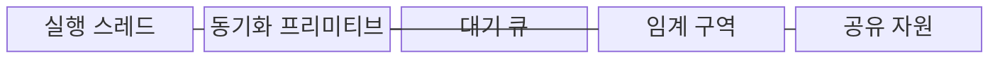
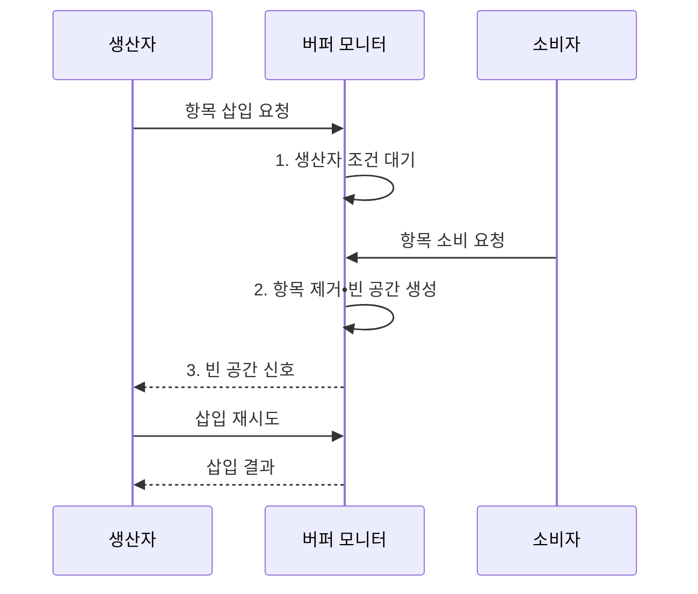

---
sidebar:
  order: 12
  label: "012. 세마포어•뮤텍스•모니터 (Semaphore Mutex Monitor)"
  badge:
    text: "기출 • 70%"
    variant: note
title: 세마포어•뮤텍스•모니터 (Semaphore Mutex Monitor)
date: "2026-08-03T09:18:00+09:00"
tags: [notes-software]
weight: 12
extra:
  question_no: "012"
  source_status: "기출"
  source_history: "125회, 126회, 132회"
  priority: 70
  priority_note: "125•126•132회 반복, 동기화 원리 핵심"
---

## Ⅰ. 개요

핵심 용어

- **동기화(Synchronization)**: 동시 실행 주체의 공유 자원 접근 순서와 상호 배제를 보장하는 제어 기법
- **경쟁 조건(Race Condition)**: 실행 순서에 따라 공유 상태 결과가 달라지는 상태

- 정의/개념: **동기화** 는 공유 자원의 진입•대기•해제 규칙으로 동시 실행 주체의 접근 순서와 상호 배제를 보장하는 **실행 제어 기법**
- 배경/필요성: 동시 쓰기를 순서화하지 않으면 **경쟁 조건** 으로 공유 상태 불일치

#### 한줄 요약

- 방 열쇠나 입장권처럼 공유 자원에 맞는 출입 규칙을 선택한다.

## Ⅱ. 특징

핵심 용어

- **상호 배제(Mutual Exclusion)**: 한 시점에 한 실행 주체만 임계 구역에 진입하도록 제한하는 성질
- **조건 변수(Condition Variable)**: 스레드를 공유 상태 조건에 따라 대기시키고 깨우는 동기화 객체
- **캡슐화(Encapsulation)**: 공유 상태와 메서드•조건 변수를 한 경계에 묶어 직접 접근을 제한하는 설계
- **대기 큐•깨움 신호**: 대기 큐는 조건이 충족되지 않은 스레드를 보관하고, 깨움 신호는 상태 변경 뒤 조건 재검사를 요청한다.

- **상호배제•순서 제어** 로 경쟁 조건 방지
- **대기 큐•깨움 신호** 로 자원 미가용 스레드 실행 조정
- **캡슐화된 조건 변수** 로 상태 변경과 대기•깨움 결합

#### 한줄 요약

- 획득 순서와 반환을 잘못 관리하면 서로 기다리거나 입장권이 사라질 수 있다.

## Ⅲ. 구조 및 구성요소

핵심 용어

- **동기화 프리미티브**: 공유 자원의 접근 허가와 대기 조건을 제어하는 기본 동기화 도구
- **대기 큐(Wait Queue)**: 동기화 조건이나 자원 허가를 기다리는 스레드를 보관하는 대기열
- **임계 구역(Critical Section)**: 한 번에 제한된 실행 주체만 들어가야 하는 코드 범위

| 구성요소 | 책임 |
|:---|:---|
| 실행 스레드 | **공유 자원 접근 요청** |
| 동기화 프리미티브 | **접근 허가•대기 조건** 제어 |
| 대기 큐 | **미충족 조건 스레드** 보관 |
| 임계 구역 | **동시 실행 제한** 코드 범위 |
| 공유 자원 | **보호 대상 상태 제공** |

#### 한줄 요약

- 버퍼가 가득 차면 생산자는 열쇠를 놓고 기다리며, 소비자가 공간을 만든 신호 뒤에도 조건을 다시 확인하고 넣는다.

## Ⅳ. 흐름도

핵심 용어

- **생산자•소비자 버퍼(Producer-Consumer Buffer)**: 생산자가 넣고 소비자가 꺼내는 유한 공유 저장소
- **조건 신호(Condition Signal)**: 공유 상태가 바뀌어 조건을 다시 검사할 수 있음을 대기 스레드에 알리는 동작
- **허위 깨움(Spurious Wakeup)**: 기다리던 조건이 충족되지 않았는데도 조건 변수 대기에서 깨어나는 현상
- **조건 큐•잠금(Condition Queue•Lock)**: 조건 큐는 대기 스레드를 보관하고, 잠금은 조건 검사와 공유 상태 변경을 원자적으로 보호한다.

**동작 원리**

1. **생산자 조건 대기**: 버퍼가 가득 차면 잠금을 풀고 조건 큐에 등록
2. **항목 제거•빈 공간 생성**: 소비자가 공유 버퍼에서 항목을 꺼내 수용 공간 확보
3. **빈 공간 신호**: 생산자를 깨우면 생산자가 잠금을 다시 얻고 조건을 재검사

#### 한줄 요약

- 공간이 생겼다는 신호 뒤에도 조건을 다시 확인한다.

## Ⅴ. 종류 및 비교

핵심 용어

- **세마포어(Semaphore)**: 정수 허가 수로 동시 접근 수를 제한하는 동기화 도구
- **뮤텍스(Mutual Exclusion, Mutex)**: 획득한 소유자만 해제할 수 있는 단일 잠금
- **모니터(Monitor)**: 공유 상태•메서드•조건 변수를 캡슐화한 동기화 구조

| 동기화 프리미티브 | 세마포어 | 뮤텍스 | 모니터 |
|:---|:---|:---|:---|
| 적용 기준 | 동시 **사용 수 제한** | 단일 **소유권 잠금** | 상태•조건 **캡슐화** |
| 핵심 특징 | 정수 허가 수•**소유권 없음** | 단일 소유자의 **잠금•해제** | 상태•**조건 변수 결합** |
| 한계 | 허가 누락•**과다 반환** | 교착•**소유자 정지** | 조건 신호 **누락** |

> 요약: 동시 허가 수는 **세마포어**, 단일 소유권은 **뮤텍스**, 상태 조건은 모니터

#### 한줄 요약

- 세마포어는 입장권 수를, 뮤텍스는 열쇠 주인을, 모니터는 대기 조건을 관리한다.

## Ⅵ. 실무 고려사항 및 대책

핵심 용어

- **교착상태(Deadlock)**: 여러 실행 주체가 서로 보유한 잠금 해제를 기다려 모두 진행하지 못하는 상태
- **꼬리 지연(Tail Latency)**: 요청 지연 분포에서 가장 느린 일부 요청의 지연
- **예외 안전 해제(Exception-safe Release)**: 오류가 발생해도 잠금이나 허가를 반드시 반환하는 처리 방식
- **전역 잠금 순서(Global Lock Ordering)**: 모든 실행 경로가 여러 잠금을 같은 순서로 획득해 환형 대기를 막는 규칙
- **락 분할(Lock Striping)**: 하나의 큰 잠금을 여러 독립 잠금으로 나눠 서로 다른 데이터 접근의 경합을 줄이는 기법
- **허가 누수(Permit Leak)**: 세마포어 허가를 잘못 반환하거나 회수하지 않아 실제 사용량과 허가 수가 어긋나는 상태

| 문제 | 대책 | 효과 |
|:---|:---|:---|
| 잠금 획득 순서가 달라 **교착상태 발생** | **전역 잠금 순서** 와 대기시간 제한 적용 | **환형 대기** 예방 |
| 임계 구역이 길어 **경합•꼬리 지연 증가** | **임계 구역 축소•락 분할** 과 보유시간 계측 | **동시 실행 범위** 확대 |
| 조건 신호 유실•허위 깨움으로 **상태 오류** | 조건 반복 검사와 **동일 락 신호 보호** | 정확한 **대기•재개 조건** 유지 |
| 세마포어 과다 반환•뮤텍스 비소유 해제로 **허가 누수** | 소유권 검사와 **예외 안전 해제** | **허가•잠금 상태** 일관성 유지 |

#### 한줄 요약

- 유한 자원 풀은 남은 입장권 수만큼 사용 권한을 빌려준다.

## Ⅶ. 결론

핵심 용어

- **허가 수•소유권•상태 조건**: 세마포어•뮤텍스•모니터 중 동기화 도구를 선택하는 기준

- 동시 허가 수는 **세마포어**, 단일 소유권은 **뮤텍스**, 상태 조건은 모니터 선택

#### 한줄 요약

- 입장권 수•열쇠 주인•대기 조건 중 필요한 규칙을 선택한다.
