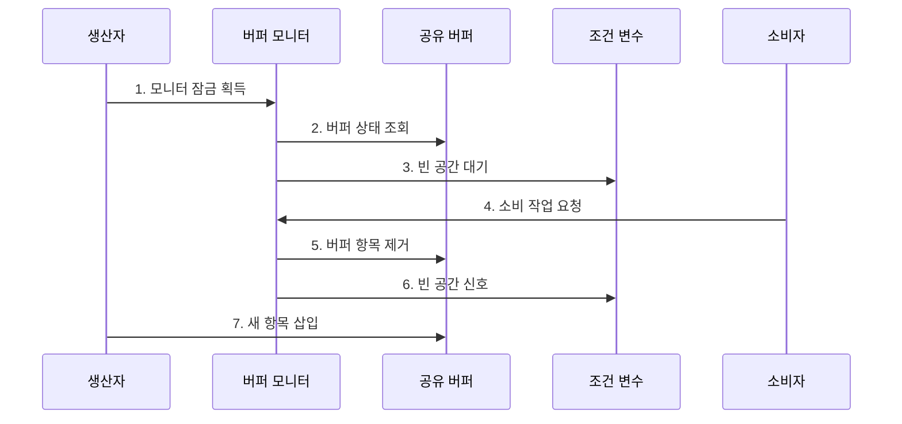

---
sidebar:
  order: 12
  label: "012. 세마포어·뮤텍스·모니터 (Semaphore Mutex Monitor)"
  badge:
    text: "기출 · 70%"
    variant: note
title: 세마포어·뮤텍스·모니터 (Semaphore Mutex Monitor)
date: "2026-07-27T23:59:59+09:00"
tags: [notes-software]
weight: 12
extra:
  question_no: "012"
  source_status: "기출"
  source_history: "125회, 126회, 132회"
  priority: 70
  priority_note: "125·126·132회 반복, 동기화 원리 핵심"
---

## 미리 알고가기

- **동기화(Synchronization)**: 동시 실행 주체의 공유 자원 접근 순서 조정
- **세마포어(Semaphore)**: 정수 허가 수로 동시 접근 수 제한
- **뮤텍스(Mutual Exclusion, Mutex)**: 소유자만 해제하는 단일 잠금
- **모니터(Monitor)**: 공유 상태·메서드·조건 변수를 캡슐화
- **상호 배제(Mutual Exclusion)**: 한 시점에 한 실행 주체만 임계 구역에 진입
- **소유권(Ownership)**: 락 획득 스레드만 같은 락을 해제하는 규칙
- **조건 변수(Condition Variable)**: 스레드를 조건에 따라 대기·깨우는 동기화 객체
- **경쟁 조건(Race Condition)**: 실행 순서에 따라 공유 상태 결과가 달라지는 상태
- **락·임계 구역(Lock·Critical Section)**: 락은 공유 상태 접근 권한을 제어하고 임계 구역은 한 번에 제한된 실행 주체만 들어가야 하는 코드 범위
- **캡슐화(Encapsulation)**: 공유 상태와 이를 다루는 메서드·조건 변수를 하나의 경계 안에 묶어 외부의 직접 접근을 제한하는 설계
- **교착상태(Deadlock)**: 여러 실행 주체가 서로 보유한 락이나 자원을 기다려 모두 진행하지 못하는 상태
- **연결 풀(Connection Pool)**: 재사용 가능한 데이터베이스 연결을 보관하며 세마포어 허가 수로 동시 대여 개수를 제한하는 구조
- **캐시(Cache)**: 재사용 데이터를 빠르게 읽도록 보관하며 갱신 임계 구역을 뮤텍스로 보호하는 저장소
- **생산자·소비자 버퍼(Producer-Consumer Buffer)**: 생산자가 데이터를 넣고 소비자가 꺼내는 유한 저장소로서 빈 상태와 가득 찬 상태를 모니터 조건 변수로 기다림
- **조건 신호(Condition Signal)**: 공유 상태가 바뀌어 대기 조건을 다시 검사할 수 있음을 조건 변수의 대기 스레드에 알리는 동작
- **우선순위 역전(Priority Inversion)**: 높은 우선순위 작업이 낮은 우선순위 작업의 잠금 해제를 기다리며 사실상 뒤로 밀리는 현상
- **꼬리 지연(Tail Latency)**: 요청 지연시간 분포에서 가장 느린 일부 요청의 지연
- **허위 깨움(Spurious Wakeup)**: 기다리던 조건이 충족되지 않았는데도 조건 변수 대기에서 깨어나는 현상
- **예외 안전 해제(Exception-safe Release)**: 실행 중 오류가 발생해도 잠금이나 허가를 반드시 반환하는 처리 방식

## Ⅰ. 개요
- 정의/개념: 진입·대기·해제로 **공유 접근을 조정**하는 기법
- 배경/필요성: 무제어 접근의 **경쟁 조건·상태 불일치** 방지

### 쉽게 이해하기 (학습용)

- 방 열쇠나 입장권처럼 공유 자원에 맞는 출입 규칙을 선택한다.

## Ⅱ. 특징

- **상호배제·순서 제어**로 경쟁 조건 방지
- **대기 큐·깨움 신호**로 자원 미가용 스레드 실행 조정
- 잠금 순서 오류는 **교착·기아·우선순위 역전** 유발

### 쉽게 이해하기 (학습용)

- 획득 순서와 반환을 잘못 관리하면 서로 기다리거나 입장권이 사라질 수 있다.

## Ⅲ. 구조 및 구성요소

| 구성요소 | 책임 |
|:---|:---|
| 실행 스레드 | **공유 자원 접근 요청** |
| 세마포어 | **동시 사용 수 제한** |
| 뮤텍스 | **단일 소유권 보호** |
| 모니터 | **상태·조건 대기 캡슐화** |
| 공유 자원 | **보호 대상 상태 제공** |

### 쉽게 이해하기 (학습용)

- 버퍼가 가득 차면 생산자는 열쇠를 놓고 기다리며, 소비자가 공간을 만든 신호 뒤에도 조건을 다시 확인하고 넣는다.

## Ⅳ. 흐름도

**동작 원리**

- **1. 모니터 잠금 획득**: 생산자 진입
- **2. 버퍼 상태 조회**: 용량 확인
- **3. 빈 공간 대기**: 잠금 해제·대기
- **4. 소비 작업 요청**: 소비자 진입
- **5. 버퍼 항목 제거**: 공간 확보
- **6. 빈 공간 신호**: 생산자 깨움
- **7. 새 항목 삽입**: 조건 재검사 후 저장

### 쉽게 이해하기 (학습용)

- 공간이 생겼다는 신호 뒤에도 조건을 다시 확인한다.

## Ⅴ. 종류 및 비교

| 구분 | 세마포어 | 뮤텍스 | 모니터 |
|:---|:---|:---|:---|
| 적용 기준 | 동시 **사용 수 제한** | 단일 **소유권 잠금** | 상태·조건 **캡슐화** |
| 핵심 특징 | 정수 허가 수·**소유권 없음** | 단일 소유자의 **잠금·해제** | 상태·**조건 변수 결합** |
| 한계 | 허가 누락·**과다 반환** | 교착·**소유자 정지** | 조건 신호 **누락** |

> 요약: 허가 수·소유권·조건 변수로 구분

### 쉽게 이해하기 (학습용)

- 세마포어는 입장권 수를, 뮤텍스는 열쇠 주인을, 모니터는 대기 조건을 관리한다.

## Ⅵ. 실무 고려사항 및 대책

| 고려사항 | 대책 | 효과 |
|:---|:---|:---|
| 잠금 순서 불일치로 교착 | 전역 획득 순서·계층과 시간 제한·진단 정보 적용 | 무한 대기 예방 |
| 보호 구간이 길어 경합·꼬리 지연 증가 | 임계 구역 축소·락 분할과 보유시간 계측 | 병렬성 향상 |
| 조건 신호 유실·허위 깨움으로 상태 오류 | 조건을 반복 검사하고 상태 변경과 신호를 같은 락으로 보호 | 정확한 대기·재개 |
| 세마포어 과다 반환·뮤텍스 비소유 해제 | 구조화된 수명주기·소유권 검사와 예외 안전 해제 | 허가·잠금 누수 방지 |

### 쉽게 이해하기 (학습용)

- 연결 풀은 남은 입장권 수만큼 연결을 빌려준다.

## Ⅶ. 결론

- 허가 수·소유권·조건 대기로 **동기화 수단**을 결정

### 쉽게 이해하기 (학습용)

- 입장권 수·열쇠 주인·대기 조건 중 필요한 규칙을 선택한다.
