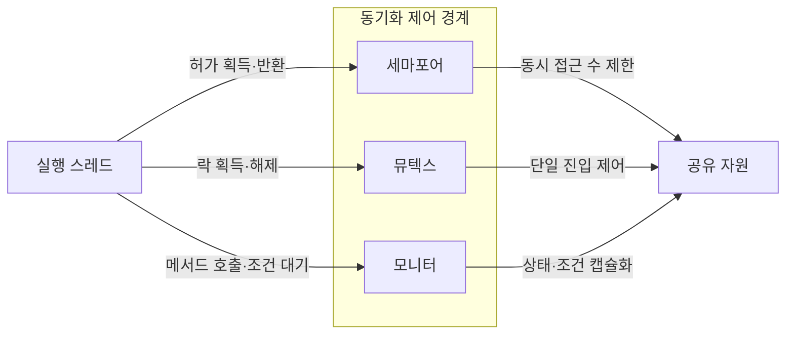
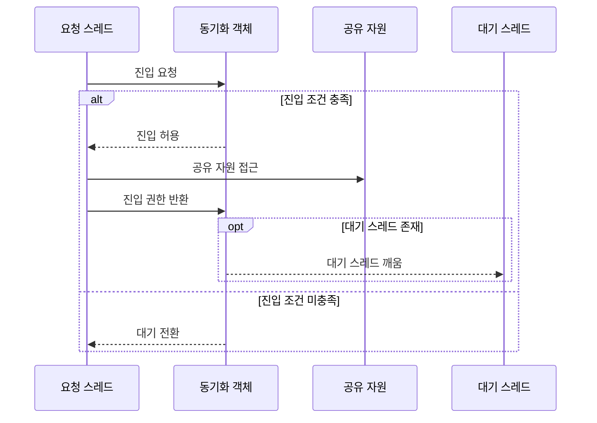

---
sidebar:
  order: 12
  label: "012. 세마포어·뮤텍스·모니터 (Semaphore Mutex Monitor)"
  badge:
    text: "기출 · 70%"
    variant: note
title: 세마포어·뮤텍스·모니터 (Semaphore Mutex Monitor)
date: "2026-07-27T23:59:59+09:00"
tags: [notes-software]
weight: 12
extra:
  question_no: "012"
  source_status: "기출"
  source_history: "125회, 126회, 132회"
  priority: 70
  priority_note: "125·126·132회 반복, 동기화 원리 핵심"
---

## 미리 알고가기

- **동기화(Synchronization)**: 동시 실행 주체의 공유 자원 접근 순서 조정
- **세마포어(Semaphore)**: 정수 허가 수로 동시 접근 수 제한
- **뮤텍스(Mutual Exclusion, Mutex)**: 소유자만 해제하는 단일 잠금
- **모니터(Monitor)**: 공유 상태·메서드·조건 변수를 캡슐화
- **상호 배제(Mutual Exclusion)**: 한 시점에 한 실행 주체만 임계 구역에 진입
- **소유권(Ownership)**: 락 획득 스레드만 같은 락을 해제하는 규칙
- **조건 변수(Condition Variable)**: 스레드를 조건에 따라 대기·깨우는 동기화 객체
- **경쟁 조건(Race Condition)**: 실행 순서에 따라 공유 상태 결과가 달라지는 상태
- **락·임계 구역(Lock·Critical Section)**: 락은 공유 상태 접근 권한을 제어하고 임계 구역은 한 번에 제한된 실행 주체만 들어가야 하는 코드 범위
- **캡슐화(Encapsulation)**: 공유 상태와 이를 다루는 메서드·조건 변수를 하나의 경계 안에 묶어 외부의 직접 접근을 제한하는 설계
- **교착상태(Deadlock)**: 여러 실행 주체가 서로 보유한 락이나 자원을 기다려 모두 진행하지 못하는 상태
- **연결 풀(Connection Pool)**: 재사용 가능한 데이터베이스 연결을 보관하며 세마포어 허가 수로 동시 대여 개수를 제한하는 구조
- **캐시(Cache)**: 재사용 데이터를 빠르게 읽도록 보관하며 갱신 임계 구역을 뮤텍스로 보호하는 저장소
- **생산자·소비자 버퍼(Producer–Consumer Buffer)**: 생산자가 데이터를 넣고 소비자가 꺼내는 유한 저장소로서 빈 상태와 가득 찬 상태를 모니터 조건 변수로 기다림
- **조건 신호(Condition Signal)**: 공유 상태가 바뀌어 대기 조건을 다시 검사할 수 있음을 조건 변수의 대기 스레드에 알리는 동작

## Ⅰ. 개요
- 정의/개념: 진입·대기·해제로 **공유 자원 접근 순서**를 조정하는 기법
- 기존 한계: 무제어 동시 접근은 **경쟁 조건·공유 상태 불일치** 유발

### 쉽게 이해하기 (학습용)

- 방 열쇠나 입장권처럼 공유 자원에 맞는 출입 규칙을 선택한다.

## Ⅱ. 특징

- **상호배제·순서 제어**로 경쟁 조건 방지
- **대기 큐·깨움 신호**로 자원 미가용 스레드 실행 조정
- 잠금 순서 오류는 **교착·기아·우선순위 역전** 유발

### 쉽게 이해하기 (학습용)

- 획득 순서와 반환을 잘못 관리하면 서로 기다리거나 입장권이 사라질 수 있다.

## Ⅲ. 아키텍처 및 구성요소

| 설계 요소 | 설명 |
|:---|:---|
| 세마포어 | 정수 허가 수로 동시 자원 사용 수 제어 |
| 뮤텍스 | 잠금 상태·소유자로 단일 임계 구역 보호 |
| 모니터 | 공유 상태·메서드·조건 변수 캡슐화 |

> 요약: 허가 수·소유권·조건으로 공유 자원 진입 제어

### 쉽게 이해하기 (학습용)

- 입장권·주인 있는 열쇠·조건 대기실이 공유 자원 입구를 지킨다.

## Ⅳ. 원리 및 절차 흐름도

| 절차 | 설명 |
|:---|:---|
| 진입 요청 | 허가 수·락 상태·조건 검사 |
| 진입 허용 | 조건 충족 시 요청 스레드 진입 |
| 공유 자원 접근 | 보호 상태 갱신·자원 사용 |
| 진입 권한 반환 | 허가 반환·락 해제·모니터 퇴장 |
| 대기 스레드 깨움 | 허가 반환·락 해제·조건 신호 후 재개 |
| 대기 전환 | 조건 미충족 스레드를 대기 상태로 전환 |

> 요약: 조건 충족 전 대기하고 반환 후 재개

### 쉽게 이해하기 (학습용)

- 열쇠·입장권·대기실 규칙에 맞춰 기다리거나 들어간다.

## Ⅴ. 종류 및 비교

| 동기화 기법 | 세마포어 | 뮤텍스 | 모니터 |
|:---|:---|:---|:---|
| 적용 기준 | 동시 **사용 수 제한** | 단일 **소유권 잠금** | 상태·조건 **캡슐화** |
| 핵심 특징 | 정수 허가 수·**소유권 없음** | 단일 소유자의 **잠금·해제** | 상태·**조건 변수 결합** |
| 한계 | 허가 누락·**과다 반환** | 교착·**소유자 정지** | 조건 신호 **누락** |

> 요약: 허가 수·소유권·조건 변수로 구분

### 쉽게 이해하기 (학습용)

- 세마포어는 입장권 수를, 뮤텍스는 열쇠 주인을, 모니터는 대기 조건을 관리한다.

## Ⅵ. 실무 사례

1. 연결 풀은 **세마포어 허가 수**로 동시 대여 제한
2. 캐시 갱신은 **뮤텍스**로 단일 스레드 진입
3. 생산자·소비자는 **모니터 조건 변수**로 대기·신호

### 쉽게 이해하기 (학습용)

- 연결 풀은 남은 입장권 수만큼 연결을 빌려준다.
- 캐시는 열쇠를 가진 한 작업자만 값을 바꾸게 한다.
- 버퍼가 비거나 차면 조건 대기실에서 기다렸다가 신호로 깨어난다.

## Ⅶ. 결론

- 허가 수는 **세마포어**, 소유권은 **뮤텍스**, 조건은 모니터

### 쉽게 이해하기 (학습용)

- 입장권 수·열쇠 주인·대기 조건 중 필요한 규칙을 선택한다.
