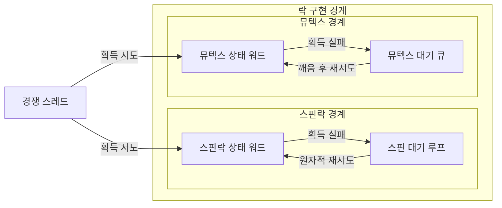
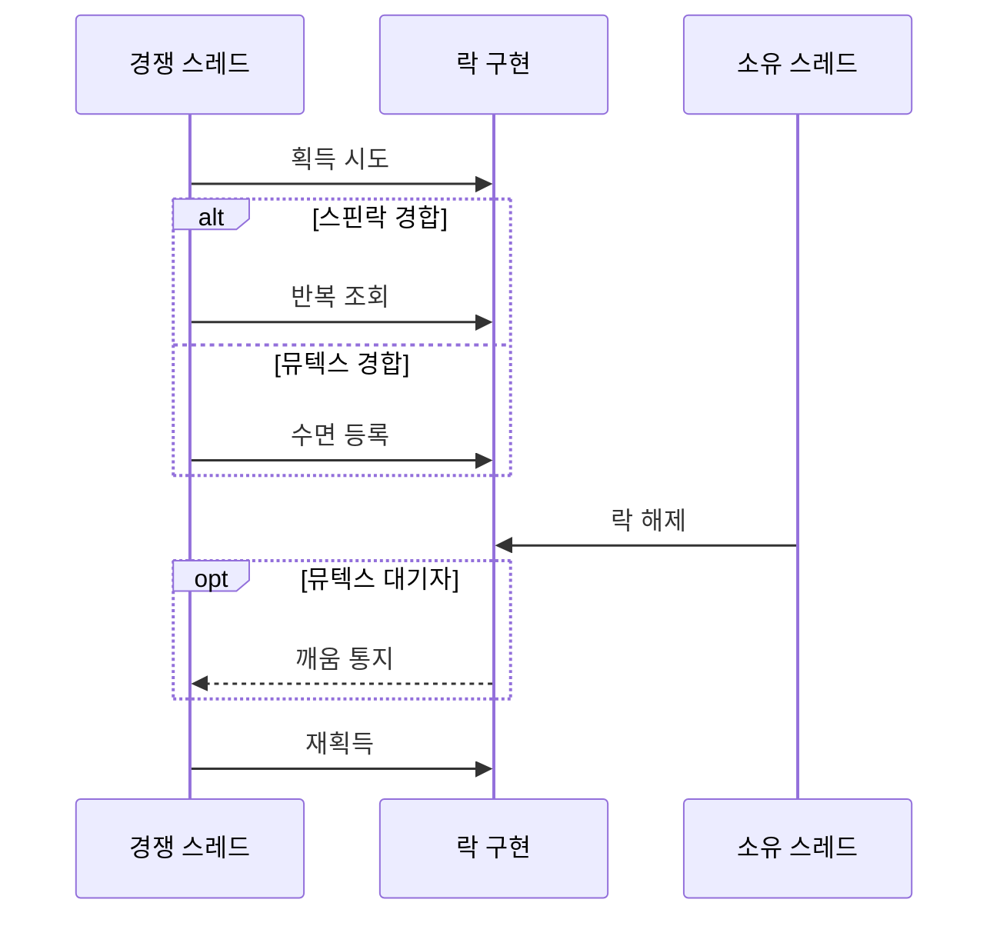

---
sidebar:
  order: 13
  label: "013. 스핀락 vs 뮤텍스 (Spinlock vs Mutex)"
  badge:
    text: "기출 · 50%"
    variant: note
title: 스핀락 vs 뮤텍스 (Spinlock vs Mutex)
date: "2026-07-25T00:35:28+09:00"
tags: [notes-software]
weight: 13
extra:
  question_no: "013"
  source_status: "기출"
  source_history: "123회"
  priority: 50
  priority_note: "123회 기출, 스핀락·뮤텍스 선택 기준"
---

## 미리 알고가기

- **스핀락과 뮤텍스(Spinlock and Mutex)**: 경합 시 반복 검사와 수면으로 대기하는 두 락
- **락 경합(Lock Contention)**: 여러 스레드가 같은 락을 동시에 요청
- **중앙처리장치(Central Processing Unit, CPU, 시피유)**: 영문 각 단어의 첫 글자를 따 CPU로 표기하며 스핀 대기 중 반복 검사 명령을 실행하는 장치
- **바쁜 대기(Busy Waiting)**: 조건 충족까지 CPU에서 상태를 반복 검사
- **수면 대기(Sleeping Wait)**: 스레드를 대기 큐로 옮겨 CPU를 반납
- **임계 구역(Critical Section)**: 공유 상태를 한 번에 한 스레드만 다루는 코드
- **락 보유시간(Lock Hold Time)**: 획득부터 해제까지 임계 구역을 점유한 시간
- **문맥 전환(Context Switch)**: 실행 상태를 저장하고 다음 상태를 복원
- **원자적 연산(Atomic Operation)**: 중간 상태 노출 없이 락 상태를 한 번에 변경
- **뮤텍스(Mutual Exclusion, Mutex)**: 소유 스레드만 해제할 수 있고 경합한 스레드를 대기 큐에서 수면시키는 단일 잠금
- **상호 배제(Mutual Exclusion)**: 공유 임계 구역에 한 시점에 한 실행 주체만 진입하게 하는 성질
- **상태 워드(State Word)**: 잠김·해제와 경합 여부를 한 기계어 크기 값에 기록해 원자적으로 갱신하는 락 상태 저장소
- **스핀 대기 루프(Spin-wait Loop)**: 락이 풀릴 때까지 상태 워드를 CPU에서 반복 조회하고 원자적으로 재획득을 시도하는 코드
- **소유자 선점(Owner Preemption)**: 락을 가진 스레드가 실행 중단되어 대기자가 스핀해도 락을 해제할 수 없는 상태
- **커널(Kernel)**: 운영체제의 핵심으로 인터럽트·스케줄링·장치를 관리하며 수면할 수 없는 짧은 임계 구역에서 스핀락을 사용함
- **수면 불가 문맥(Non-sleepable Context)**: 현재 실행을 멈추고 스케줄러 대기 큐로 이동할 수 없어 뮤텍스를 사용할 수 없는 커널 실행 상황
- **연결 풀(Connection Pool)**: 재사용 가능한 데이터베이스 연결을 공유하며 긴 경합 시 뮤텍스로 대기 스레드를 수면시키는 구조

## Ⅰ. 개요

- **정의/개념**: 반복 검사·수면 대기로 상호배제를 구현하는 두 락
- **배경/필요성**: 대기 비용이 달라 경합별 락 선택 필요

### 쉽게 이해하기 (학습용)

- 문이 곧 열리면 앞에서 확인하고 오래 걸리면 대기실에서 잠시 쉬는 편이 낫다

## Ⅱ. 특징

- 스핀락은 소유자가 실행돼야 대기 종료된다.
- 뮤텍스는 대기자가 수면해 CPU를 반납한다.

### 쉽게 이해하기 (학습용)

- 스핀락은 문이 열릴 때까지 계속 보고, 뮤텍스는 잠들어 다른 작업이 CPU를 쓰게 한다

## Ⅲ. 아키텍처 및 구성요소

| 설계 요소 | 설명 |
|:---|:---|
| 스핀락 상태 워드 | 잠김·해제 상태를 원자적으로 표시 |
| 스핀 대기 루프 | 상태 워드를 반복 조회하며 획득 재시도 |
| 뮤텍스 상태 워드 | 잠김 상태와 경합 여부를 원자적으로 표시 |
| 뮤텍스 대기 큐 | 경합 스레드를 수면·깨움 순서로 관리 |

> 요약: 스핀은 상태 워드 재조회·뮤텍스는 대기 큐 사용

### 쉽게 이해하기 (학습용)

- 스핀락은 상태표를 계속 읽고, 뮤텍스는 기다리는 스레드를 줄에 세워 잠들게 한다

## Ⅳ. 원리 및 절차 흐름도

| 절차 | 설명 |
|:---|:---|
| 획득 시도 | 해제 상태일 때 잠김 상태로 원자적 변경 |
| 반복 조회 | 스핀락 실패 시 CPU에서 상태 재검사 |
| 수면 등록 | 뮤텍스 실패 시 대기 큐 등록 후 수면 |
| 락 해제 | 잠김 상태를 풀고 대기자 존재 여부 확인 |
| 깨움 통지 | 뮤텍스 대기자를 실행 가능 상태로 전환 |
| 재획득 | 해제 확인 또는 깨움 후 원자적 재시도 |

> 요약: 스핀은 재조회·뮤텍스는 수면 후 재시도

### 쉽게 이해하기 (학습용)

- 락을 못 얻으면 계속 확인하거나 줄에서 잠들고, 소유자가 놓은 뒤 다시 획득을 시도한다

## Ⅴ. 종류 및 비교

| 판단 기준 | 스핀락 | 뮤텍스 |
|:---|:---|:---|
| 핵심 특징 | CPU에서 락 상태 반복 조회 | 대기 큐 등록 후 수면 |
| 적용 기준 | 전환 비용보다 짧은 보유시간 | 전환 비용보다 긴 보유시간 |
| 주요 위험 | 소유자 선점 시 CPU 낭비 | 수면 불가 문맥에서 사용 불가 |

> 요약: 수면 불가·짧은 경합은 스핀락·긴 경합은 뮤텍스

### 쉽게 이해하기 (학습용)

- 잠드는 비용보다 빨리 풀리면 스핀락, 오래 기다려야 하면 뮤텍스가 CPU 낭비를 줄인다

## Ⅵ. 실무 사례

1. 커널 수면 불가 임계 구역에 스핀락 적용
2. 서버 연결 풀은 뮤텍스로 경합 스레드를 수면

### 쉽게 이해하기 (학습용)

- 커널이 잠들 수 없는 짧은 구간에서는 락이 풀릴 때까지 잠깐 반복 확인한다
- 연결 풀을 다른 스레드가 쓰는 동안 기다리는 스레드는 뮤텍스 줄에서 잠든다

## Ⅶ. 결론

- 보유시간·수면 가능 여부로 스핀락·뮤텍스 선택

### 쉽게 이해하기 (학습용)

- 잠들 수 있는지와 락이 얼마나 빨리 풀리는지를 보고 두 락 중 하나를 선택한다
