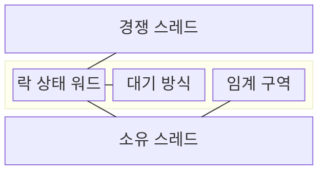
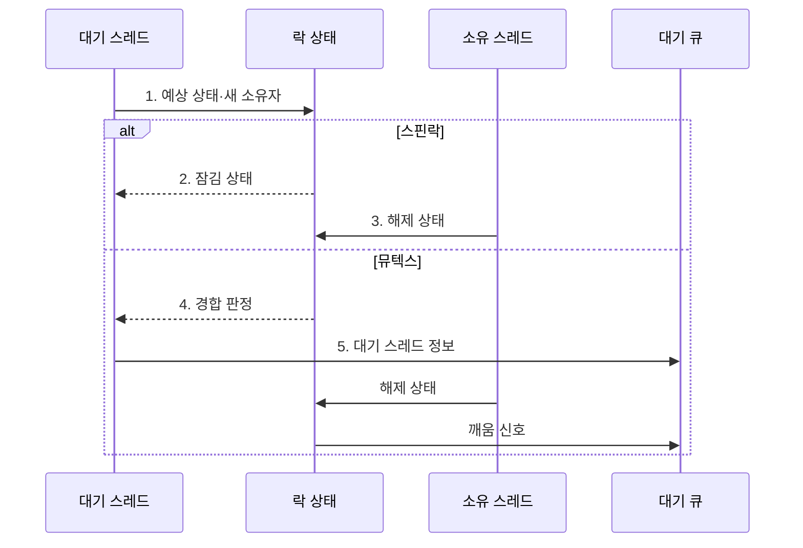

---
sidebar:
  order: 13
  label: "013. 스핀락 vs 뮤텍스 (Spinlock vs Mutex)"
  badge:
    text: "기출 · 50%"
    variant: note
title: 스핀락 vs 뮤텍스 (Spinlock vs Mutex)
date: "2026-07-30T23:27:12+09:00"
tags: [notes-software]
weight: 13
extra:
  question_no: "013"
  source_status: "기출"
  source_history: "123회"
  priority: 50
  priority_note: "123회 기출, 스핀락·뮤텍스 선택 기준"
---

## 미리 알고가기

- **스핀락과 뮤텍스(Spinlock and Mutex)**: 경합 시 각각 CPU 반복 검사와 대기 큐 수면으로 기다리는 두 상호 배제 잠금 방식
- **락 경합(Lock Contention)**: 여러 스레드가 같은 락을 동시에 요청
- **중앙처리장치(Central Processing Unit, CPU)**: 스핀 대기 중 잠금 상태를 반복 검사하는 명령을 실행하는 장치
- **바쁜 대기(Busy Waiting)**: 조건 충족까지 CPU에서 상태를 반복 검사
- **수면 대기(Sleeping Wait)**: 스레드를 대기 큐로 옮겨 CPU를 반납
- **임계 구역(Critical Section)**: 공유 상태를 한 번에 한 스레드만 다루는 코드
- **락 보유시간(Lock Hold Time)**: 획득부터 해제까지 임계 구역을 점유한 시간
- **문맥 전환(Context Switch)**: 실행 상태를 저장하고 다음 상태를 복원
- **원자적 연산(Atomic Operation)**: 중간 상태 노출 없이 락 상태를 한 번에 변경
- **뮤텍스(Mutual Exclusion, Mutex)**: 소유 스레드만 해제할 수 있고 경합한 스레드를 대기 큐에서 수면시키는 단일 잠금
- **상호 배제(Mutual Exclusion)**: 공유 임계 구역에 한 시점에 한 실행 주체만 진입하게 하는 성질
- **상태 워드(State Word)**: 잠김·해제와 경합 여부를 한 기계어 크기 값에 기록해 원자적으로 갱신하는 락 상태 저장소
- **스핀 대기 루프(Spin-wait Loop)**: 락이 풀릴 때까지 상태 워드를 CPU에서 반복 조회하고 원자적으로 재획득을 시도하는 코드
- **소유자 선점(Owner Preemption)**: 락을 가진 스레드가 실행 중단되어 대기자가 스핀해도 락을 해제할 수 없는 상태
- **커널(Kernel)**: 운영체제의 핵심으로 인터럽트·스케줄링·장치를 관리하며 수면할 수 없는 짧은 임계 구역에서 스핀락을 사용한다.
- **수면 불가 문맥(Non-sleepable Context)**: 현재 실행을 멈추고 스케줄러 대기 큐로 이동할 수 없어 뮤텍스를 사용할 수 없는 커널 실행 상황
- **캐시 라인(Cache Line)**: CPU 캐시와 메모리 사이에서 한 번에 전송·일관성을 관리하는 고정 크기 데이터 블록
- **다중 소켓(Multi-socket)**: 두 개 이상의 물리 CPU 패키지가 메모리와 캐시 일관성 통신을 공유하는 구조
- **블로킹 락(Blocking Lock)**: 락을 얻지 못한 스레드를 수면 상태로 전환하는 잠금
- **백분위(Percentile)**: 측정값을 작은 순서로 놓았을 때 일정 비율이 그 이하인 경계값

## Ⅰ. 개요

- 정의/개념: 경합 시 반복 검사하는 **스핀락**과 수면 대기하는 **뮤텍스**의 상호 배제 방식
- 배경/필요성: 보유시간·수면 가능 여부를 무시하면 **CPU 낭비·전환 비용 증가**

### 쉽게 이해하기 (학습용)

- 문이 곧 열리면 앞에서 확인하고 오래 걸리면 대기실에서 잠시 쉬는 편이 낫다.

## Ⅱ. 특징

- 스핀락은 **반복 상태 검사**로 문맥 전환 회피
- 뮤텍스는 **대기 큐 수면**으로 CPU 점유 반납
- **잠금 보유시간·수면 가능 문맥**이 선택 기준

### 쉽게 이해하기 (학습용)

- 스핀락은 문이 열릴 때까지 계속 보고, 뮤텍스는 잠들어 다른 작업이 CPU를 쓰게 한다.

## Ⅲ. 구조 및 구성요소

| 구성요소 | 책임 |
|:---|:---|
| 경쟁 스레드 | **락 획득·해제 요청** |
| 락 상태 워드 | **잠김 상태·소유권** 기록 |
| 대기 방식 | **반복 검사·수면 대기** 선택 |
| 임계 구역 | **상호 배제 실행** 범위 |
| 소유 스레드 | 임계 구역 완료 후 **락 해제** |

### 쉽게 이해하기 (학습용)

- 곧 풀릴 락은 CPU에서 잠깐 확인하고, 오래 걸릴 락은 대기 큐에서 잠들어 다른 작업에 CPU를 양보한다.

## Ⅳ. 흐름도

**동작 원리**

1. **예상 상태·새 소유자**: 원자적 연산으로 해제 상태일 때만 소유권 변경
2. **잠김 상태**: 스핀락 대기자가 상태 워드를 반복 조회
3. **해제 상태**: 소유자가 임계 구역을 마치면 재획득 가능 상태 게시
4. **경합 판정**: 뮤텍스 대기자를 수면 경로로 전환
5. **대기 스레드 정보**: 운영체제 대기 큐에 등록하고 CPU 반납

### 쉽게 이해하기 (학습용)

- 곧 풀리면 확인하고 오래 걸리면 잠들어 CPU를 양보한다.

## Ⅴ. 종류 및 비교

| 잠금 대기 방식 | 스핀락 | 뮤텍스 |
|:---|:---|:---|
| 적용 기준 | 전환 비용보다 **짧은 보유시간** | 전환 비용보다 **긴 보유시간** |
| 핵심 특징 | CPU에서 **락 상태 반복 조회** | 대기 큐 등록 후 **수면** |
| 한계 | 소유자 선점 시 **CPU 낭비** | 수면 불가 문맥에서 **사용 불가** |

> 요약: 수면 불가·짧은 경합은 **스핀락**, 긴 경합은 **뮤텍스** 선택

### 쉽게 이해하기 (학습용)

- 잠드는 비용보다 빨리 풀리면 스핀락, 오래 기다려야 하면 뮤텍스가 CPU 낭비를 줄인다.

## Ⅵ. 실무 고려사항 및 대책

| 고려사항 | 대책 | 효과 |
|:---|:---|:---|
| 소유자가 선점된 동안 대기자가 계속 **바쁜 대기** | 선점 가능 문맥은 뮤텍스 사용·**스핀 상한 적용** | **CPU 낭비 시간** 제한 |
| 임계 구역이 길어져 짧은 보유시간 **선택 가정 붕괴** | 락 보유·대기시간의 **백분위 계측** | **잠금 방식 재선정** 근거 확보 |
| 다중 소켓에서 상태 워드의 **캐시 라인 왕복** | 락 분할·CPU별 대기 큐와 **데이터 지역화** | **캐시 일관성 트래픽** 감소 |
| 수면 불가 문맥에서 **블로킹 락 사용** | 문맥별 허용 락 규칙과 **정적·실행 중 검사** | **커널 정지·오류** 예방 |

### 쉽게 이해하기 (학습용)

- 커널이 잠들 수 없는 짧은 구간에서는 락이 풀릴 때까지 잠깐 반복 확인한다.

## Ⅶ. 결론

- 수면 불가·보유시간이 전환비용보다 짧으면 **스핀락**, 그 외에는 **뮤텍스** 선택

### 쉽게 이해하기 (학습용)

- 잠들 수 있는지와 락이 얼마나 빨리 풀리는지를 보고 두 락 중 하나를 선택한다.
