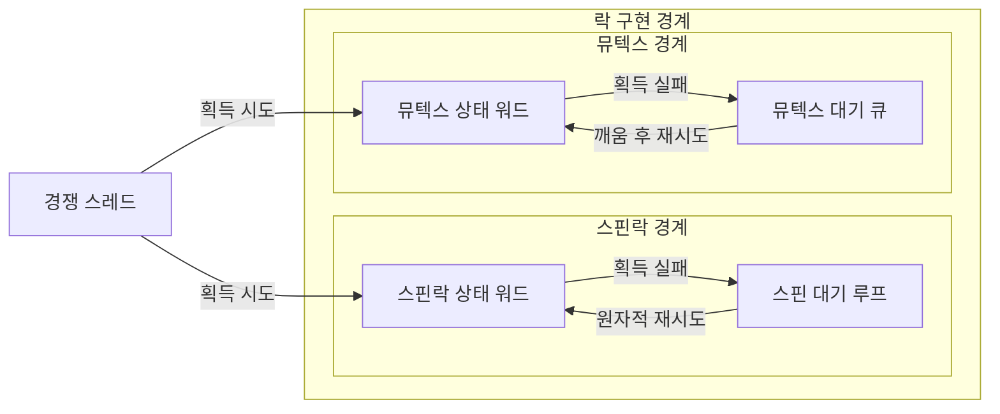
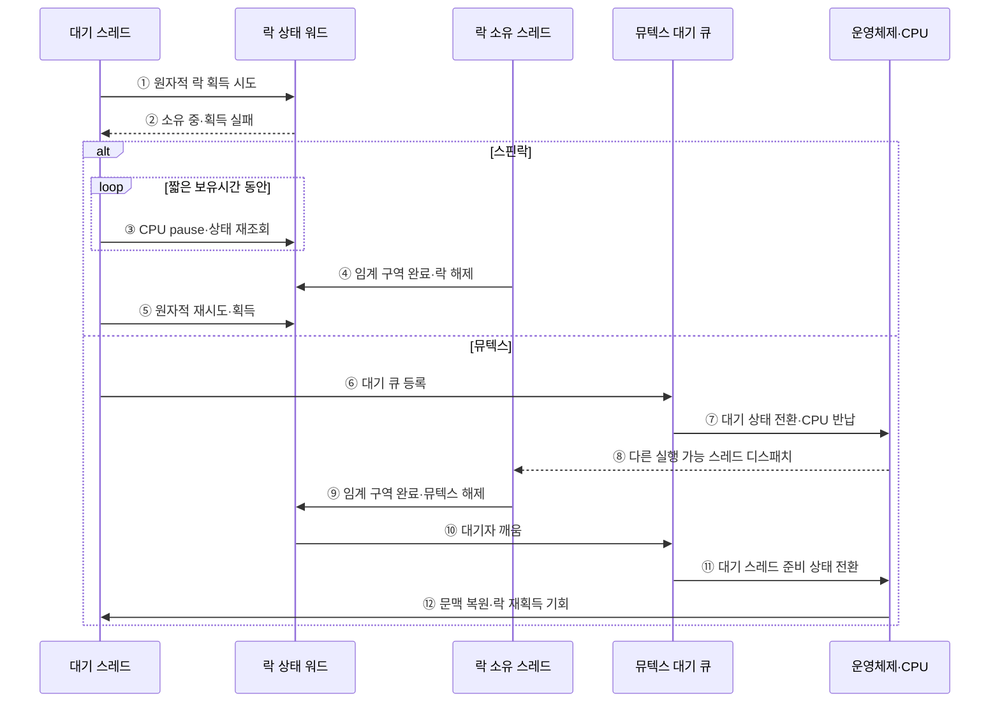

---
sidebar:
  order: 13
  label: "013. 스핀락 vs 뮤텍스 (Spinlock vs Mutex)"
  badge:
    text: "기출 · 50%"
    variant: note
title: 스핀락 vs 뮤텍스 (Spinlock vs Mutex)
date: "2026-07-27T23:59:59+09:00"
tags: [notes-software]
weight: 13
extra:
  question_no: "013"
  source_status: "기출"
  source_history: "123회"
  priority: 50
  priority_note: "123회 기출, 스핀락·뮤텍스 선택 기준"
---

## 미리 알고가기

- **스핀락과 뮤텍스(Spinlock and Mutex)**: 경합 시 반복 검사와 수면으로 대기하는 두 락
- **락 경합(Lock Contention)**: 여러 스레드가 같은 락을 동시에 요청
- **중앙처리장치(Central Processing Unit, CPU)**: 스핀 대기 중 잠금 상태를 반복 검사하는 명령을 실행하는 장치
- **바쁜 대기(Busy Waiting)**: 조건 충족까지 CPU에서 상태를 반복 검사
- **수면 대기(Sleeping Wait)**: 스레드를 대기 큐로 옮겨 CPU를 반납
- **임계 구역(Critical Section)**: 공유 상태를 한 번에 한 스레드만 다루는 코드
- **락 보유시간(Lock Hold Time)**: 획득부터 해제까지 임계 구역을 점유한 시간
- **문맥 전환(Context Switch)**: 실행 상태를 저장하고 다음 상태를 복원
- **원자적 연산(Atomic Operation)**: 중간 상태 노출 없이 락 상태를 한 번에 변경
- **뮤텍스(Mutual Exclusion, Mutex)**: 소유 스레드만 해제할 수 있고 경합한 스레드를 대기 큐에서 수면시키는 단일 잠금
- **상호 배제(Mutual Exclusion)**: 공유 임계 구역에 한 시점에 한 실행 주체만 진입하게 하는 성질
- **상태 워드(State Word)**: 잠김·해제와 경합 여부를 한 기계어 크기 값에 기록해 원자적으로 갱신하는 락 상태 저장소
- **스핀 대기 루프(Spin-wait Loop)**: 락이 풀릴 때까지 상태 워드를 CPU에서 반복 조회하고 원자적으로 재획득을 시도하는 코드
- **소유자 선점(Owner Preemption)**: 락을 가진 스레드가 실행 중단되어 대기자가 스핀해도 락을 해제할 수 없는 상태
- **커널(Kernel)**: 운영체제의 핵심으로 인터럽트·스케줄링·장치를 관리하며 수면할 수 없는 짧은 임계 구역에서 스핀락을 사용함
- **수면 불가 문맥(Non-sleepable Context)**: 현재 실행을 멈추고 스케줄러 대기 큐로 이동할 수 없어 뮤텍스를 사용할 수 없는 커널 실행 상황
- **연결 풀(Connection Pool)**: 재사용 가능한 데이터베이스 연결을 공유하며 긴 경합 시 뮤텍스로 대기 스레드를 수면시키는 구조
- **비교·교환(Compare-and-swap, CAS)**: 상태가 예상값과 같을 때만 새 값으로 바꾸는 원자적 연산
- **CPU 완화 명령(CPU Pause Instruction)**: 스핀 반복 중 처리기 자원 소모를 줄이도록 잠깐 실행을 늦추는 명령
- **빠른 경로(Fast Path)**: 경합이 없을 때 대기 큐나 스케줄러를 거치지 않고 잠금을 즉시 얻는 처리 경로
- **캐시 라인(Cache Line)**: CPU 캐시와 메모리 사이에서 한 번에 전송·일관성을 관리하는 고정 크기 데이터 블록
- **다중 소켓(Multi-socket)**: 두 개 이상의 물리 CPU 패키지가 메모리와 캐시 일관성 통신을 공유하는 구조
- **블로킹 락(Blocking Lock)**: 락을 얻지 못한 스레드를 수면 상태로 전환하는 잠금
- **입출력(Input/Output, I/O)**: 파일·네트워크·장치와 데이터를 주고받는 처리

## Ⅰ. 개요

- 정의/개념: 반복 검사·수면 대기로 **상호배제를 구현하는 잠금 기법**
- 기존 한계: 단일 대기 방식은 **짧은·긴 잠금 보유시간별 비용** 최적화에 한계

### 쉽게 이해하기 (학습용)

- 문이 곧 열리면 앞에서 확인하고 오래 걸리면 대기실에서 잠시 쉬는 편이 낫다.

## Ⅱ. 특징

- 스핀락은 **반복 상태 검사**로 문맥 전환 회피
- 뮤텍스는 **대기 큐 수면**으로 CPU 점유 반납
- **잠금 보유시간·수면 가능 문맥**이 선택 기준

### 쉽게 이해하기 (학습용)

- 스핀락은 문이 열릴 때까지 계속 보고, 뮤텍스는 잠들어 다른 작업이 CPU를 쓰게 한다.

## Ⅲ. 아키텍처

**도표안 A — 구조도**

**도표안 B — sequenceDiagram**

| 설계 요소 | 입력·상태 | 역할 |
|:---|:---|:---|
| 스핀락 상태 워드 | 잠김·해제·소유 상태 | 원자적 락 획득·해제 판정 |
| 스핀 대기 루프 | 획득 실패·CPU 상태 | 상태 반복 조회·재시도 |
| 뮤텍스 상태 워드 | 잠김·소유자·경합 상태 | 소유권·대기 경로 결정 |
| 뮤텍스 대기 큐 | 경합 스레드·깨움 순서 | 수면·재실행 후보 관리 |

**동작 원리**

- ① 상태 워드에 비교·교환으로 락 획득 시도
- ② 다른 스레드가 소유 중이면 빠른 경로 실패
- ③ 스핀락은 CPU 완화 명령과 함께 상태를 제한적으로 재조회
- ④ 소유 스레드가 임계 구역을 끝내고 락 해제
- ⑤ 대기 스레드가 원자적 재시도 후 락 획득
- ⑥ 뮤텍스는 경합 스레드를 대기 큐에 등록
- ⑦ 대기 스레드를 수면 상태로 바꾸고 CPU 반납
- ⑧ CPU에 다른 실행 가능 스레드 디스패치
- ⑨ 소유 스레드가 임계 구역을 끝내고 뮤텍스 해제
- ⑩ 정책에 맞는 대기자 하나를 깨움
- ⑪ 깨운 스레드를 준비 상태로 전환
- ⑫ 문맥 복원 후 락 상태를 다시 확인하고 획득 경쟁

### 쉽게 이해하기 (학습용)

- 곧 풀릴 락은 CPU에서 잠깐 확인하고, 오래 걸릴 락은 대기 큐에서 잠들어 다른 작업에 CPU를 양보한다.

## Ⅳ. 종류 및 비교

| 상호배제 잠금 | 스핀락 | 뮤텍스 |
|:---|:---|:---|
| 적용 기준 | 전환 비용보다 **짧은 보유시간** | 전환 비용보다 **긴 보유시간** |
| 핵심 특징 | CPU에서 **락 상태 반복 조회** | 대기 큐 등록 후 **수면** |
| 한계 | 소유자 선점 시 **CPU 낭비** | 수면 불가 문맥에서 **사용 불가** |

> 요약: 수면 불가·짧은 경합은 스핀락·긴 경합은 뮤텍스

### 쉽게 이해하기 (학습용)

- 잠드는 비용보다 빨리 풀리면 스핀락, 오래 기다려야 하면 뮤텍스가 CPU 낭비를 줄인다.

## Ⅴ. 실무 고려사항 및 대책

| 운영 위험 | 대응 | 기대 효과 |
|:---|:---|:---|
| 소유자가 선점된 동안 대기자가 계속 스핀 | 선점 가능 문맥은 뮤텍스 사용·스핀 상한 적용 | CPU 낭비 방지 |
| 임계 구역 증가로 선택 가정 붕괴 | 락 보유·대기시간 백분위 지속 계측 | 락 방식 재선정 근거 확보 |
| 다중 소켓에서 상태 워드 캐시 라인 왕복 | 락 분할·지역 큐 기반 락과 데이터 지역화 | 일관성 트래픽 감소 |
| 수면 불가 문맥에서 블로킹 락 사용 | 문맥별 허용 락 규칙과 정적·런타임 검사 | 커널 정지·오류 예방 |

### 적용 사례

- 커널의 수면 불가·짧은 임계 구역은 스핀락을 쓰고, 연결 풀처럼 I/O를 포함할 수 있는 경로는 뮤텍스와 시간 제한을 사용한다.

### 쉽게 이해하기 (학습용)

- 커널이 잠들 수 없는 짧은 구간에서는 락이 풀릴 때까지 잠깐 반복 확인한다.

## Ⅵ. 결론

- 락 대기 비용을 최소화하려면 **임계 구역 보유시간과 대기 중 수면 가능 여부**를 검토하고 짧은 비수면 구역은 스핀락, 긴 대기는 뮤텍스를 적용한다.

### 쉽게 이해하기 (학습용)

- 잠들 수 있는지와 락이 얼마나 빨리 풀리는지를 보고 두 락 중 하나를 선택한다.
