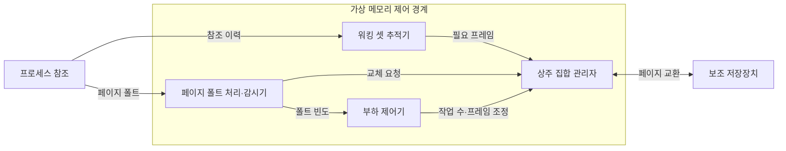
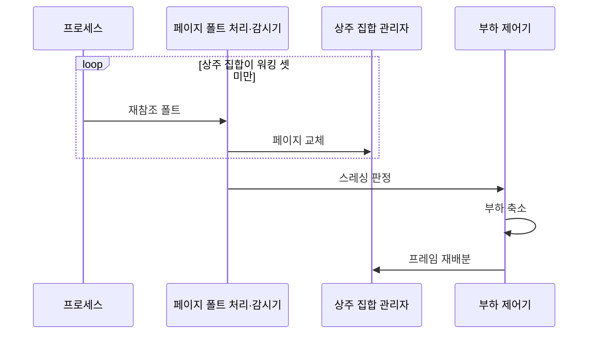

---
sidebar:
  order: 14
  label: "014. 프로세스 스레싱 (Process Thrashing)"
  badge:
    text: "기출 · 70%"
    variant: note
title: 프로세스 스레싱 (Process Thrashing)
date: "2026-07-27T23:59:59+09:00"
tags: [notes-software]
weight: 14
extra:
  question_no: "014"
  source_status: "기출"
  source_history: "129회, 131회"
  priority: 70
  priority_note: "129·131회 반복, 스레싱·워킹 셋 핵심"
---

## 미리 알고가기

- **프로세스 스레싱(Process Thrashing)**: 페이지 교체가 실제 실행을 압도하는 상태
- **가상 메모리(Virtual Memory)**: 페이지를 메모리와 보조 저장장치 사이에 배치
- **페이지 폴트(Page Fault)**: 참조 페이지가 메모리에 없어 발생하는 예외
- **워킹 셋(Working Set)**: 최근 구간에 반복 참조한 페이지 집합
- **상주 집합(Resident Set)**: 프로세스가 물리 메모리에 보유한 프레임 집합
- **페이지 폴트 빈도(Page-Fault Frequency)**: 관찰 구간의 폴트 수로 프레임 부족 추정
- **다중프로그래밍 정도(Degree of Multiprogramming)**: 동시에 메모리에 둔 실행 프로세스 수
- **중앙처리장치(Central Processing Unit, CPU, 시피유)**: 영문 각 단어의 첫 글자를 따 CPU로 표기하며 프로세스 명령을 실행하는 장치
- **입출력(Input/Output, I/O)**: ‘아이오’로 읽고 Input과 Output의 머리글자를 빗금(/)으로 묶는 관례 표기이며 페이지 교환이 저장장치와 메모리 사이에서 만드는 전송 작업
- **물리 프레임(Physical Frame)**: 물리 메모리를 페이지와 같은 크기로 나눈 블록으로서 상주 집합의 실제 저장 공간
- **보조 저장장치(Secondary Storage)**: 비상주 페이지를 보관하고 페이지 폴트 때 물리 메모리로 데이터를 전송하는 대용량 저장장치
- **페이지 교체(Page Replacement)**: 빈 프레임이 없을 때 기존 페이지를 퇴출하고 요구 페이지를 적재해 상주 집합을 바꾸는 동작
- **요구 페이징(Demand Paging)**: 프로세스가 실제 참조해 페이지 폴트가 발생한 시점에만 해당 페이지를 메모리에 적재하는 방식
- **페이지 퇴출·적재(Page Eviction·Load)**: 퇴출은 기존 페이지를 프레임에서 내보내고 적재는 필요한 페이지를 저장장치에서 프레임으로 가져오는 동작
- **부하 제어기(Load Controller)**: 페이지 폴트 빈도와 CPU 이용률로 스레싱을 판정해 동시 프로세스 수와 프레임 배분을 조정하는 구성요소
- **가상 머신·호스트(Virtual Machine·Host)**: 가상 머신은 격리된 운영체제 실행 환경이고 호스트는 여러 가상 머신에 물리 프레임을 배분하는 기반 시스템

## Ⅰ. 개요

- 정의/개념: 반복 페이지 폴트·교체가 **유효 실행을 압도하는 상태**
- 기존 한계: 총 워킹 셋을 못 담는 프레임은 **교체 I/O·CPU 유휴** 증가

### 쉽게 이해하기 (학습용)

- 책상보다 자주 쓰는 자료가 많아 창고에서 꺼내고 넣는 일만 반복하는 상태다

## Ⅱ. 특징

- **워킹 셋 미수용**으로 재참조 페이지 폴트 반복
- **페이지 교체 I/O 증가**로 CPU 이용률·처리량 저하
- **실행 작업 수 축소·프레임 재배분**으로 정상 상태 복귀

### 쉽게 이해하기 (학습용)

- 일을 늘리면 처음에는 CPU가 바빠지지만 메모리가 모자라면 자료 교체만 하느라 실제 처리가 줄어든다

## Ⅲ. 아키텍처 및 구성요소

| 설계 요소 | 설명 |
|:---|:---|
| 워킹 셋 추적기 | 참조 구간에서 반복 사용 페이지 추정 |
| 상주 집합 관리자 | 물리 프레임 할당과 페이지 교체 관리 |
| 페이지 폴트 처리·감시기 | 폴트 처리와 시간 구간별 빈도 집계 |
| 부하 제어기 | 스레싱 시 작업 수 축소·프레임 재배분 |

> 요약: 워킹 셋 추적·폴트 감시를 상주 집합 배분에 연결

### 쉽게 이해하기 (학습용)

- 운영체제는 자주 쓰는 자료량과 창고 왕복 횟수를 보고 책상 크기와 동시 작업 수를 조정한다

## Ⅳ. 원리 및 절차 흐름도

| 절차 | 설명 |
|:---|:---|
| 재참조 폴트 | 최근 사용 페이지 퇴출 후 재참조 폴트 |
| 페이지 교체 | 기존 페이지 퇴출 후 요구 페이지 적재 |
| 스레싱 판정 | 폴트 빈도 상한·CPU 이용률 하락 감지 |
| 부하 축소 | 프로세스를 일시 중단해 동시 작업 수 축소 |
| 프레임 재배분 | 회수 프레임을 남은 워킹 셋에 배분 |

> 요약: 반복 폴트 판정 후 작업 수를 줄여 프레임 회복

### 쉽게 이해하기 (학습용)

- 자주 쓰는 자료까지 계속 쫓겨나면 일부 일을 멈추고 남은 일에 더 큰 책상을 나눠 준다

## Ⅴ. 종류 및 비교

| 메모리 실행 상태 | 스레싱 | 정상 요구 페이징 |
|:---|:---|:---|
| 적용 기준 | 작업 수 축소·**프레임 재배분** | 기존 할당·**교체 정책 유지** |
| 핵심 특징 | 워킹 셋 미수용·**반복 폴트** | 워킹 셋 수용·**간헐적 폴트** |
| 한계 | 교체 I/O가 **유효 실행 압도** | 부하 증가 시 **스레싱 전이** |

> 요약: 워킹 셋 미수용·반복 폴트로 스레싱 판정

### 쉽게 이해하기 (학습용)

- 자주 쓰는 자료가 책상에 머물면 정상이고 방금 가져온 자료가 다시 쫓겨나면 스레싱이다

## Ⅵ. 실무 사례

1. 서버는 **폴트 빈도 상한 초과** 시 작업 수 제한

### 쉽게 이해하기 (학습용)

- 서버의 창고 왕복이 기준을 넘으면 동시에 실행할 작업을 줄인다

## Ⅶ. 결론

- 폴트 상한 초과 시 **작업 축소·워킹 셋 프레임 보장**

### 쉽게 이해하기 (학습용)

- 창고 왕복이 기준을 넘으면 일을 줄이고 남은 일의 자주 쓰는 자료가 책상에 머물게 한다
