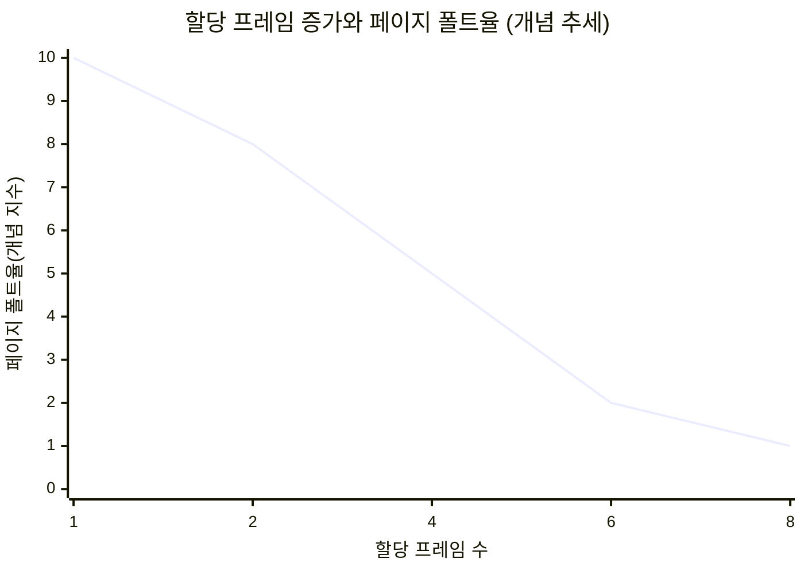
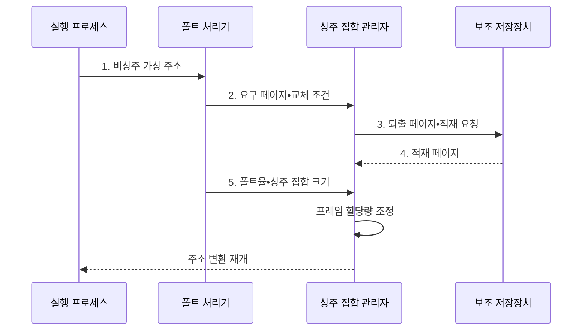

---
sidebar:
  order: 14
  label: "014. 프로세스 스레싱 (Process Thrashing)"
  badge:
    text: "기출 • 70%"
    variant: note
title: 프로세스 스레싱 (Process Thrashing)
date: "2026-08-03T09:20:00+09:00"
tags: [notes-software]
weight: 14
extra:
  question_no: "014"
  source_status: "기출"
  source_history: "129회, 131회"
  priority: 70
  priority_note: "129•131회 반복, 스레싱•워킹 셋 핵심"
---

## Ⅰ. 개요

핵심 용어

- **프로세스 스레싱(Process Thrashing)**: 페이지 교체가 유효한 프로세스 실행을 압도하는 가상 메모리 성능 붕괴 상태
- **워킹 셋(Working Set)**: 최근 구간에 프로세스가 반복 참조한 페이지 집합

- 정의/개념: **프로세스 스레싱** 은 워킹 셋이 할당 프레임을 넘어 페이지 교체 작업이 유효한 실행을 압도하는 **가상 메모리 성능 붕괴 상태**
- 배경/필요성: 프로세스별 워킹 셋을 무시한 프레임 배분으로 **교체 I/O•CPU 유휴 증가**

#### 한줄 요약

- 책상보다 자주 쓰는 자료가 많아 창고에서 꺼내고 넣는 일만 반복하는 상태다.

## Ⅱ. 특징

핵심 용어

- **페이지 폴트율**: 관찰 구간의 페이지 참조 중 비상주 페이지 예외가 발생한 비율
- **다중프로그래밍 정도(Degree of Multiprogramming)**: 동시에 메모리에 둔 실행 프로세스 수

> 할당 프레임이 **워킹 셋** 을 충족한 뒤 **페이지 폴트율** 감소 폭 축소

- **워킹 셋 미수용** 으로 재참조 페이지 폴트 반복
- **페이지 교체 I/O 증가** 로 CPU 이용률•처리량 저하
- **다중프로그래밍 정도 증가** 가 프레임 부족•처리량 붕괴를 증폭

#### 한줄 요약

- 일을 늘리면 처음에는 CPU가 바빠지지만 메모리가 모자라면 자료 교체만 하느라 실제 처리가 줄어든다.

## Ⅲ. 구조 및 구성요소

핵심 용어

- **상주 집합(Resident Set)**: 프로세스가 물리 메모리에 보유한 프레임 집합
- **부하 제어기(Load Controller)**: 폴트율과 CPU 이용률로 스레싱을 판정해 작업 수와 프레임 배분을 조정하는 구성요소
- **워킹 셋 추적기•상주 집합 관리자**: 최근 참조 페이지를 추적해 필요 프레임을 추정하고 실제 물리 프레임의 할당•교체를 수행하는 구성요소
- **페이지 폴트 감시기**: 프로세스별 폴트 빈도와 재참조 교체를 계측해 스레싱 징후를 탐지하는 구성요소

| 구성요소 | 책임 |
|:---|:---|
| 실행 프로세스 | **페이지 참조 생성** |
| 워킹 셋 추적기 | **필요 프레임 수 추정** |
| 상주 집합 관리자 | **프레임 할당•교체** |
| 페이지 폴트 감시기 | **반복 폴트 탐지** |
| 부하 제어기 | **작업 수•프레임 조정** |

#### 한줄 요약

- 운영체제는 자주 쓰는 자료량과 창고 왕복 횟수를 보고 책상 크기와 동시 작업 수를 조정한다.

## Ⅳ. 흐름도

핵심 용어

- **페이지 교체(Page Replacement)**: 빈 프레임이 없을 때 기존 페이지를 퇴출하고 요구 페이지를 적재하는 동작
- **보조 저장장치(Secondary Storage)**: 비상주 페이지를 보관하고 폴트 때 물리 메모리로 전송하는 저장장치
- **페이지 테이블(Page Table)**: 가상 페이지와 물리 프레임의 주소 대응 및 상주 여부를 기록하는 표

**동작 원리**

- **1. 비상주 가상 주소**: 페이지 테이블 조회 실패로 폴트 처리 진입
- **2. 요구 페이지•교체 조건**: 빈 프레임 유무와 퇴출 후보 전달
- **3. 퇴출 페이지•적재 요청**: 기존 페이지 저장과 요구 페이지 읽기 요청
- **4. 적재 페이지**: 물리 프레임에 페이지를 넣고 주소 매핑 갱신
- **5. 폴트율•상주 집합 크기**: 워킹 셋 미수용과 반복 교체 여부 판정

#### 한줄 요약

- 창고 왕복이 많아지면 작업 수를 줄이고 책상을 넓힌다.

## Ⅴ. 종류 및 비교

핵심 용어

- **요구 페이징(Demand Paging)**: 실제 참조로 페이지 폴트가 발생한 시점에만 페이지를 메모리에 적재하는 방식
- **스레싱(Thrashing)**: 작업 집합을 담지 못해 페이지를 반복 교체하면서 유효 실행보다 입출력에 더 많은 시간을 쓰는 상태
- **스레싱 전이(Thrashing Transition)**: 메모리 수요가 가용 프레임을 넘어 정상 요구 페이징이 반복 교체로 바뀌는 지점

| 가상 메모리 상태 | 관측 징후 | 운영 의미 |
|:---|:---|:---|
| **정상 요구 페이징** | 워킹 셋 수용•**간헐적 폴트** | 폴트 처리 뒤 유효 실행이 계속 증가 |
| **스레싱** | 워킹 셋 미수용•**반복 교체** | 교체 입출력이 유효 실행을 압도해 처리량 하락 |
| **스레싱 전이** | 프레임 수요가 가용량을 넘는 경계 | 작업 수 축소•프레임 재배분 판단 시점 |

> 요약: **워킹 셋 미수용•반복 폴트** 가 겹치면 **스레싱** 판정

#### 한줄 요약

- 자주 쓰는 자료가 책상에 머물면 정상이고 방금 가져온 자료가 다시 쫓겨나면 스레싱이다.

## Ⅵ. 실무 고려사항 및 대책

핵심 용어

- **주요•경미 페이지 폴트(Major•Minor Page Fault)**: 저장장치 읽기가 필요한 폴트와 메모리 주소 매핑만 복구하는 폴트
- **수용 제어(Admission Control)**: 메모리 여유를 검사해 새 작업의 실행 허용 여부를 결정하는 절차
- **재참조•교체량**: 최근 퇴출한 페이지를 다시 요구한 횟수와 메모리•저장장치 사이에서 바꾼 페이지 양
- **교환 I/O(Swap I/O)**: 메모리 압박 때 페이지를 보조 저장장치로 내보내거나 다시 읽는 입출력

| 문제 | 대책 | 효과 |
|:---|:---|:---|
| 파일 최초 접근 폴트와 재참조 **스레싱 혼동** | 주요•경미 폴트와 **재참조•교체량 분리 계측** | 정확한 **스레싱 판정** |
| 전체 평균이 특정 프로세스의 **워킹 셋 부족 은폐** | 프로세스•컨테이너별 **폴트율•상주 집합 감시** | **메모리 병목 주체** 식별 |
| 메모리 압박 중 작업을 추가해 **프레임 부족 악화** | **수용 제어•동시 작업 축소** 와 최소 워킹 셋 보장 | **처리량 붕괴** 방지 |
| 교환 I/O가 저장장치의 **정상 요청 지연** | 교환 한도•우선순위와 **메모리 증설•작업 중단** | 연쇄 **I/O 지연** 완화 |

#### 한줄 요약

- 서버의 창고 왕복이 기준을 넘으면 동시에 실행할 작업을 줄인다.

## Ⅶ. 결론

핵심 용어

- **폴트율 상한•워킹 셋 수용**: 스레싱 판정과 작업 수•프레임 재배분을 결정하는 기준

- **폴트율 상한** 을 넘고 워킹 셋이 미수용되면 **작업 수 축소•프레임 재배분**

#### 한줄 요약

- 창고 왕복이 기준을 넘으면 일을 줄이고 남은 일의 자주 쓰는 자료가 책상에 머물게 한다.
