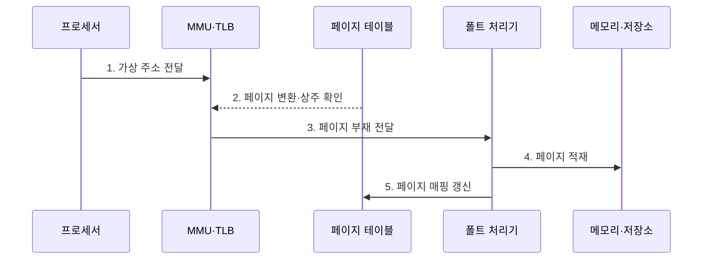

---
sidebar:
  order: 15
  label: "015. 가상 메모리·페이징·세그멘테이션 (Virtual Memory)"
  badge:
    text: "기출 · 70%"
    variant: note
title: "가상 메모리·페이징·세그멘테이션 (Virtual Memory)"
date: "2026-07-27T23:59:59+09:00"
tags:
  - "notes-software"
weight: 15
extra:
  question_no: "015"
  source_status: "기출"
  source_history: "120회, 125회, 126회"
  priority: 70
  priority_note: "120·125·126회 반복, 가상 메모리 구조 핵심"
---

## 미리 알고가기

- **가상 메모리(Virtual Memory)**: 가상 주소를 물리 메모리·저장소에 연결하는 메모리 관리
- **페이징(Paging)**: 가상 페이지를 물리 프레임에 매핑하는 고정 크기 분할
- **세그멘테이션(Segmentation)**: 코드·데이터·스택을 가변 크기 논리 영역으로 분할
- **페이지(Page)·프레임(Frame)**: 가상·물리 메모리의 같은 크기 블록
- **메모리 관리 장치(Memory Management Unit, MMU)**: 가상 주소를 물리 주소로 변환하고 접근 권한을 검사하는 장치
- **변환 색인 버퍼(Translation Lookaside Buffer, TLB)**: 최근 가상·물리 주소 변환 결과를 보관하는 캐시
- **페이지 테이블(Page Table)**: 가상 페이지의 프레임·권한·상주 상태 저장
- **페이지 폴트(Page Fault)**: 페이지 부재·권한 위반 시 발생하는 예외
- **후면 저장소(Backing Store)**: 비상주 페이지를 보관하는 보조기억장치
- **가상·물리 주소(Virtual·Physical Address)**: 가상 주소는 프로세스가 생성한 논리 위치이고 물리 주소는 MMU 변환 뒤 실제 메모리 프레임을 가리키는 위치
- **주소 공간(Address Space)**: 프로세스가 사용할 수 있는 가상 주소 범위로서 다른 프로세스의 메모리와 격리됨
- **접근 권한(Access Permission)**: 페이지별 읽기·쓰기·실행 가능 여부를 지정해 허용되지 않은 메모리 접근을 예외로 차단하는 속성
- **상주·비상주(Resident·Non-resident)**: 상주는 페이지가 물리 프레임에 있는 상태이고 비상주는 후면 저장소에 있어 접근 전 적재가 필요한 상태
- **요구 적재(Demand Loading)**: 페이지를 미리 모두 올리지 않고 최초 접근으로 부재 예외가 발생할 때만 후면 저장소에서 적재하는 방식
- **교환 데이터(Swap Data)**: 물리 메모리에서 밀려난 익명 페이지를 후면 저장소의 교환 영역에 보관한 데이터
- **내부·외부 단편화(Internal·External Fragmentation)**: 내부 단편화는 고정 블록 안의 빈 공간이고 외부 단편화는 가변 영역 사이에 흩어진 연속 사용 불가 공간
- **대형 페이지(Huge Page)**: 기본 페이지보다 큰 고정 크기 페이지로서 하나의 TLB 항목이 변환하는 메모리 범위를 넓힘
- **데이터베이스 버퍼 풀(Database Buffer Pool)**: 디스크 페이지를 메모리에 캐시하며 대형 페이지로 TLB 변환 항목 사용량을 줄일 수 있는 영역
- **프로세스 로더(Process Loader)**: 실행 파일의 코드·데이터를 가상 주소 공간에 매핑하고 페이지별 접근 권한을 설정하는 운영체제 구성요소
- **요구 페이징(Demand Paging)**: 실제로 참조한 페이지가 없을 때만 후면 저장소에서 물리 메모리로 적재하는 방식
- **TLB 미스(TLB Miss)**: 찾는 주소 변환 항목이 TLB에 없어 페이지 테이블을 추가 조회해야 하는 상태
- **TLB 무효화(TLB Invalidation)**: 페이지 매핑이 바뀔 때 오래된 TLB 변환 항목을 제거하는 동작
- **주소 공간 배치 무작위화(Address Space Layout Randomization, ASLR)**: 코드·데이터·스택의 가상 주소를 실행마다 바꿔 공격자가 위치를 예측하기 어렵게 하는 보호 기법
- **쓰기·실행 분리(Write XOR Execute, W^X)**: 한 메모리 페이지에 쓰기와 실행 권한을 동시에 허용하지 않는 원칙
- **워킹 셋(Working Set)**: 프로세스가 최근에 반복 참조해 물리 메모리에 유지할 필요가 있는 페이지 집합
- **주요 페이지 폴트(Major Page Fault)**: 페이지를 저장장치에서 읽어 와야 해 큰 지연이 발생하는 페이지 폴트
- **수용 제어(Admission Control)**: 메모리 여유를 검사해 새 작업의 실행 허용 여부를 결정하는 절차

## Ⅰ. 개요

- 정의/개념: 프로세스의 **가상 주소를 물리 메모리에 매핑**하는 기법
- 배경/필요성: 물리 주소 직접 사용의 **격리·할당 한계** 해소

### 쉽게 이해하기 (학습용)

- 프로그램마다 큰 주소 지도를 주고 지금 쓰는 부분만 실제 메모리에 연결한다.

## Ⅱ. 특징

- **가상·물리 주소 분리**로 프로세스별 주소 공간 격리
- **요구 페이징**으로 필요한 페이지만 물리 메모리에 적재
- **페이지 테이블·TLB**로 주소 변환·권한 검사

### 쉽게 이해하기 (학습용)

- 프로그램이 보는 주소 지도 크기와 실제 메모리에 올라온 양은 서로 다를 수 있다.

## Ⅲ. 구조 및 구성요소

| 구성요소 | 책임 |
|:---|:---|
| 프로세서 | **가상 주소·접근 생성** |
| MMU·TLB | **변환 조회·권한 검사** |
| 페이지 테이블 | **프레임·권한·상주 저장** |
| 페이지 폴트 처리기 | **부재·위반 처리** |
| 물리 메모리·후면 저장소 | **상주·비상주 페이지 보관** |

### 쉽게 이해하기 (학습용)

- 장부가 메모리 위치를 알려 주고 없는 내용은 보조기억장치에서 가져온다.

## Ⅳ. 흐름도

**동작 원리**

- **1. 가상 주소 전달**: 접근 유형 포함
- **2. 페이지 변환·상주 확인**: TLB 미스와 비상주 상태 판정
- **3. 페이지 부재 전달**: 예외 처리
- **4. 페이지 적재**: 프레임 확보 후 저장소에서 적재
- **5. 페이지 매핑 갱신**: 권한·상주 반영

### 쉽게 이해하기 (학습용)

- 장부에 없는 내용은 저장소에서 가져와 새 위치를 기록한다.

## Ⅴ. 종류 및 비교

| 구분 | 페이징 | 세그멘테이션 |
|:---|:---|:---|
| 적용 기준 | 비연속 메모리의 **균일 할당** | 논리 영역별 **보호·공유** |
| 핵심 특징 | 고정 페이지·**비연속 프레임** | 가변 논리 영역·**연속 공간** |
| 한계 | 내부 단편화·**페이지 테이블 비용** | 외부 단편화·**연속 공간 필요** |

> 요약: 비연속 할당은 페이징, 논리 영역 보호는 세그멘테이션

### 쉽게 이해하기 (학습용)

- 같은 상자는 내부 빈틈, 맞춤 구역은 구역 사이 빈틈이 생긴다.

## Ⅵ. 실무 고려사항 및 대책

| 고려사항 | 대책 | 효과 |
|:---|:---|:---|
| 읽기·쓰기·실행 권한 과다 부여 | 최소 권한·쓰기와 실행 분리·주소 배치 무작위화 | 메모리 공격면 축소 |
| 대형 페이지가 내부 낭비·회수 지연 유발 | TLB 미스·사용률·회수 비용 기반 선택적 적용 | 성능·유연성 균형 |
| 메모리 압박으로 교환·페이지 폴트 급증 | 워킹 셋·주요 폴트·교환량 감시와 한도·수용 제어 | 스레싱 예방 |
| 페이지 테이블·TLB 무효화 비용 확대 | 매핑 변경을 묶어 처리하고 무효화 지연 계측 | 다중 코어 확장성 향상 |

### 쉽게 이해하기 (학습용)

- 데이터베이스는 큰 상자를 써서 같은 번역 장부로 더 넓은 메모리를 찾는다.

## Ⅶ. 결론

- 단편화·보호 단위로 **페이징·세그멘테이션**을 조합

### 쉽게 이해하기 (학습용)

- 빈틈과 보호 구역을 보고 같은 크기 상자와 논리 구역을 조합한다.
