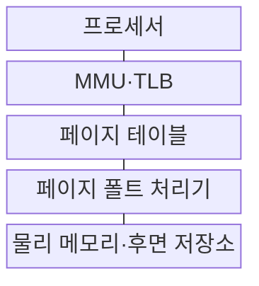
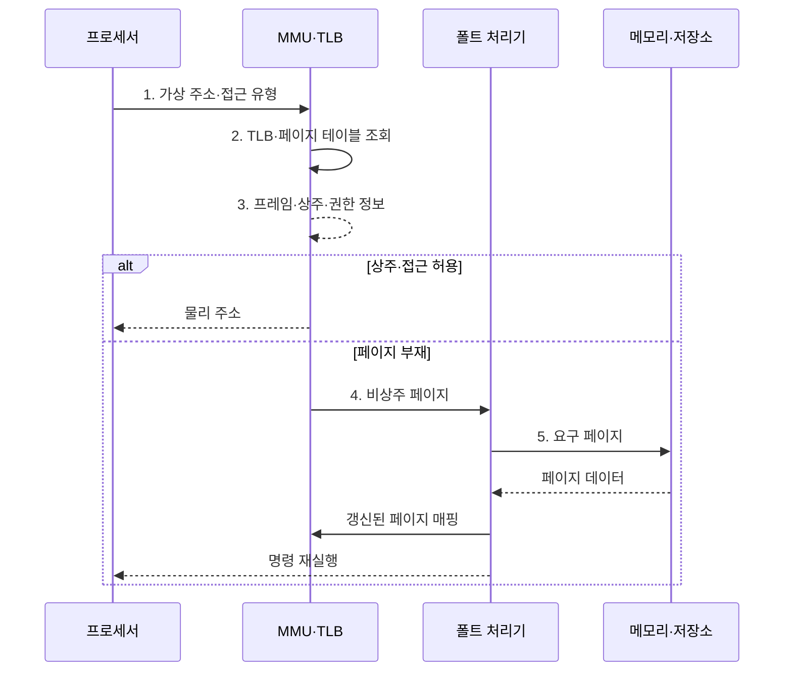

---
sidebar:
  order: 15
  label: "015. 가상 메모리·페이징·세그멘테이션 (Virtual Memory)"
  badge:
    text: "기출 · 70%"
    variant: note
title: "가상 메모리·페이징·세그멘테이션 (Virtual Memory)"
date: "2026-08-02T12:00:00+09:00"
tags:
  - "notes-software"
weight: 15
extra:
  question_no: "015"
  source_status: "기출"
  source_history: "120회, 125회, 126회"
  priority: 70
  priority_note: "120·125·126회 반복, 가상 메모리 구조 핵심"
---

## Ⅰ. 개요

핵심 용어

- **가상 메모리(Virtual Memory)**: 프로세스의 가상 주소를 물리 메모리와 후면 저장소에 연결하는 메모리 관리 기법

- 정의/개념: **가상 메모리**는 프로세스의 가상 주소를 물리 메모리와 후면 저장소에 매핑해 독립된 주소 공간을 제공하는 **메모리 관리 기법**
- 배경/필요성: 프로세스가 물리 메모리 배치를 직접 관리하면 **격리•재배치•탄력적 할당이 제약**

#### 한줄 요약

- 프로그램마다 큰 주소 지도를 주고 지금 쓰는 부분만 실제 메모리에 연결한다.

## Ⅱ. 특징

핵심 용어

- **요구 페이징(Demand Paging)**: 실제 참조한 페이지가 없을 때만 후면 저장소에서 메모리로 적재하는 방식
- **변환 색인 버퍼(Translation Lookaside Buffer, TLB)**: 최근 가상·물리 주소 변환 결과를 보관하는 캐시
- **페이지 테이블(Page Table)**: 가상 페이지의 물리 프레임·접근 권한·상주 여부를 기록하는 표

- **가상·물리 주소 분리**로 프로세스별 주소 공간 격리
- **요구 페이징**으로 필요한 페이지만 물리 메모리에 적재
- **페이지 테이블·TLB**로 주소 변환·권한 검사

#### 한줄 요약

- 프로그램이 보는 주소 지도 크기와 실제 메모리에 올라온 양은 서로 다를 수 있다.

## Ⅲ. 구조 및 구성요소

핵심 용어

- **메모리 관리 장치(Memory Management Unit, MMU)**: 가상 주소를 물리 주소로 변환하고 접근 권한을 검사하는 장치
- **페이지 테이블(Page Table)**: 가상 페이지의 프레임·권한·상주 상태를 저장하는 표
- **후면 저장소(Backing Store)**: 비상주 페이지를 보관하는 보조기억장치
- **페이지 폴트 처리기(Page-fault Handler)**: 페이지 부재면 적재·매핑 갱신 후 명령을 재실행하고 권한 위반이면 접근을 차단하는 커널 구성요소

| 구성요소 | 책임 |
|:---|:---|
| 프로세서 | **가상 주소·접근 생성** |
| MMU·TLB | **변환 조회·권한 검사** |
| 페이지 테이블 | **프레임·권한·상주 저장** |
| 페이지 폴트 처리기 | **부재·위반 처리** |
| 물리 메모리·후면 저장소 | **상주·비상주 페이지 보관** |

#### 한줄 요약

- 장부가 메모리 위치를 알려 주고 없는 내용은 보조기억장치에서 가져온다.

## Ⅳ. 흐름도

핵심 용어

- **TLB 미스(TLB Miss)**: 찾는 주소 변환 항목이 TLB에 없어 페이지 테이블을 추가 조회하는 상태
- **페이지 폴트(Page Fault)**: 페이지 부재나 권한 위반으로 주소 변환을 완료하지 못해 발생하는 예외

**동작 원리**

- **1. 가상 주소·접근 유형**: 프로세서가 변환할 주소와 연산 권한 전달
- **2. TLB·페이지 테이블 조회**: TLB 미스 시 가상 페이지와 접근 유형으로 페이지 테이블 조회
- **3. 프레임·상주·권한 정보**: 주소 변환과 접근 허용 여부 판정
- **4. 비상주 페이지**: 페이지 부재 예외 처리 진입
- **5. 요구 페이지**: 프레임 확보 후 저장소에서 페이지 적재

#### 한줄 요약

- 장부에 없는 내용은 저장소에서 가져와 새 위치를 기록한다.

## Ⅴ. 종류 및 비교

핵심 용어

- **페이징(Paging)**: 가상 페이지를 같은 크기의 물리 프레임에 매핑하는 고정 크기 분할
- **세그멘테이션(Segmentation)**: 코드·데이터·스택을 가변 크기 논리 영역으로 나누는 분할
- **내부·외부 단편화**: 고정 블록 안의 빈 공간과 가변 영역 사이에 흩어진 연속 사용 불가 공간

| 메모리 분할 방식 | 페이징 | 세그멘테이션 |
|:---|:---|:---|
| 적용 기준 | 비연속 메모리의 **균일 할당** | 논리 영역별 **보호·공유** |
| 핵심 특징 | 고정 페이지·**비연속 프레임** | 가변 논리 영역·**연속 공간** |
| 한계 | 내부 단편화·**페이지 테이블 비용** | 외부 단편화·**연속 공간 필요** |

> 요약: **비연속 할당**은 페이징, **논리 영역 보호**는 세그멘테이션

#### 한줄 요약

- 같은 상자는 내부 빈틈, 맞춤 구역은 구역 사이 빈틈이 생긴다.

## Ⅵ. 실무 고려사항 및 대책

핵심 용어

- **쓰기·실행 분리(Write XOR Execute, W^X)**: 한 페이지에 쓰기와 실행 권한을 동시에 허용하지 않는 원칙
- **주소 공간 배치 무작위화(Address Space Layout Randomization, ASLR)**: 코드·데이터·스택 주소를 실행마다 바꾸는 보호 기법
- **대형 페이지(Huge Page)**: 하나의 TLB 항목이 더 넓은 메모리 범위를 변환하도록 키운 페이지
- **워킹 셋(Working Set)**: 프로세스가 최근 반복 참조해 메모리에 유지할 필요가 있는 페이지 집합
- **TLB 무효화(TLB Invalidation)**: 페이지 매핑 변경 때 오래된 TLB 변환 항목을 제거하는 동작
- **주요 페이지 폴트(Major Page Fault)**: 요구 페이지를 저장장치에서 읽어야 해 큰 지연이 발생하는 페이지 폴트
- **교환량·수용 제어**: 교환량은 메모리와 저장장치 사이를 이동한 페이지 양이고, 수용 제어는 메모리 여유에 따라 새 작업 허용을 정한다.
- **스레싱(Thrashing)**: 워킹 셋이 메모리에 머물지 못해 페이지 교체가 실제 실행을 압도하는 상태

| 문제 | 대책 | 효과 |
|:---|:---|:---|
| 쓰기·실행 권한을 함께 부여해 **코드 주입 위험 증가** | **W^X·ASLR**과 페이지별 최소 권한 적용 | **메모리 공격면** 축소 |
| 대형 페이지가 **내부 단편화·회수 지연 유발** | TLB 미스·사용률·회수 비용에 따라 **선택 적용** | **변환 성능·회수 유연성** 균형 |
| 메모리 압박으로 **교환·주요 페이지 폴트 급증** | **워킹 셋·교환량 감시**와 한도·수용 제어 | **스레싱** 예방 |
| 매핑 변경이 잦아 **TLB 무효화 비용 확대** | 변경을 묶어 처리하고 **무효화 지연 계측** | **다중 코어 확장성** 향상 |

#### 한줄 요약

- 데이터베이스는 큰 상자를 써서 같은 번역 장부로 더 넓은 메모리를 찾는다.

## Ⅶ. 결론

핵심 용어

- **비연속 할당·논리 영역 보호**: 페이징과 세그멘테이션 중 분할 방식을 선택하는 기준

- 비연속 할당은 **페이징**, 논리 영역 보호는 **세그멘테이션** 적용

#### 한줄 요약

- 빈틈과 보호 구역을 보고 같은 크기 상자와 논리 구역을 조합한다.
