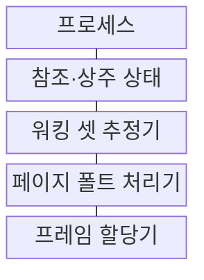
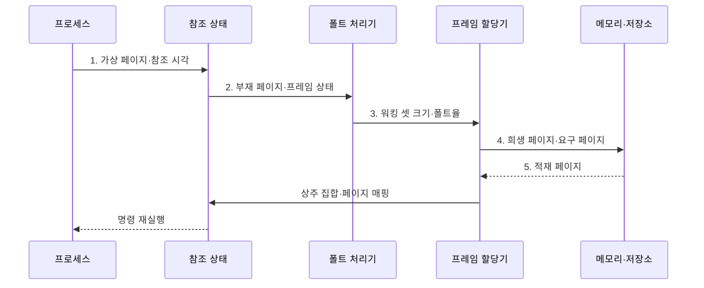

---
sidebar:
  order: 16
  label: "016. 워킹 셋·페이지 폴트 (Working Set·Page Fault)"
  badge:
    text: "기출 · 50%"
    variant: note
title: 워킹 셋·페이지 폴트 (Working Set·Page Fault)
date: "2026-08-02T12:00:00+09:00"
tags: [notes-software]
weight: 16
extra:
  question_no: "016"
  source_status: "기출"
  source_history: "131회"
  priority: 50
  priority_note: "131회 기출, 워킹 셋·페이지 폴트 제어"
---

## Ⅰ. 개요

핵심 용어

- **워킹 셋(Working Set)**: 최근 참조 창에서 프로세스가 사용한 페이지 집합
- **페이지 폴트(Page Fault)**: 참조한 페이지가 물리 메모리에 없을 때 발생하는 예외

- 정의/개념: **워킹 셋•페이지 폴트 제어**는 최근 참조 페이지 집합과 폴트율로 프로세스의 프레임 수요와 부족 상태를 판단하는 **동적 메모리 할당 기법**
- 배경/필요성: 고정 프레임 배분은 지역성 변화에 맞추지 못해 **반복 폴트·스레싱 유발**

#### 한줄 요약

- 최근에 쓰는 자료 묶음만큼 책상을 주고 창고 왕복이 늘면 공간을 다시 조정한다.

## Ⅱ. 특징

핵심 용어

- **참조 창(Reference Window)**: 워킹 셋에 포함할 페이지를 정하는 시간 또는 참조 횟수 범위
- **상주 집합(Resident Set)**: 프로세스가 물리 메모리에 보유한 페이지 집합
- **페이지 폴트 빈도(Page Fault Frequency, PFF)**: 단위 시간 또는 메모리 참조당 페이지 폴트 발생률

- **최근 참조 창**으로 현재 지역성의 워킹 셋 추정
- **상주 집합 부족** 시 재참조 페이지 폴트 증가
- **페이지 폴트 빈도**로 워킹 셋 미수용 상태를 온라인 감지

#### 한줄 요약

- 기록 범위를 넓히면 필요한 자료를 덜 빠뜨리지만 책상에 둘 자료를 더 많이 잡는다.

## Ⅲ. 구조 및 구성요소

핵심 용어

- **희생 페이지(Victim Page)**: 빈 프레임이 없을 때 교체 정책이 퇴출 대상으로 고른 상주 페이지
- **프레임 할당기**: 프로세스별 물리 프레임의 할당·회수와 희생 페이지 선택을 수행하는 구성요소

| 구성요소 | 책임 |
|:---|:---|
| 프로세스 | **가상 페이지 참조** |
| 참조·상주 상태 | **이력·상주 관계 기록** |
| 워킹 셋 추정기 | **목표 프레임 계산** |
| 페이지 폴트 처리기 | **페이지 적재·재실행** |
| 프레임 할당기 | **할당·회수·희생 선택** |

#### 한줄 요약

- 최근 사용 기록으로 책상 크기를 정하고 없는 자료를 찾으면 창고에서 가져와 다시 실행한다.

## Ⅳ. 흐름도

핵심 용어

- **부재 페이지**: 프로세스가 참조했지만 현재 상주 집합에는 없는 가상 페이지
- **물리 프레임(Physical Frame)**: 물리 메모리를 페이지와 같은 크기로 나눈 저장 블록

**동작 원리**

- **1. 가상 페이지·참조 시각**: 참조 창에 페이지 접근 이력 반영
- **2. 부재 페이지·프레임 상태**: 페이지 폴트와 상주 집합 부족 전달
- **3. 워킹 셋 크기·폴트율**: 필요 프레임 수와 부족 정도 산정
- **4. 희생 페이지·요구 페이지**: 퇴출 대상과 적재 대상을 저장소에 전달
- **5. 적재 페이지**: 물리 프레임에 넣고 상주 집합 갱신

#### 한줄 요약

- 최근 사용 기록과 창고 왕복 횟수로 책상 크기를 조정한다.

## Ⅴ. 종류 및 비교

핵심 용어

- **워킹 셋 방식**: 참조 창의 페이지 집합으로 목표 프레임 수요를 추정하는 방식
- **페이지 폴트 빈도 방식**: 실행 중 관측한 폴트율로 프레임 부족을 사후 감지하는 방식

| 프레임 수요 판단 방식 | 워킹 셋 | 페이지 폴트 빈도 |
|:---|:---|:---|
| 적용 기준 | 참조 이력·**집합 추적 가능** | 저비용 **온라인 제어** |
| 핵심 특징 | 참조 창으로 **목표 집합 추정** | 폴트율로 **부족 상태 감지** |
| 한계 | 창 크기별 **추정 오차** | 부족 상태 **사후 감지** |

> 요약: **워킹 셋**은 필요량 추정, **폴트 빈도**는 부족 감지

#### 한줄 요약

- 사용 기록을 자세히 모으면 필요한 책상 크기를 잡고, 창고 왕복만 세면 부족 여부를 빠르게 안다.

## Ⅵ. 실무 고려사항 및 대책

핵심 용어

- **참조 지역성(Locality of Reference)**: 가까운 시점에 일부 페이지를 반복 참조하는 성질
- **감쇠·다중 시간창**: 오래된 참조 영향을 줄이고 짧은·긴 관찰 구간을 함께 쓰는 추정 방식
- **주요·경미 페이지 폴트**: 저장장치 I/O가 필요한 폴트와 주소 매핑만 복구하면 되는 폴트
- **꼬리 지연(Tail Latency)**: 요청 지연 분포에서 가장 느린 일부 요청의 지연

| 문제 | 대책 | 효과 |
|:---|:---|:---|
| 짧은 참조 창이 순환 **참조 지역성 누락** | 워크로드 주기·민감도에 따라 **참조 창 조정** | **워킹 셋 추정 정확도** 향상 |
| 긴 참조 창이 과거 페이지를 **상주 집합에 유지** | **감쇠·다중 시간창**과 메모리 압박 시 창 축소 | 불필요한 **프레임 점유** 감소 |
| 폴트율만 보면 순차 최초 접근을 **프레임 부족으로 오인** | 주요·경미 폴트와 **재참조·I/O 대기 분리** | 잘못된 **프레임 증감** 방지 |
| 프레임 회수가 중요 작업의 **꼬리 지연 유발** | 중요도별 최소 상주 집합과 **회수 우선순위** 적용 | **서비스 수준** 보호 |

#### 한줄 요약

- 호스트는 컨테이너가 실제로 쓰는 메모리와 디스크 적재 횟수를 보고 한도를 조정한다.

## Ⅶ. 결론

핵심 용어

- **워킹 셋 미수용·주요 폴트율**: 프레임 증설과 동시 작업 수 축소를 결정하는 메모리 압박 신호

- **워킹 셋 미수용·주요 폴트율 초과** 시 **프레임 증설·작업 수 축소**

#### 한줄 요약

- 최근 사용량과 디스크 적재 신호를 함께 보고 메모리와 동시에 실행할 작업 수를 정한다.
