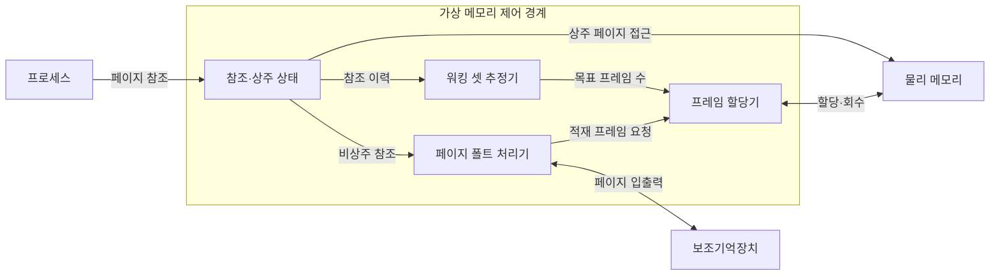
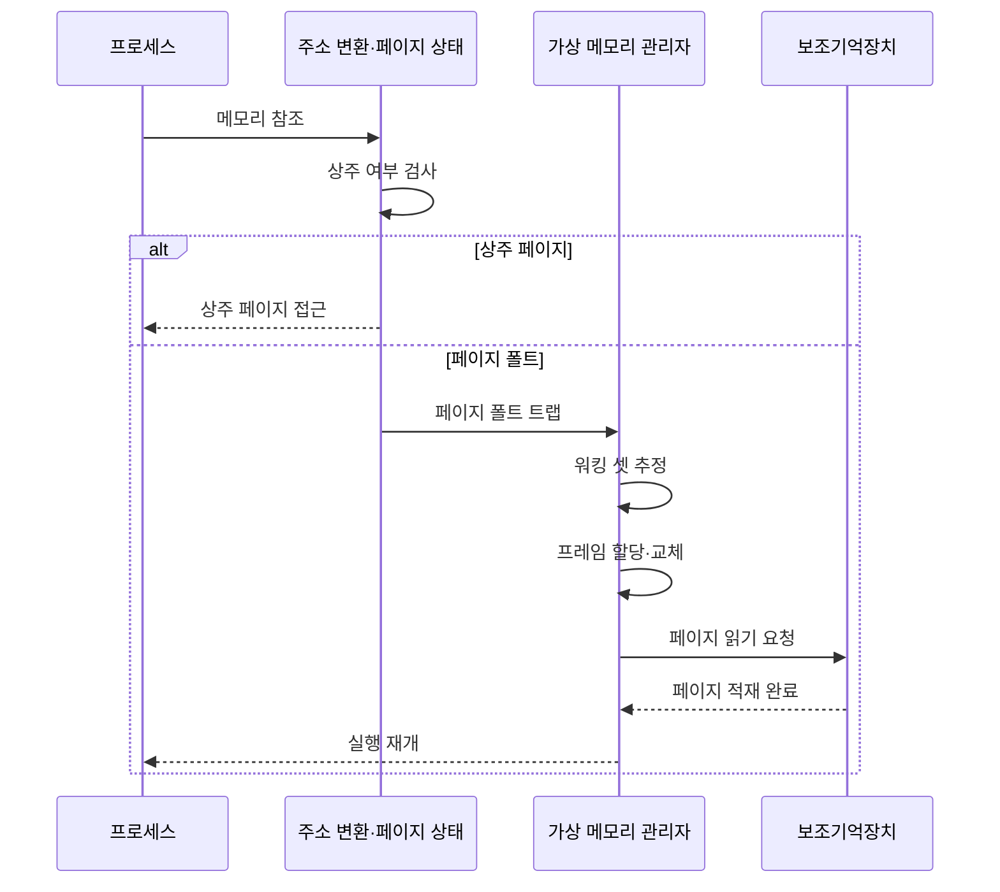

---
sidebar:
  order: 16
  label: "016. 워킹 셋·페이지 폴트 (Working Set·Page Fault)"
  badge:
    text: "기출 · 50%"
    variant: note
title: 워킹 셋·페이지 폴트 (Working Set·Page Fault)
date: "2026-07-25T00:35:28+09:00"
tags: [notes-software]
weight: 16
extra:
  question_no: "016"
  source_status: "기출"
  source_history: "131회"
  priority: 50
  priority_note: "131회 기출, 워킹 셋·페이지 폴트 제어"
---

## 미리 알고가기

- **워킹 셋(Working Set)**: 최근 참조 창에서 사용한 페이지 집합
- **상주 집합(Resident Set)**: 프로세스가 물리 메모리에 보유한 페이지 집합
- **페이지 폴트(Page Fault)**: 참조 페이지가 비상주일 때 발생하는 예외
- **주요 페이지 폴트(Major Page Fault)**: 보조기억장치 입출력이 필요한 폴트
- **경미 페이지 폴트(Minor Page Fault)**: 보조기억장치 입출력 없이 해결되는 폴트
- **페이지 폴트 빈도(Page Fault Frequency, PFF, 피에프에프)**: 영문 각 단어의 첫 글자를 따 PFF로 표기하며 단위 시간·참조당 폴트 발생률을 나타내는 지표
- **참조 지역성(Locality of Reference)**: 가까운 시점에 일부 페이지를 반복 참조
- **스레싱(Thrashing)**: 페이지 교체·적재가 실행보다 많아진 상태
- **참조 창(Reference Window)**: 현재 시점부터 일정 시간이나 참조 횟수만큼 거슬러 올라가 워킹 셋에 포함할 페이지를 정하는 관찰 범위
- **물리 프레임(Physical Frame)**: 물리 메모리를 페이지와 같은 크기로 나눈 블록으로서 상주 페이지를 실제로 저장함
- **입출력(Input/Output, I/O)**: ‘아이오’로 읽고 Input과 Output의 머리글자를 빗금(/)으로 묶는 관례 표기이며 주요 페이지 폴트가 보조기억장치에서 페이지를 읽을 때 발생하는 전송
- **페이지 폴트 트랩(Page-fault Trap)**: 비상주 페이지 접근을 하드웨어가 감지해 커널의 페이지 폴트 처리기로 제어권을 넘기는 예외 진입
- **희생 페이지(Victim Page)**: 빈 프레임이 없을 때 교체 정책이 퇴출 대상으로 선택한 기존 상주 페이지
- **온라인 제어(Online Control)**: 실행 중 관측되는 페이지 폴트 빈도로 프레임 부족을 사후 감지하고 할당량을 조정하는 방식
- **컨테이너 호스트(Container Host)**: 여러 격리 컨테이너에 물리 메모리를 배분하며 워킹 셋과 주요 폴트율로 각 메모리 한도를 조정하는 기반 시스템

## Ⅰ. 개요

- **정의/개념**: 최근 참조로 프레임 수요와 부족 판단
- **배경/필요성**: 상주 집합 부족이 폴트를 낳아 프레임 조정 필요

### 쉽게 이해하기 (학습용)

- 최근에 쓰는 자료 묶음만큼 책상을 주고 창고 왕복이 늘면 공간을 다시 조정한다.

## Ⅱ. 특징

- 상주 집합이 워킹 셋보다 작으면 재참조 폴트 증가한다.
- 참조 창 확대 시 페이지 누락 위험 감소·추정 집합 증가한다.

### 쉽게 이해하기 (학습용)

- 기록 범위를 넓히면 필요한 자료를 덜 빠뜨리지만 책상에 둘 자료를 더 많이 잡는다.

## Ⅲ. 아키텍처 및 구성요소

| 설계 요소 | 설명 |
|:---|:---|
| 참조·상주 상태 | 최근 참조 이력과 현재 상주 페이지 관리 |
| 워킹 셋 추정기 | 참조 창으로 필요 페이지·목표 프레임 계산 |
| 페이지 폴트 처리기 | 비상주 참조 예외·페이지 적재·재실행 처리 |
| 프레임 할당기 | 목표 프레임에 따라 할당·회수·교체 |

> 요약: 워킹 셋은 목표 프레임, 폴트는 적재·재배분 유도

### 쉽게 이해하기 (학습용)

- 최근 사용 기록으로 책상 크기를 정하고 없는 자료를 찾으면 창고에서 가져와 다시 실행한다.

## Ⅳ. 원리 및 절차 흐름도

| 절차 | 설명 |
|:---|:---|
| 메모리 참조 | 프로세스가 가상 주소의 페이지 참조 |
| 상주 여부 검사 | 페이지 상태로 물리 메모리 상주 확인 |
| 상주 페이지 접근 | 주소 변환 후 물리 페이지 접근 |
| 페이지 폴트 트랩 | 비상주 참조를 커널 예외로 전달 |
| 워킹 셋 추정 | 최근 참조 창으로 목표 프레임 계산 |
| 프레임 할당·교체 | 빈 프레임 할당 또는 희생 페이지 선택 |
| 페이지 읽기 요청 | 보조기억장치에 대상 페이지 요청 |
| 페이지 적재 완료 | 프레임 적재 후 페이지 상태 갱신 |
| 실행 재개 | 폴트를 낸 명령부터 다시 실행 |

> 요약: 상주 검사 실패 시 프레임 확보·적재 후 명령 재실행

### 쉽게 이해하기 (학습용)

- 책상에 자료가 없으면 필요한 공간을 확보해 창고에서 가져온 뒤 멈춘 일을 다시 시작한다.

## Ⅴ. 종류 및 비교

| 판단 기준 | 워킹 셋 기준 | 페이지 폴트 빈도 기준 |
|:---|:---|:---|
| 핵심 특징 | 참조 창으로 목표 집합 추정 | 폴트율로 부족 상태 감지 |
| 적용 기준 | 참조 이력·집합 추적 가능 | 낮은 비용의 온라인 제어 필요 |
| 주요 위험 | 창 크기에 따른 추정 오차 | 부족을 사후 감지 |

> 요약: 워킹 셋은 필요량을 추정하고 폴트 빈도는 부족을 감지

### 쉽게 이해하기 (학습용)

- 사용 기록을 자세히 모으면 필요한 책상 크기를 잡고, 창고 왕복만 세면 부족 여부를 빠르게 안다.

## Ⅵ. 실무 사례

1. 컨테이너 호스트는 워킹 셋·주요 폴트율로 메모리 한도 조정
2. 운영체제는 워킹 셋 합이 프레임 초과 시 작업 수 제한

### 쉽게 이해하기 (학습용)

- 호스트는 컨테이너가 실제로 쓰는 메모리와 디스크 적재 횟수를 보고 한도를 조정한다.
- 모든 작업의 필요 메모리가 용량을 넘으면 일부 작업을 멈춰 창고 왕복을 줄인다.

## Ⅶ. 결론

- 참조 창·주요 폴트율로 프레임 배분·실행 수 조정

### 쉽게 이해하기 (학습용)

- 최근 사용량과 디스크 적재 신호를 함께 보고 메모리와 동시에 실행할 작업 수를 정한다.
